<LINK href="jb1.css" rel="stylesheet" type="text/css">

#### [Back to index](index.html)

# AWS Analysing data at scale

- [AWS Analysing data at scale](#aws-analysing-data-at-scale)
  - [Extraction / enrichment](#extraction--enrichment)
  - [Typical problems](#typical-problems)
  - [Solutions](#solutions)
  - [Conclusion](#conclusion)

## Extraction / enrichment

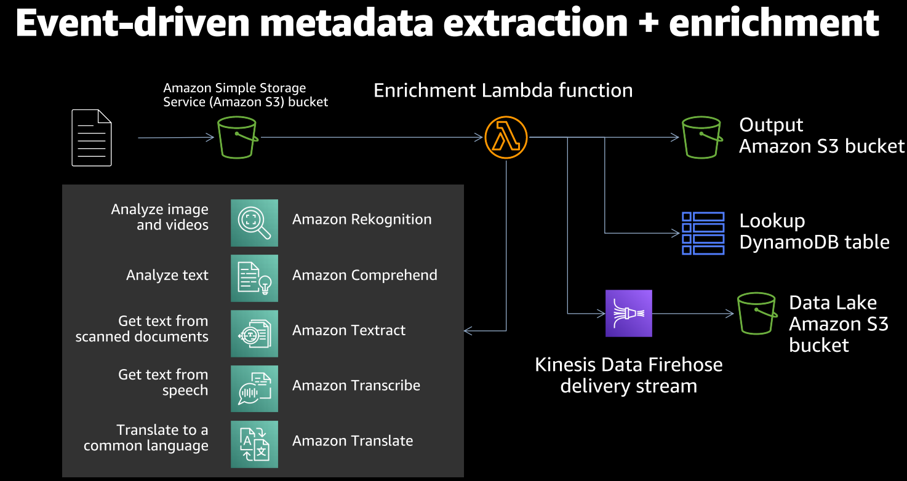

Lots of amazon services to extract data from sources
Output as JSON file
Store in Dynamo DB (can cope with large single items 400Kb)
Kenesis data firehose -> data lake

## Typical problems

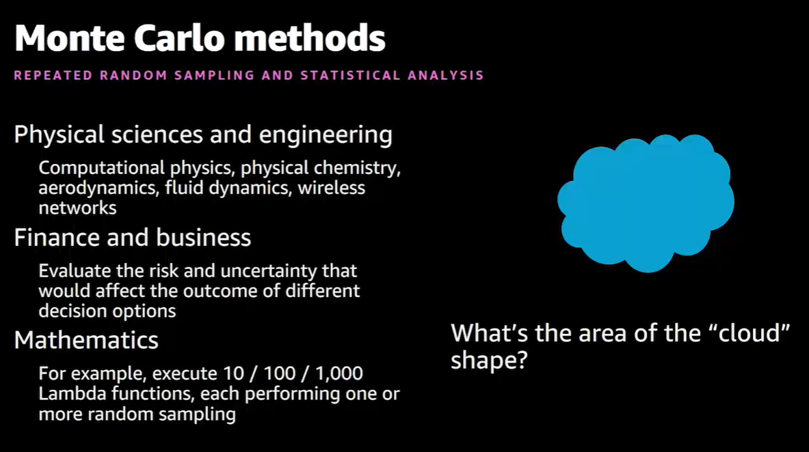

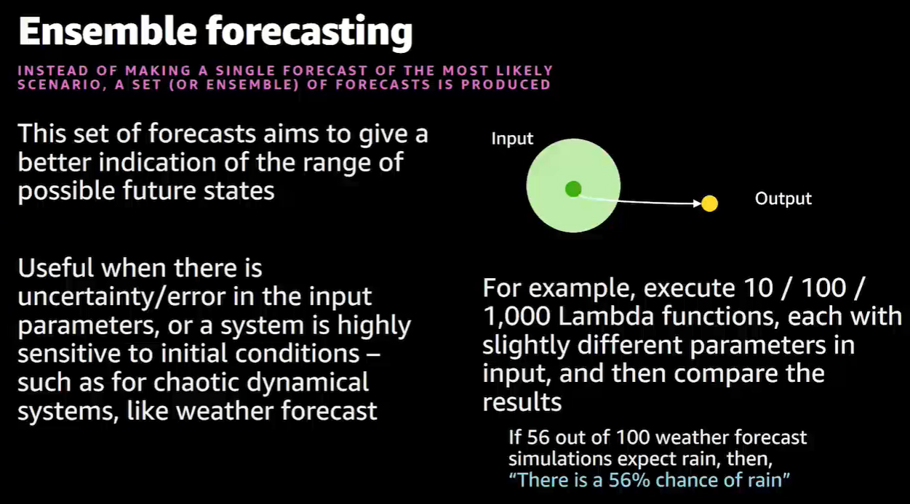

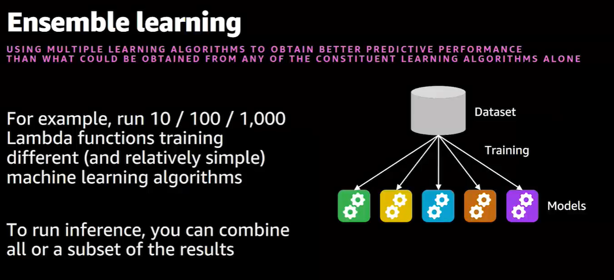

## Solutions

Host in Lambda, write to EFS.

Simple solution:

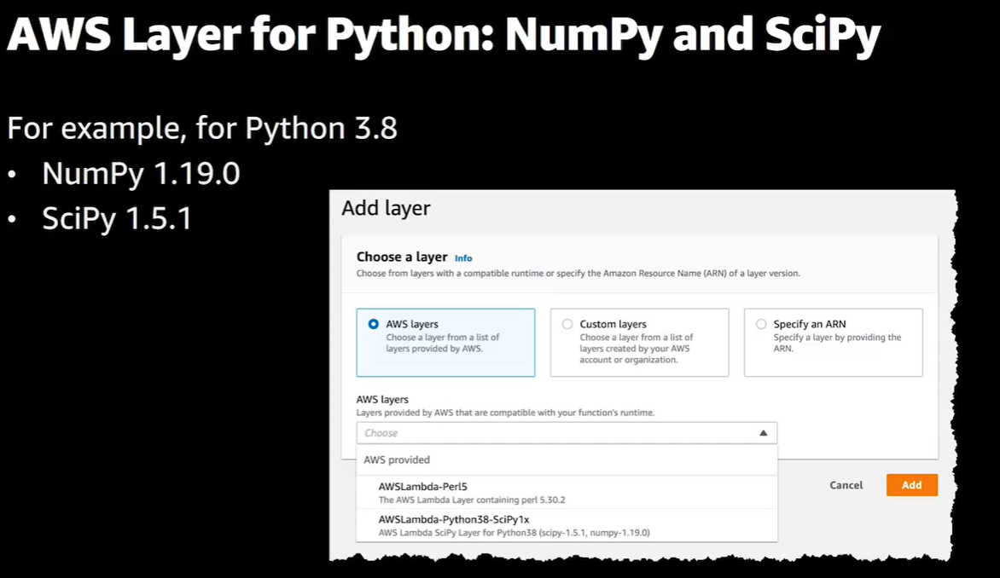

better: Host in EFS

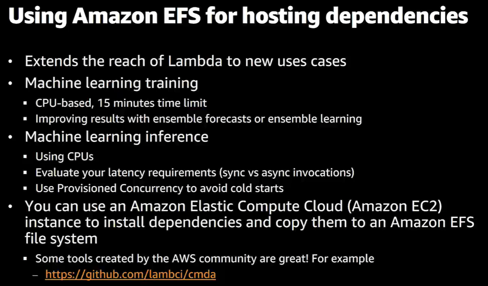

For Lambda examples look at aws.amazon.com/blogs/compute/pay-as-you...

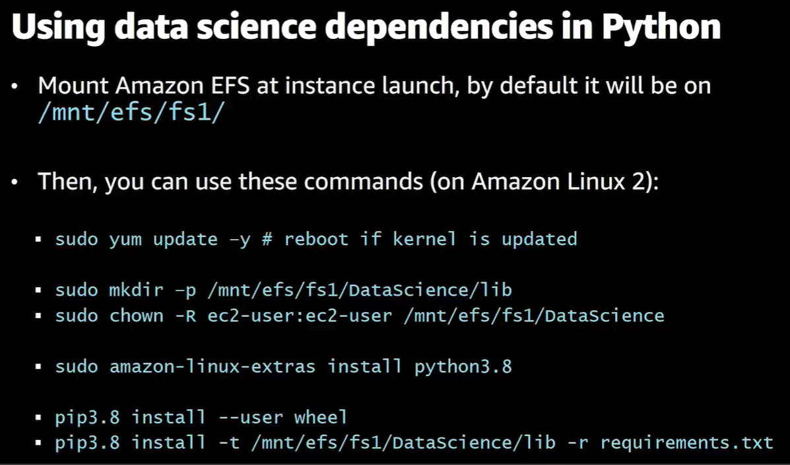

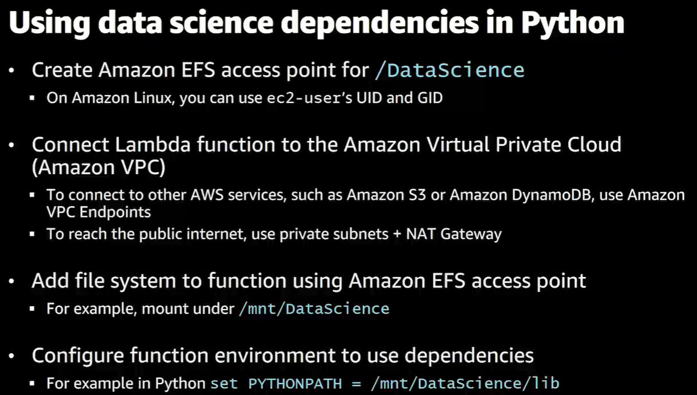

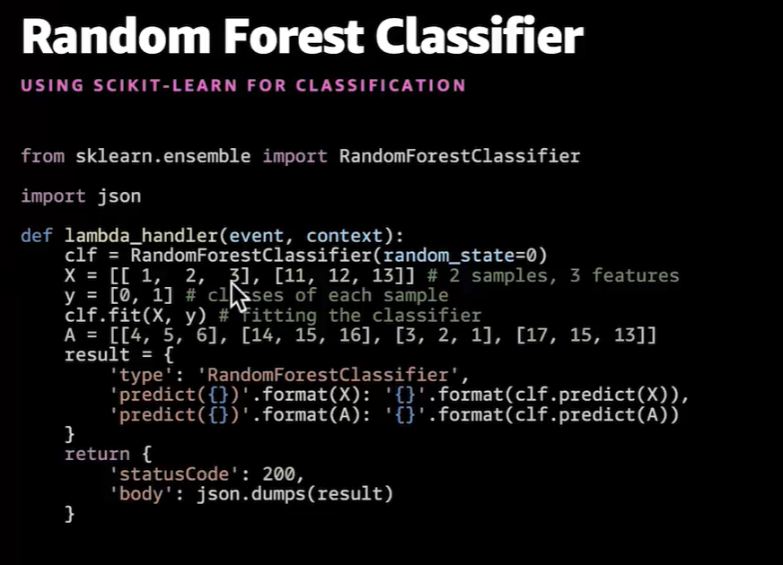

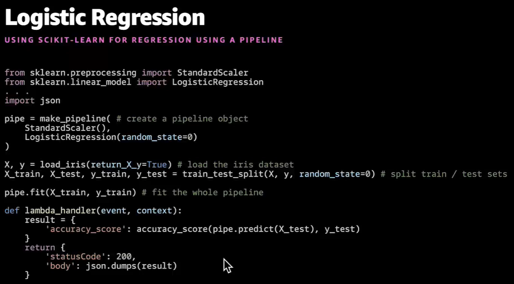

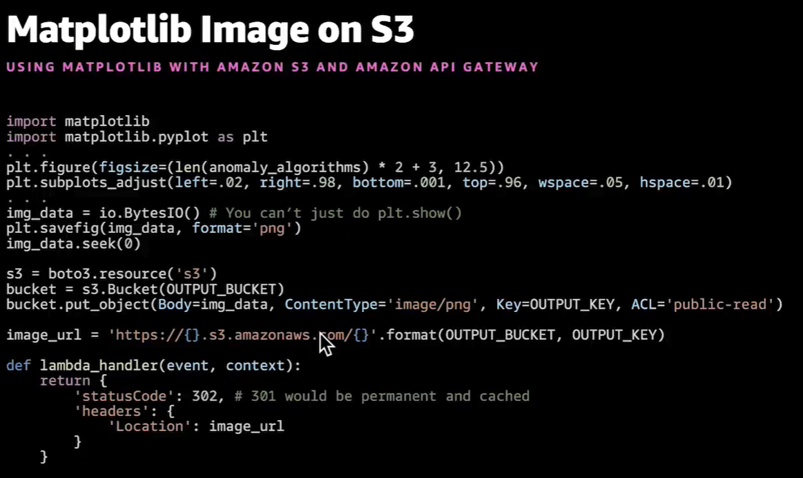

Look at "Postman" software to run and see results
Look at "Papermill" software: run notebooks in batch execution

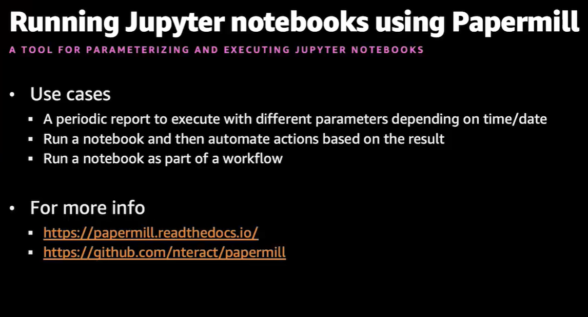

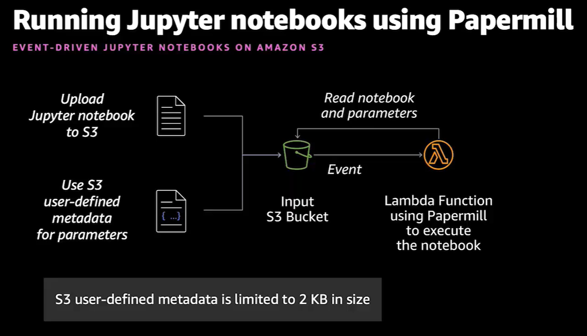

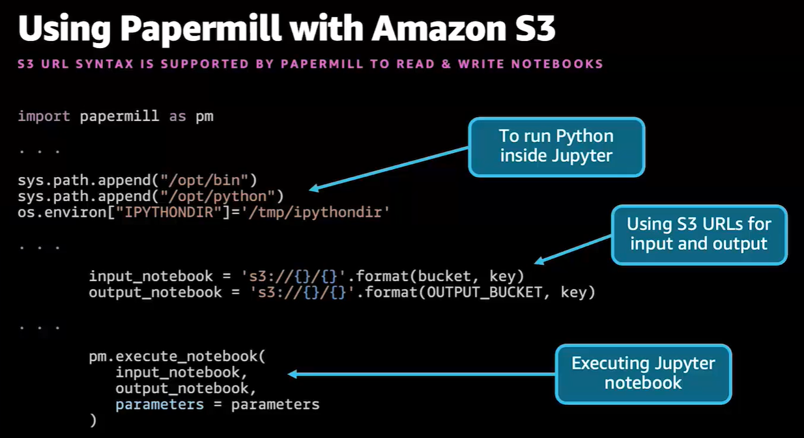

## Conclusion

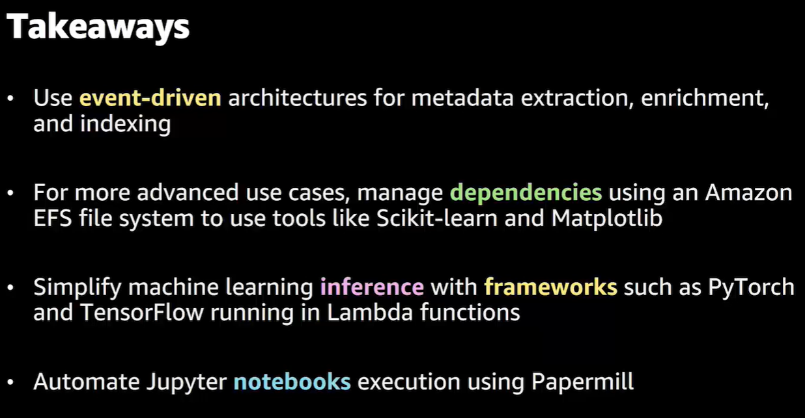
