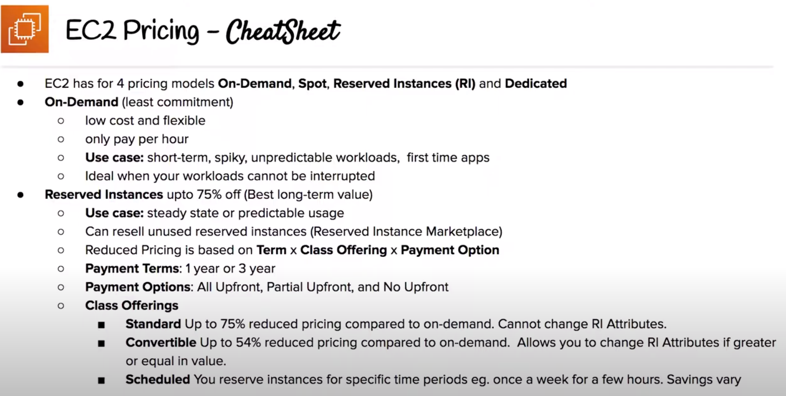
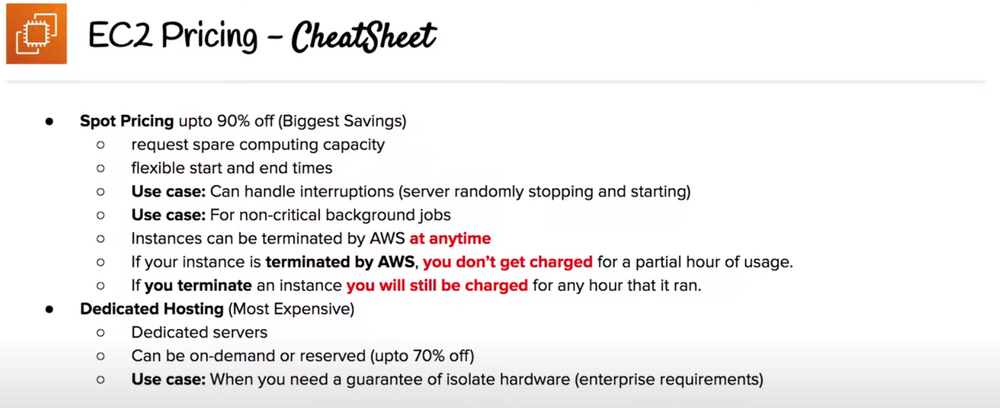
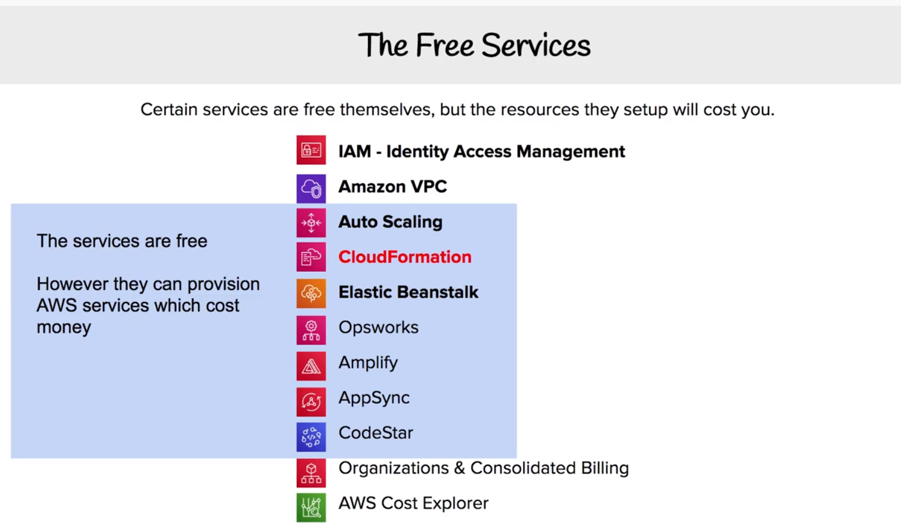
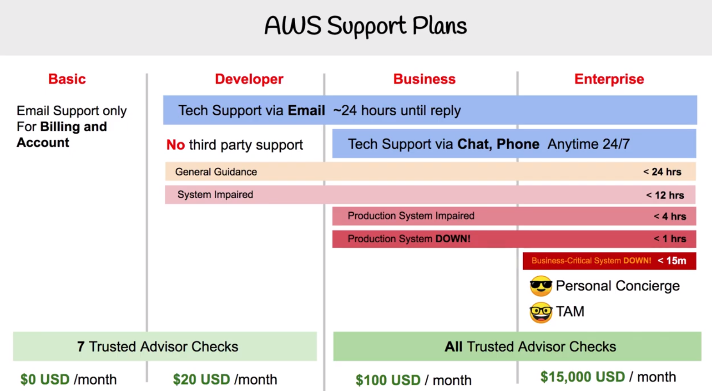
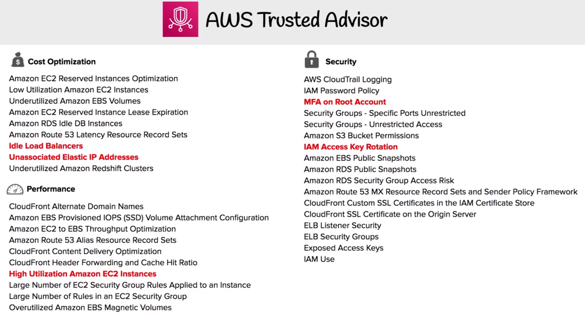
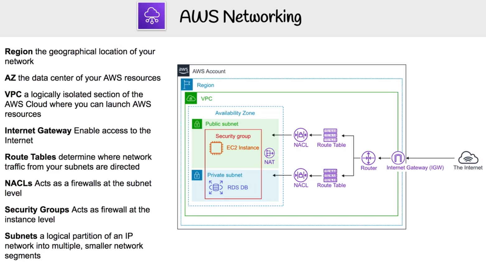
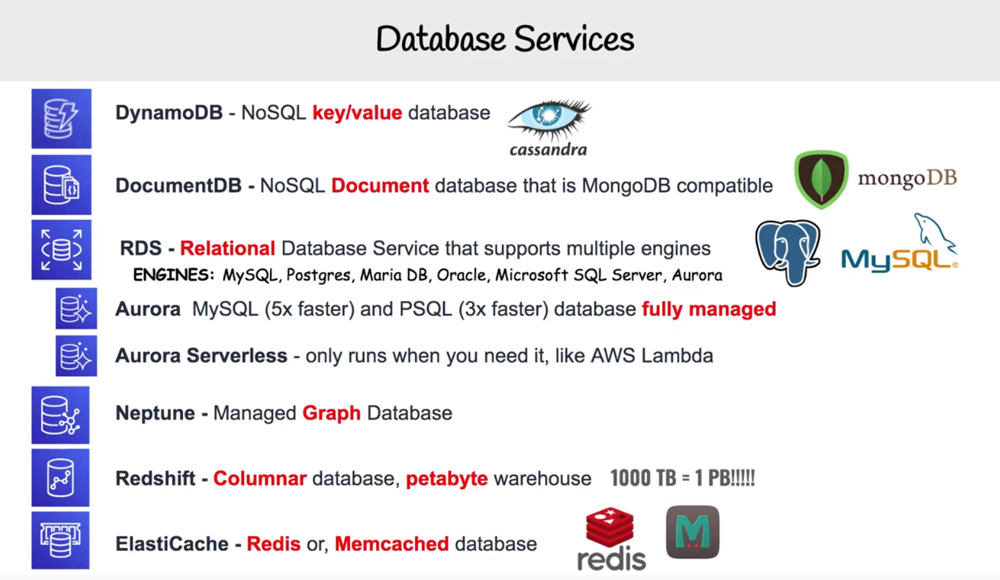
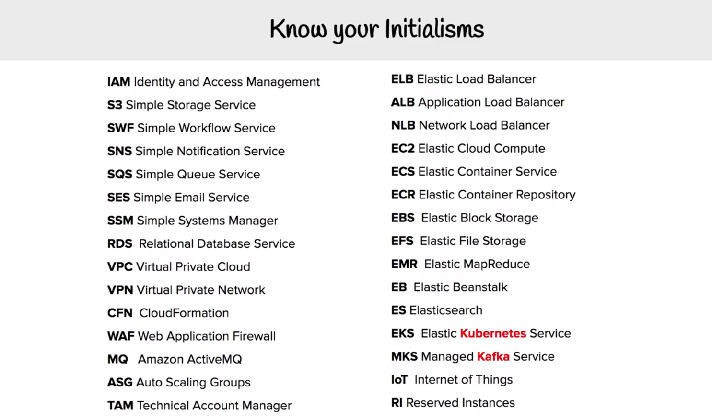
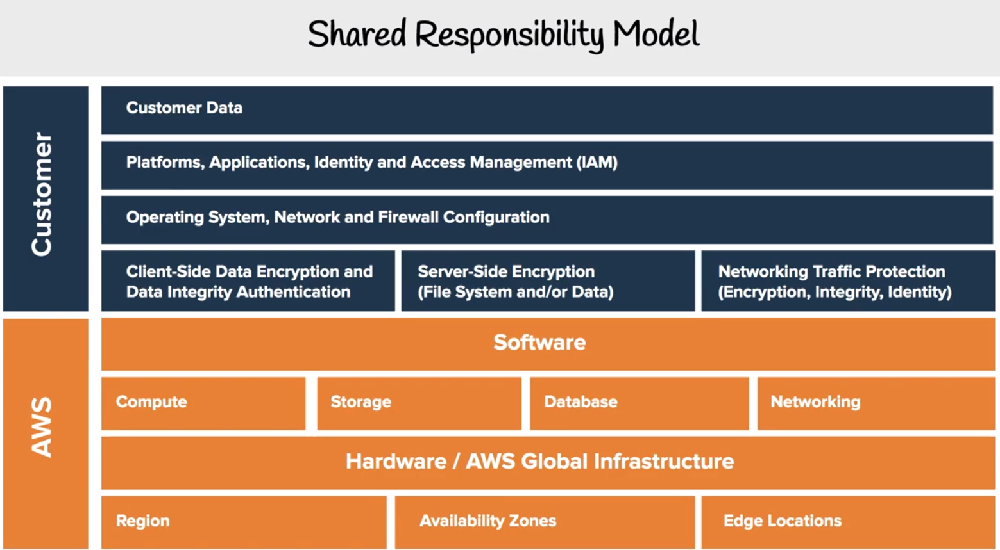

<LINK href="jb1.css" rel="stylesheet" type="text/css">

#### [Back to index](index.html)

# AWS Certified Cloud Practitioner

- [AWS Certified Cloud Practitioner](#aws-certified-cloud-practitioner)
  - [Reasons](#reasons)
  - [Benefits of AWS](#benefits-of-aws)
  - [Options](#options)
  - [Deployment models](#deployment-models)
  - [Global infrastructure](#global-infrastructure)
  - [Setting up account](#setting-up-account)
    - [Billing Limits](#billing-limits)
    - [IAM (Identity and access management)](#iam-identity-and-access-management)
    - [Hands on setup](#hands-on-setup)
  - [EC2 Pricing](#ec2-pricing)
  - [Billing and Pricing](#billing-and-pricing)
    - [AWS support plans](#aws-support-plans)
    - [AWS marketplace](#aws-marketplace)
    - [AWS trusted advisor](#aws-trusted-advisor)
    - [Consolidated billing](#consolidated-billing)
    - [Cost explorer](#cost-explorer)
    - [AWS Budgets](#aws-budgets)
    - [TCO calculator](#tco-calculator)
    - [AWS landing zone](#aws-landing-zone)
    - [AWS resource groups](#aws-resource-groups)
    - [AWS quickstarts](#aws-quickstarts)
    - [AWS cost and usage report](#aws-cost-and-usage-report)
  - [Technology](#technology)
    - [Organisations and accounts](#organisations-and-accounts)
    - [AWS Networking](#aws-networking)
    - [AWS Databases](#aws-databases)
    - [Provisioning](#provisioning)
    - [Compute services](#compute-services)
    - [Storage services](#storage-services)
    - [Business services](#business-services)
    - [Enterprise integration](#enterprise-integration)
    - [logging](#logging)
    - [services initials](#services-initials)
  - [Security](#security)
    - [Security services](#security-services)

## Reasons

Prepares for solution architect associate  
contents: Cloud concepts, security, Technology, pricing  
not really a big thing for developers  

## Benefits of AWS

1. trade capital cost for variable expense
2. Massive economy of scale
3. Stop guessing capacity
4. Increase speed and agility for setup
5. No data centres
6. global

## Options

- Saas: Complete product runs as a service. e.g. Office 365, salesforce.
- Paas: Platform. Don't manage the infrastructure
- Iaas: AWS. Networking, compute  

## Deployment models

- Full cloud: good for startups, Saas, new projects
- Hybrid: parts on the cloud.  
- On Prem: private cloud, good for very sensitive data, lots of regulation. Reasons not to use cloud

## Global infrastructure

- 1m customers, 190 countries.  
- Region: physical locations with multiple AZ. Regions physically isolated DR. At least 2 AZ in a region. Not all services in all regions, US-EAst is first normally. US-EAST-1 is the main and where you get your billing info.  
- AZ: one or more data centres. e.g. US-EAST-1a AZ. Distribute across multiple AZs allows failover config for when one AZ goes down. Latency is sub 10ms.  
- Edge locations: lots. owned by trusted partner. Serves requests for cloudfront and Route 53. Routed quickly to AWS.  
- GovCloud is a US gov region for US soil US institutions.

## Setting up account

Personal or professional

### Billing Limits

- Billing preferences: set up alerts and invoice info. Alerts for over thresholds.  
- Budgets: Get 2 free budgets, and set alerts.  
- Cloudwatch: set billing alarms. need to switch to US east region to set billing alarm.

### IAM (Identity and access management)  

Generally don't want to use root account. So create accounts, set permissions.
Create an account name, activate MFA for multi factor authorisation.
Manage user, add user. Create group with administrator access
Set most users to power users (so can't manage users and groups)
Get access key id, secret, password.
Reset access keys here.

### Hands on setup

- Choose region, Launch a new EC2 instance.
- Session manager: Key pairs needed for ssh access, or can use browser instead with instance connect, or simple systems manager SSM (use SSM to be able to monitor who is doing what) sudo to your user, not root. Stop instance.
- AMI: Amazon machine image. snapshot or copy of the server config. Create image. Give it a name. When you have an AMI, you can launch another copy of it. This is a way to save a configuration.
- Auto scaling group: Allows you to ensure multiple instances are running and auto scale up and down. check if at least one and launch a new one if not enough. Determined based on metrics. Create a launch configuration from the AMI. Create autoscaling group with Scaling policies are rules to determine how the autoscaling group relates to changes in environment (CPU, memory, etc). Manually close instance, another spins up from auto scaling group.
- Elastic load balancer: ELB. Allow a load balancer in front of instances. Evenly distributes traffic to multiple instances in different AZs. Load 2 instances. 3 types: application, network, classic. Use application load balancer. Set a target for the load balancer. Routes traffic to the registered targets
- S3: Global, so no regions. But buckets are region specific. Buckets contain files. Upload, download files to pc.
- Cloudfront: Content distribution network. If video files to share globally, set up cloudfront and it copies content to multiple edge locations. Choose an s3 bucket to distribute. Can set a domain name.
- RDS: Aurora expensive, postgres free. Also  are SQL server.
- AWS Lambda: straight to code editor.

## EC2 Pricing

- On Demand: no up front payment. Short term spiky, new dev, testing.
- Spot: 90% discount compared with on Demand. AWS has Unused compute capacity. Like hotel usage with last minute availability. Instance can be terminated at any time. AWS batch is an easy way yo use spot pricing. Good when start and end time are flexible, or things that are only viable at low cost. Still charged if you use part of an hour.
- Reserved instances: steady state, predictable usage, reserved capacity. Cheaper. Standard is 75% cheaper, no change to RA attributes. Convertible - 54% off, can increase requirement. Pay more upfront get better savings. Longer term better savings. RIs can be shared between multiple accounts in one org, and can be sold on in RI marketplace. Price = Term x class offering x payment options.
- Dedicated host instances: For reg requirements where you need server bound licencing, physical hardware isolated. Can be single tenant or multi tenant.  

## Billing and Pricing

Free services, but the resources they setup will cost.

### AWS support plans

- basic is email only.
- Developer is $20pm. Includes tech support on email.
- Business has tech support on chat & phone 24/7, $100 pm. Production system impaired or down get response < 4h, 1h.
- Enterprise: $15k pm. 2 dedicated people, technical account manager. Respond in 15 mins for system down.

### AWS marketplace

Independent vendors which run on AWS. AMIs  
e.g. Launch an instance of a marketplace service in EC2  
EC2 -> aws marketplace -> tensorflow and set up an AMI  
Go back to AWS marketplace to see the subscriptions you have.  
Shut down instances to stop costs.  

### AWS trusted advisor

Automated advisor on security, saving money, performance, fault tolerance, service limits  

- on costs, e.g. idle load balancer, unassociated elastic IP addresses
- on performance, e.g. high utilisation on EC2 instances
- on security:  
- on fault tolerance, e.g. RDS backups

Preferences can set automated emails every week from trusted advisor.

### Consolidated billing

One account considered master account for the organisation. Billing is all via master account.  
Get volume discounts with consolidated billing: aggregate usage and get cheaper rates for higher volume of e.g. storage.  

### Cost explorer

to see expected costs. Visualise, understand, manage all costs over time.  
Forecasting of costs.  
Nice graphs, can filter adn cut e.g. by service.  
Report writer.  

### AWS Budgets

First 2 budgets are free, then 0.02 per day.
Set up alerts if you exceed or approach budget limits.  
Cost, usage or reservation buckets.  
Track at monthly, quarterly, annual levels.  
covers EC2, RDS, Redshift, Elasticache.
Notified by email or chatbot (e.g. if using slack or chime (AWS version of slack))

### TCO calculator

for Executive reports. Estimate how much you would save moving from on prem to AWS.  
Lots of stuff in report!

### AWS landing zone

Helps enterprises set up a secure AWS multi account.  
Baseline environment to get started. Best practices.  
e.g. sets up separate account for log archives, security, cloud etc.

### AWS resource groups

set Tags on an instance, assign to resource groups.  
Use in e.g. EC2. LOts of services use tags.  
Good way to find resources on a project.  

### AWS quickstarts

Prebuilt templates to help deploy popular stacks on AWS. Reduce hundreds of manual procedures to a few steps.  
3 parts: reference architecture, AWS cloud formation template, deployment guide saying whats done.  
e.g. IOT camera connector.

### AWS cost and usage report

Big spreadsheet output in S3 bucket for all resources and costs. Query in database or use quicksight.

## Technology

### Organisations and accounts

Account can be turned into master account  
Organization: a group of accounts. Can add policies to org units  
IAM -> AWS organizations  
Organizational unit e.g. developers, and attach policies to the Organization  
Can set policy to e.g. limit actions to only EC2.  
Can't delete accounts, just suspend.  

### AWS Networking

Region -> VPC (logical section of the could just for you, to launch resources)  
In a VPC, want to have subnets: logical partition of an IP network into multiple smaller network segments, e.g. hard a public subnet and a private subnet.  
Subnets in an AZ  
Internet Gateway to allow VPC to access outside  
Route table determines where traffic is directed.  
Security groups  
NACL is security at subnet level  

### AWS Databases

Aurora is AWS integrated version of MySQL or PSQL, faster.  
Aurora more expensive but faster.  
Aurora serverless you only run when you need it. Good for developement, or serverless.  

### Provisioning

Provisioning is the allocation or creation of resources and services to a customer.  
Use different services: Elastic beanstalk for deploying / scaling web apps  
Cloud formation, OpsWorks, AWS Quickstart, AWS marketplace all allow resource creation.  

### Compute services

- EC2 is behind everything, some are higher level.
- EC2 choose CPU, memory, network, OS etc
- ECS: elastic container service. Supports docker.
- Fargate: Just pay for runtime, a bit like lambdas
- EKS: Kubernetes as a service. Run containerised applications using Kubernetes.
- Lambda: serverless functions, only compute time no servers.
- Elastic beanstalk: good for developer access, not really production. Don't need to worry about setup too much.
- AWS Batch: launches EC2 using spot pricing.

### Storage services

- S3: object storage
- S3 glacier: S3 low cost for archiving. Wait for retrieval.
- Storage gateway: local caching with on-prem
- EBS (elastic block storage): virtual hard drive attached to the EC2 instance. Attach to one EC2. SSD or HHD
- EFS (elastic file storage): file storage mountable to multiple EC2 at the same time
- Snowball: Move lots of data around quickly from on prem to AWS. Order a snowball, populate it locally, send to AWS

### Business services

- Amazon connect: Call centre. record calls, inbound / outbound, workflows based on rules.
- Workspaces: Virtual remote desktops. Remote desktops.
- Workdocs: like sharepoint
- Chime: like slack with skype
- Workmail: like gmail
- Pinpoint: marketing campaigns. Targeted marketing emails.
- SES: simple email service. Web app can sent emails.
- Quicksight: BI service.

### Enterprise integration

Bring on prem and AWS to work together.

- Direct connect: fast connection prem to AWS
- VPN: secure connect to AWS
- Storage gateway: use AWS storage
- Active directory: integrate with MS ad.

### logging

- Cloudtrail: logs all API calls to know who modified a resource
- Cloudwatch: lots of services, logs performance, lambdas, applications. Lots of metrics available. Trigger events, alarms, dashboards.

### services initials

## Security

Customer does data and configuration.  
AWS do the hardware, managed services, global infrastructure. So don't make a mistake with your config.

### Security services

- Compliance programs: rules for payments, privacy, security, etc.
- AWS Artifact: Proves AWS is meeting a compliance program. Service to show reports on compliance to a standard.
- Amazon inspector: How to prove an EC2 instance is "hardened" (eliminated as many security risks as possible). Runs security benchmark against EC2 instance. Network and Host assessments. e.g. CIS check, 699 checks.
- AWS WAF: Web application firewall. Projects web apps against common web exploitations, plus add your own. Can be attached to cloudfront or Application load balancer.
- AWS shield: managed DDOS application service. (Large amount of fake traffic). No additional charge when use cloudfront or route 53. Shield standard or shield advanced: Advanced version not free, more support and visibility into attacks. Could be expensive, some guarantees against traffic costs with advanced.
- Penetration testing (Pen testing): Authorised simulated cyber attack to evaluate security.
- AWS guard duty: threat detection service. Uses ML to analyse logs.
- KMS: Key management service. Hardware to store keys, very secure. Create and control the keys. MUlti tenant hardware security module. Many services use this. Envelope encryption, so encrypt the master key with an envelope key.
- Amazon Macie: Monitors S3 data access for anomalies. Looks for potential issues, and gives reports when incidents found.  
- Security groups vs NACLs: security groups act at the instance level, denys traffic and you create allow rules. NACLS (network access control lists) act as a firewall at the subnet level. Create allow and deny rules, e.g. deny to a specific known IP address.  
- AWS VPN: virtual private network. Private tunnel from your network to AWS global network. Site to site: entire office connects to VPN. Client for single laptop to VPN.
