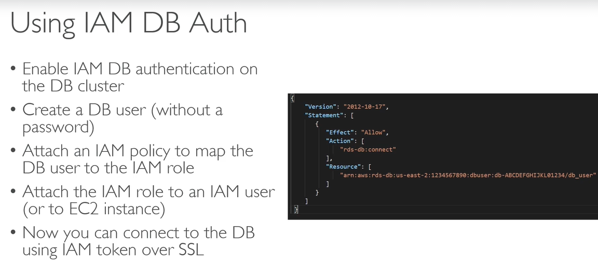
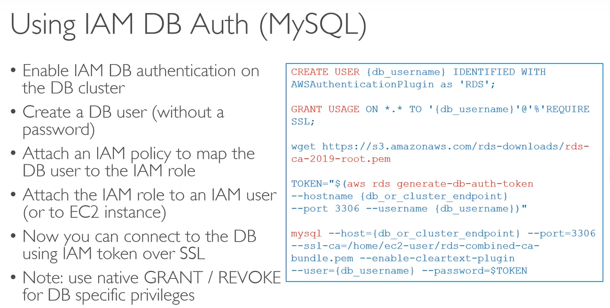
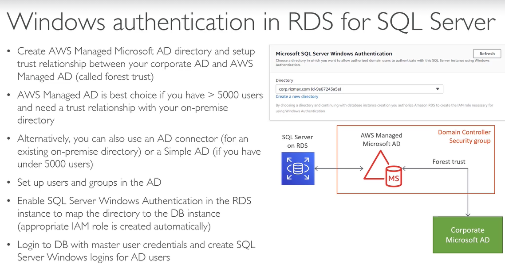
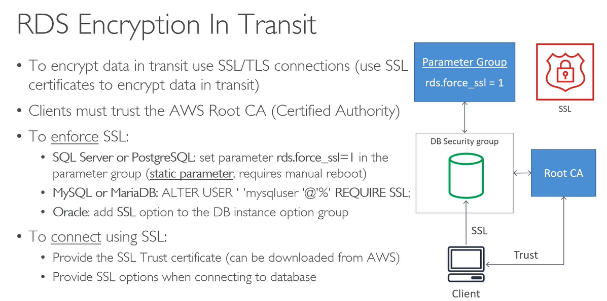
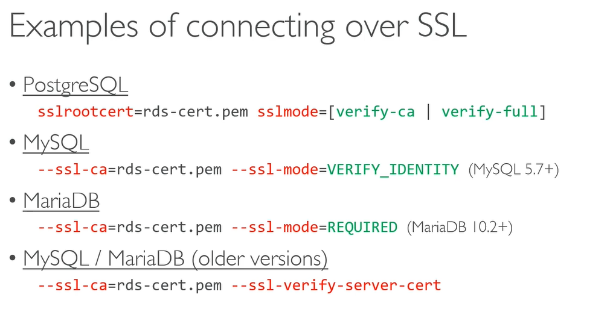
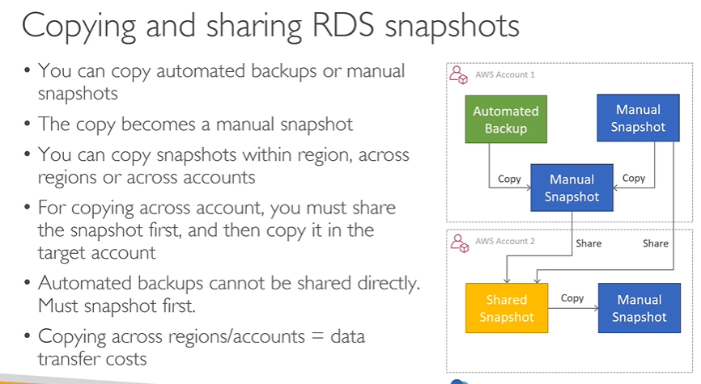
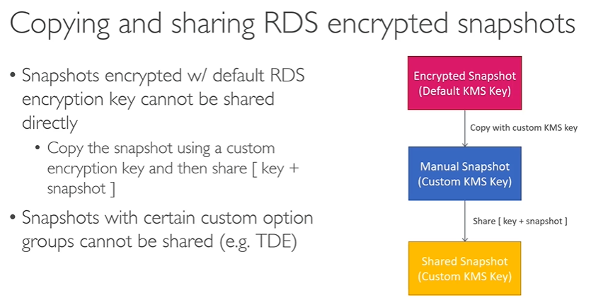

# AWS RDS

## Overview

Supported: Postgres, Maria, MySQL, Oracle, Microsoft SQL Server
Aurora is the Amazon version.

Managed db service

- Launched in  a VPC, private subnet
- control access with security groups.
- Storage on EBS (gp2 or iops).
- Increase volumes with autoscaling.
- Backups: automated with point in time recovery.
- Snapshots: manual, can move cross region
- Monitoring: cloudwatch.
- SNS for events

## RDS

### Why RDS?

- Self hosted: need to manage hardware, software, application.
- EC2 hosted: need to manage software, application
- RDS hosted: AWS does hardware, software, application.

### Managed service

- automated provisioning
- OS patching
- continuous backups to give point in time restore
- Monitoring dashboard
- Read replicas
- Multi AZ for DR
- maintenance autmatmed in maintenance windows
- scaling verical and horizontal
- can't SSH into it.

### creating

- instance type (on demand / reserved)
- choose engine
- choose storage

### costs

- pay by hour for on demand based on compute
- RI means 1-3 years, big discount
- pay per Gb per month
- pay for backups / snapshot export to S3
- pay for IO per million requests
- pay for data transfer

## Instance classes

- standard, memory optimised, burstable
- Bursdting means get higher level of CPU when needed, baseline at other times. Managed through CPU credits, bwhich you get when underutilize the CPU

### Storage types

Gen purpose:  

- SSD
- cost effective
- baseline is 3 IOPS /  Gb, burst to 3000 IOPS
- good for variable workload
- use for dev / test / small to medium size

Provisioned IOPS:  

- high performance for production
- choose storage size
- choose amount of IOPS
- up to 32k iops
- use for IO intensive, and write heavy.

Storage autoscaling:

- should be switched on
- works on both. No downtime. 
- Saves costs because don't over-provision.
- Set max storage limit to control costs.

### Parameter groups

- specific to db engine
- like config values
- get a default parameter group which you can't edit
- create a new group inherited from the default.
- can apply a parameter group to multuple DB instances
- examples
  - autocommit
  - max connections
  - storage egine

2 types of parameters: static / dynamic

- Dynamic always applied immediately
- Static need manual reboot. Status is pending reboot after change, but this does not happen automatically in next maintenance window.
- status back to "in sync" after reboot

### Option groups

- Similar but these are for optional features specific to db engine.
- default option group is empty, but craeate a new option group and attach to DB instance
- e.g. memcache settings on to of MySQL

### Demo

- DB name
- Master username and password
- set security group to allow inbound connections on TCPIP port 3306 for MySQL
- Backup set to 0 days is basically disabling. Set up to 30 days.
- Logs from DB Engine can be sent to Cloudwatch.
- Specify the weekly maintenance window, about 30 mins.
- Enable deletion prevention for whole DB
- Creates DB endpoint
- Clone parameter group, change, then assign to instance.

### Connecting client

use any client, e.g. SQLECTRON gui, SQL Workbench
connect with endpoint and port.
user name and password

- needs public access ticked which sets security group. sets up IGW.
- route table to not prevent access

### Security

- Create in VPC
- Generally in private subnet
- Can't change VPC after launch
- Security groups
- shared responsibility: 
  - you responsibility for users, security groups, access levels, parameter groups to allow SSL only
  - AWS for OS, DB versions, no SSH

### IAM

- IAM policies control who can manage the RDS
- user names and passwords to log in to the database
- Can use IAM to log in to MySQL, Postgres

#### Best practices

- IAM policies for RDS resources
- grant least privileged access
- use MFA
- use policy conditions to restrict IP, SSL, MFA, time windows
- rotate DB credentials

#### IAM authentication

- Just for login and login management.
- Use grant / revoke for permissions in Db

### Rotating DB credentials

- Need to keep secure.
- use AWS secrets manager
  - stores secrets centrally, audit functions
  - supports auto rotation via Lambda function
  - this function knows the ARN of the secret
  - integrated for MySQL, Aurora, Postgres

### Windows authentication for SQL server

- Use windows creds or AD creds for SQL Server
- elaborate process
- needs Active Directory (AD) (AWS managed, or AD connector if on prem AD, or simple AD for < 5000 users)
- Set up users and groups in AD
- Enable SQL Server windows authenticaion
- Login to DB and create SQL Server logins for the AD users

### Encryption

In transit:

- SSL / TLS
- Clients use AWS Root CA (Certified authority)
- To enforce SSL:
  - (SQL Server and Postgres) rds.force_ssl = 1 in parameter group
  - (MySQL / Maria) Alter user mysqluser REQUIRE SSL;
  - (Oracle) add SSL option to BD option group
- to connect

At rest:

- AES-256 encryption
- Keys in KMS
- Can encrypt master and read replicas
- Encryption defined at launch time
- (SQL Server and Oracle) RDS also supports Transparent Data Encryption (TDE)
- can use both, but performance hit: just use one generally
- TDS is an option group setting

### RDS backups

- happen in backup window
- default to 7 days retention, up to 35, 0 is disabled
- first is full backup, subsequent are incremental
- stored in S3 but hidden
- if not multi AZ replication, you can get IO suspension during backup
- Integrated with AWS Backup service
- support point in time recovery (PITR)
- good for unexpected failures
- snapshots taken before / after engine upgrade

### Snapshots

- Manually triggered
- full backup
- you set retention
- not PITR
- good for events like DB changes
- Can use Lambda to snapshot and save to S3 at regular intervals

