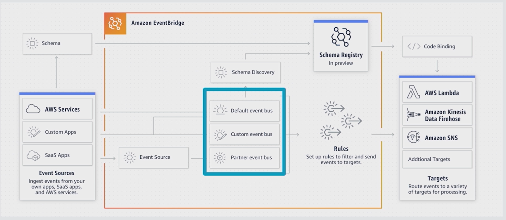
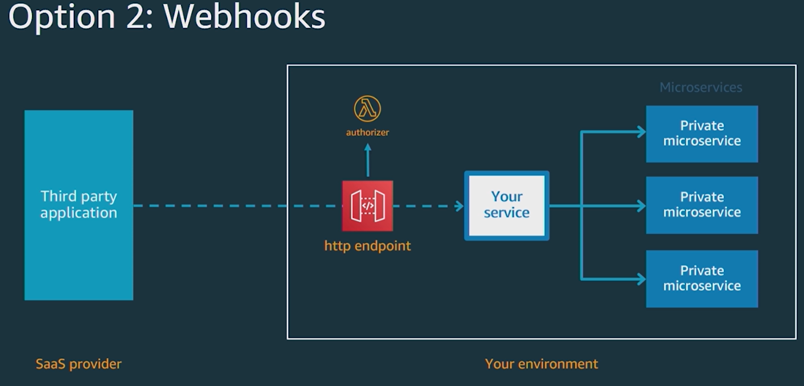

<LINK href="jb1.css" rel="stylesheet" type="text/css">

#### [Back to index](index.html)

# AWS Event Bridge

## Problems with early distributed architecture

Microservices: each service does one thing.  
Often Synchronous API calls used  
easy enough with 2 services but as you add more, problems are:

1. Coupling increases

    a central service (e.g. order service) needs to call APIs in other services, so bottleneck with the team. Systems start in a decoupled way and trend back to being tightly coupled.

1. Happy path works ok

    Invoicing, payment, fulfillment, shipping, forecasting. All good but then shipping fails: shipping needs to call multiple other services to reverse the order, but not all services have these functions.

1. New services

    The new service (e.g. a reward service) not called for a particular path in the workflow as no-one realised.

1. Performance mismatch

   fast service calling a slow service synchronously is a problem. Looks like first service is failing.

1. Availability

    downstream service goes down, the upstream service appears to fail too. No response to customer from completed action.

## Solution

- Decouple with an event bus
- Notify events to the event bus, and let consumers pick up events which are relevent to them
- means less coupling, less development bottlenecks, new services can join in and pick up the events, more availability.

e.g. when fulfillment has an error, published an error event. Other services can take action appropriately.

Amazon event bridge: serverless, fully managed, integrated with SaaS providers, uses AWS backbone, cheap, 17 AWS services as targets.

Benefits:

- decoupling
- Simplified event routing (listen to events you care about)
- improved availability (using asynchronous infrastructure based around events)
- 3rd party integration

## Using event bridge

Have events, and rules which match to a subset of events

- Define rules per event bus
- Create rule
- set schedule to run the rule
- Set the targets to notify when the rule finds a match 
- Targets can be e.g. cloudwatch, or Lambda function call

Basically, use rules to filter events, and define which targets receive which events.

## Custom Event bus

Setup:

- Create event bus in console
- AWS events create-event-bus --name --region
- use code to add events to event bridge
- Example at github/jbesw/eventbridge-sam-example
- Deploy Lambda functions with SAM
- Cloud9 for js development on cloud

## Schema Registry

- Set a schema for the messages on the bus
- They can get hard to manage, so tools to detect, find, manage, store schemas.
- Tools can look at messages and work out schema
- Then download code bindings into your development env.

## Integrating with Saas Providers

Use pre built integrations so 3rd party posts messages on your event bus

## Example: Integrate with Auth0 (a SaaS provider of Authentication)  

Benefits:

- Take automated actions when your users log in / log out
- run custom code for events run by auth0
- add functionality not part of Auth 0
- add functiuonality with managed services

Choices when integrating with Saas provider:

Need to pass info to and from 3rd party systems. But don't own their code.

1. Poll 3rd party API

   - but load on Saas provider
   - difficult if lots of data
   - need to manage polling service
   - time lag

1. Webhooks

   - you provide SaaS 3rd party with a http end point
   - 3rd party app calls you
   - but when you are down, 3rd party doesn't know what to do
   - need to mange API, can be hard to scale
   - security is not great

1. Event bridge partner integration

- Use Partner Event source, allows events without IAM.
- Go into Auth0 account
- Set up AWS account id
- Then in AWS Event Bus, see a partner event source (pending until confirm)
- Create new rule
- choose Event pattern
- Choose Target (e.g. Lambda)

### Integrate with ZenDesk

- Set up a provider
- e.g. zendesk.com: CRM integration
- set up the link in ZenDesk
- Create bus for zendesk events
- Create a new rule to look for events matching zendesk, send to cloudwatch target.
- e.g. Look for tickets with negative sentiment, apply tag to the zenDesk event

Integration is quick!

### Integrate with PagerDuty

- (Centralised monitoring of all systems, infrastructure etc with incident management)
- Take customised automated action on the PagerDuty tickets
- Add functionality which is not part of what PagerDuty provides
- Set up pagerDuty to post events to Event Bridge
- In AWS, look at event sources, and accosiate with an event bus (create a new one)
- Set up a new rule: event pattern is pre defined by PagerDuty
- Set Target to a log group
- So: easy to get events from partner SaaS providers.
