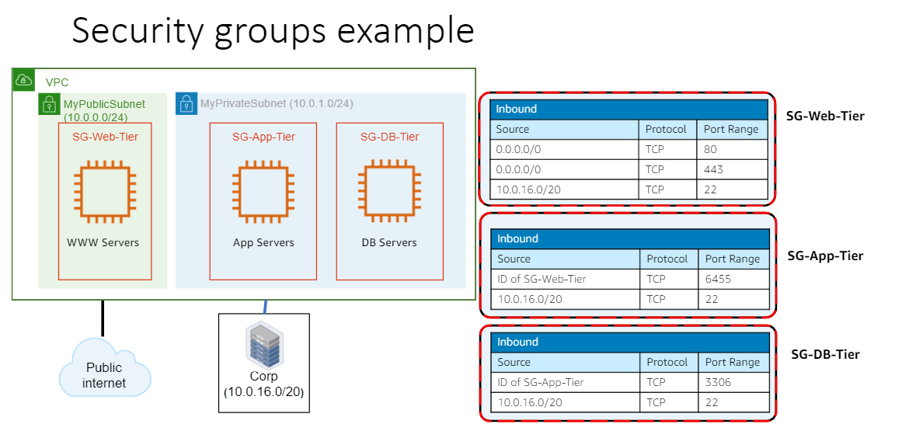

<LINK href="jb1.css" rel="stylesheet" type="text/css">

#### [Back to index](index.html)

# AWS Fundamentals

- [AWS Fundamentals](#aws-fundamentals)
  - [Migration process](#migration-process)
  - [Compute](#compute)
    - [Regions](#regions)
    - [Availability zone](#availability-zone)
    - [EC2 elastic cloud compute](#ec2-elastic-cloud-compute)
    - [Lightsail](#lightsail)
    - [AWS Spot](#aws-spot)
  - [Storage options](#storage-options)
    - [Amazon EBS: Elastic block store](#amazon-ebs-elastic-block-store)
    - [S3](#s3)
    - [S3 select](#s3-select)
    - [Amazon Athena](#amazon-athena)
  - [snapshots](#snapshots)
    - [S3 glacier](#s3-glacier)
    - [Security groups for Amazon virtual private cloud](#security-groups-for-amazon-virtual-private-cloud)
  - [Monitoring](#monitoring)
  - [Databases](#databases)
  - [Automated deployment](#automated-deployment)
  - [Route 53 (DNS)](#route-53-dns)
  - [Cloudfront](#cloudfront)
  - [Networking](#networking)
    - [VPC (Virtual private cloud)](#vpc-virtual-private-cloud)
    - [SSH setup](#ssh-setup)

## Migration process

normal journey is project, foundation, migration, retire tech debt, reinvention

## Compute

### Regions

Reasons:

- local laws
- select to minimise latency with customers
- products vary by region
- costs different by region

### Availability zone

- unit of resilience 
- multiple within a region 
- Low latency networks

### EC2 elastic cloud compute

- Elasticity: Can schedule elasticity, or dynamic. 
- Control: start up and shut down
- Flexibility: big or small amount of resource
- Integrated: storage, ML, etc
- reliable
- security: built in
- inexpensive: don't own.

Virtual servers. Scalable.

- *AMI:* Amazon machine images (templates for machine setup)
- *Instance store volume:* temporary data that's deleted when you stop / terminate the running instance
- *EBS volumes:* Elastic block store. Persistent storage
- *Regions and availability zones*: physical locations.
- *Security groups:* You specific the protocols, ports, IP ranges to allow to access your instances.
- *Elastic IP addresses:* static IP
- *Tags:* Instance metadata

- Platform choice: e.g. Red hat linux, amazon linux, windows etc
- EC2 instance types are optimise for different use cases, workloads, and come in multiple sizes. 
- e.g. compute organize, memory optimise.

### Lightsail

- Amazon Lightsail is the basic option.
- Choose an operating system, and apps if you want.
- choose region and zone.
- Basically a computer with cpu, memory, disk, network.
- Pay $3.50 per month, first month free.
- chose 512 MB RAM, 1 vCPU, 20 GB SSD
- https://lightsail.aws.amazon.com/ls/webapp/home/instances

### AWS Spot

- Unused capacity at 90% discount.
- Amazon hibernates when amazon needs them.
- Good for Big data stateless, batch.

## Storage options

### Amazon EBS: Elastic block store

- persistent storage for instances
- different drive types, e.g. SSD or hard disk.
- scale up ot down in minutes
- pay for what you provision
- snapshot, encryption etc

### S3

- data stored as objects in buckets. not a file system.
- key based access to objects
- e.g camera system storing to S3 bucket.
- not just a bucket: have versioning, requestor pays, hosting static website, object lifecycle management.

$0.10 per allocated GB per month

- Buckets infinite capacity, objects 5Tb max.
- Permissions for upload / download.
- Good for Rest and Soap interfaces.

Address with https://bucketname.s3.region.amazonaws.com/folder/file.

Used for access control, charging, account, namespace.
Can auto handle versions.

Object are data plus metadata.

Key plus version uniquely identifies version of object within the bucket.

bucket + key + version -> object.

Put does a commit but takes time to replicate across servers, so possible to get an old copy with a get.

2 simultaneous puts the request with latest timestamp wins.

API: REst interface returns metadata in HTTP headers.
Soap deprecated.
AWS sdk is the alternate.

AWS SDK wraps the Rest interface.

Charges based on what you use. No setup fees, just month;y usage charges.

### S3 select

Generally with S3 you retrieve an object and then query it. 

- S3 select instead uses query in place: store data in S3, query it directly without downloading. 
- Works at object level. There are other query in place functions with different scope. 
- Can e.g. retrieve the header. 
- Uses a basic subset of standard SQL. 
- Supports multiple file formats (e.g. gzip, zip, csv, JSON etc). 
- Can only query if you can supply the customer key.
- Selective scanning: can specify range of bytes to query.
- Charges based on amount of data returned - so cheaper than downloading the whole thing.

can run from CLI, console, or any of the SDKs or write a program.

### Amazon Athena

Like S3 select but runs more complex SQL.

## snapshots

These are backups.
Can transfer from lightsail (basic) to EC2 (more features)

### S3 glacier

- long term archiving and backup
- configure S3 to move here after a time
- Good for e.g. scientific storage, media assets, magnetic tape replacement, digital preservation
- Glacier vault lock: good for keeping regulatory controlled data for a period of time.

region: grouping of availability zones
each AZ has one or more data center.

### Security groups for Amazon virtual private cloud

Aim is to allow corp people ot access database and services, customers just to access
public subnet for internet access, private subnet for corporate access linked to own datacentre.
security groups specify the ip addresses and ports that you can use to access it.

## Monitoring

Use cloudwatch to monitor
look at all metrics, set alerts, look for optimisations.

## Databases

- Host on EC2, or better use Amazon RDS: choose amazon aurora, oracle, MS SQL server etc.
- Easily scalable, automated patches etc.
- Aurora is MySQL compatible.
- Relational
- NoSQL - Amazon Dynamo BD: sed for horizontal scaling. Good for low latency.  Used for microservices, mobile backends, gaming, IOT.
- Amazon redshift for data warehouse
- AWM database migration service to migrate.
- MySQl is $15pm

## Automated deployment

- AWS cloud formation: create repeatable cloud deployment.

## Route 53 (DNS)

- Create alias records, register domains.
- Translates domain name to Ip address
- Priced based on users.

## Cloudfront

- Content delivery network: network of edge servers, automatically distribute content to closest location to requestors to help performance.

## Networking

- Can add static ip, load balancer, dns end point
- Connect with browser client on the instances page.
- IP address changes every reboot, so create static if you want.

Then can connect using your own ssh client.

- When you connect with your client, you will also need the private key.
- Mine uses default key pair
- download default private key.

- Safer to use private i addresses for comms inside AWS between services.
- ip addresses are Private or public
- static means a public ip address doesn't change.

### VPC (Virtual private cloud)

- Virtual network dedicated you your account.
- Use to connect AWS resources e.g. database to EC2.
- VPC created by default, isolated to the region unless you enable.

### SSH setup

- Lightsail has browser based SSH client which manages ssh keys for you.
- AwS keys are regional.
- Can upload your own key for the region, or use the default key.
- If use default, can download the key for safekeeping.
- AWS stores the public key, you store the private key.
