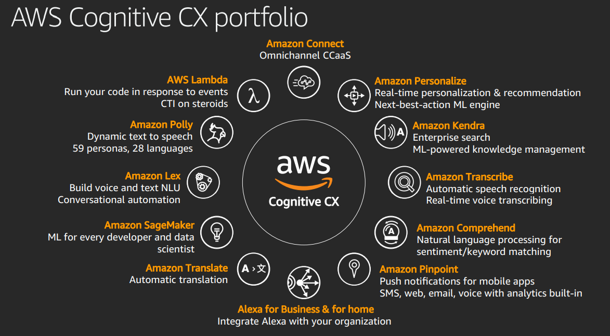
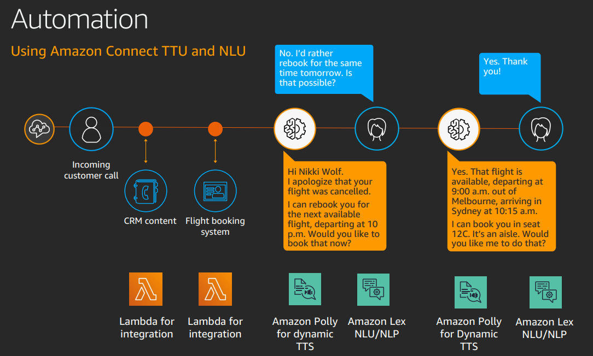
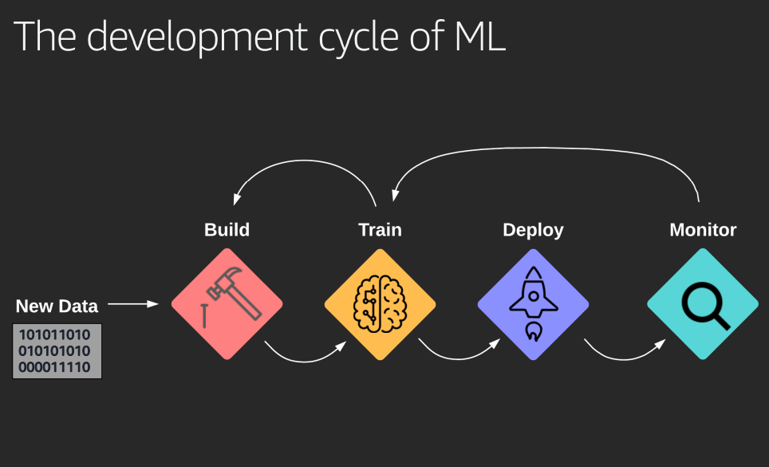
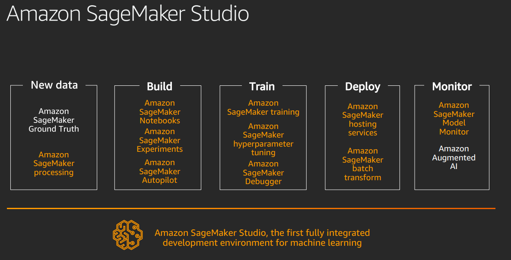
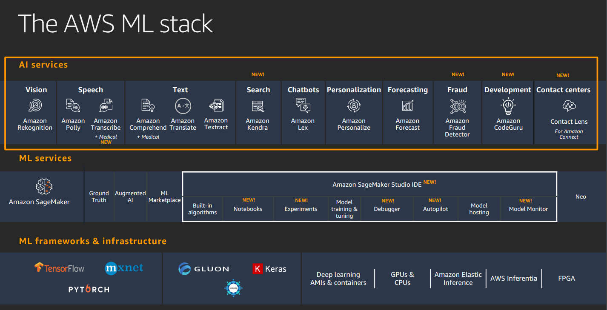

<LINK href="jb1.css" rel="stylesheet" type="text/css">

#### [Back to index](index.html)

# AWS Machine Learning

- [AWS Machine Learning](#aws-machine-learning)
  - [CX](#cx)
  - [ML operations at scale](#ml-operations-at-scale)
    - [Challenges of large scale ML](#challenges-of-large-scale-ml)
    - [Solutions](#solutions)
      - [Workflow orchestration](#workflow-orchestration)
      - [Amazon Tools](#amazon-tools)
        - [Build](#build)
        - [Train](#train)
        - [Deploy](#deploy)
        - [Monitor](#monitor)
        - [New data](#new-data)
  - [Building AI into your app](#building-ai-into-your-app)
    - [Amazon AI services](#amazon-ai-services)
    - [Building Block approach](#building-block-approach)
  - [Building NLP models with Sagemaker](#building-nlp-models-with-sagemaker)
  - [New tools 2020](#new-tools-2020)

## CX

CX = Customer experience

CCAAS = Contact centre as a service

CX across all touch points:

- retaining cheaper than new so reduce churn by better retention
- upsell easier then new sell
- loyalty yields evangelism

CX is Primary means of customer differentiation.

CS means 6 pillars (gives mechanism for prioritising and sequencing your plan)

- Personalisation (emotional connection)
- removing customer effort (frictionless)
- Integrity
- Expectations
- Resolutions
- Empathy

**ROAS**: return on ad spend. a marketing metric that measures the amount of revenue your business earns for each dollar it spends on advertising. For all intents and purposes, ROAS is practically the same as another metric you're probably familiar with: return on investment, or ROI

Amazon Connect 2017: one application for scalable solution, Contact routing, call handling, analysis, messaging, voice.  
Phone menus, predicted insights  
Consumption based, not set up cost.  
Customer insight gap: capture and use all the data customer gives you.  

AWS Connect services:

1. **AWS Lambda:** event driven serverless compute service
2. **Amazon Polly:** dynamic text to speech
3. **Amazon lex:** Build voice and text NLU conversational automation
4. **Amazon Sagemaker** Machine learning
5. **Amazon Translate**
6. **Alexa for business and home**: Integrate Alexa
7. **Amazon Pinpoint** push notifications to SMS, mobile
8. **Amazon Comprehend**: NLP for sentiment / keyword matching
9. **Amazon Transcribe**: Automatic speech recognition
10. **Amazon Kendra**: Enterprise search
11. **Amazon Personalise** ML to Predict next action
12. **Amazon connect**: Omnichannel marketing

Allows same flow to be used for voice, text, app chat.
Agent can interact if necessary.
Amazon lens: monitor sentiment through the call.

## ML operations at scale

### Challenges of large scale ML

Build train deploy monitor

problems:
But then retrain, retest. Iterative in design, but also after deployment.  
Data drift: change in stats, e.g. market movement drives change in behavior. Then need to retrain.  
Need good tools to compare results.  
New data from extra customers. New features mean more and better data.  
Need to annotate data so can be used for ML.  

Increasing complexity in 3 dimensions: Delivery more complex, team size growing, scale of users and data increasing.

If have separate ML and software teams:

- it's hard to integration test
- hard for ML to get logs
- lack of understanding

ML going from science experiment to engineering practice.

- Team size increases: need standard environment, specialisation, collaboration
- Infrastructure - elastic, on demand, distributed, large data size
- Users grow - business growth

More mature now.
Saas, CI / CD, experiments for A/B, automatic monitoring
Needs better foundational tools to prepare for business growth.

### Solutions

#### Workflow orchestration

e.g. Metaflow, Flyte, Apache Airflow, Kubeflow, AWS Step functions.  
Mainly build on Kubernetes, hive, spark.  
Can e.g. use AWS sagemaker for ML, deploy in Kubernetes.  

#### Amazon Tools

All wrapped in Amazon Sagemaker studio.

##### Build

- **Amazon Sagemaker Notebooks**: hosted Jupyter notebooks. Prebuilt environments. Good for collaboration.
- **Amazon Sagemaker Experiments**: captures metrics, models, metadata used in experiments. Helps organise experiments and their comparison.
- **Amazon Sagemaker Autopilot**: Automated experimentation. Run several training trails, takes data to generate Jupyter notebook model as output.

##### Train

- **Amazon Sagemaker training**: high volume data model training. Specify model, instance configuration with right dependencies, executes training. Can use built in models.
- **Sagemaker Hyperparameter tuning**: Finds best version of the model by running multiple training jobs.
- **Sagemaker debugger**: Automatically identifies complex issues in ML training, e.g. exploding or vanishing gradients, lack of convergence.

##### Deploy

- **Amazon sagemaker hosting services**: specify location where models are stored. This starts instances, creates load balancer, runs.
- **Sagemaker batch transform**: runs batch on data to predict new values.

##### Monitor

- **Amazon sagemaker model monitor**: checks for data drift
- **Amazon augmented AI**: check for low confidence predictions

##### New data

- **Sagemaker ground truth**: human classification, then auto takes over. AWS marketplace has vendors doing human classification.
- **Sagemaker processing**:

## Building AI into your app

Customers using smart functions, automation, understanding questions.  

### Amazon AI services  

give simple easy to use ML.  
Generally pay as you go.  

- **Amazon Kendra**:
intelligent search. Connect a set of docs from multiple sources. Connect data sources, builds index. Ten can fine tune query response.
- **Amazon code guru**:
Automate code reviews. Profiler to measure cost of lines of code. Reduces cost in a usage cost model.
- **Fraud detector**:
route api call to fraud detector (after training) and get fraud measure.
- **Amazon Augmented AI / A2I**:
take the "5 of production data not being well handled by the model, want to use this in next training iteration. Helps feedback loop.
- **Amazon Textract**:
OCR++. Handles table extraction, form extraction, bounding boxes, confidence thresholds, etc. Does OCR and stores better.
- **Amazon Rekognition**:
Like OCR with images. Face search, labels (scenes, activities, objects), text in image, pathing, etc. WOrks on video also. Checks compliance rules. If Rekognition doesn't include your specific classification, then you can use custom labels to add this capability. Build your classification, build custom model.
- **Amazon Forecast**:
accurate time series forecasting. Traditionally use linear or seasonal models. But ghi price variability, relations, slow moving products, new products etc mean more complex problem. Takes in historical data (sales, inventory, demand), related data (price, promotions, etc), meta data (items, customer, colour, city, category etc). Model builds features and build private forecasting model behind API. Allows quantiles, e.g. 95% confidence forecast is higher than real value.
- **Amazon Personalise**:
real time personalisation and recommendation. e.g. what else do you want to buy. Real time. Provide input data, finds features, seasonalities etc. Provides custom API to provide recommendations.

### Building Block approach

Python integration, API calls.  

For practicals look at ai-services.go-aws.com  

## Building NLP models with Sagemaker

Natural language processing  

- Needs a language model  
- Big vocab, millions of docs.  
- Need compact mathematical model.  
- Need to tokenise, vectorise, train.
- Uses neural networks, read forward and backwards.

Bert is the latest NLP model. Uses masking to help learning. Apply a fine tuning classifier to it to get the results you want.

Popular deep learning frameworks:

- Tensorflow
- Pytorch

Sagemaker support for tensorflow.

## New tools 2020

- Sagemaker data wrangler: easier data prep. Feature engineering by combining attributes.
- Sagemaker clarify for Bias detection. Check features are well represented across the data (e.g. too much blues data in playlist data gets balanced out). Inspect predictions to check features which are important are not under represented.
- Sagemaker model monitor
- Aurora ML: run ML directly in the database. Much less integration work
- Athena ML: add ML predictions to queries on S3.
- IOT: Panorama for AI in cameras at edge.
- Amazon Lookout for AI cameras
- Monitron for monitoring vibrating things
