<LINK href="jb1.css" rel="stylesheet" type="text/css">

#### [Back to index](index.html)

# AWS Machine learning and data analytics

- [AWS Machine learning and data analytics](#aws-machine-learning-and-data-analytics)
  - [The problem](#the-problem)
  - [Solution](#solution)
  - [details](#details)
    - [Use columnar database](#use-columnar-database)
    - [Partitioning](#partitioning)
    - [External functions](#external-functions)
    - [Built in visualisations](#built-in-visualisations)
    - [Why](#why)
    - [Environment](#environment)
    - [Running models](#running-models)
    - [Scaling](#scaling)
    - [Custom metrics](#custom-metrics)

## The problem

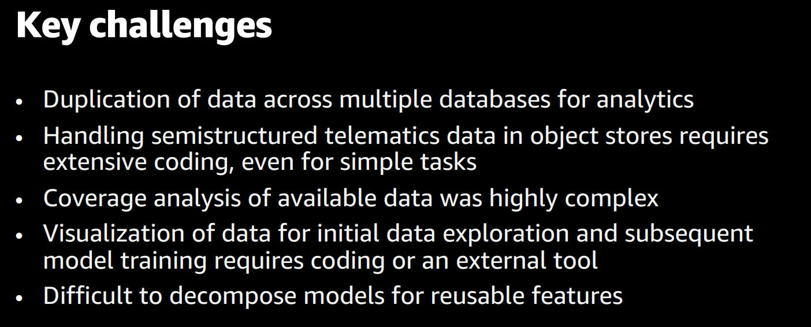

## Solution

Use S3 and data cloud (snowflake) to simplify.
Object store and data cloud

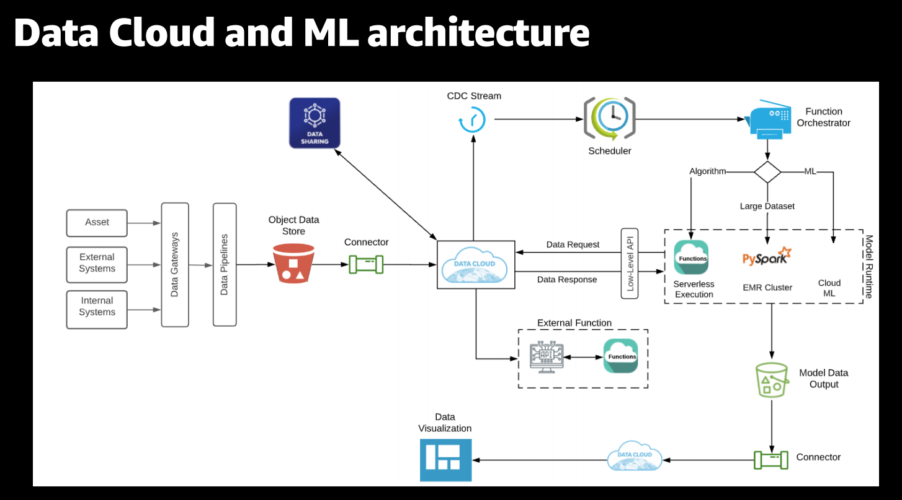

Store in teh data cloud in a well defioned data model: structured and unstructured.
Partition correctly.
Use external functions to clean data ready for ML.
Use external functions to run ML models
(all this eliminates additional tools)

Have a variety of runtime engines to run ML models:

- serverless
- Pyspark for large data
- Sagemaker for cloud ML

Results to Object store
Share directly from here to visualisation tools

## details

### Use columnar database

Use variant column type, gets structured and semi structured data in a single data model. Then can query both with single SQL. Reduced storage by huge factor, as e.g. 100 chanels of data in one row. 

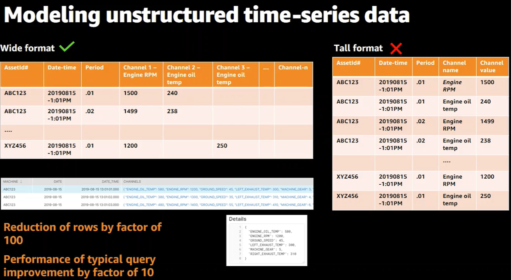

### Partitioning 

to organise data in the way that it is queried.

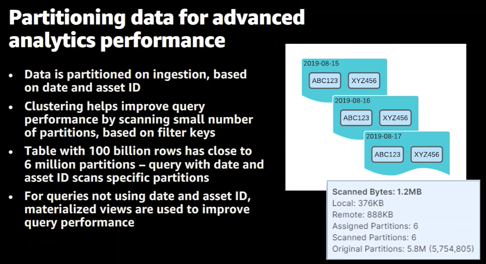

### External functions

Data cloud manages scaling of teh external functions.

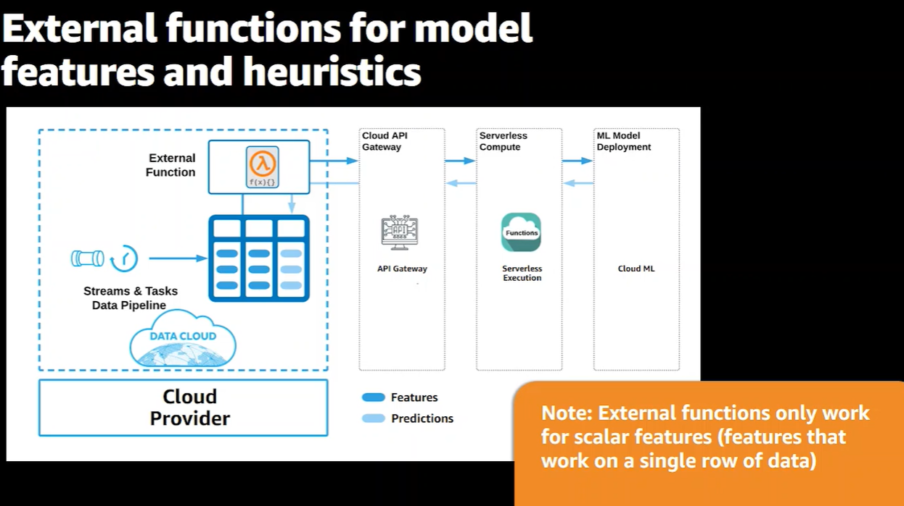

### Built in visualisations

Traditional is Python notebooks or e.g. Tableau
Can now use native query in snowflake.
Input data and output data in the same platform with SQL
Build templates that you can use directly, don't need to do so much coding to visualise data

### Why

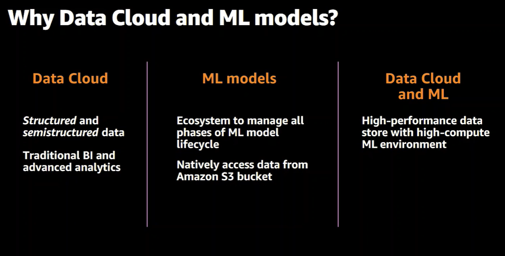

### Environment

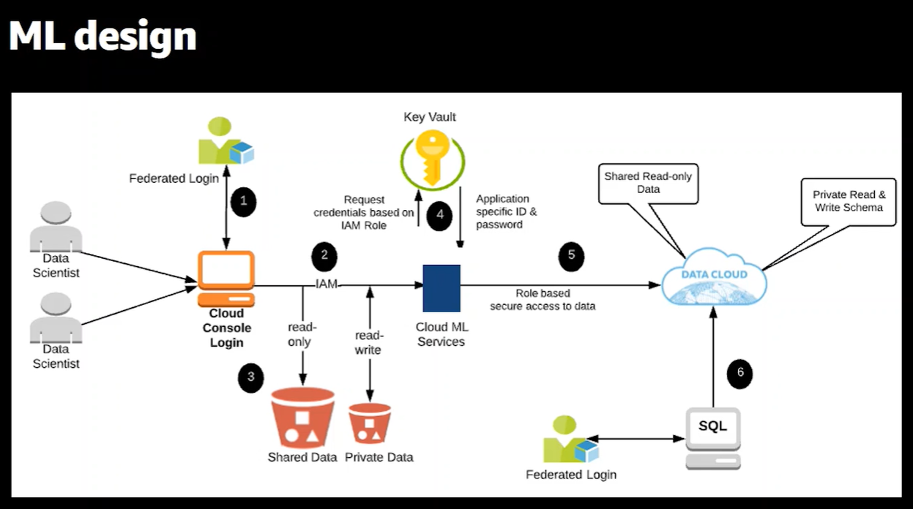

### Running models

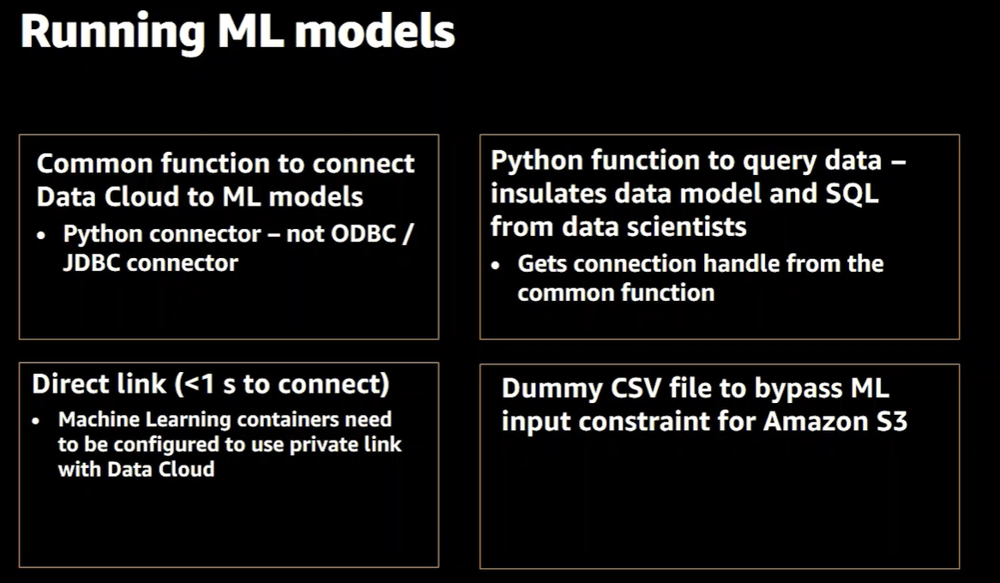

### Scaling

Time sensitive models doing predict for real time
vs Batch models

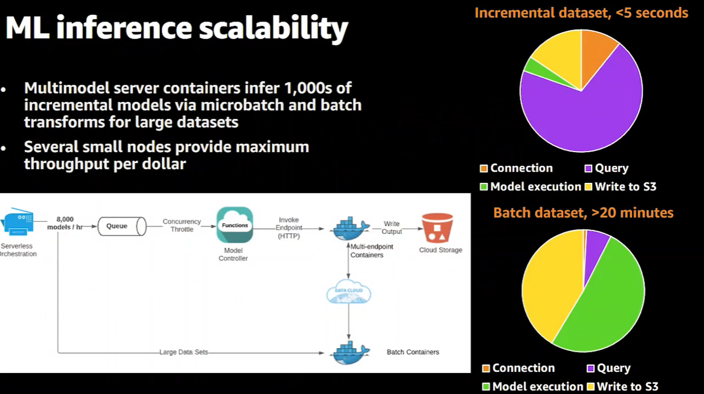

### Custom metrics

Add snowflake metrics into cloudwatch to make it easier for ops teams

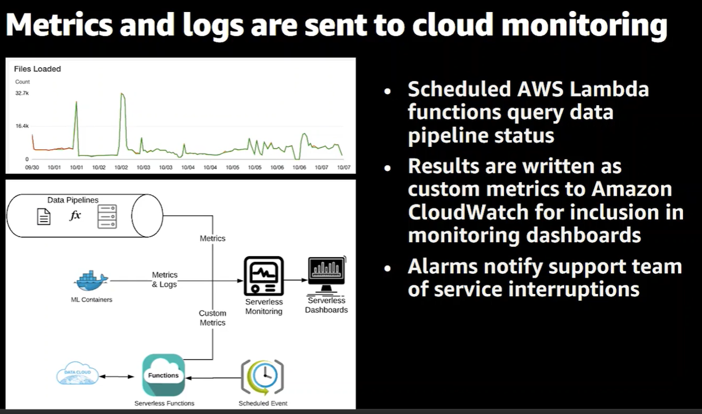

monitoring for DevOops

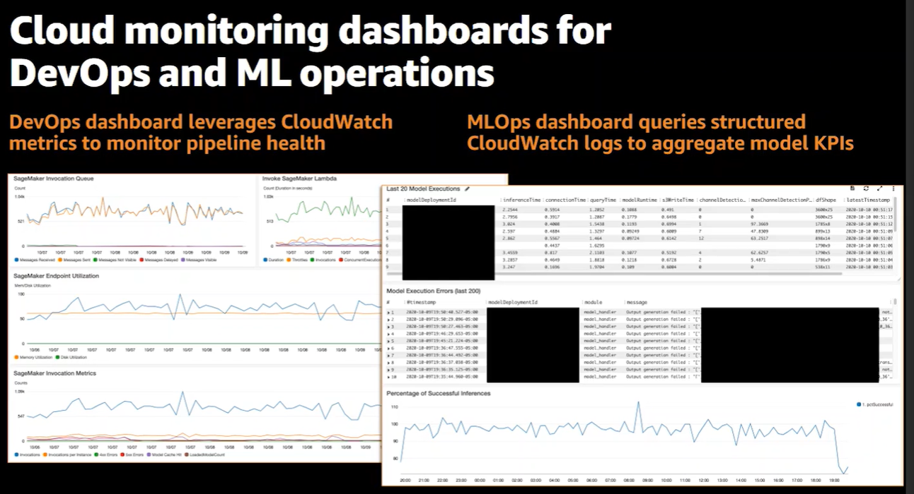

