<LINK href="jb1.css" rel="stylesheet" type="text/css">

#### [Back to index](index.html)

# AWS SAA-C02 Databases

- [AWS SAA-C02 Databases](#aws-saa-c02-databases)
  - [Relational vs Non Relational](#relational-vs-non-relational)
    - [Structured data](#structured-data)
    - [Semi structured](#semi-structured)
    - [Unstructured](#unstructured)
  - [RDS](#rds)
    - [more custom option: EC2 instance with database](#more-custom-option-ec2-instance-with-database)
    - [Setup Wordpress on MySQL](#setup-wordpress-on-mysql)
    - [Multi AZ database](#multi-az-database)
    - [Read replica](#read-replica)
    - [Multi AZ read replicas](#multi-az-read-replicas)
    - [RDS encryption](#rds-encryption)
    - [Snapshots](#snapshots)
    - [Migration](#migration)
  - [Aurora](#aurora)
    - [Aurora replicas vs MySQL replicas](#aurora-replicas-vs-mysql-replicas)
    - [Aurora fault tolerance](#aurora-fault-tolerance)
    - [Aurora setup](#aurora-setup)
    - [Aurora Global database](#aurora-global-database)
    - [Aurora multi master](#aurora-multi-master)
    - [Aurora Serverless](#aurora-serverless)
  - [Dynamo DB](#dynamo-db)
    - [Features](#features)
    - [DynamoDB table setup](#dynamodb-table-setup)
    - [DynamoDB Streams](#dynamodb-streams)
    - [DynamoDB Accelerator (DAX)](#dynamodb-accelerator-dax)
    - [Global table](#global-table)
  - [Elasticache](#elasticache)
    - [Redis](#redis)
    - [MemCacheD](#memcached)
  - [Redshift](#redshift)
  - [Document DB](#document-db)
  - [Neptune](#neptune)
  - [QLDB](#qldb)
  - [Timestream](#timestream)

## Relational vs Non Relational

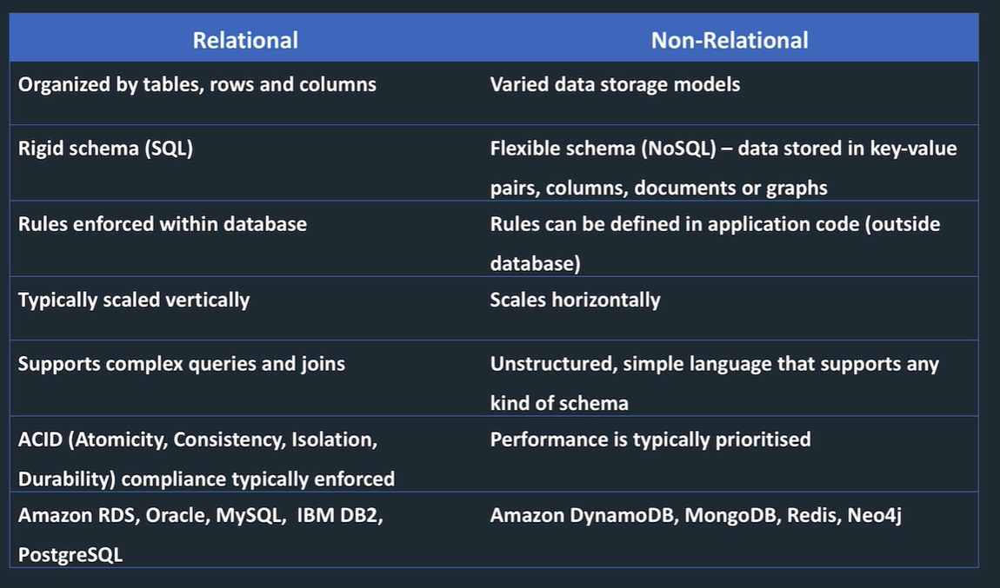

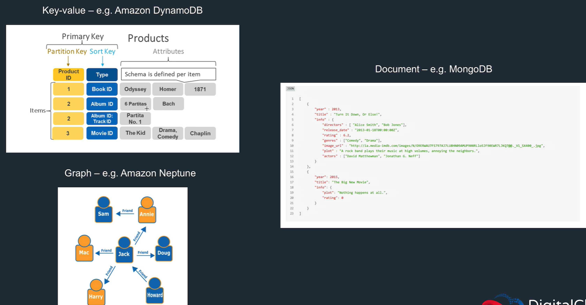

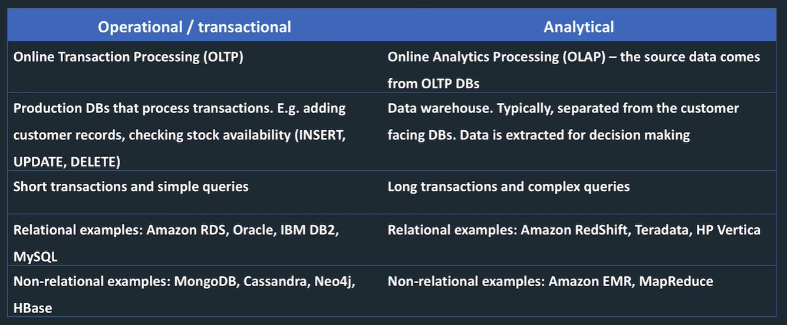

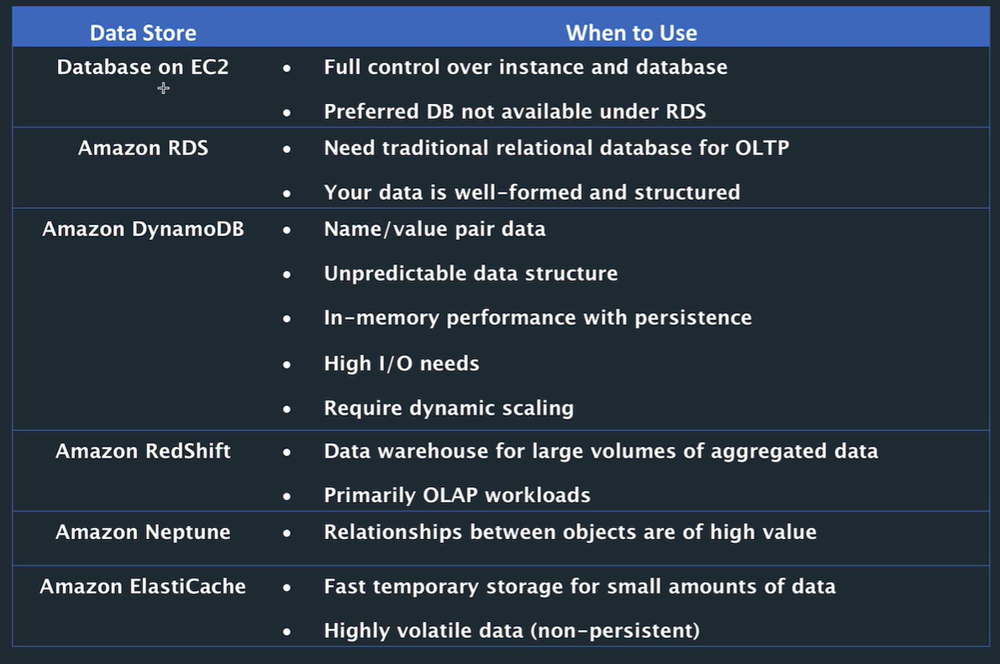

### Structured data

transactional and analytical. Relational or non relational.

### Semi structured

e.g. xml. But flexible, updated withing the requirement to change the schema for every record in the table. Non relational stores, e.g. XML,. JSON, email

### Unstructured

not organized. e.g. key value pairs, lots of irrelevant information. e.g. text messages, docs, videos. Files in file store or data lake.  
often combined, e.g. point of sale system produces structured data, integrated with clickstream data form the website in XML. Need to bring together to query.

## RDS

- Covers Aurora, MySQL, Postgres, Oracle, SQL Server
- OLTP, replacement for on prem db.
- RDS encryption: only enable at creation (unless you load an encrypted backup into non encrypted)
- Read replicas need to be same encryption
- Monitor with cloudwatch
- maintenance windows
- specify storage, vpc, instance size (cpu / mem)
- specify instance type, some downtime when changing this.
- No access to underlying EC2 instance so no customisation.
- patching, backup are automated
- easy to scale
- synchronous replication to multi AZ
- auto failover
- read replicas to scale for reads
- pay for: DB hours, storage, IO requests, backup storage
- in multi AZ, pay for 2nd install but data transfer between the 2 is not chargeable
- scale up based on cpu and storage, but not down. Causes downtime if change instance type.

### more custom option: EC2 instance with database

- option if need more control than RDS offers
- e.g IBM DB2
- need to manage everything: patches, scaling, backups

### Setup Wordpress on MySQL

Set up MySQL db, free tier  
Set up EC2 instance

```bash
# Install WordPress on EC2 using RDS MySQL DB
yum update -y
amazon-linux-extras install -y php7.2 yum install -y httpd
systemctl start httpd
systemctl enable httpd
cd /var/www/html
wget https://wordpress.org/latest.tar.gz tar -xzf latest.tar.gz
cp -r wordpress/* ./
chmod -R 755 wp-content
chown -R apache:apache wp-content
yum install php-mbstring -y
systemctl restart httpd
systemctl restart php-fpm
wget https://www.phpmyadmin.net/downloads/phpMyAdmin-latest-all- languages.tar.gz
mkdir phpMyAdmin && tar -xvzf phpMyAdmin-latest-all-languages.tar.gz -C phpMyAdmin --strip-components 1
rm phpMyAdmin-latest-all-languages.tar.gz
```

Go to public IP address and see wordpress installation screen
Put in database URN in wordpress setup page
SSH to the EC2 instance, create wordpress wp-config.php file in EC2.
Give site title

Install PHP etc

```bash
# Install PHP MyAdmin
yum install php-mbstring -y
systemctl restart httpd
systemctl restart php-fpm
wget https://www.phpmyadmin.net/downloads/phpMyAdmin-latest-all-languages.tar.gz
mkdir phpMyAdmin && tar -xvzf phpMyAdmin-latest-all-languages.tar.gz -C phpMyAdmin --strip-components 1 rm phpMyAdmin-latest-all-languages.tar.gz

# Edit config:
nano config.sample.inc.php #add database host name

# Add text (enter RDS endpoint):
$cfg['Servers'][$i]['host'] = 'RDS MYSQL ENDPOINT'; $cfg['Servers'][$i]['compress'] = false; $cfg['Servers'][$i]['AllowNoPassword'] = false; $cfg['Servers'][$i]['connect_type'] = 'tcp'; $cfg['Servers'][$i]['extension'] = 'mysqli';

# Copy sample file over live file:
cp config.sample.inc.php config.inc.php
service httpd restart
```

Go to ip address/phpmyadmin to get MySQL database manager.

### Multi AZ database

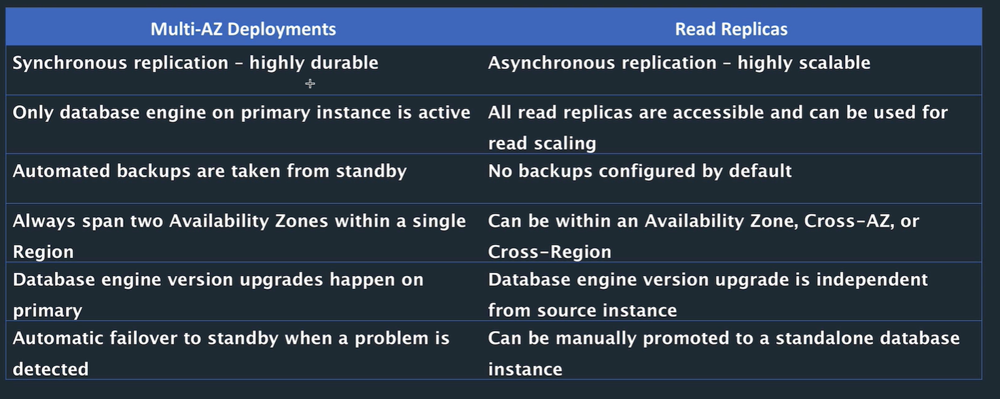

Multi AZ:

- standby database in separate AZ.
- synchronous replication to instance in different AZ.
- No endpoint, on failover end point address is mapped to standby instance.
- 2 AZs in one region.
- Standby used to take backups.
- Auto or manual fail over.
- When flips over to secondary, replicates the other way. Takes a couple of mins.

setup: just choose setting to make multi AZ. Takes time initially. Demo with reboot, wordpress site goes to replica.

### Read replica

Read replica: Asynchronous replication. Separate endpoint, so you can use it. Can be cross region! Can promote to writable db.

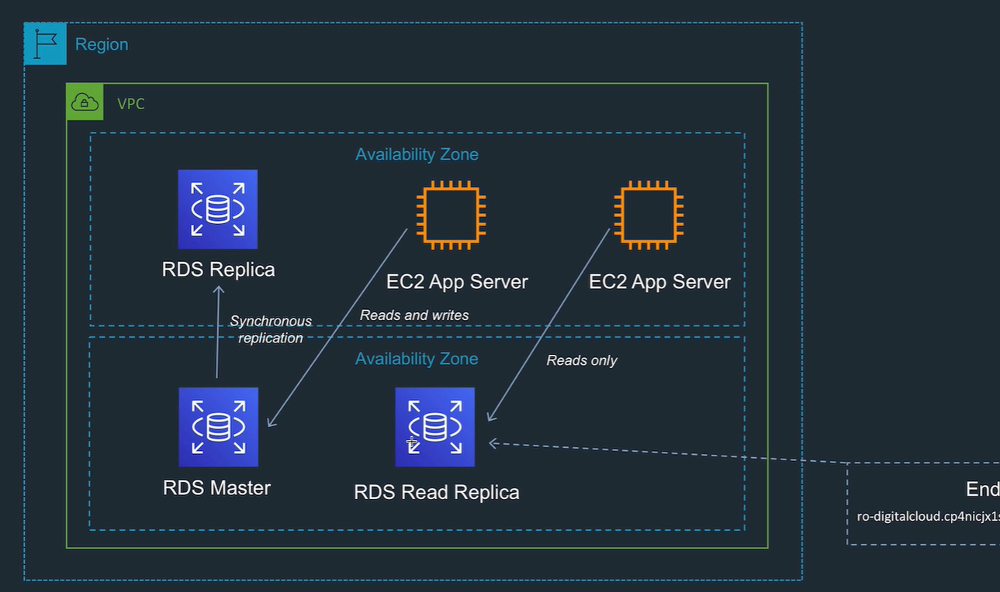

### Multi AZ read replicas

If you need fail over on read replicas..
If you fail over to a rr, then the rr copy becomes the OLTP replica.

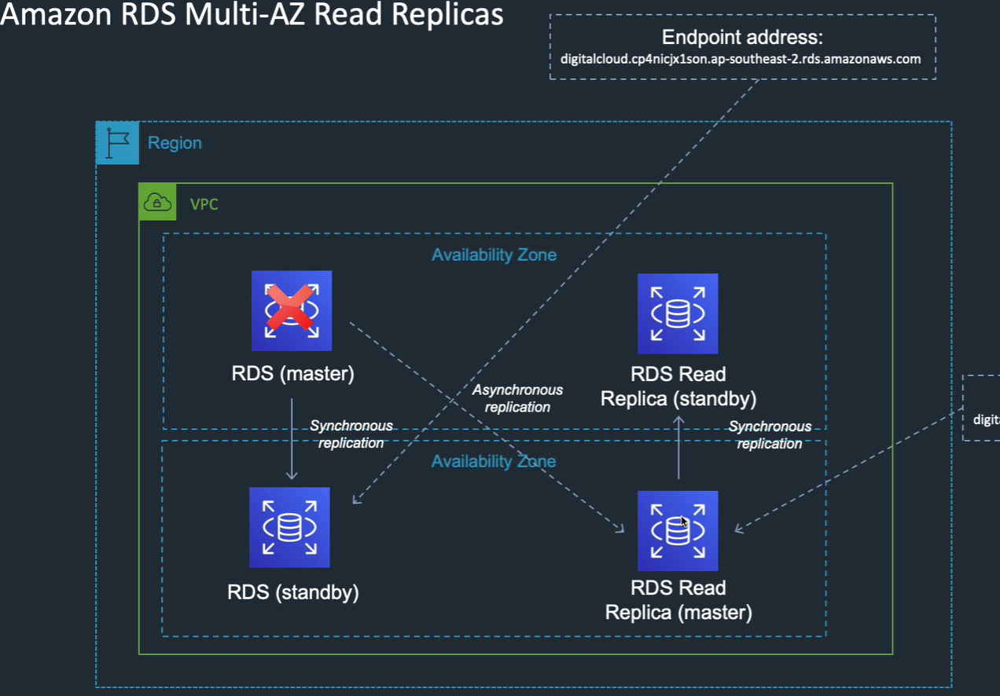

### RDS encryption

- Encryption at rest: means storage in EBS, backups, snapshots, replicas
- Uses AES 256.
- Transparent
- no performance impact
- enabled at creation only, can't disable
- RR encrypted at same level. In same region, can use the same key.
- If in different regions, need different keys
- work around to encrypt / decrypt: take snapshot, start a new instance with different encryption, load snapshot.

### Snapshots

- Taken to S3, manually delete
- user initiated backups
- restored databases to new RDS instance (not to existing DB)

### Migration

- AWS database migration service (DMS)
- Schema conversion tool (SCT)
- Lots of source databases

## Aurora

- Different from other RDS databases
- Compatible with MySQL or PostgreSQL, faster than these
- point in time recovery without restore
- cheap
- highly available
- Aurora replicas: like read replicas, in region read scaling. up to 15.
- MySQL read replicas: cross region cluster with read scaling, up to 5.
- Global database: cross region cluster with read scaling. Fastest replication and low latency reads.
- Multi master: scales writes in a region.
- Serverless: autoscaling for Aurora.
- 2 copies of data in each AZ, with min of 3 AZs, so min 6 data copies

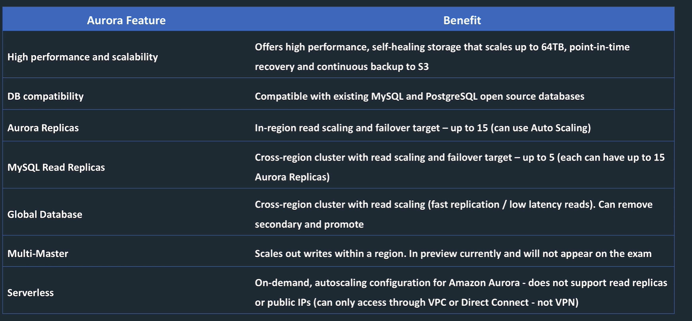

### Aurora replicas vs MySQL replicas

Aurora replica

- single region
- high performance
- support for failover

Aurora Cross region replica

- multi region for better DR
- eay to migrate between regions
- fast local reads

MySQL replicas

- multi region
- asynchronous
- higher impact on primary

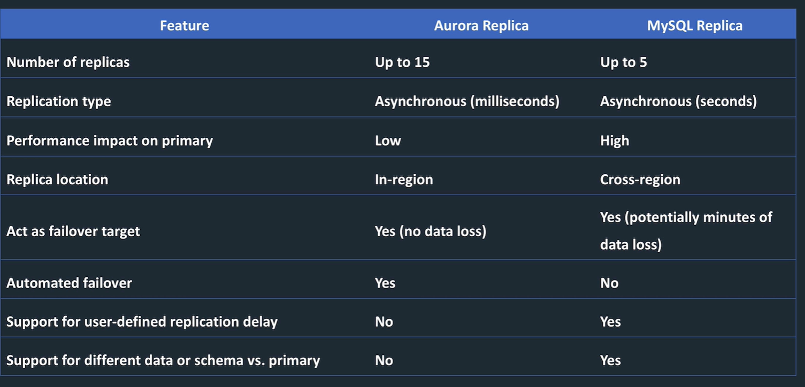

### Aurora fault tolerance

Multi AZ, multi copies in an AZ, so 6 min copies of the data

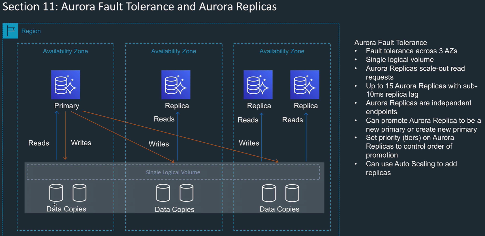

### Aurora setup

- provisioned (defined scale) or serverless (autoscaling)
- tiers control the order of failover
- can enable backtrack

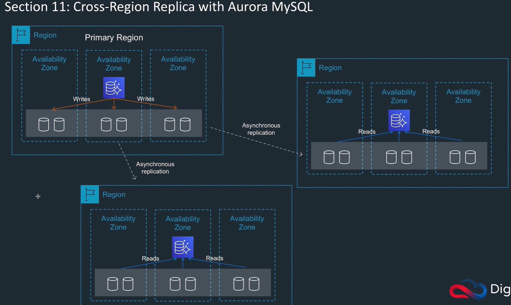

- Cross region read replicas: need to enable bin logging.
- Promote: makes a read replica a primary, stops and reverses replication.

### Aurora Global database

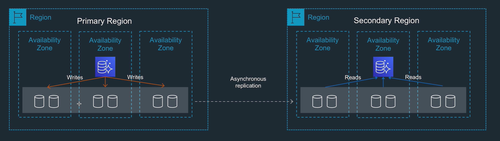

- write to one region, replicated to others.
- Low latency (1 sec) read only copy
- little impact on the database (uses non db processes to replicate data)
- can promote secondary region
- storage based replication

### Aurora multi master

- mySQL only
- High availability
- ACID
- multi AZ

### Aurora Serverless

- automatically starts up, scales, shots down when required
- simple and cheap for infrequent intermittent, unpredictable workload
- On demand auto scaling
- MySQL or Postgres SQL only
- pay for storage, and io while active.

## Dynamo DB

### Features

- Fully managed, serverless, no setup or maintenance to do, no downtime.
- Scales easily: horizontal, no downtime. Scale with read and write units, or autoscaling.
- Availability very high. 4 9's, 5 9's when use global tables.
- DynamoDB streams: use for queue.
- DynamoDB accelerator (DAX): caches with microsecond performance (no read replicas for DynamoDB!)
- Point in time recovery
- Global tables are multi region multi master.
- Transaction support: strong consistent, eventual consistent, or ACID.
- multi AZ or cross region
- Defaults to eventual consistency, but can request strongly consistent reads
- Use DynamoDB Transactions for ACID
- auto scaling
- pay for capacity: on demand (auto scaling) or provisioned capacity (specify reads and writes per second)  
- fast to store data from e.g. Kinesis

### DynamoDB table setup

- Primary key mandatory, sort key optional
- read write capacity: choose Provisioned or on demand. Can choose reserved capacity (big discount)
- Scaling parameters
- Encryption with KMS or default
- Items can have different attributes
- Search with scan (uses filters) or query (uses sort key, fast)

### DynamoDB Streams

- Switch on to get a list of item level changes
- integrate with Lambda as trigger, associate the stream with a lambda function

### DynamoDB Accelerator (DAX)

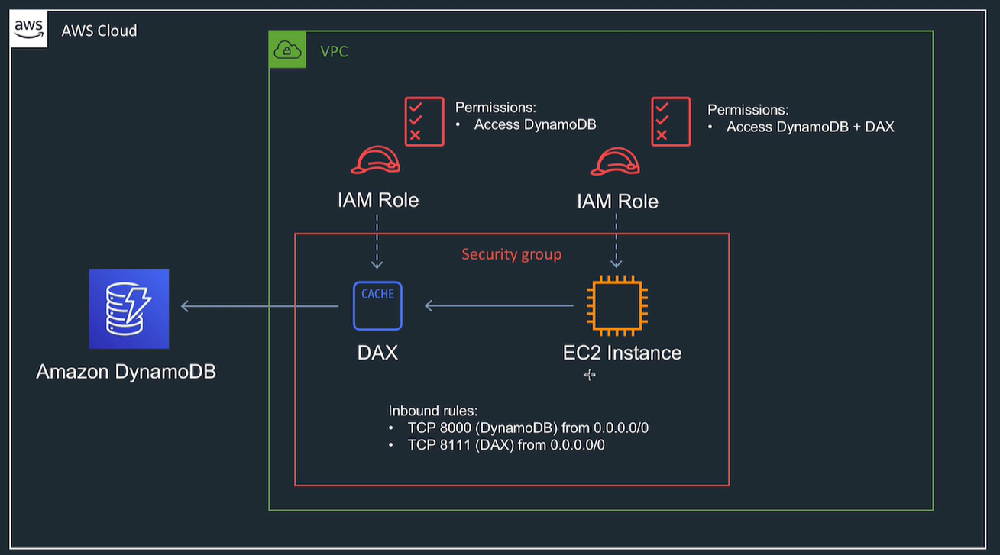

Look at python and DAX example

- Cache, has nodes in various AZs.
- Gives endpoint.
- Managed service
- 10 x faster than dynamoDB

### Global table

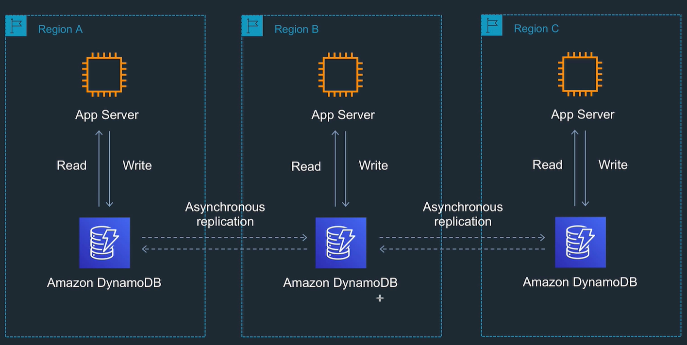

- Replicated to regions, and can write in regions.
- Async replication but uses AWS backbone.
- Need to switch on DynamoDBStreams
- Set up a table and add a region to it.
- Monitoring shows pending replication count.

## Elasticache

- 2 different options (Redis / MemcacheD)
- Fully managed, in memory datastores
- Use when want to improve latency and throughput for read intensive apps.
- best for OLAP
- a fast database for small memory requirements

### Redis

- better for real data, for very low latency and high performance
- persistent
- really just like an in memory database
- multi AZ with failover
- with no clusters, all data in one db and have between 0 and 5 replicas
- cluster mode can be enabled
  - this splits the data into shards in different AZs.
  - a shard has between 0 and 5 replicas
  - slots and key spaces to segregate the data into shards
- can encrypt
- can have auto failover to make a different node the primary

Redis AUTH command: requires users to have a token (password) before allowing clients to execute commands.

### MemCacheD

- high performance object storage
- good for cache data for web apps, e.g. session state
- partitioned data
- set up number of nodes, scales these, multi AZ
- can get reserved instances for cheaper cost
- no backups
- no encryption

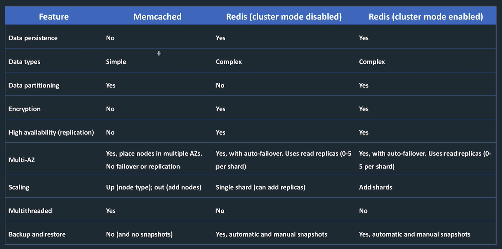

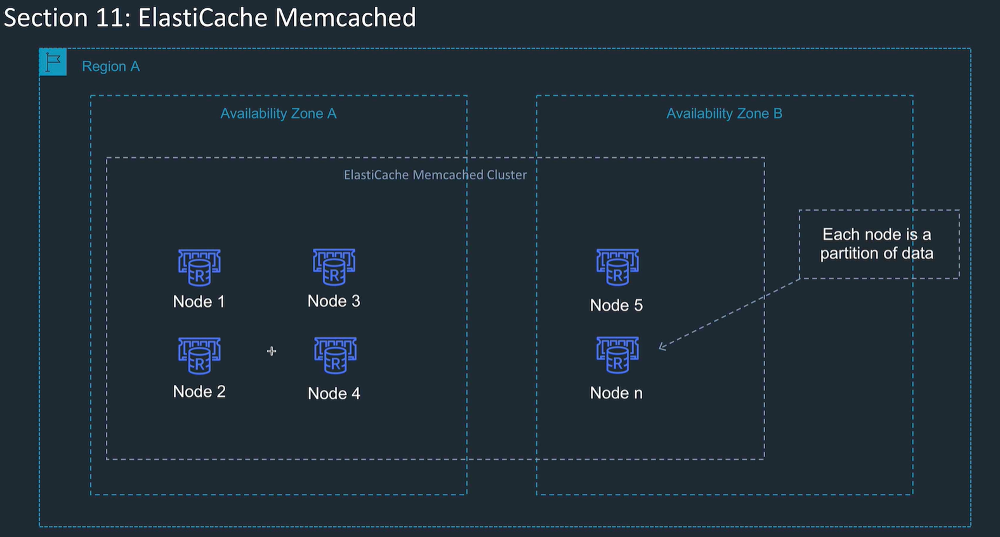

Need to write code to use this effectively.

## Redshift

- OLAP Analytical database
- Data warehouse with SQL and BI tools
- Load data from OLTP, or s3 or something.
- Leader nodes coordinate the query
- compute nodes do the query execution
- Take snapshots, can replicate snapshots
- Single AZ, but snapshots are in S3 region, so can restore to a second AZ
- Redshift spectrum: query data directly on S3 without loading to Redshift
- Uses columnar data storage: this is good for warehousing as less IO for L shaped data
- Massively parallel processing with lots of compute nodes.
- cross region snapshots
- can use reserved nodes with optional upfront payment
- good for long running queries, and also the cache helps with repeated short queries

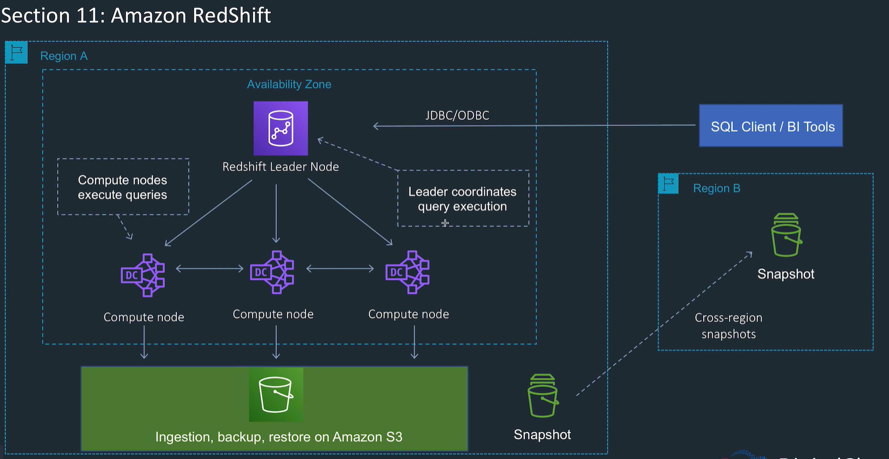

## Document DB

- mongo DB implementation
- auto scaling
- JSON type storage

## Neptune

- Graph database
- supports graph query languages Apache Tinkerpop etc
- use cases social networking, recommendations.
- Create relationships and quickly query.
- Hard in Relational because multiple foreign keys, difficult nested queries.
- Neptune uses graph structures such as nodes (data entities), edges (relationships), and properties to represent and store data


Gremlin query to find Howard's friends friends  

```sql
g.V().has('name', 'Howard').out('friend').out('friend').values('name')
```

## QLDB

- Quantum ledger database
- fully managed
- ledger database to record history
- immutable transaction log known as journal, read only, with hash chained blocks
- SQL Transaction logs can be replayed but not secure because can be changed, and cant be easily queried
- QLDB similar to trans log, but immutable.
- Write transactions committed to journal first
- journal materialised into queryable user defined tables

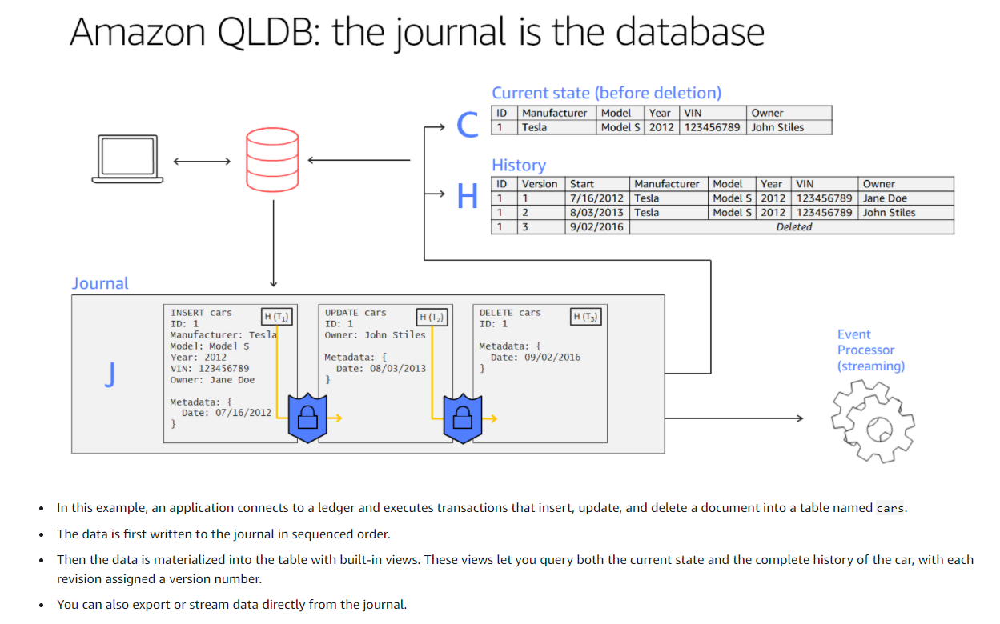

## Timestream

- Time series database
- store and analyse time series data points
- keeps recent data in memory and moves old data to different storage automatically
- query engine to analyse recent and historical data together without specifying location
- built in time analytics functions
- managed service
- use cases: metrics, telemetry, IOT
