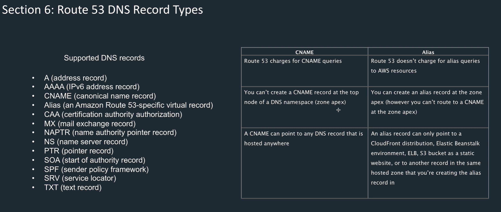
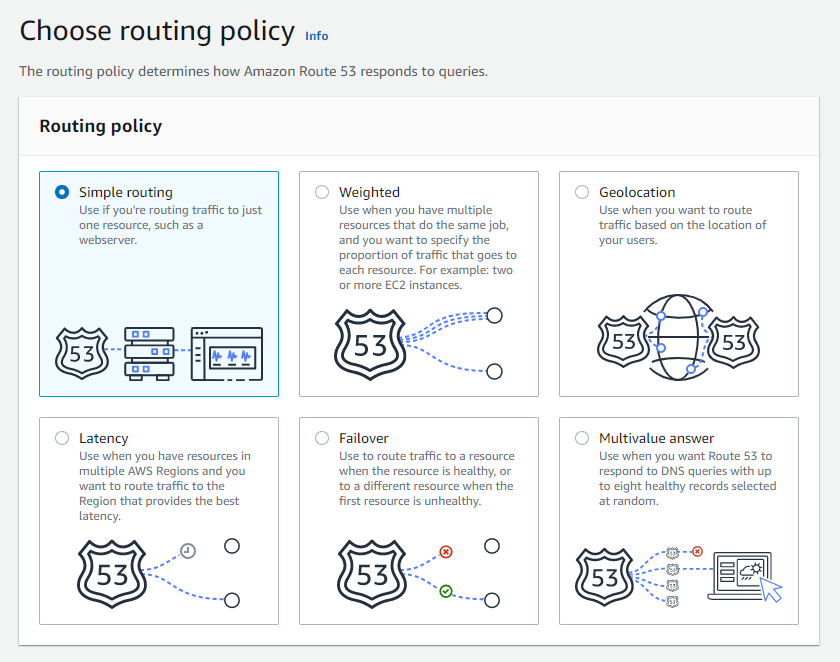
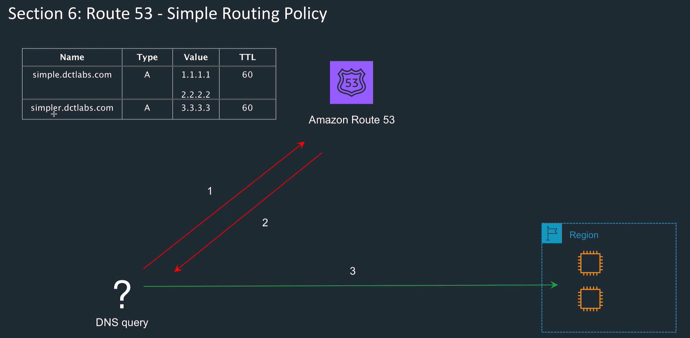
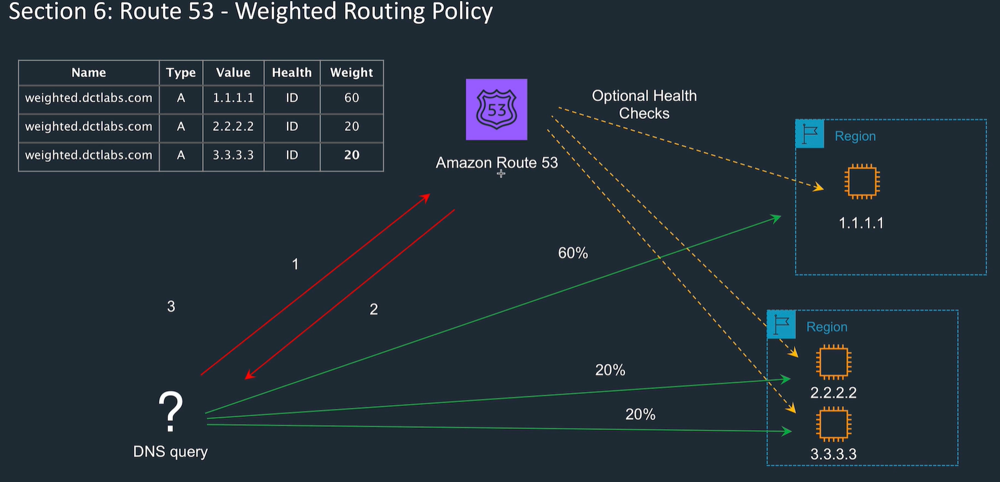
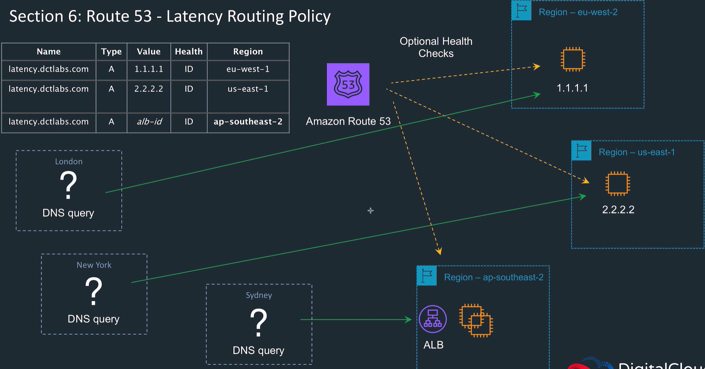
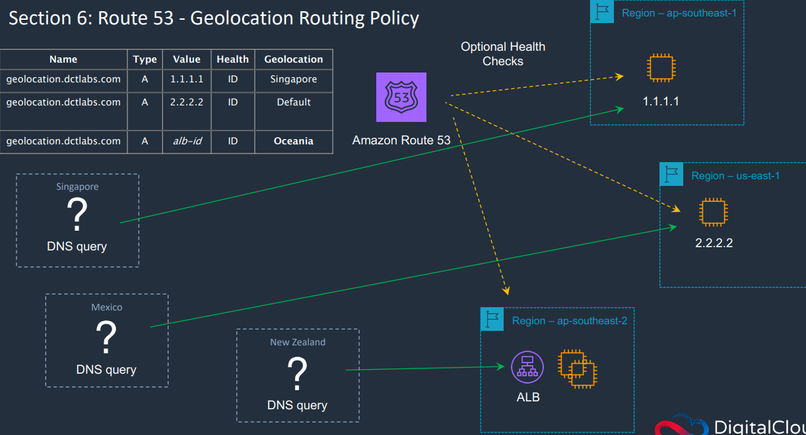
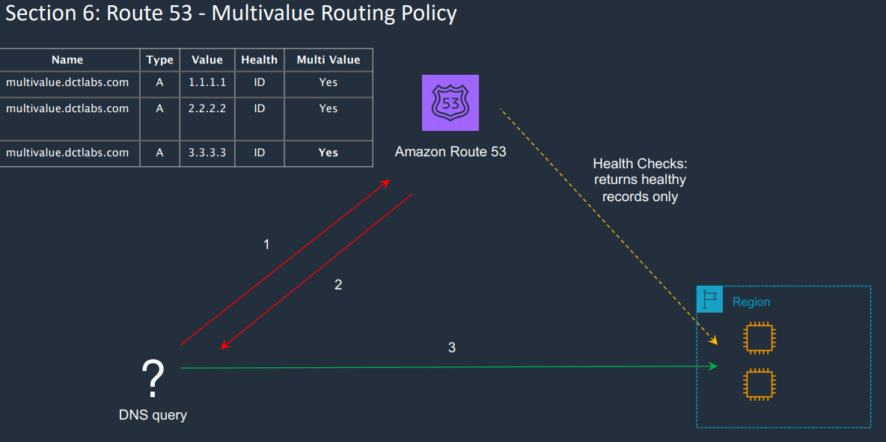
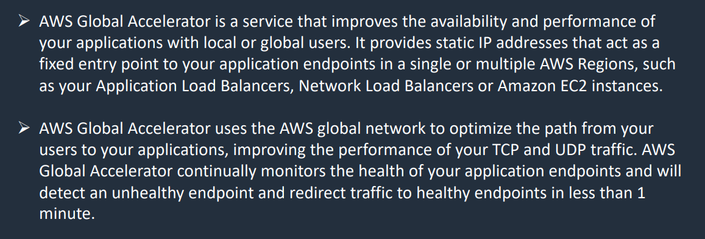
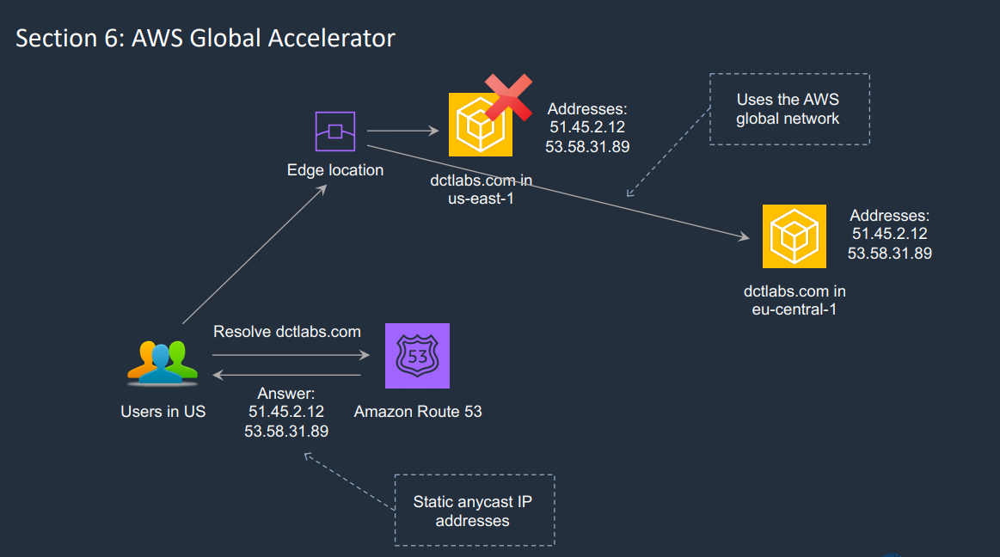

<LINK href="jb1.css" rel="stylesheet" type="text/css">

#### [Back to index](index.html)

# AWS Route 53

- [AWS Route 53](#aws-route-53)
  - [Overview](#overview)
  - [DNS Basics](#dns-basics)
    - [Hosted Zones](#hosted-zones)
    - [Record types](#record-types)
    - [TTL](#ttl)
  - [Routing policies](#routing-policies)
    - [Simple routing](#simple-routing)
    - [Weighted routing](#weighted-routing)
    - [Latency based](#latency-based)
    - [Failover Routing](#failover-routing)
    - [Geolocation routing](#geolocation-routing)
    - [Geoproximity routing](#geoproximity-routing)
    - [Multivalue routing policy](#multivalue-routing-policy)
  - [Traffic flow](#traffic-flow)
  - [Route 53 Resolver](#route-53-resolver)
  - [AWS Global Accelerator](#aws-global-accelerator)

## Overview

Manages:
  DNS names
  Hosted Zones
  Health checks
  Registrations

## DNS Basics

Domain registry, health check, DNS resolution
Located with edge locations

### Hosted Zones

Hosted zone is collection of records
Private hosted zones: e.g. jbprivate.com

### Record types

- A record (address record) translates hostname to IP
- AAAA record (address record) translates hostname to IP for ipv6
- SOA (Start of authority)
- Cname and Alias translate one domain name to another. Alias is an AWS thing.

For exam need alias, CNAME  

- Cname
  - maps one domain name to another.
  - Can't create at top level (zone apex).
  - can't point to AWS end point.
  - paid lookup
- Alias
  - similar to CNAME but records need to point to AWS services.
  - Mean automatically pick up e.g. IP changes to S3 or cloudfront.
  - can create alias at top level
  - free lookup

### TTL

Time to live. Caches come back and refresh record info after this time.

## Routing policies

Use dig utility to see what your client thinks the DNS points to. Cached with a TTL.

### Simple routing

- A record associated with one or more IP addresses
- Doesn't support health checks
- For routing a DNS name to one resource (but can have multiple IPs, round robin)

### Weighted routing

Specify multiple destinations, and a weight for each. Different values provided depending on weight.

Can configure health checks

### Latency based

- Users connected to service with lowest latency
- Distance is key
- create multiple records, Route 53 choses based on user latency
- use e.g. VPN to dummy location to test

### Failover Routing

- Primary and secondary target
- Use health check to test if primary is live, mandatory
- When fail, cuts over.
- Set TTL appropriately

### Geolocation routing

Geolocation routing lets you choose the resources that serve your traffic based on the geographic location of your users, meaning the location that DNS queries originate from.

- Lock to a location
- e.g. use different language web sites, distribution rights, etc.
- specify by continent, country, state in US.
- Multiple entries for a record type, set location.
- Set a default
- Can associate with health check

### Geoproximity routing

Use when you want to route traffic based on the location of your resources and, optionally, shift traffic from resources in one location to resources in another.

### Multivalue routing policy

- Return multiple values (IP addresses) to the client. Then client can do load balancing on their side.
- Can give up to 8 records
- generally only gives healthy instances. If no health check, included anyway. If all unhealthy, all returned.
- bit like a load balancer

## Traffic flow

- Enables you to create a policy which combines several policies.
- e.g. Primary & secondary, primary has weights, then weights use latency.

## Route 53 Resolver

- regional service which can route DNS queries between VPCs and on prem.
- Aims to resolve across hybrid environments (On Prem plus AWS)
- in Route 53 create outbound endpoints and inbound endpoints
- e.g. use mail server on prem.
- all a bit complex.

## AWS Global Accelerator

- Uses internal AWS network, not the internet
- Monitors health
- Gives static IP addresses for all sorts of regional load balancers etc.
- Don't need to change info at client end when a service goes down with TTL as this info never changes.
- Uses edge locations
- When a failure, AWS Global accelerator redirects the traffic.
- Useful when have static IP addresses and need failover

Pricing: fixed fee for each partial hour, plus per gigabyte charge.

- Set up endpoint groups (regions)
- Set up endpoints (e.g. ALB, EC2 etc)
- Can assign weights to each group and each instance
- Gives 2 static IP addresses
- Either one will direct a user to closest endpoint.
