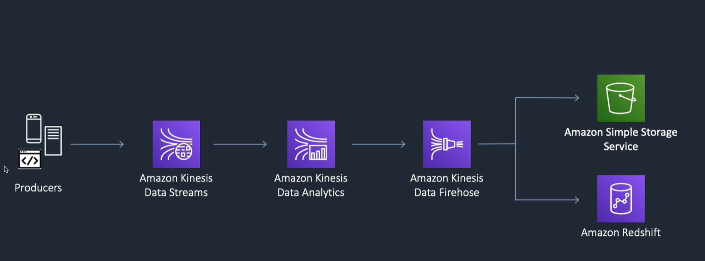
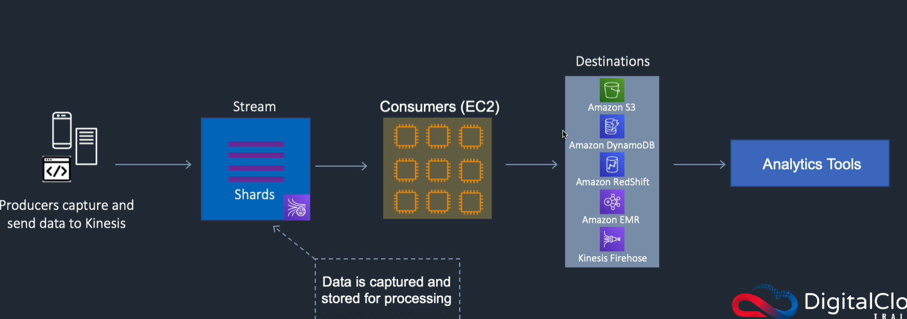
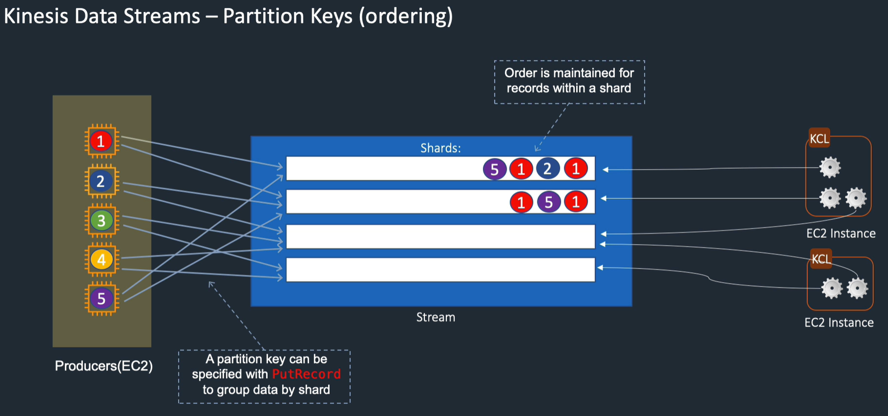
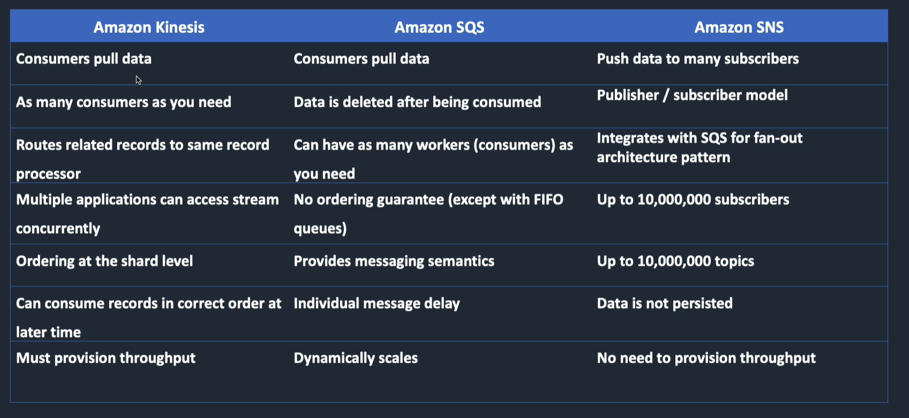
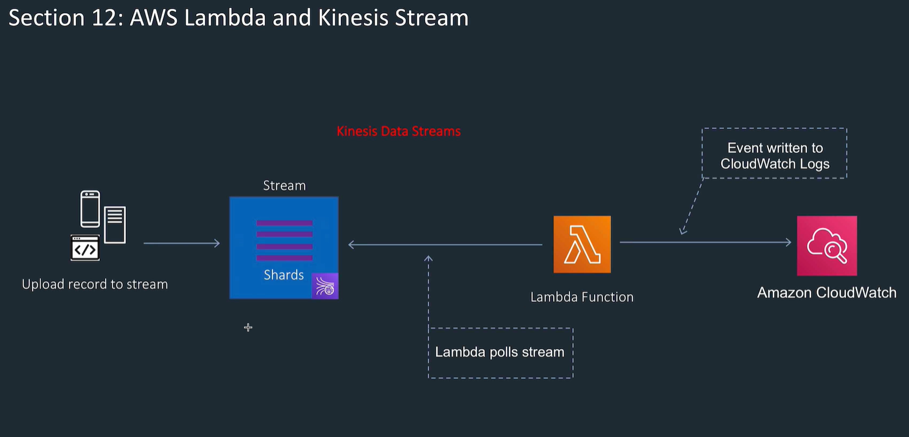
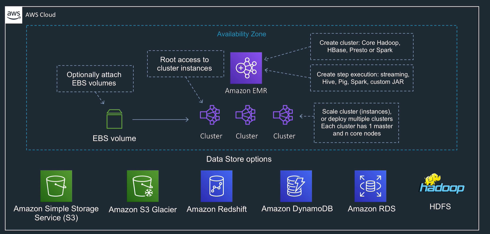

<LINK href="jb1.css" rel="stylesheet" type="text/css">

#### [Back to index](index.html)

# AWS Big Data Pipelines: Kinesis, EMR, Athena

- [AWS Big Data Pipelines: Kinesis, EMR, Athena](#aws-big-data-pipelines-kinesis-emr-athena)
  - [Kinesis](#kinesis)
    - [Use cases](#use-cases)
    - [Kinesis Data Stream](#kinesis-data-stream)
    - [Kinesis Firehose](#kinesis-firehose)
    - [Kineses Analytics](#kineses-analytics)
  - [Compare Kinesis / SQS / SNS](#compare-kinesis--sqs--sns)
    - [SQS](#sqs)
    - [SNS](#sns)
  - [Example Kinesis stream with Lambda](#example-kinesis-stream-with-lambda)
  - [Example Kinesis use](#example-kinesis-use)
  - [Amazon EMR](#amazon-emr)
  - [Amazon Athena and AWS Glue](#amazon-athena-and-aws-glue)
    - [Glue](#glue)

## Kinesis

Handles streaming data  
Collect and analyse  
Rapidly move data off producers and then processing  

Data streams stores data for later processing, Firehose delivers data directly to AWS services  

e.g. IOT data coming in through stream  
Process in Data analytics: run SQL on incoming data  

### Use cases

- game data
- social network data
- IOT sensors

### Kinesis Data Stream

- Serverless, must provision throughput
- stream data is stored in Shards (these carry the data, held for 24 hours extendable to 7 days)
- Consumers are EC2 instances which get data from the shards, save to another service (called Kinesis streams applications)
- Shards have limits: 1Mb/sec input, 2Mb / sec output, and 1000 PUT records per second
- Stream capacity depends on number of shards
- pay per shard
- Re-sharding: adjust number of shares as data flow increases.
- Shard split: divide one shard into 2. increases capacity and cost
- Shard merge: combine. Reduces capacity.

- Data stream partition keys: provide ordering
- When put onto a stream, specify the shard
- Can't guarantee ordering between different shard, but within shard ordering is maintained.
- SQS doesn't guarantee order on SQS standard queues, but it can if you use SQS FIFO.

### Kinesis Firehose

Kinesis Data Firehose is the easiest way to load streaming data into data stores and analytics tools. It captures, transforms, and loads streaming data and you can deliver the data to “destinations” including Amazon S3 buckets for later analysis

- real time streaming data to data stores and analytics tools
- Firehose Captures, transforms, loads
- Optional Lambda transformation
- Can batch, compress, encrypt
- Scalability is elastic, less work than Data Stream
- Fully managed
- Replicates to multiple AZ so durable
- near real time, 60 seconds latency
- Destinations: S3, redshift, Elastic search, Splunk
- Producers supply data streams

### Kineses Analytics

- Sits over Data Streams and Firehose
- Runs SQL against streaming sources
- Gives real time analysis capability
- e.g. time series analytics, dashboards, alerts

## Compare Kinesis / SQS / SNS

### SQS

No ordering, except with FIFO  
Doesn't scale like Kinesis data streams  

### SNS

Pub / sub model  
data not persisted

## Example Kinesis stream with Lambda

AWS tutorial  
Need lambda to poll Kineses, so set up event source mapping  

## Example Kinesis use

Receive streaming data from IoT. Same partition key go to same instance, so e.g. segregate sources to different partitions. Can load data streams into Firehose then S3 a good place to store.  

## Amazon EMR

- Elastic map reduce is the main cloud big data platform
- Uses apache spark, hive, hadoop
- Can use EBS volumes, or S3, redshift, RDS etc
- Choose applications: e.g. hadoop, Hive, Presto
- Used to process huge amounts of data
- Create a cluster with multiple EC2 instances, one master multiple slaves
- Can access the EC2 instances
- AWS creates the security groups
- All nodes in one AZ

TODO: look at EMR docs

## Amazon Athena and AWS Glue

- Athena does SQL queries on S3 data
- serverless
- uses managed data catalogue (in AWS Glue)
- Can work on various file formats e.g. csv, JSON, PRC, parquet, Avro etc
- don't need to write lots of ETL code to transform for analysis first
- queries in place instead

### Glue

- Fully managed Extract, Transform, load (ETL)
- automates steps for analytics
- Discovers and profiles data, generates transform code based on target schemas
- Runs on Apache spark
- point it at your data, it stores data mode in Glue catalogue
- then data is searchable, available for ETL
