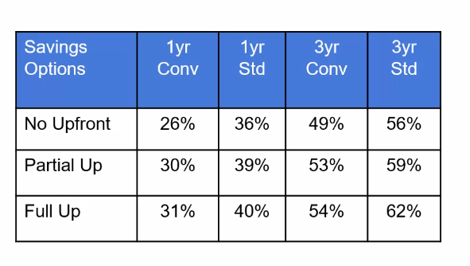

<LINK href="jb1.css" rel="stylesheet" type="text/css">

#### [Back to index](index.html)

# SAA-C02 - EC2 Compute

- [SAA-C02 - EC2 Compute](#saa-c02---ec2-compute)
  - [Amazon Machine instances](#amazon-machine-instances)
  - [Instance types](#instance-types)
  - [Instance purchasing options](#instance-purchasing-options)
  - [EC2 Tenancy](#ec2-tenancy)
  - [EC2 Instance User data](#ec2-instance-user-data)
  - [EC2 Instance Metadata](#ec2-instance-metadata)
  - [EC2 monitoring and status checks](#ec2-monitoring-and-status-checks)
    - [Cloudwatch monitoring](#cloudwatch-monitoring)
  - [Storage options](#storage-options)
  - [Security](#security)
    - [Keys](#keys)
    - [Security setup](#security-setup)
  - [Connecting](#connecting)
  - [Optimising costs](#optimising-costs)
    - [savings plans](#savings-plans)
    - [RI Marketplace Gold](#ri-marketplace-gold)
    - [approach](#approach)
  - [Elastic load balancer  (ELB)](#elastic-load-balancer--elb)
    - [ELB summary](#elb-summary)
    - [Load Balancer types](#load-balancer-types)
    - [ELB Components](#elb-components)
    - [SSL / TLS](#ssl--tls)
    - [Application load balancer](#application-load-balancer)
    - [Network load balancer](#network-load-balancer)
    - [classic load balancer](#classic-load-balancer)
  - [EC2 Auto scaling](#ec2-auto-scaling)
    - [EC2 auto scaling components](#ec2-auto-scaling-components)
  - [ELB and EC2 Autoscaling together](#elb-and-ec2-autoscaling-together)
  - [Placement groups](#placement-groups)
  - [IAM Roles](#iam-roles)
  - [Monitoring](#monitoring)
  - [My Summary](#my-summary)

## Amazon Machine instances

Template of pre-configured EC2 instances so you can quickly launch one.  
Lots of preset AMIs.
Can have things pre installed e.g. tensorflow  
Can create your own AMI: Take an AMI, launch, install custom apps, customise -> save as custom AMI.  
Then can launch multiple. Good for autoscaling.  
You can copy an Amazon Machine Image (AMI) within or across AWS Regions using CopyImage action.

- AWS marketplace: vendor AMIs with optimsed settings, built in tools, etc.
- AWS community AMIs: shared.

## Instance types

choose the cpu numbers, cpu type, clock speed, memory, instance storage, network transfer trade, architecture, AVX (advanced vector extensions), turbo  
Instance type families: organise these.

- Micro (static web site)
- General purpose (test and dev)
- Compute (high performance)
- GPU (ML)
- FPGA (field programmable ..)
- memory optimised (e.g. Sharepoint)
- storage optimised (SSD with high IOPS, good for NoSQL db)

## Instance purchasing options

1. on demand instances:
    - Can be launched at any time, use for a time, terminate.
    - Flat rate per second.
    - Good for irregular short term.
    - Good for testing and dev
2. reserved instances (RI)
    - discounted rate, set period of time, cheaper.
    - Reserved instances are a good choice for workloads that run continuously.
    - purchase options:
        - all upfront (complete for 1 to 3 years)
        - partial upfront
        - no upfront (smallest discount)
    - RI types
        - Standard RI: cheapest, best for steady state
        - Convertible RI: ability to change the attributes of the RI to equal or greater value
        - Scheduled RI: can launch within time windows you reserve.
3. scheduled instances:
    - pay for reservations on a recurring schedule, e.g. weekly time.
    - Still charged when not used.
    - a good choice for workloads that do not run continuously but do run on a regular schedule.
    - you can use Scheduled Instances for an application that runs during business hours, development environment, or for batch processing that runs at the end of the week.
4. spot instances:
    - unused EC2 resources,
    - need to bid higher than current spot price (which moves).
    - 2 minute warning if price goes up.
    - Can bid for large instances at low cost.
    - Only useful if job an be interrupted, e.g. batch.
5. on demand capacity reservation:
    - pre reservation.
6. Spot Blocks
    - Spot Instances with a defined duration
    - designed not to be interrupted and will run continuously for the duration you select.
    - This makes them ideal for jobs that take a finite time to complete, such as batch processing, encoding and rendering, modeling and analysis, and continuous integration.
    - Max 6 hours

## EC2 Tenancy

This is the underlying host the EC2 instance will reside on. Physical server.

- Shared tenancy: any available host, with multiple customers.
- Dedicated tenancy:
  - dedicated instances: no other customer can access teh machine, more expensive
  - dedicated hosts: similar, but additional visibility and control over host. good for compliance

## EC2 Instance User data

Allows you to enter commands to run during boot cycle of the instance
e.g. start up apache
Can get the user data with
>curl http://169.254.169.254/latest/user-data

## EC2 Instance Metadata

This gets the instance metadata
>curl http://169.254.169.254/latest/meta-data
Can get e.g. ip address  with
>curl http://169.254.169.254/latest/meta-data/ipaddress

Also access metadata by run
>wget ec2-metadata
Downloads a program which gives access to metadata

## EC2 monitoring and status checks

- EC2 monitoring Run every minute
- If all ok -> ok. Else -> impaired.
- System status checks -> aws need to troubleshoot.
- Instance status checks -> my responsibility.

### Cloudwatch monitoring

- Can configure alarms based on status checks (Cloudwatch), e.g. notification when cpu > 50%. Alarm can have actions.
- Cloudwatch be y default runs every 5 mins. Pay more for every minute.

## Storage options

- persistent storage: attached EBS volumes, separate device. Can attach / detach.
- Ephemeral storage: instances have local storage. When the instance is stopped or terminated, all saved data on ephemeral storage is lost. Reboot will retain data. Can't detach.

## Security

need to set a security group: instance level firewall allows you to specify what traffic can come in and out.  
Can set Source, port, protocol.  
Need a key pair to encrypt and decrypt login information  (.pem file). Need to download, can only download once.  

### Keys

- Need public key and private key.
- Public key held by AWS
- customer holds the private key.
- For windows, private key allows you to obtain the password
- for linux, private key allows you to SSH  

### Security setup

- Download key pair and keep safe.  
- Can use same key par on multiple instances.  
- Once connected, can set up less privileged accounts with simpler logins.  
- Customer responsibility to install security patches.
- Default allows 0.0.0.0, open to all IP addresses.

## Connecting

- Connect to linux with SSH, needs public / private key pair.
- For windows client, need to use Putty as not a native windows SSH. Putty doesn't support PEM, so need to convert the private key to PPK format which putty does support. PuttyGEN does this.
- best to copy the keys to WSL, not access on the windows side. Need to chmod 600.
- get the ip address of the instance from the AWS console
- standard user names for each linux distribution, e.g. ec2_user or ubuntu

from WSL:  ssh -i keys/cloud_academy_private_key.pem ec2-user@ip  
from windows: putty, add ip address, SSH auth -> add key.  

get EC2 metadata using curl from special ip address, e.g.  curl -w "\n" http://169.254.169.254/latest/meta-data/public-keys/0/openssh-key  

## Optimising costs

hard to buy RIs in correct size, constantly changing marketplace and requirements. Can't keep up to maximise savings.  
Instance size doubles as you go to the next instance type level. Want to buy in smallest common denominator. Mix and match sizes.  

3 years is tempting. There's an RI marketplace to sell back unused compute.
Convertible or standard

### savings plans

Cheaper than OnDemand, but commit to use a specific amount of compute power for 1 or 3 year term.

Savings Plans are a flexible pricing model that offer low prices on EC2, Fargate and Lambda usage, in exchange for a commitment to a consistent amount of usage (measured in $/hour) for a 1 or 3 year term.  

- compute savings plans

  - global
  - EC2 and Lambda
  - not fixed to regions / services
  - at convertible RI rate

- ECS instance savings plans

  - regional
  - standard RI rate

Cannot sell savings plans

### RI Marketplace Gold

- short term RIs for resale
- heavily used, go quickly

### approach

- Need to constantly monitor to maximise savings.
- Incremental purchases
- mix of RI options
- include looking at RDS and ES
- AWS cost explorer and export out to spreadsheet

## Elastic load balancer  (ELB)

### ELB summary

Manage and control flow of inbound requests and distribute to targets.  
Targets can be multiple EC2, lambda, containers etc.  
receives TCP traffic on port 80.  

Single EC2 instance approach drawbacks are:  

- failure
- spikes not handled

EBL is comprised of multiple instances managed by AWS, automatically scales.

- detects failures of EC2 instances and redirects
- auto scales EC2 instances
- ELB scales automatically to meet incoming traffic

### Load Balancer types

- application load balancer (ALB): request level. flexible features, HTTP, containers etc.
- network load balancer (NLB): connection level, lower in the stack at network level. For ultra high performance.
- classic load balancer, does both. Old.

### ELB Components

- listeners: define how inbound connectors are routed to target groups from ports based on conditions
- target groups: group of resources to target
- rules: map between requests to target groups.
- health checks: checks health of targets at intervals
- internal ELB or internet facing ELB: means don't need to expose targets to internet.
- ELB nodes: need ELB node in any AZ you want to route traffic to.
- Cross zone load balancing:

### SSL / TLS

Http is port 80, https is port 443  
Https allows encrypted communication. Needs additional config for server certificate and security policy.  
TLS is transport layer security. Same as HTTPS.  
AWS Certificate manager (ACM): can create and provision certificates. Can use IAM to load 3rd party certificates.   All are X509 standard.  

### Application load balancer

- OSI: open services infrastructure
- Good for micro-servers and containers.

ALB setup  

- Set up target group first (in EC2 config, load balancers.)
- Target group need to set port, vpc, health check parameters
- Then add targets: add instances  
- Then create load balancer (ALB): internet facing, set up listener (e.g. http on port 80), set up AZs
- set up security groups
- set target groups

Go to listener to set up rules  
e.g. if source IP is a specific value, route to different target group  

### Network load balancer

Principals same as ALB, but this is for connections. Lower layer, TCP protocols. TCP, TLS, UDP.  
Processes many requests per sec.  
Cross zone can be disabled.  

### classic load balancer

less features, old

## EC2 Auto scaling

EC2 auto scaling means add VMs when cpu > threshold, terminate EC2 instance when cpu < threshold
(also other AWS services can auto scale)

- Don't have to manually configure
- better for end users
- cost reduction
- terminates instances with failures and restarts new ones

### EC2 auto scaling components

create template (or launch configuration, template is newer). Defines how auto scaling group builds new instances.  
Basically the instructions to start a new instance.  

creating launch templates:

- can have versions and source templates
- specify ami, instance type, storage, network interface, instance tags, commands on first boot  
- specify purchase options, e.g. spot or on demand

Creating launch configuration:

- similar but less options.  

Create auto scaling group:

- Need to set up launch configurations before setting up auto scaling.
- select launch template, say initial instance count, can link to a load balancer at this point
- set scaling policies
- set min max size
- add specific number, or percentage of group size, or exact size
- set alarm to trigger e.g. when average CPU > 75% for 5 mins.  
- set action to take on alarm
- add notifications

Auto-scaling groups allow you to scale out (add more instances) or scale in (remove instances) based on metrics such as:

- Average CPU utilization
- Network traffic (ingress and egress)
- Application Load Balancer request counts
- It's possible to create your own metrics and use these to decide when to scale, such metrics can be populated in CloudWatch directly from the application rather than inspecting the instance's resource usage. This is useful when the point that you need to scale at is determined by something unrelated to the instance, such as reaching a database connection limit or some other application-specific bottleneck. Called target tracking action.
- cooldown period is wait period before autoscaling rules checked again
- The warm-up period is the period of time in which a newly created EC2 instance launched by ASG using step scaling is not considered toward the ASG metrics.
- The CloudWatch Alarm Evaluation Period is the number of the most recent data points to evaluate when determining alarm state.

## ELB and EC2 Autoscaling together

Generally need both together so whole thing goes up and down

- Attach the load balancer to the auto scaling group
- set the target groups (pool of resources that the ELB is assigned to)

## Placement groups

Put instances in a placement group  
Normally instances launches on different servers.  
Might want to place close together for better node comms.  
When launch, place EC2 in a placement group.  
Rules so can't put e.g. micro in a cluster.  
Spread and partition can be in multi AZs but cluster only in one AZ  

- cluster: close in single AZ for low latency for high performance. Maybe use enhanced network adaptor (ENA)
- Partition: on separate AWS racks. Different power sources, networking etc. Specify no of partitions.
- Spread: spread across distinct hardware for less failure. Each instance on a separate rack.

## IAM Roles

Can attach one role to an EC2 instance
Instant effect
Universal (any region)

## Monitoring

- Runs every minute, returns pass or fail.
- If one or more fail -> impaired
- Instance checks -> my responsibility  
- System status checks -> AWS  
- Cloudwatch can automatically perform actions on alarms

## My Summary

- Use ELB and Auto scaling together
- ELB responds flexibly to user requests, scaling up and down. Configure listeners, target groups, health checks.
- Set up launch template as model for the instances to be started (includes AMI, instance type, key pair, security group etc)
- Set up autoscaling to use this launch template, and to put the instances in the target group.
- Need a security group to say what traffic can access the instances.

- Tested with http access to the ELB
- Tested with a command to stress the instance, successfully autoscaled.
- Tested with forced terminate of instance, successfully restarted.
