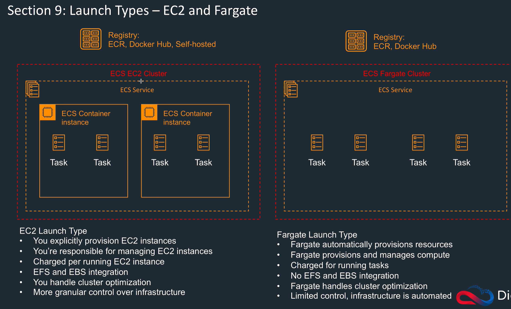
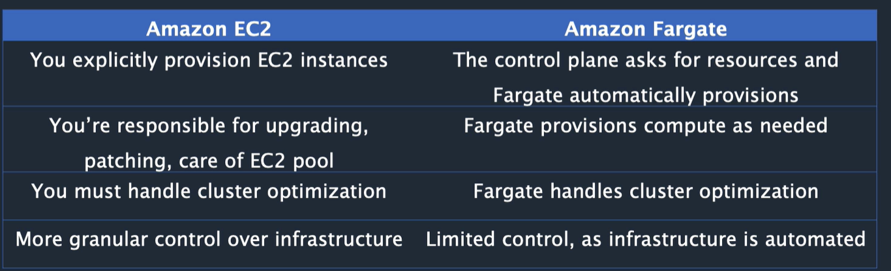
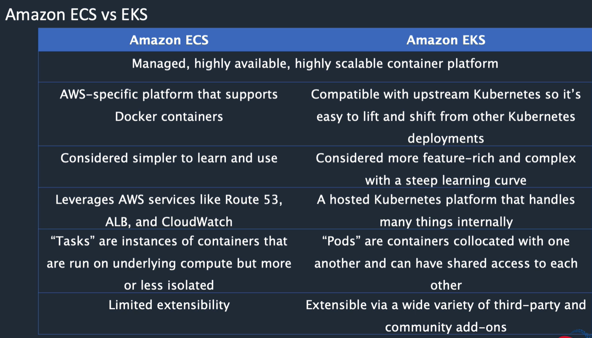

<LINK href="jb1.css" rel="stylesheet" type="text/css">

#### [Back to index](index.html)

# AWS Elastic Container Service (ECS) and Fargate

- [AWS Elastic Container Service (ECS) and Fargate](#aws-elastic-container-service-ecs-and-fargate)
  - [Microservices](#microservices)
    - [Continuous integration continuous deployment (CICD)](#continuous-integration-continuous-deployment-cicd)
  - [Theory](#theory)
  - [Terms](#terms)
    - [ECS launch type](#ecs-launch-type)
    - [Fargate setup](#fargate-setup)
    - [ECS CLI create cluster](#ecs-cli-create-cluster)
    - [Dynamic host port mapping](#dynamic-host-port-mapping)
    - [Cluster auto scaling](#cluster-auto-scaling)
    - [IAM roles for tasks](#iam-roles-for-tasks)
  - [Elastic Container Registry (ECS)](#elastic-container-registry-ecs)
    - [Create a docker image](#create-a-docker-image)
  - [Elastic Kubernetes Service (EKS)](#elastic-kubernetes-service-eks)

## Microservices

distributed systems & service orientated architectures: create lots of independent decoupled services.  
Containers are good for running these.  

- can use immutable image with dependencies
- any language
- versioned
- test locally and deploy at scale

Features

- autoscaling (clusters or services, scale with cloudwatch alarms based on metrics)
- service discovery: microservices automatically discovered as they get created
- logging to one place

### Continuous integration continuous deployment (CICD)

Popular with microservices. Pipeline:

- monitor source code repository
- build new docker image
- push to image repository
- update ECS to use new image

## Theory

- ECS Compatible with Docker
- Packages code and all its dependencies for easy shift between environments
- Code, runtime, system libraries, system tools, settings all included
- Can start and stop easily
- Run lots in parallel, scale easily, isolated from each other
- ECS schedules the placement of containers across clusters.

## Terms

- ECS Runs containers on a cluster.
- Cluster is logical grouping of tasks or services.
- Containers defined in task definition.
- Task definitions can run individual tasks, or tasks in a service.
- A service is something which lets you run a specified number of tasks simultaneously in a cluster.
- ECS Task definition: blueprint to launch docker container
- ECS Task: Same as a container. Can support multiple running containers. Eg. wordpress task, mySQL task, application task.
- ECS Service: used to define scaling and control tasks
- Image: sits in Elastic Container Registry, docker hub, or custom.
- Fargate runs tasks and services on serverless, or ECS launch type runs on EC2.  
- Task definition in JSON. Describes one or more containers, and their parameters (name, image, memory size, etc)  
- ECS task scheduler places tasks on the cluster. Different scheduling options available, e.g. define a service which maintains a specified number of tasks in the service.  
- Can register EC2 instances to the cluster, or run on Fargate serverless.
- EC2 instances run Container Agent to communicate with ECS. This comes with ECS optimised AMI, or install yourself (Linux or windows)
- Create a cluster, task definition, run the task and if goes to registry and pulls the task down.
- ECS CLI different from AWS CLI



### ECS launch type

EC2 launch type: Lower level, control EC2, file storage, do teh management, granular control

### Fargate setup

- launch a cluster with a task for Apache, all automatic.
- Fargate launch type: Automatically launches EC2, hidden, charged for running tasks, no EFS / EBS, limited control.



### ECS CLI create cluster

- Use a task definition from Docker hub
- Use ecs cli to create a configuration, bring up the cluster, start the tasks

### Dynamic host port mapping

Can have multiple tasks in a container wanting the same default port, e.g. Apache an nginx. The instance takes care of this, and maps to different ports. Also the ALB listens on a single port, HTTP 80, so need to set up the ALB to use rule based routing and paths. Can't do that with a network load balancer.

### Cluster auto scaling

- New feature
- Uses Capacity Provider, associated with EC2 auto scaling group.
- Cluster can then scale the ASG using managed scaling

### IAM roles for tasks

Specify IAM role for a container to use for a task. The tasks can then use AWS CLI. Use TaskRoleArn override.

## Elastic Container Registry (ECS)

### Create a docker image

```bash
New EC2 instance
SSH into it
sudo yam update -y (update EC2)
AWS configure (set up permissions: to set access key id for AWS CLI)
sudo amazon-linux-extra install docker
sudo service docker start
sudo systemctl enable docker (ensures restarts after a reboot of instance)
sudo usermod -a -G docker ec2-user (allows you to run commands as ec2-user rather than root)
docker info (if permissions issues, shutdown and restart instance with sudo shutdown -r now)
create Dockerfile (e.g. use ubuntu, install apache, expose a port, run apache)
docker build -t jb-container . (builds the image from Dockerfile)
docker run -t -i -p 80:80 jb-container (runs the image)
-> working docker image in a container.

Then want to copy the container to ECR
aws ecr create-repository --repository-name jer-ecr (created repository)
get repository urn
docker push (loads image)

Start in ECS:
ECS clusters, configure a new one, fargate type.
docker image uri
runs
```

## Elastic Kubernetes Service (EKS)

- Managed service to run Kubernetes on AWS. Open sourced system for managing microservices and SOA images. Does scaling, management of containers.  
- Means amazon independent.


