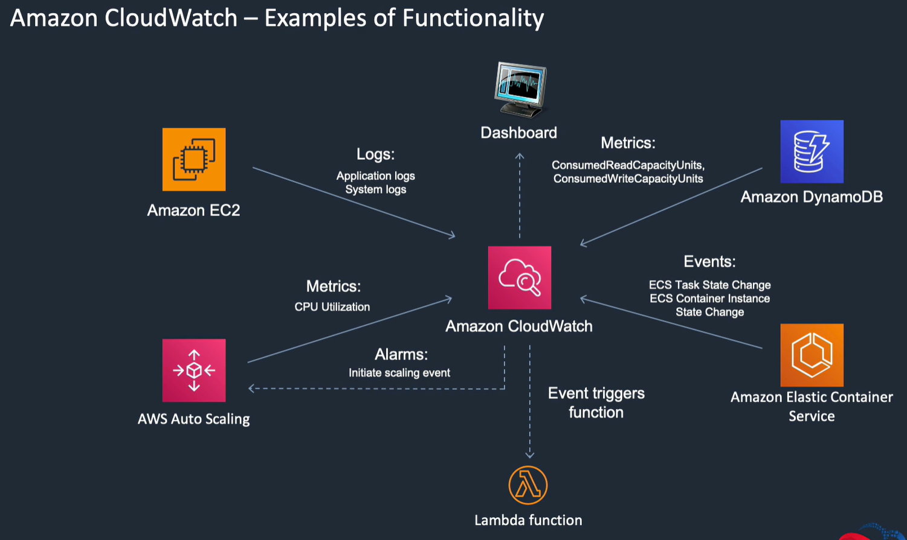
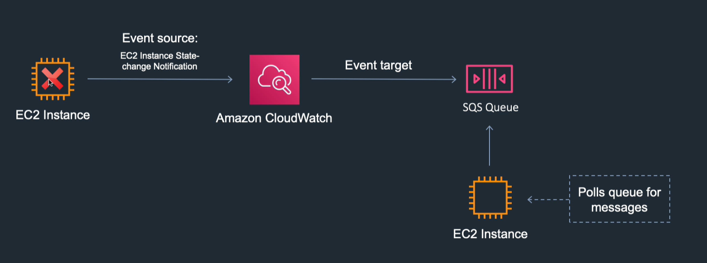

<LINK href="jb1.css" rel="stylesheet" type="text/css">

#### [Back to index](index.html)

# AWS logging and Monitoring

- [AWS logging and Monitoring](#aws-logging-and-monitoring)
  - [Overview](#overview)
    - [Cloudtrail: auditing and API activity](#cloudtrail-auditing-and-api-activity)
    - [Cloudwatch: Monitoring](#cloudwatch-monitoring)
  - [Cloudwatch detail](#cloudwatch-detail)
    - [Creating a custom metric in EC2](#creating-a-custom-metric-in-ec2)
    - [Event example](#event-example)
  - [Cloudtrail Detail](#cloudtrail-detail)
  - [AWS Config](#aws-config)

## Overview

### Cloudtrail: auditing and API activity

- Every interaction over API, console etc is an api call
- More about auditing and security
- More low level
- Log from multiple accounts
- Logs stored to S3 or cloudwatch indefinitely
- No alarms: use cloudwatch

### Cloudwatch: Monitoring

- Performance monitoring
- Operational health
- Alarms
- Metrics
- Log from multiple accounts
- Logs stored indefinitely
- Alarm history for 14 days

## Cloudwatch detail

- Namespace: container for cloudwatch metrics, so different resource groups get separate metrics
- Metrics: time ordered. Can't be deleted but expire after 15 months, can create custom metrics
- Different metrics for each service
- Dimensions: subdivision below namespace. E.g. EC2 has various dimensions, autoscaling is one.
- Statistics: metrics aggregated over time, e.g. average
- Alarms: watch a metric and automatically trigger actions. Alarms need a state change and maintained for an amount of time, e.g. CPU > 80% for 3 mins
- Events: delivers near real time stream of system events. Can use to schedule from e.g. cron. Can route them to a target, e.g. Lambda. Specify event source, state change, and set target.

### Creating a custom metric in EC2

- e.g. Memory is not a standard metric for EC2.
- Set up custom metric with crontab calling shell script to get the memory and do an AwS cli call.
- EC2 doesn't send logs by default. If you want to get application logs to cloudwatch need to install Cloudwatch application agent. Lambda has logs enabled.

### Event example

## Cloudtrail Detail

Audit log for resource changes.  
Create a trail, that delivers log files to S3 bucket.  
**Enables governance, compliance, operational risk auditing**

- trail types: all regions, or single region.
- Management events: (also known as control plane events) include security changes, registering devices, logging changes.
- Data events: (data plane operations) higher volume.

## AWS Config

- Gives you a resource inventory.
- Configuration history for each resource.
- Alerts you if resources change from that state.
- Enables security and governance
- Config is about point in time changes.
- Cloudtrail tells you who changed it, config tells you what the config was.

Rules examples:

- check all EC2 have detailed monitoring enabled
- check all security groups are used, check all network interfaces are attached to a security group

Remediation actions:

There are lots, including e.g.

- run lambda
- stop EC2
- delete security group

Gives you a file per resource in S3
