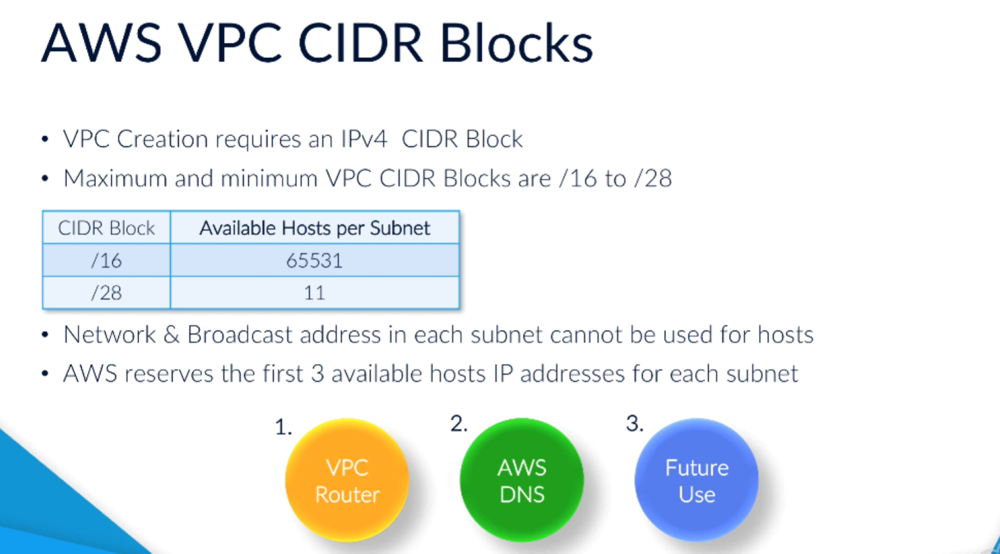
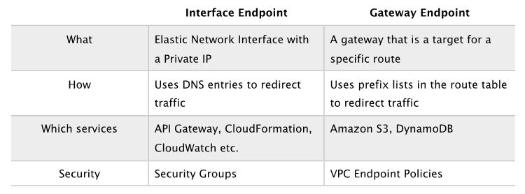
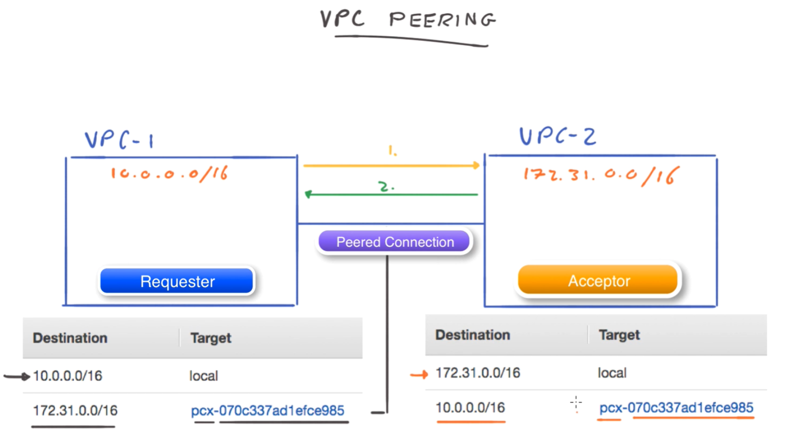
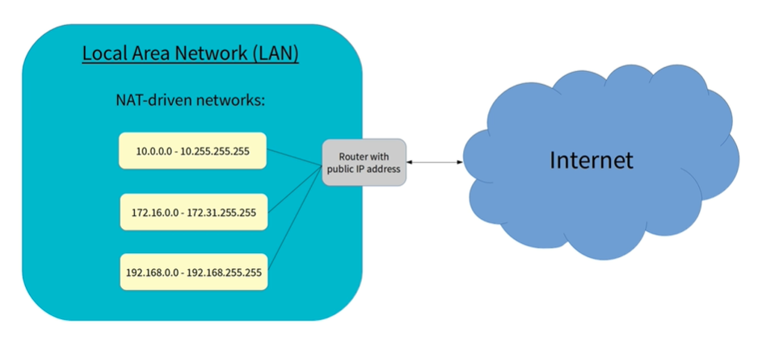

<LINK href="jb1.css" rel="stylesheet" type="text/css">

#### [Back to index](index.html)

# AWS SAA-C02_networking

- [AWS SAA-C02_networking](#aws-saa-c02_networking)
  - [VPC](#vpc)
  - [Default setup](#default-setup)
  - [Subnets](#subnets)
    - [CIDR blocks](#cidr-blocks)
    - [Example CIDR setup](#example-cidr-setup)
    - [Why subnet](#why-subnet)
  - [Subnet architecture](#subnet-architecture)
    - [Subnet setup](#subnet-setup)
    - [Public vs Private](#public-vs-private)
    - [IP addressing](#ip-addressing)
    - [Public / Private / Elastic IP addresses](#public--private--elastic-ip-addresses)
  - [Routing](#routing)
    - [Fundamentals](#fundamentals)
    - [Route table setup](#route-table-setup)
    - [Routing priorities](#routing-priorities)
    - [Routing limits](#routing-limits)
    - [Virtual private gateways (VGW)](#virtual-private-gateways-vgw)
    - [Routing for internet gateways](#routing-for-internet-gateways)
    - [Routing VPC endpoints](#routing-vpc-endpoints)
  - [VPC security and control](#vpc-security-and-control)
    - [Network access control list (NACL)](#network-access-control-list-nacl)
    - [Security groups](#security-groups)
    - [NAT gateways](#nat-gateways)
    - [Bastion host (for maintenance SSH access to private subnet instances)](#bastion-host-for-maintenance-ssh-access-to-private-subnet-instances)
  - [VPC Connections between on Prem and AWS](#vpc-connections-between-on-prem-and-aws)
    - [VPN (Simplest)](#vpn-simplest)
    - [Direct Connect](#direct-connect)
    - [Direct connect gateway](#direct-connect-gateway)
    - [VPC peering](#vpc-peering)
    - [Transit gateway](#transit-gateway)
    - [Endpoint services](#endpoint-services)
    - [AWS PrivateLink](#aws-privatelink)
    - [Flow logs](#flow-logs)
    - [VPC wizard](#vpc-wizard)
    - [Site to site](#site-to-site)
    - [Network adaptors](#network-adaptors)
    - [sharing EC2 and on prem](#sharing-ec2-and-on-prem)
  - [Networking fundamentals](#networking-fundamentals)
    - [OSI and TCP models](#osi-and-tcp-models)
    - [IPV4 IP addresses](#ipv4-ip-addresses)
    - [IPv6](#ipv6)
    - [Netmask](#netmask)
    - [CIDR](#cidr)
    - [Reserved IP addresses](#reserved-ip-addresses)
    - [Protocols](#protocols)
    - [Ports](#ports)
    - [commands](#commands)
    - [DNS](#dns)

## VPC

- VPC is isolated section of cloud
- segregates you from other aws customers
- Can have up to 5 VPCs per account in a region
- Can organise to multiple Subnets, Used to:
  - organise your VPCs
  - better management
  - isolate some resources

## Default setup

- you get a default VPC per region
- you get a subnet per AZ  
- you get an IGW per VPC

Subnet has name and CIDR address

## Subnets

### CIDR blocks

Subnet splits a CIDR block into subsets.
e.g. 10.0.0.0/16 means 65k hosts.
Could subnet, e.g. /17

When set up VPN, specify the CIDR block. Max  /16, min /28

Can specify in ipv6 format

### Example CIDR setup

5 addresses you can't use for hoist resources: 1st 4, last one.

### Why subnet

- Logical grouping of similar resources helps security
- Allows for greater security using NACLS. You know the purpose so can limit traffic.
- Accessibility: Can have private / public split.
- Routing tables allow
- Subnet can only be in one routing table
- VPC subnet can't span 2 availability zones. SO need to create second subnet in other AZ, this is a benefit.
- Subnet is in one AZ. Need to have additional subnets in other AZ.
- local routes mean all subnets can talk to each other.

## Subnet architecture

Have subnets in multiple AZs for resilience.

### Subnet setup

- summary
  - subnet id: unique
  - When launch e.g. EC2 instance, takes an IP address from the subnet.
  - Route table id
  - NACL id
  - shows if public or private
- route table
- NAC (Network ACL)
  - rule based tool for incoming and outgoing traffic
  - stateless
  - NACL rule set:
    - rule number (read in ascending order)
    - type (e.g. SSH, POP3)
    - protocol (depends on type)
    - port range (specify for custom rule)
    - port range for custom rules
- Flow logs
- Tags

### Public vs Private

to set as public:  

1. need to attach internet gateway to your VPC
1. add default route to the route table for your subnet. e.g. 0.0.0.0 -> internet gateway  

(public subnet nacl needs to not deny traffic)

### IP addressing

- By default all subnets have auto assignment of public IP addresses disabled.
- Switch on with tick box in subnet.
- Can disable an instance.
- The IP address comes from AWS bank, not your list. Can't get the same address again.
- Use EIP (elastic IP address) if you need a static IP address

### Public / Private / Elastic IP addresses

- Private IP: come from CIDR block range for the subnet. used by the operating system. Retained when stopped. Always have one. The other IP addressed are associated to this.
- Public IP addresses: Allocated if tick the option on the subnet or instance. released when instance stopped, and lost. free.
- Elastic: also public. static, retained on stop. Can move it between instances. Charged when not used. Need to associate with an instance (or a network interface).

Internet gateway does the IP swapping from public to private.

- Elastic network interface: can set up a network interface.  
- E.g. used for fail over to a second interface.  
- Like a virtual network card that you can move between instances.

## Routing

### Fundamentals

Routing tables allow packets to the forwarded to the correct destination. So don't need to configure routers. AWS adds implicit router to VPC  

The packet has an IP address, needs to know how to get to it. Destination is the place you want the packet to get to, target is how to get there. E.g. internet gateway.  

Main route table:

- added automatically.
- Can be modified.
- Subnets implicitly associated with this main route table
- Acts for any subnet which doesn't have an explicit route table
- Subnet only associated with a single route table
- One route table can be used by many subnets
- Can change settings by setting up new route table, test with one subnet, then set this as the main route table.

### Route table setup

1. Summary
   - Route table ID issued automatically. rtb...

1. Routes
   - shows the routing decisions within the routing table
   - destination: network you want to route to
   - target: how to get to that destination, which gateway to use. e.g. a specific virtual private gateway to connect to your corporate network.
   - pre-configured route for e.g. 10.0.0.0/16 to go to local: this allows all subnets to talk. Can't be deleted.
   - edit routes by entering destination and target

1. Subnet associations
   - shows implicit and explicit

1. Route propagation
   - propagation of VPG attached to VPC. Can automatically attach VPG to all subnets.

### Routing priorities

The packet has an IP address, needs to know how to get to it. May match multiple routes, so uses the most precise route available in the route table. Longest prefix match.

0.0.0.0 is the most generic destination, matches any IP address

Exceptions:

- static ip
- overlapping with local

### Routing limits

limit of 200 routes per VPC
Default limit of 50 non propagated routes
Limit of 100 propagated routes

### Virtual private gateways (VGW)

- Provide a link between VPC and corporate network
- To set up a VPN, need a VGW, and attach it to your VPC.

### Routing for internet gateways

- Public subnets must be allowed to route to an IGW to get to the internet
- IGW is a managed service, automatically scales

### Routing VPC endpoints

- Virtual device allowing you to connect your VPC to other AWS services without using a gateway.
- AWS S3 is only supported endpoint currently
- comms is all within AWS
- select "endpoints" in VPC dashboard
- Automatically adds a new route to the mail route table  

There are two different types of VPC endpoint: interface endpoint, and gateway endpoint. With an interface endpoint you use an ENI in the VPC. With a gateway endpoint you configure your route table to point to the endpoint. Amazon S3 and DynamoDB use gateway endpoints. This solution means that all traffic will go through the VPC endpoint straight to DynamoDB using private IP addresses.

## VPC security and control

### Network access control list (NACL)

- Configure NACL for a subnet so only wanted traffic in and out
- by default allows all traffic in and out.
- Get a default NACL with a subnet
- NACL rule set:
  - rule number (read in ascending order)
  - type (e.g. SSH, POP3)
  - protocol (depends on type)
  - port range (specify for custom rule)
  - port range for custom rules

- Default rules applied at end, have no rule number. For traffic not meeting any other rule.
- Inbound restricts based on source, outbound based on destination.
- NACLs stateless.
- Can share NACLs between subnets, but each subnet has one.
- When set up a custom NACL, it starts with deny rules so you need to change it.

### Security groups

- Security groups are virtual firewalls at the instance level.  
- Security groups are stateful so don't need to worry about setting up for response when initiation allowed.  If you allow internet traffic into a SG then it's allowed out, don't need to specify.
- Similar to NACLs but don't have a deny setting, just allow.  
- An instance can be in multiple security groups (up to 5), and a security group can have multiple instances.  
- Changes applied instantly.
- Specify inbound and outbound rules.  
- subnets and AZs are not relevant

Security group rules evaluated until finds one that allows traffic, if not found then not allowed (Implicit deny at the end)
specify IP ranges, specific IP address with /32, or the ID of a source.

Example setup:

- shared nacl here says allow all TCP access.
- Want to limit access to the database to the subnet 1.0
- Use a security group to configure allow access to TCP from a source

Inbound and outbound rules
For inbound, specify the source and protocol
When you set up a custom security group.

### NAT gateways

- Allows instance within a private subnet access to the gateway.
- Good for updating operating systems under shared security model (in the cloud)
- only allows outbound connections from VPC and response, not inbound created outside.
- Public subnet has an IP - use an EIP to make static.
- Add NAT gateway to the routing table
- Set up NAT in the public subnet
- NAT is a point of failure, so add to a subnet in each AZ
- Managed by AWS so autoscaled.
- Can't use SSH

NAT instance:

- network address translation. Older.

### Bastion host (for maintenance SSH access to private subnet instances)

Not possible to access instances on private subnet directly.
Use bastion host running in public subnet to give this access

- add security group to allow inbound SSH from one specific source IP.
- Add security group on private network to allow the bastion host security group to access the private subnet.
- Needs private key. Best not to store in bastion host. Instead store on client pc, and set up SSH agent forwarding.

To add a key file permanently so it's accessible:
> ssh-add -c jer.pem  

Configure agent forwarding  

ssh to the public ip:
>ssh -A ec2-user@1231  

then ssh from there to the private subnet:
>ssh ec2-user@private ip  

Search for agent forwarding on EC2 ssh  

On windows for agent forwarding use "pagent" tool  

## VPC Connections between on Prem and AWS

### VPN (Simplest)

- Virtual Gateway (VGW): managed by AWS. Endpoint.
- Customer gateway (CGW): on customer site. Could be hardware or software. Endpoint.
- Set IP addresses (and static / dynamic setup for routing)
- Initiate VPN tunnel from customer GW.
- Set up continuous pings to avoid 10sec drop.
- Set up route table so traffic for customer goes to VGW. Enable route propagation.
- Set up inbound access to private subnet from data centre source IP.

### Direct Connect

- Totally isolated infrastructure, not the internet
- Partner companies provide intermediate infrastructure, called Direct Connect location.
- Have private and public interfaces, so can connect to either Public services like S3 or private instances.
- dedicated network
- private connection
- Fast (1 to 10 Gb / sec)
- Better than VPN for latency
- expensive and takes weeks to set up.
- within a region

### Direct connect gateway

- Use when have multiple regions, and you want to connect to all of them.  
- Like Direct Connect, but a Global service.
- Use if you need a fast connection using private connection globally

### VPC peering

- Allows you to connect 2 VPCs as if in the same network
- Restrictions on CIDR blocks: need to make sure not overlapping.
- 1:1 connection only, but can have multiple.
- Can't daisy chain VPCs, but 1 ->2. 2 ->3. To get 1->3, need to set up another peer.
- Peered connections abbreviated as PCX
- need to set up routing on both sides
- Connection via AWS so very fast
- overlapping CIDR ranges between VPCs can't be peered.
- Each VPC can only communicate with its peer, but a VPC can be between 2 others. In this case the CIDR ranges may overlap, longest prefix method used.

Route table setup for peered connection

### Transit gateway

- Multiple VPCs and customer sites are complex to manage.
- Transit gateway allows all your data centres and all VPCs to connect via a central hub.
- Quite new.

### Endpoint services

- Allow you to connect from one VPC to services in another, using AWS backbone, not via internet.
- E.g. someone elses S3.

### AWS PrivateLink

Service provider can offer a VPC endpoint service using AWS PrivateLink (referred to as an endpoint service). Other AWS accounts can create a connection from their VPC to your endpoint service using an interface VPC endpoint.

You are acting as the service provider and offering the service to service consumers. This configuration uses a Network Load Balancer and can be fault tolerant by configuring multiple subnets in which the EC2 instances are running.

### Flow logs

- Capture IP traffic in and out
- Use to record accepts or rejects.  
- Can have at VPC, subnet, network interface level.
- Even if traffic rejected by security groups, can see in here.
- If you modify a flow log you need to delete and recreate, you can't amend.

### VPC wizard

- Simplifies setup.
- Get a public and private subnet with a NAT gateway etc.

### Site to site

- Set up Customer gateway on the customer site
- VPN gateway at AWS side.  
- Set up VPN between the 2
- update route table to accept traffic

### Network adaptors

1. ENI: Elastic network Interface
  Virtual network card. Has MAC address, IP address etc.
  Eth0 is primary ENI

1. ENA: Elastic network Adaptor
  Enhanced networking. Lower latency, higher bandwidth.

1. EFA: Elastic Fabric adaptor
  Like ENA with better performance. High performance compute with tightly coupled application with internode comms needing high bandwidth and low latency.

### sharing EC2 and on prem

The ALB (and NLB) supports IP addresses as targets as well as instance IDs as targets. When you create a target group, you specify its target type, which determines how you specify its targets. After you create a target group, you cannot change its target type.

Using IP addresses as targets allows load balancing any application hosted in AWS or on-premises using IP addresses of the application back-ends as targets.

You must have a VPN or Direct Connect connection to enable this configuration to work.

## Networking fundamentals

### OSI and TCP models

- OSI: Open system interconnection. 7 layer
- TCP/IP: 4 layer. Older. Used in real world.

Headers added at each level as you go down, and used on the receiving side as you go up. E.g. source and destination IDs, destination MAC address. Does things like decide is needs to be split into packets.  

- Layer 4 protocols are all connection protocols (FTP, HTTP etc)
- Layer 3 protocols handle splitting into segments. Different options with different benefits, e.g. TCP good for delivery, UDP allows some packets to be lots.  
- Layer 2 and 3 allow routing.
- All the protocols use each other.

### IPV4 IP addresses

- e.g. 192.168.0.1: this is in class C. made of 4 octets. For class C generally first 3 are network portion, last one is node.  Can have 1, 2 or 3 octets for the network range.
- network portion and host portion
- 0 and 255 are reserved numbers.
- Networks define the access ranges available, nodes define the endpoints.
- Use network masks to communicate the format, which parts of the address is network and which is nodes.
- e.g. mask 255.255.255.0 means 3 octets used to define the network -> 256 devices max
- e.g. mask 255.255.0.0 means 2 octets used to define the network. Means 65k device addresses, but only 65k subnets.
- Previously divided to 5 classes, now largely redundant.

### IPv6

- e.g. 1203:8fe0:fe80:b897:8990:8a7c:99bf:323d
- Hex, 8 sets of 4 hex digits.
- can remove leading zeros
- ::/0 means anywhere

Network address translation: source and destination IP addresses translated at boundary of private network.

### Netmask

Each bit that is relevant to the network portion gets a binary 1.  
So if first 3 octets are network, net mask is 255.255.255.0

### CIDR

- Can also define the network mask via CIDR (classless inter-domain routing notation):  
- 255.255.0.0 = 192.158.0.0/16. The last number is the number of bits of the address which are network. So in this case 16 bits are nodes, same as 2 of the 8 bit octets.
- 255.255.255.0 = CIDR 192.168.0.0/24
- can use part of the octet: e.g. 192.168.0.0/28 - this gives 128 nodes.
Google the subnet calculator to figure out this

### Reserved IP addresses

- Reserving of 3 address ranges using NAT: port forwarding of a single public facing address to internal private network.
- Addresses in these ranges can't be reached from the internet, but can can be reached via router or each other.  
  - 10.0.0.0
  - 172.16.0.0
  - 192.168.0.0

### Protocols

Defines how packets, encryption, routing work.

- TCP: used for most web traffic, file transfers. Packet verification included.
- UDP: used where confirmation / verification not needed e.g. video
- ICMP: used for ping
- Http
- Https

### Ports

Allow single IP address used for multiple purposes
ports 1 to 1023 are well known. Ports go up to 65k.
When you send to a non standard port, need to specify the port after address with colon.

- Port 80 for Http
- Port 443 for Https
- Port 20 for FTP
- port 53 for DNS
- Port 110 for POP3

### commands

>ip a  
>route  
>ping 192....  

### DNS

DNS translation between ip address and hostname.
