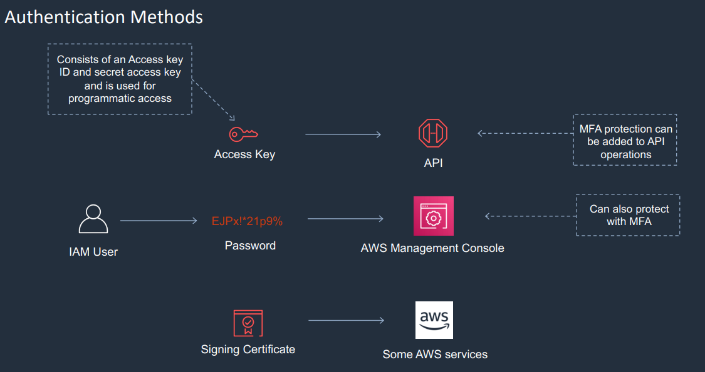
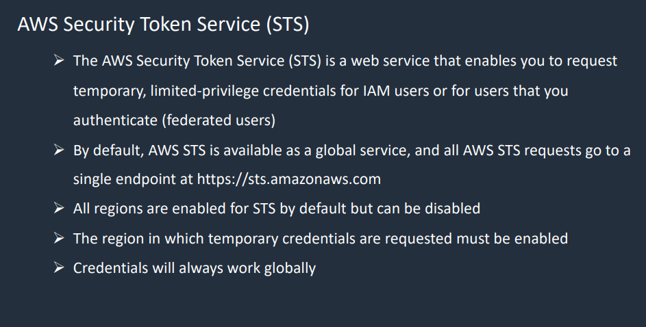

<LINK href="jb1.css" rel="stylesheet" type="text/css">

#### [Back to index](index.html)

# AWS Commands

- [AWS Commands](#aws-commands)
  - [IAM Overview](#iam-overview)
  - [Roles](#roles)
  - [Policies](#policies)
  - [Authentication Methods](#authentication-methods)
  - [MFA](#mfa)
  - [IAM setup](#iam-setup)
  - [Stress tool](#stress-tool)
  - [Connecting](#connecting)
  - [commands](#commands)
  - [ssh setup](#ssh-setup)
  - [AWS CLI setup](#aws-cli-setup)
    - [installation](#installation)

## IAM Overview

- IAM is account for person or service.
- Can apply an IAM policy.
- IAM Group: collections of users. Attach policies.
- Role: Roles are assumed by trusted entities. Policies can be applied to Roles.

- IAM users can be assigned access keys.
- Root users is the main account - full admin permissions, can't be restricted. So best practice is not to use this. Better to create an IAM user.

- IAM accounts can be for service.
- IAM accounts have a name and a Amazon resource name (ARN)

- Groups: can't nest

## Roles

- e.g. role to access S3, or Lambda.
- Assign this role to e.g. a service
- Delegate permissions to use services.
- Don't need to give permanent credentials.

## Policies

- Written in JSON
- E.g. S3 Full access, DynamoDB read-only.
- IAM policy simulator is good to test / understand.
- Also have condition element.

## Authentication Methods



- Access keys and secret access keys need to be stored securely.
- Can disable keys.
- Signing certificate is SSL / TLS cert to authenticate with some services.

## MFA

- Something you know (password)
- Something you have (Dongle)
- Something about you (biometrics)

Security token service (STS)



Limited time credentials for IAM users

## IAM setup

- set alias for console login:  https://jezza64.signin.aws.amazon.com/console
- Set up billing alarm as root user
- set up IAM account for user, in a group.
- Set password privileges.

## Stress tool

To install:
> sudo amazon-linux-extras install epel -y
> sudo yum install stress -y
To see options:
> stress --help
To generate CPU:
> stress -c 8

## Connecting

- .pem file saved
- ssh -i "key.pem" ec2-user@{the public DNS or IP}
- Doesn't allow you to use the .pem file unless chmod 400.
- Use putty: convert .pem to .ppk
- AWS puts your public key on the EC2 instance. Your private key needs to be provided in the cli request to match the public key.

## commands

Update op system:
>sudo yum update

- dig is utility to query DNS
- e.g. dig simple.jeremybates.uk
- returns configured IP address

user data

```bash
#!/bin/bash
yum update -y
yum install httpd -y
systemctl start httpd
systemctl enable httpd
cd /var/www/html
aws s3 cp s3://jer-saa-bucket/index.txt ./
EC2AZ=$(curl -s http://169.254.169.254/latest/meta-data/placement/availability-zone) 
sed "s/INSTANCE/the EC2 instance in $EC2AZ/" index.txt > index.html
```

## ssh setup

configure ssh agent forwarding:

```bash
ssh-add -l
```

use agent forwarding

```bash
ssh -A
```

## AWS CLI setup

```bash
>aws --version
```

### installation

```bash
curl "https://awscli.amazonaws.com/awscli-exe-linux-x86_64.zip" -o "awscliv2.zip"
unzip awscliv2.zip
sudo ./aws/install
```

Run configuration:

```bash
aws configure
```
