<LINK href="jb1.css" rel="stylesheet" type="text/css">

#### [Back to index](index.html)

# SAA-C02 Storage Services

- [SAA-C02 Storage Services](#saa-c02-storage-services)
  - [Storage differences](#storage-differences)
  - [EBS Elastic block storage](#ebs-elastic-block-storage)
    - [EBS Disk volume types](#ebs-disk-volume-types)
    - [EBS Encryption](#ebs-encryption)
    - [EBS Pricing](#ebs-pricing)
    - [EBS sharing / copying](#ebs-sharing--copying)
  - [AWS EC2 instance store (Instance store volume)](#aws-ec2-instance-store-instance-store-volume)
  - [Hibernating with EBS](#hibernating-with-ebs)
  - [S3 (Simple storage Service)](#s3-simple-storage-service)
    - [S3 storage classes](#s3-storage-classes)
    - [S3 Glacier](#s3-glacier)
    - [S3 Glacier Deep Archive](#s3-glacier-deep-archive)
    - [S3 storage classes summary](#s3-storage-classes-summary)
    - [S3 Bucket properties and management features](#s3-bucket-properties-and-management-features)
    - [S3 Versioning](#s3-versioning)
    - [S3 Server access logging](#s3-server-access-logging)
    - [S3 Static website hosting](#s3-static-website-hosting)
    - [S3 Object level logging](#s3-object-level-logging)
    - [S3 Default encryption](#s3-default-encryption)
    - [Object lock](#object-lock)
    - [S3 Tags](#s3-tags)
    - [S3 Transfer acceleration](#s3-transfer-acceleration)
    - [S3 Events](#s3-events)
    - [S3 Requestor pays](#s3-requestor-pays)
  - [Elastic File store (EFS)](#elastic-file-store-efs)
    - [EFS Storage classes and options](#efs-storage-classes-and-options)
    - [Creating EFS](#creating-efs)
    - [EFS Security](#efs-security)
    - [Importing data to EFS](#importing-data-to-efs)
  - [FsX and Lustre](#fsx-and-lustre)
  - [Backup and DR strategies](#backup-and-dr-strategies)
    - [Replication considerations](#replication-considerations)
    - [Replication types](#replication-types)
  - [Using AWS Storage for on-prem backup and DR](#using-aws-storage-for-on-prem-backup-and-dr)
    - [Traditional](#traditional)
    - [issues](#issues)
    - [data transfer mechanisms](#data-transfer-mechanisms)
    - [S3 as a backup solution](#s3-as-a-backup-solution)
      - [Storage classes](#storage-classes)
      - [Moving data to glacier](#moving-data-to-glacier)
      - [Glacier retrieval](#glacier-retrieval)
      - [S3 regions](#s3-regions)
      - [S3 performance](#s3-performance)
      - [S3 Security](#s3-security)
    - [AWS Snowball for data transfer](#aws-snowball-for-data-transfer)
  - [AWS storage gateway](#aws-storage-gateway)
  - [Optimising Storage costs](#optimising-storage-costs)
    - [Cost optimisation](#cost-optimisation)
    - [EFS costs](#efs-costs)
    - [FSx](#fsx)
    - [AWS Storage Gateway costs](#aws-storage-gateway-costs)
    - [AWS Backup costs](#aws-backup-costs)

Different solutions to allow different types of migrations.  
On prem, use different types, same on cloud. DIfferent benefits: costs, capacity, durability, r/w/ speeds, auditing, backup etc.  
Not all data treated the same.  
Blocks: low latency, like direct access storage  
File: Separate files in directories, in a file system. Like NAS  
Object: referenced by key, flat address space.  

## Storage differences

EFS: only linux, seperate resource that you can mount to many EC2 instances.
EBS: detached hard disk, attach to one instance only. Format it etc.
Instance stores: ephemeral storage, local to server. Can't detach, if stop then loose data

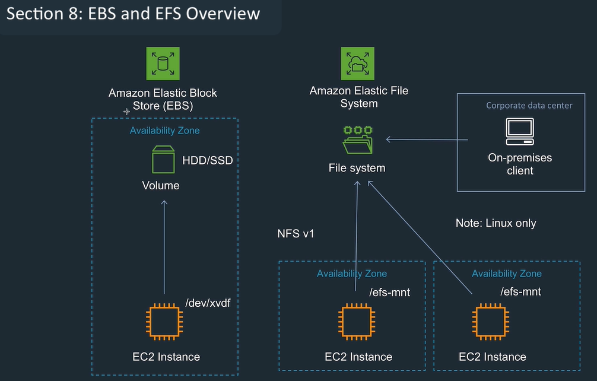

## EBS Elastic block storage

- Block level storage to EC2. e.g. db disk
- Persistent and durable.
- Flexible
- Good for rapidly changing data
- Attached to one EC2 instance.
- A hard disk in the cloud, HDD or SSD
- Separate service, so independent of EC2.
- EBS snapshot stored on S3, manual or automatic. Incremental. If you loose an EBS volume, can restore from a snapshot.
- Writes to EBS volumes by default replicated in one AZ. Can recreate in a different AZ.
- IOPS: input output per second. Also use data throughput.
- Can create as part of EC2 setup or separately
- Elastically scalable, so can be resized with modify volume.
- Not good for: Temporary storage, multi instance access, very high durability / availability.
- Can only be attached to one EC2 instance at a time (different from EFS: multiple EC2 can mount a single EFS, so EFS can be shared.)
- EBS snapshots to S3 are incremental, only changed data saved in the snapshot. Deletion process is clever so only need to save the most recent snapshot.
- Snapshots good to move data between AZs or regions
- Encryption fully available

### EBS Disk volume types

HDD is for high throughput, big data, logging, larger blocks, not boot volumes.  
SSD good for smaller blocks, db transactions, boot volumes

- SSD GP2: General purpose, fast, 3k IOPS, 128 Mb / sec
- SSD IO1: Provisioned IOPS. Predictable performance, specify IOPS rate. Max 20K IOPS. Most expensive. Business critical, large database iops etc.
- HDD SC1: cold HDD. good for large infrequent workloads, high throughput, 250 Mb/sec. Cheapest, but much less iops than SSD.
- HDD ST1: throughput optimised. good for frequently accessed large dataset. 500 Mb/sec.  Good for e.g. data warehouse, log processing. HDD can't be boot volume

### EBS Encryption

- EBS offers encryption at rest and in transit.
- Just need to choose if encrypted when create.
- 256 bit with KMS for keys.
- Snapshots are also encrypted.

### EBS Pricing

Charged per month for capacity, even if don't use capacity.

### EBS sharing / copying

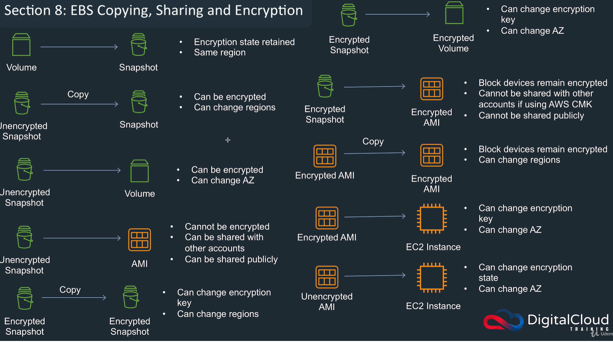

## AWS EC2 instance store (Instance store volume)

- Can store data locally to EC2 instance.
- Temporary storage only, can be lost when instance stopped or terminated. OK if reboot.
- E.g. if EC2 fails, all date lost and reset.

Benefits:

- storage included in EC2 costs
- IO is very fast compared to EBS (3.3 M IOPS)
- Ideal as cache or buffer.
- often used in load balancing group
- cheap

Features:

- Not available on all instances.
- Get bigger with EC2 size.
- Same security as EC2.
- Not good for: shared data, persistent data. Use EBS.

## Hibernating with EBS

When you hibernate an instance, Amazon EC2 signals the operating system to perform hibernation (suspend-to-disk). Hibernation saves the contents from the instance memory (RAM) to your Amazon Elastic Block Store (Amazon EBS) root volume. Amazon EC2 persists the instance's EBS root volume and any attached EBS data volumes. When you start your instance:

- The EBS root volume is restored to its previous state
- The RAM contents are reloaded
- The processes that were previously running on the instance are resumed
- Previously attached data volumes are reattached and the instance retains its instance ID

## S3 (Simple storage Service)

- Most heavily used storage
- Object based.
- Unlimited scalability, but limits on individual file size (5 Tb)
- Object storage, so no data structure hierarchy. Just a URL to the object.
- Regional service, each bucket in one region.

Definitions

- Availability: uptime is between 99.5 and 99.99%  
- Durability: probability of maintaining data without being lost (corruption etc). All S3 is 11 9s.

Features

- Bucket name - container for the data. Unique.
- Flat address space, so no duplicates.
- Account has up to 100 buckets, can increase.
- Can create folders in the bucket, but really this is just address
- Key: bucket and object key. The folders are included in the key.
- URL to access the key
- Object versioning, so changes are a new object with diff key

### S3 storage classes

Lifecycle rules can move or delete data to save storage costs.  

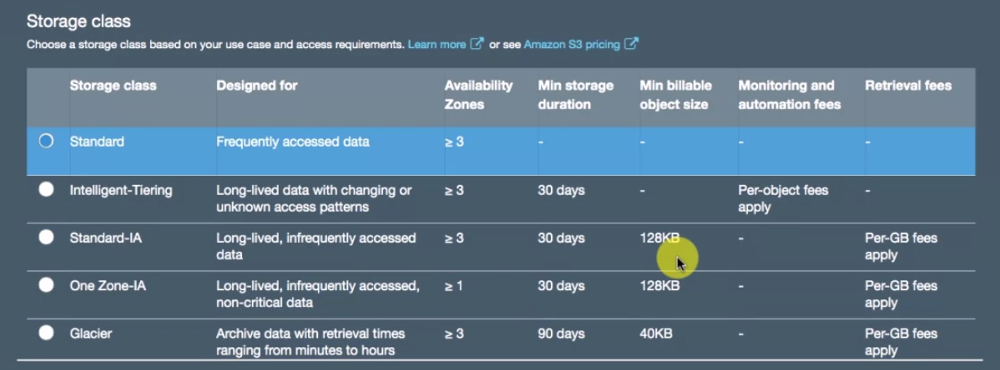

- S3 standard: good for high throughput, low latency, frequent access, durable, available, lifecycle rules
- S3 Int: Intelligent tiering. move to infrequent tier if not accessed, then moves to standard for e.g. a month when accessed. Good for unknowns.
- S3 S-IA: Standard infrequent access. Just the infrequent tier. Availability a bit lower.
- S3 Z-IA: one zone infrequent access. Availability less again. Only one availability zone. 20% cheaper than standard but less available.

### S3 Glacier

- archival data. Interact with lifecycle rules. Much cheaper than S3. Not instant access. Low cost long term cold storage. Long term backup and archiving. Can take several hours to retrieve. Glacier value is regional , just a container for an archive.  
- Same durability, same availability.
- Vaults and archives, not buckets and folders.
- Vaults in a region, Archive in a vault.
- No GUI - use glacier dashboard.
- Moving data: create vault, move data using APIs or SDKs. Or use the S3 lifecycle rules.

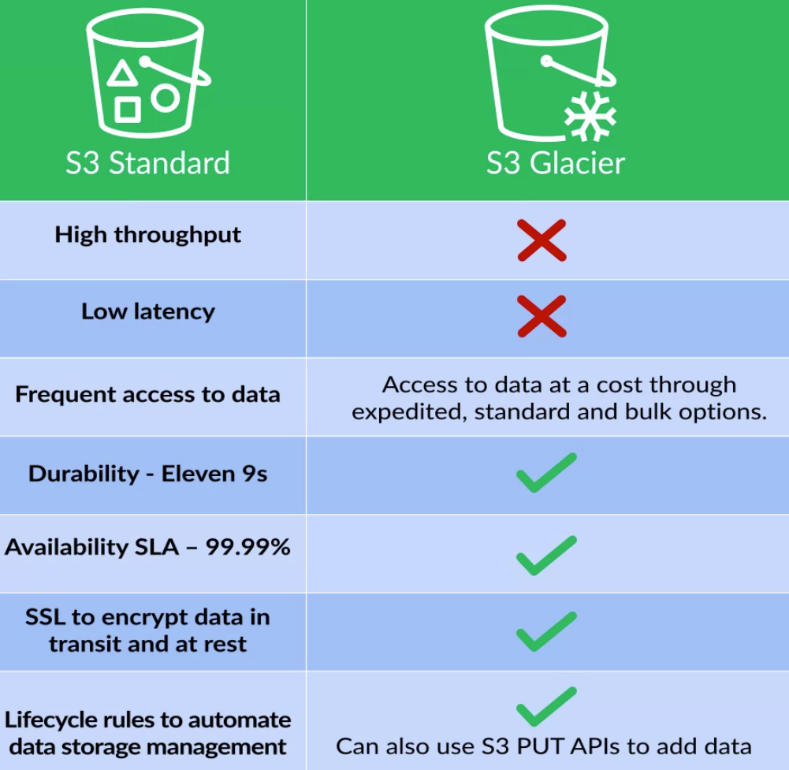

Glacier retrieval

- Expedited: under 250Mb, 5 mins
- Standard: any size, 3-5 hours
- Bulk: large size, 5-12 hours. Cheapest.

### S3 Glacier Deep Archive

Good for long term access, e.g. financial records.
Only one retrieval method, slow.

### S3 storage classes summary

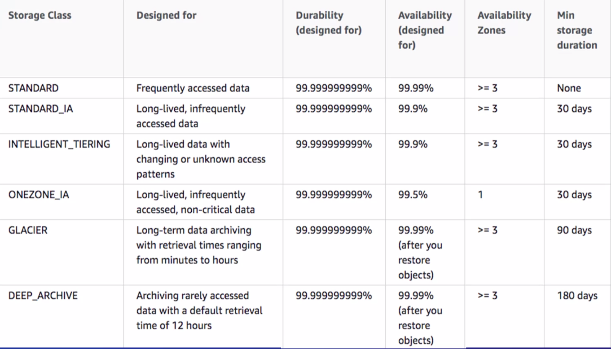
Choose based on durability, access times, etc.

### S3 Bucket properties and management features

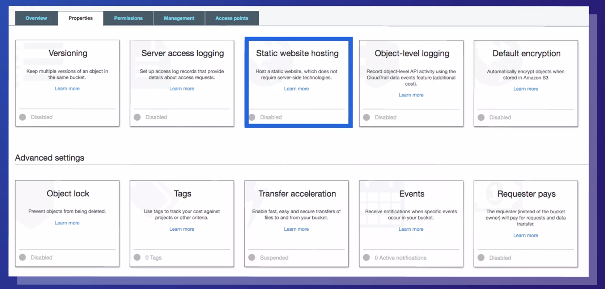

### S3 Versioning

- Multiple versions of same object.
- Managed automatically when update object in a bucket with versioning enabled.
- Only latest version shown on console.
- Can't disable, only suspend (keeps versions to date)
- Status can be un-versioned, version- enabled, versioning-suspended.
- Takes more Space so costs more.
- To enable, on creation or update.
- Versions visible on console if switch it on and saved since versions switched on.
- New version id when save.
- When delete an object, new version gets a delete marker. Thats the current version.
- Use AWS SDK to delete a file permanently passing version of delete marker.

### S3 Server access logging

- Capture details of requests to objects.
- Not guaranteed.
- specify target bucket for logs in same region, and file Prefix.
- Log delivery group needs access to S3.
- Logs have bucket owner, time,. Ip address, request id, operation, key, etc.

### S3 Static website hosting

- No server side scripting.
- Gives url, but this doesn't support https or requestor pays.
- Needs index document and error document.
- Redirect requests
- Change permissions to allow public access (By default all access is blocked), and add bucket policy

### S3 Object level logging

- This is part of AWS cloudtrail
- Cloudtrail logs api calls from CLI, console, other services etc.
- Log files stored on S3.
- Stores metadata and request.
- Setup in cloudtrail, or at bucket level.

### S3 Default encryption

Only new update objects.

- SSE-S3: S3 managed keys. Keys managed by AWS, so simple and invisible. 2 stage encryption with plaintext key being encrypted by the master key, and deleted from memory.
- SSE-KMS: KMS managed keys. KMS generates 2 data keys

### Object lock

- Good for WORM compliance, write once read many.
- Can add retention periods.
- Only done on creation of bucket, can't be disabled.
- Needs versioning enabled.
- Enter retention period.
- Need to choose governance mode or compliance mode (no users can overwrite retention period)
- Legal hold is object level, no expiration date.

### S3 Tags

Use for cost allocation to help with categorisation  
Tags can be e.g. project name, and environment name (e..g test, dev)

### S3 Transfer acceleration

- Long distance transfers.  
- Cloudfront is content delivery service, distributes traffic worldwide via edge locations.  
- If transfer acceleration enabled, uses cloudfront.  
- Increased cost.  

### S3 Events

- multiple event types, e.g. put, copy, replication started...
- Events sent to SNS topics, SQS queue, Lambda function.
- Need to give permissions for events to be sent to the topics.

### S3 Requestor pays

- Any costs of data transfers and requests become responsibility of bucket requestor, not owner.
- Owner pays storage costs
- All access needs to be authenticated so knows which account to charge.
- Customer knows from request header.

## Elastic File store (EFS)

File system Differences:

- S3 is Object storage: single storage, not block storage, so a change to a file and needs a new version. Good for e.g. video files, write once read many. Not good for read and write at the same time.
- EBS storage: stored in small blocks, not single objects, so when one part of a file changed only that part of the file is changed. Good for e.g. apps, op system, database. Good for part of file changing, multiple write and read. Pay for capacity.
- EFS: file level, good for low latency. Connect from multiple EC2 instances at once. Locks, hierarchy. bit like on prem file system. Connect with a mount point on the instance. Pay for what you use, elastic.

To the user looks like a on-prem file system.

- Good throughput, scalability, latency.
- Regional replication, so applications in different regions can access same files
- Not in all regions.
- Linux only

### EFS Storage classes and options

- standard: default. Change for storage only per month.
- IA (Infrequent access): cheaper, more latency. charged for access and storage

Both same level of durability and accessibility.  
Can use EFS lifecycle management to move between these storage classes. Small files and metadata don't get moved to IA.  

Automated backups if you want them.  

EFS has 2 different performance modes:

- general purpose: typical. low latency, IOPS capped at 7k.
- Max IO: heavy throughput and IOPS, but latency is worse. 

EFS has 2 throughput modes:

- Bursting throughput: Normal. Bursting costs money. Burst credits for EFS. Get credits when not using much throughput, then spend on bursts.
- Provisioned Throughput: guaranteed rate for high availability.

### Creating EFS

- Mount to connect storage to EC2.
- When create it, can create a mount targets in AZs.
- Use either Linux NFS or EFS mount helper (preferred).
- Install EFS mount helper to set recommended options. Built in logging.
- Create a security group to allow the EC2 instances to write to the EFS.

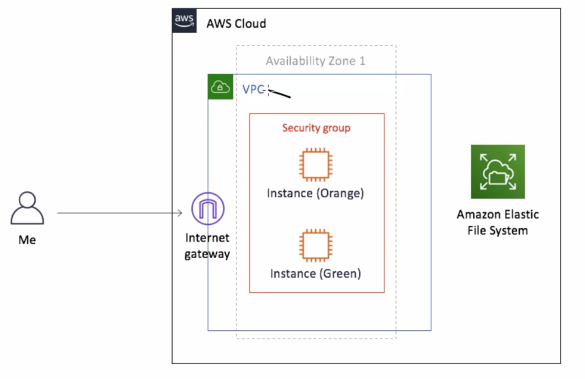

Basically create the EFS, create a folder, mount the EFS to that folder. Like mapping, so you can access e.g. one EFS mount from 2 EC2 instances.

### EFS Security

To create the EFS file system, you need 'allow' access to EFS, and EC2 access to create network interface.
Need to have policies set up.

1. Encryption at rest  
    - Need customer master key. AWS KMS encrypts and decrypts the AWS keys.
    - 2 types of customer master keys: created by amazon / created externally.
    - CMKs created first time you use them  

2. encryption in transit  
    - TLS: transport layer security
    - Stunnel: open source app for TSL / SSL tunnelling service. Listens for encrypted data and routes to decryption.

Can set group and user level permissions to manage file access.

### Importing data to EFS

AWS Datasync: to transfer data from customer site.  
Download Datasync agent, configure source and target.  
Also good for syncing data between EFS instances.  

## FsX and Lustre

- FsX is new storage service for fully managed third party file systems, gives compatibility with these.
- Lustre Useful for specialist services e.g. ML, HPC
- Good for e.g. bursting performance
- Managed service

1. FsX for Windows
    - easy way to migrate windows services
    - Supports windows features e.g. DFS, NTFS, AD etc

2. Fsx for Lustre
    - access an S3 bucket at high performance
    - S3 objects can be viewed as files in Fsx for Lustre, process on the files
    - good for bursting performance

## Backup and DR strategies

- RTO: recovery time objective - time after a disruption to restore a business process to recovery level.  
- RPO: recovery point objective - acceptable data loss in time interval. e.g. loose the last 10 mins of data may be acceptable.

Either could the be priority.

1. Backup and restore

   - like a virtual tape library.  
   - Copy object to S3, restore from there.  
   - Need to decide retention time  
   - Need to set encryption policies  
   - Regularly test  

2. Pilot light

   - Keep a similar stack ready to run.
   - In event of disaster, start up pilot light, and quickly horizontal scale to same scale as production system.

3. Warm standby

   - Ready to go with all services running in minimal possible way.
   - Mirroring / replication of data
   - Minimal services running.
   - When fails, change DNS settings and scale up

4. Multi site: full replica

   - Route traffic to all multiple sites
   - when one fails, route all traffic to less sites.
   - Most expensive

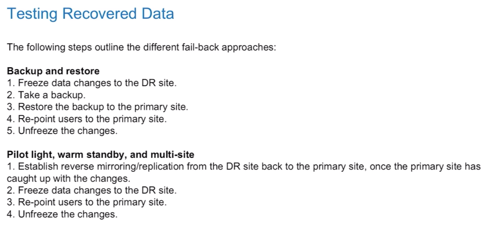

### Replication considerations

- distance between sites (latency)
- Available bandwidth
- Data create required by application
- Replication technology should be parallel

### Replication types

- Synchronous: atomic write to both.  
- Asynchronous: not atomically written to multi locations. Transfers as network allows. Used by file systems, some databases, good for read only copy.

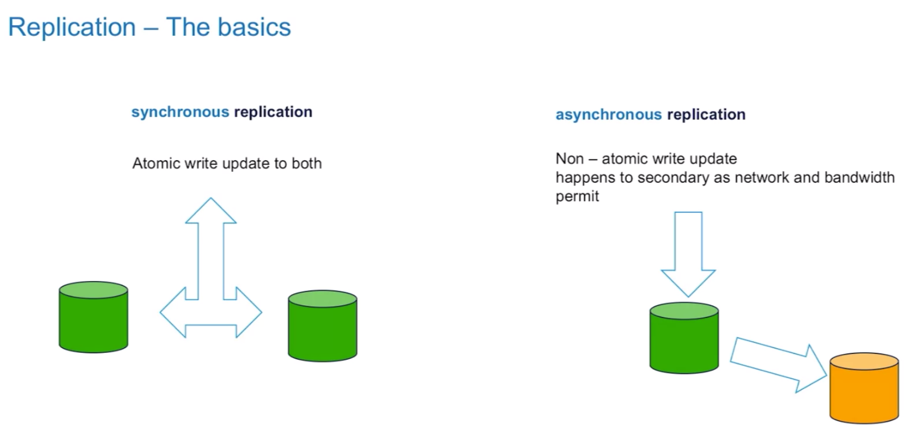

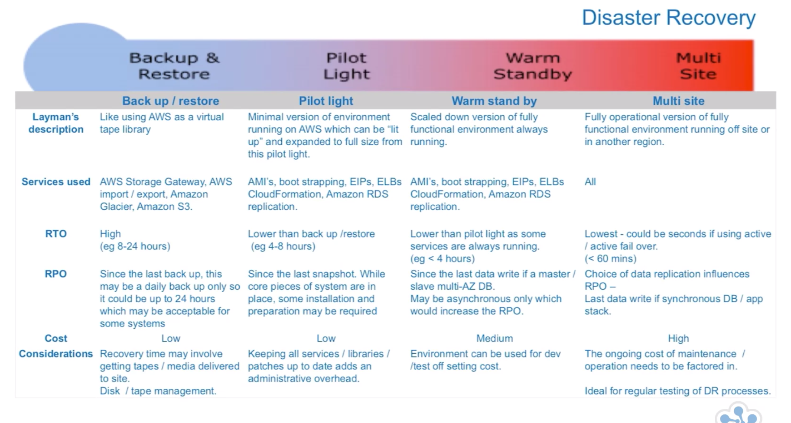

## Using AWS Storage for on-prem backup and DR

### Traditional

- backup files
- may not be available quickly
- long RTO
- scalability issues
- Manual processes

### issues

- time to get files transferred
- RTO / RPO

### data transfer mechanisms

3 direct connection types (plus snowball, )  

1. Direct connect (fastest)
2. VPN connection
3. Internet connection

Different times to transfer data after restore. Calculate the time.

### S3 as a backup solution

#### Storage classes

- Standard: 11 9's of durability, 4 9's or availability.
- IA: infrequent access. 11 9's of durability, 3 9's or availability. Cheaper. Good choice for backup data
- Glacier: 11 9's of durability, N/A availability. Archives and vaults.

#### Moving data to glacier

- lifecycle rules
- AWS SDK
- Glacier API

Has Vault locks.  

#### Glacier retrieval

- expedited (urgent)
- Standard (cheaper)
- bulk (slow and cheap)

#### S3 regions

S3 is by default single region. Can turn on cross region replication (CRR).  
Maybe do this for extra durability

#### S3 performance

Multipart upload should be used when object > 100Mb.
Faster, more throughput, interruption recovery, easier management

#### S3 Security

- IAM policies (allow or restrict identity / user group / role access)
- Bucket policies (JSON policies per bucket)
- Access control lists
- Lifecycle policies
- Multi factor delete
- Versioning

### AWS Snowball for data transfer

in and out of AWS  
Physical appliance  
50 or 80 Tb devices.  
Dust, impact and tamper resistant.  
E-link shipping label so goes to the correct place.  
tracked with SNS (simple notification service)  

Consider snowball for restore when your connection is slow.  
Create export job in AWS management console  

## AWS storage gateway

Software client in your data centre to connect to amazon.  
It's a VM running in your site.  
Can be configured as file gateways, volume gateways, virtual tape library  

- File gateway: files sent to S3 over https, encrypted. View S3 as normal NFS file system, mount internally.
- Volume gateway / Stored volume gateway: block storage backup for local storage to S3, stored as EBS snapshot. Configured as iSCSI devices for asynchronous backup. Your data stays on site. Storage buffered on site for staging. Easy disaster recovery.
- Volume gateway / Cached volume gateway: primary storage is S3. Uses local data storage as cache. Presented as iSCSI devices. Local disks act as buffer.
- virtual tape library (VTL): cloud based tape. Use your infrastructure, but store on S3. Virtual tapes, capacity of 1500 virtual tapes. Presented as iSCSI devices. Archive tapes from VTL to Glacier. Use with popular software. Encrypted.

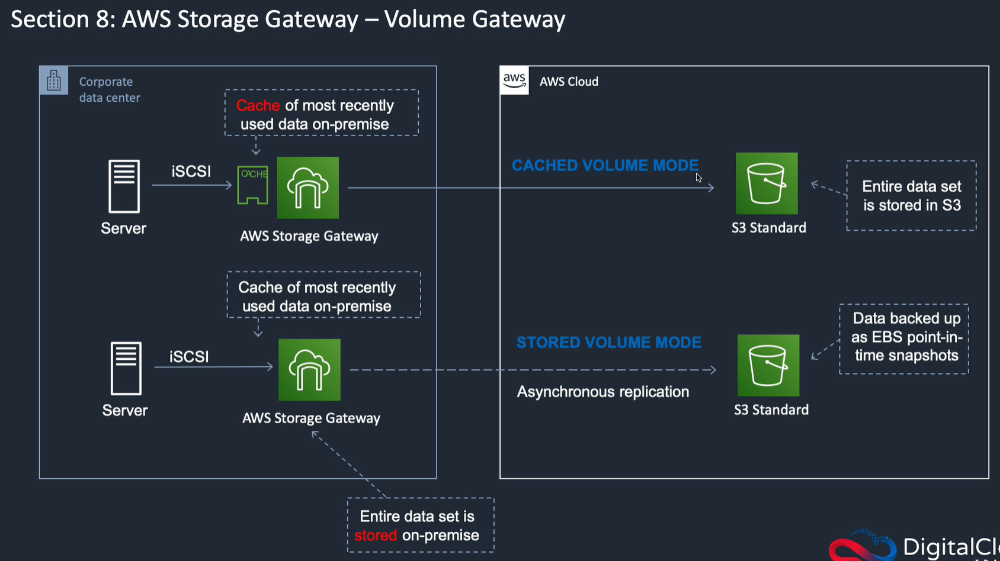

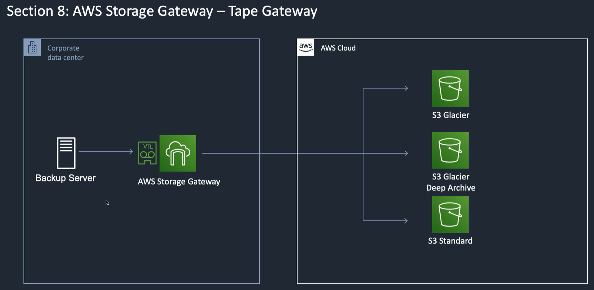

## Optimising Storage costs

S3 costs based on volume.  
With intelligent tier, costs decrease as more data added per month

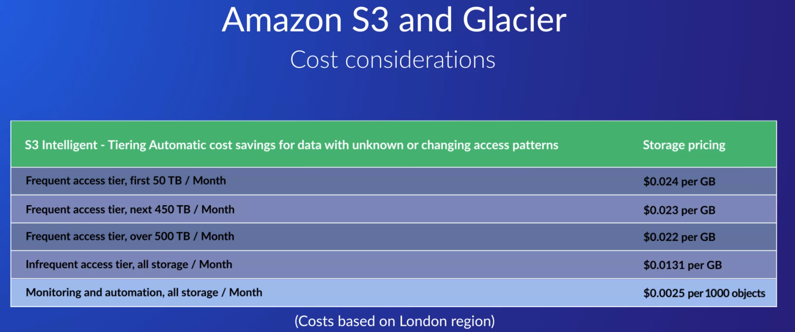

Other storage classes are fixed cost per Gb

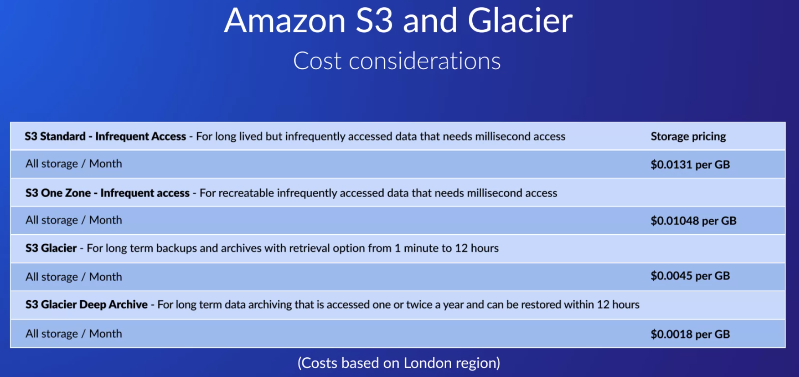

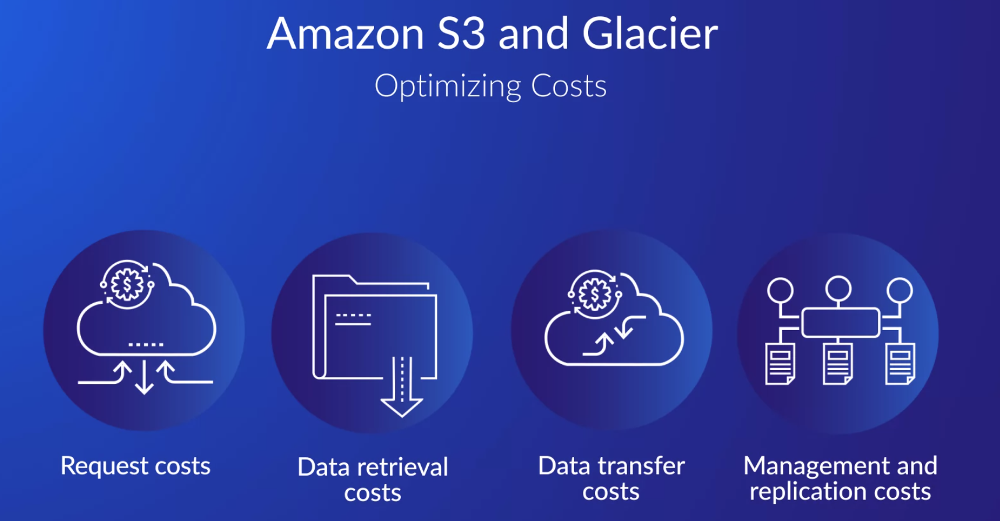

Retrieval costs: Pay for requests (e.g. API calls) and for volume retrieval per Gb

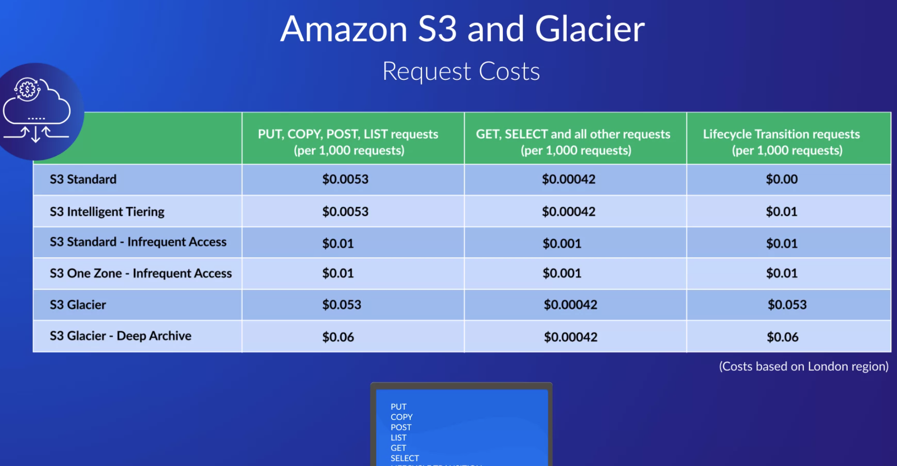

Data transfer costs: Free with to EC2 or cloudfront, but costs when transfer to internet. Transfer acceleration (via edge locations) is more costly.

Management and replication costs: costs when use S3 inventory, analytics, Object tagging.  

Batch operations: Batch for S3 operations. Priced per job and per mission operations.  

S3 and glacier select: select the data you want, cheaper, but fixed costs  

S3 replication: CRR cross region replication, or SRR same region replication. Costs for storage at other location, and data transfer between regions.  

Versioning: implement life cycle policies on S3 to cover versions.  

### Cost optimisation

understand your data: profile of retrieval, data request patterns, retrieval costs, speed to get data. Make use of lifecycle controls.

### EFS costs

EFS Standard storage is volume per month, no access charges.  
EFS IA has cheaper storage classes (90% cheaper), but also read and write charges.  
Lifecycle management moves data between these automatically. Excludes files below 128k, and metadata. configure the lifecycle management timer to e.g. 30 days.  
EFS bursting throughput: caters for occasional high peaks, included.  
EFS provisioned throughput: higher level, costs.  

### FSx

FSX for windows file system: managed windows files system on AWS. Full support for NTFS.  
FSx for Lustre: for compute intensive workloads & ML  
Pay for storage capacity used.  

### AWS Storage Gateway costs

Hardware or software on prem to connect to AWS. Types are File / volume / tape.

- File gateways: S3 file share mounted as on prem. Pricing on storage and request as per S3.
- Stored volume gateways (EBS snapshots), billed as EBS snapshots
- Cached volume gateways, charged on S3 levels.
- Tape gateways: charged for S3 and glacier.

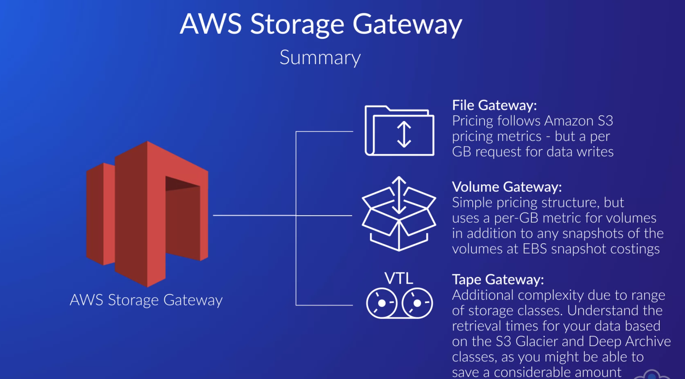

### AWS Backup costs

Solution to backup AWS services.  
Also automate backup from on prem.  
Centralises management, auditing, logging, restores.  
Need to create backup plans: schedule, window, vault, tags, regional copies etc.  
Can use tag based policies.

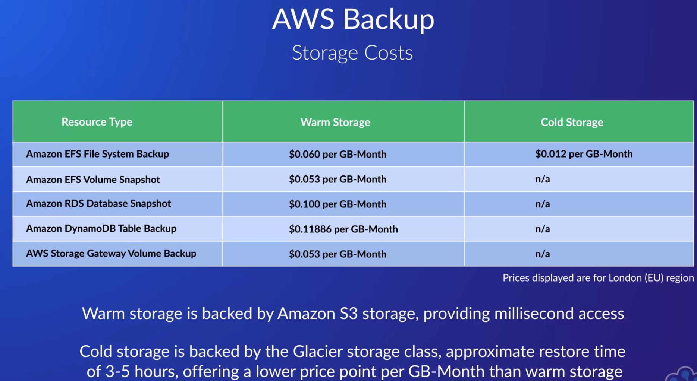
