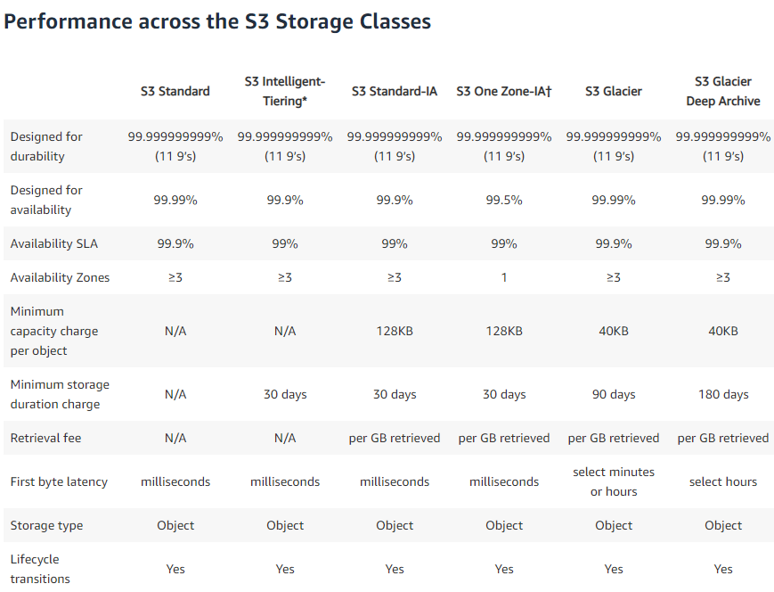

<LINK href="jb1.css" rel="stylesheet" type="text/css">

#### [Back to index](index.html)

# SAA-C02 Storage services S3 and Cloudfront

- [SAA-C02 Storage services S3 and Cloudfront](#saa-c02-storage-services-s3-and-cloudfront)
  - [Summary](#summary)
  - [Use Cases](#use-cases)
  - [S3](#s3)
    - [S3 CLI](#s3-cli)
    - [Regions](#regions)
    - [S3 storage classes](#s3-storage-classes)
    - [Create an S3 endpoint](#create-an-s3-endpoint)
  - [Security](#security)
    - [Policy setup](#policy-setup)
    - [Cross account access](#cross-account-access)
    - [Access control lists (ACL)](#access-control-lists-acl)
    - [Policy simulator, Access advisor](#policy-simulator-access-advisor)
    - [Multipart upload](#multipart-upload)
    - [Query string authentication](#query-string-authentication)
    - [Signed URL to S3](#signed-url-to-s3)
  - [Other S3 tools](#other-s3-tools)
    - [Transfer Acceleration](#transfer-acceleration)
    - [Static websites](#static-websites)
    - [Versioning](#versioning)
    - [MFA delete](#mfa-delete)
    - [Cross region replication (CRR)](#cross-region-replication-crr)
    - [Lifecycle management](#lifecycle-management)
    - [pricing](#pricing)
    - [S3 encryption](#s3-encryption)
    - [Events and notifications](#events-and-notifications)
    - [Requestor pays](#requestor-pays)
    - [Server access logging](#server-access-logging)
    - [Object lock](#object-lock)
    - [S3 select, glacier select](#s3-select-glacier-select)
    - [performance considerations](#performance-considerations)
  - [Cloudfront](#cloudfront)
    - [S3 static website and cloudfront](#s3-static-website-and-cloudfront)
    - [Lambda edge functions](#lambda-edge-functions)

## Summary


## Use Cases

S3: software distribution, backup, images, media, static websites
EBS: Op system for EC2. Databases. Trans logs. Low latency. Format files. Same AZ as needs to be close.
EFS: Corporate directories, data analytics. Can be diff AZs. Multiple AZ. Mount it.

## S3

Global service, but buckets in a region. Data held in the region.
Name globally unique.
Rest interface

Durability: prob that an object will not be lost
Availability: prob that will be available.

Provides read after write consistency for puts of new objects
Provides eventual consistence for overwrite puts and deletes (takes time to propagate)

Prefix mimics folder.
100 buckets per account.
No bested buckets but have folders.
Max file size 5Tb

### S3 CLI

```bash
aws s3 ls
aws s3 ls s3://jer-saa-bucket
aws s3 cp file bucket
aws s3 rm s3://bucket/file
```

### Regions

S3 is global  
Name must be unique  
but data is stored in a region  

### S3 storage classes



- durability 11 9's for all
- availability 4 9's reduced for IA and one zone IA
- Minimal duration for everything except S3 standard
- Retrieval free for standard, fees for the non standard options.
- reduced redundancy is cheaper for non critical data, lower levels of redundancy

### Create an S3 endpoint

S3 is public so can't access it from private subnet.  
Set  up S3 gateway endpoint.  
It's a gateway type, so need to put entries in route table.  


## Security

### Policy setup

Policy written in JSON to set identifier, action, effect, resource.  
Can apply a policy 2 different ways:

- identity based, to a user or role. or given to groups and users in the groups get the policy.
  - use cases
    - multiple buckets all need the same access
- resource based:
  - e.g. S3 bucket gets a policy.
  - Use cases:
    - restrict access to an IP address (use CIDR range, deny a CIDR range)
    - restrict access to an HTTP referrer (this is a header from teh calling web site, and e.g. allow access to images on S3. Deny policy for al, allow for one HTTP referrer as the web page)

To identify resources, use Amazon Resource Name (ARN): this is unique for all types of resources (Users, buckets etc)

### Cross account access

- User in account B to access S3 in account A.
- User in account B should assume role to do things in Account A
- Create a role which allows access to a bucket, list, read, write. Use the role for a temporary period.
- User B needs to switch role on console.

### Access control lists (ACL)

- Old way.  
- Access control at the bucket and object level  
- READ, WRITE etc permissions applied.  

### Policy simulator, Access advisor

Tools to let you set up policies more easily.  
See where permissions come from.


Use cases for ALC:

- manage objects not owned by the bucket owner
- Need to manage at the object level when objects in a bucket need different permissions
- write access logs.

Other use cases are for resource or identify based policies.

### Multipart upload

- Recommended to use when objects > 100Gb.
- Parallel upload, restart is ok, pause is ok.
- Start before know final size.
- Use APIs to upload, or CLI.
- AWS S3 cli should be used in preference to AWS S3 API CLI
- It knows it's a large file and will do it in parallel

### Query string authentication

- e.g. large file to share to a group of people without AWS accounts.
- Give them a signed URL.
- Set expiry time.

### Signed URL to S3

A signed URL includes additional information, for example, an expiration date and time, that gives you more control over access to your content. You can also specify the IP address or range of IP addresses of the users who can access your content.

A signed URL includes additional information, for example, an expiration date and time, that gives you more control over access to your content. You can also specify the IP address or range of IP addresses of the users who can access your content.

If you use CloudFront signed URLs (or signed cookies) to limit access to files in your Amazon S3 bucket, you may also want to prevent users from directly accessing your S3 files by using Amazon S3 URLs. To achieve this you can create an origin access identity (OAI), which is a special CloudFront user, and associate the OAI with your distribution.

You can then change the permissions either on your Amazon S3 bucket or on the files in your bucket so that only the origin access identity has read permission (or read and download permission).

```bash
aws s3 presign [filename]
```

## Other S3 tools

### Transfer Acceleration

- Uses edge locations in reverse to speed up file transfers to s3
- Set at bucket level
- Need to use different endpoint in the url, this has "bucket name" as first item.  
- Costs money
- Use when uploads are time sensitive.
- Can't be disabled, only suspended. Not charged if no benefit


### Static websites

- Enable public access as bucket policy, and switch off default private behavior.
- To use DNS, bucket name must be the same as the DNS name.
- Set up alias route in route 53.
- Can set up cloudfront in front of S3 static web site.

### Versioning

- When upload a new version of an object, previous versions saved.
- Delete means delete marker added. Delete the delete marker to reinstate.
- can enable versioning, but then can only suspend.

### MFA delete

Multi factor to delete.

### Cross region replication (CRR)

Automatically does it cross AZs  
But can choose to asynchronously copy data between regions.

Use cases

- want global availability
- want safer storage

Need to have versioning enabled.  
S3 needs to have role permissions to replicate the bucket.

### Lifecycle management

- this is where you know the lifecycle
- Movement between classes
- lifecycle rule combines
  - Transition actions define this behavior (e.g. Standard to glacier)
  - expiration actions to delete

If you don't know the lifecycle, use intelligent tiering.

Only S3 has lifecycle management: not on EBS or EFS

### pricing

- priced per GB per month
- less frequently accessed tiers are cheaper for storage
- pay per requests, GET, LIST, PUT
- pay per GB transferred out
- pay per GB for data to another region

### S3 encryption


Encrypt on server side or client side

server side: use s3 keys (SSE-s3) or your key (SSE-KMS), or SSE-C (client provided keys).  
client side: you encrypt before sending, S3 knows nothing

when switch on only covers new objects

### Events and notifications

Based on event types, e.g. POST, COPY, DELETE etc  
Send to SNS, SQS, Lambda etc

For SNS, create a topic, subscribe to it.

### Requestor pays

- Owner pays for storage but transfer charges to requestor.
- Need to be authenticated user.
- Include info in headers

### Server access logging

- Log requests made to S3
- Uploads, downloads.
- Source and destination buckets (separate bucket best)
- Best effort delivery
- Set permissions for log delivery

### Object lock

- Used to prevent objects being deleted.
- Bucket setting, only enable at bucket creation, permanent setting, needs versioning.
- Compliance and legal use cases.  
- legal hold - higher level lock.  

### S3 select, glacier select

- S3 select you can use SQL to look inside files.
- Reduces data download and cost.
- Similar with Glacier.

### performance considerations


## Cloudfront


- Gets content closer to users.
- Content delivery network, cache.
- Regional edge cache has a big cache.
- When TTL expires,  object removed from cache.
- Also used for upload
- Web distribution for http
- RTMP distribution for e.g. video to play before complete download.

### S3 static website and cloudfront

- Bucket public access, but set up bucket policy so only cloudfront can access S3 bucket, so people don't go direct.
- Use Origin access identity - thats a user in cloudfront.
- Set cache behavior per origin, and per distributions.
- Can limit edge locations to where your users are
- Get charged for data transfer between cloudfront and the origin
- Can specify access per e.g. geographic area
- Change the Route 53 DNS CNAME record to point to cloudfront, not S3.

cloudfront cache behaviors: say how to respond to different requests.

### Lambda edge functions

run a function at the cache, logic closer to users.
