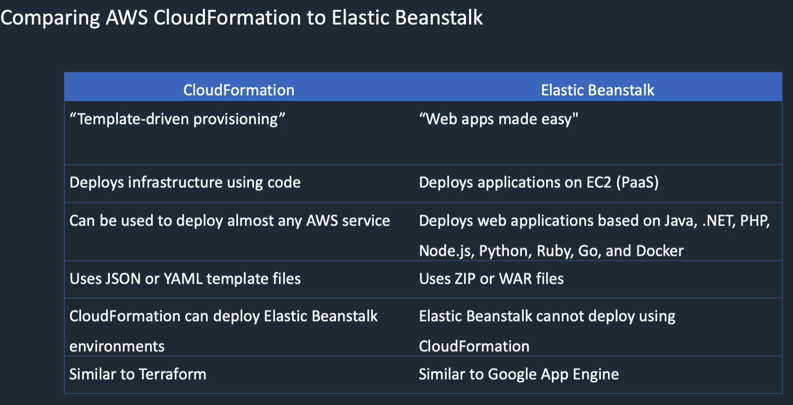

<LINK href="jb1.css" rel="stylesheet" type="text/css">

#### [Back to index](index.html)

# AWS Automation and Platform Services (CloudFormation, EBS)

## CloudFormation

- Manage, provision, configure infrastructure as code
- Set parameters in JSON, YAML. e.g. key name, AMI.
- Builds infrastructure for you, infrastructure as code.
- Means repeatable infrastructure build.

EBS is different from CloudFormation:

- it deploys applications, e.g. deploy a website.
- CloudFormation can be used for nearly every AWS service.
- Cloudformation can deploy an EBS environment.

### Cloud Formation details

- Consistent reusable infrastructure
- Version control
- Free to use
- Can delete stack, this stops services and deletes
- Automatic rollback on script failure
- Has calculator

### Cloud Formation concepts

- Templates: YAML / JSON file of instructions
- Stack: environment as single unit (single region & account)
- Stack Set: stacks across multiple accounts / regions
- Change sets: proposed stack changes
- Drift status shows if someone has done some changes to the cloudFormation script.

## Elastic Beanstalk (EBS)

- Platform as a service
- Pre builds a platform for you to deploy your code
- Easy way to get your code running.

Use case:

- Company deploying a platform including code lots of times for multiple customers around the world  

Platforms are  

- docker
- NodeJs
- Python, .NET, PHP, etc

Uses CloudFormation underneath to do the infrastructure build.  
Upload your zip or war file with your code.  
Can e.g. set up web server, set up compute tier, with SQS between them, all a few clicks  
Can optionally specify most of the underlying details, e.g. keypair and choose VPC  
You still have full access
Use S3 to store code, logs etc  
Can load code from Git.

May want to e.g. create database outside of EBS because then you can use it for multiple applications.  
