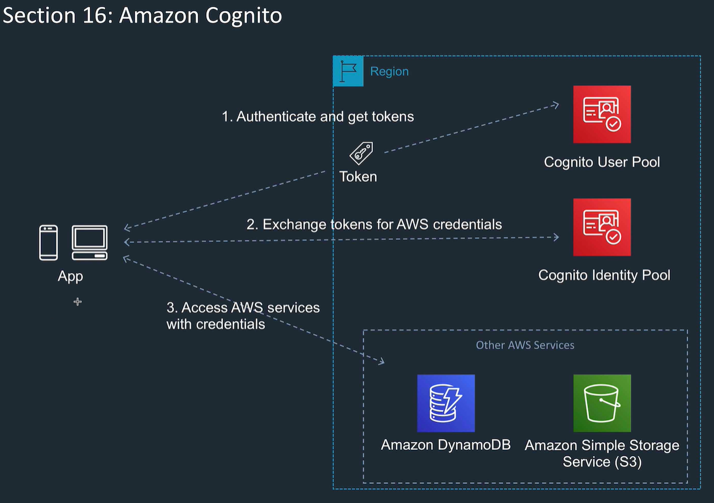
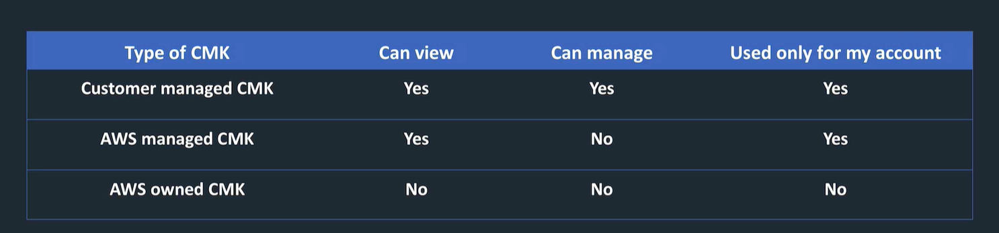
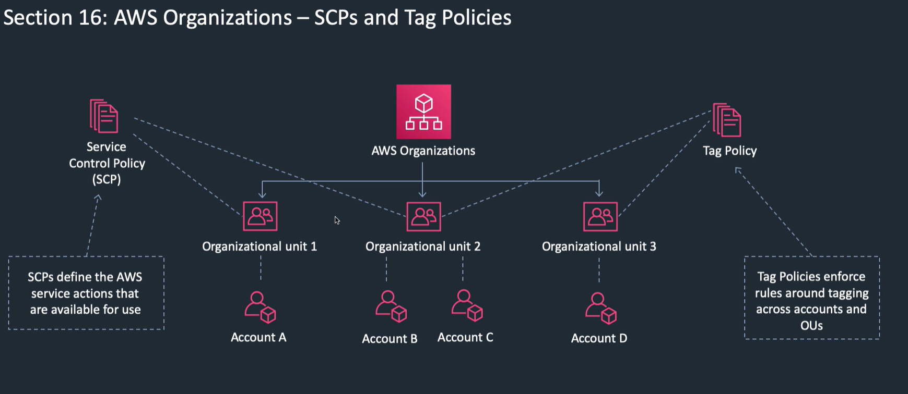
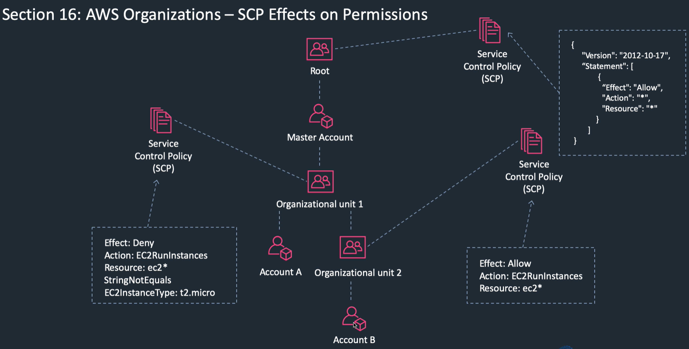
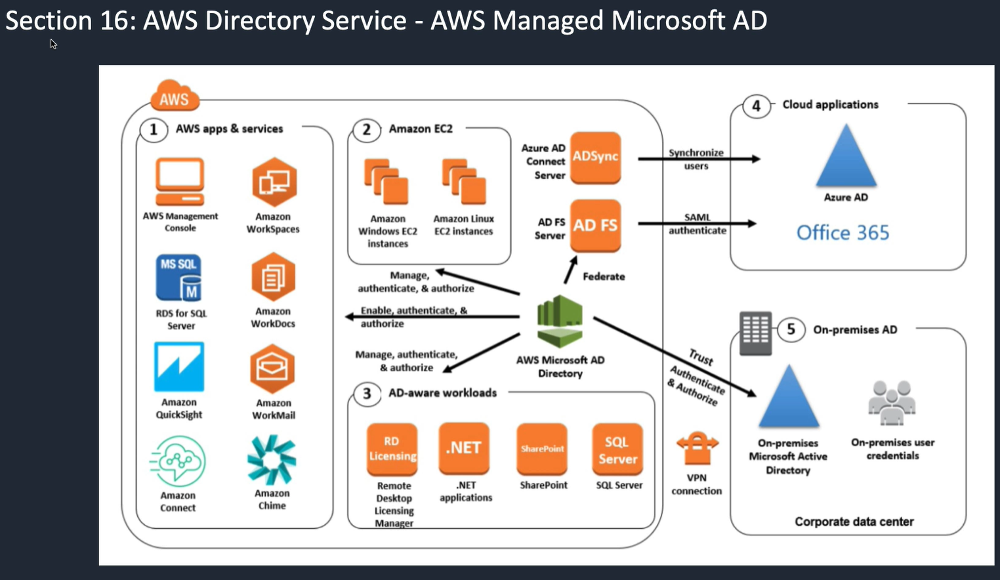
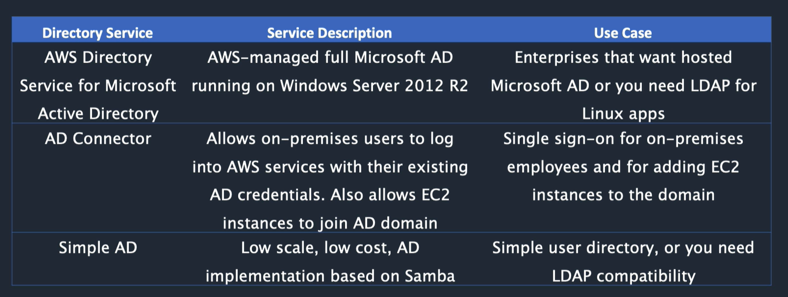
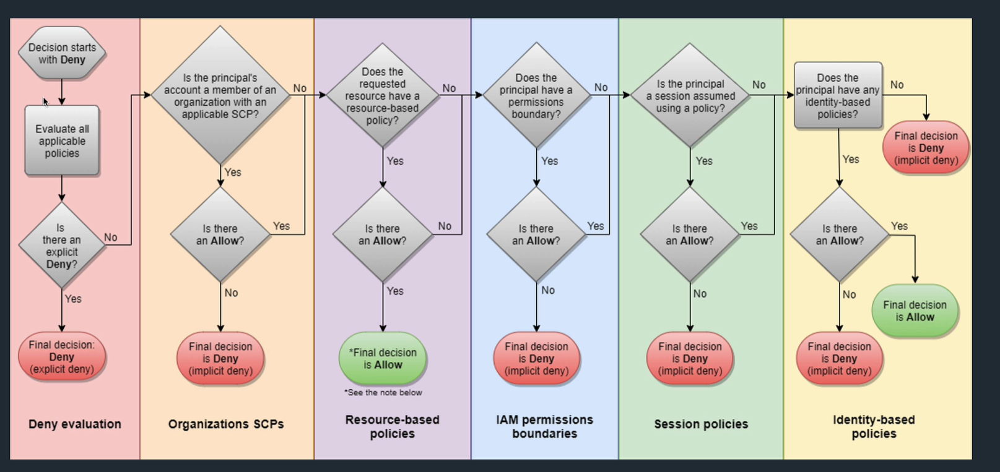
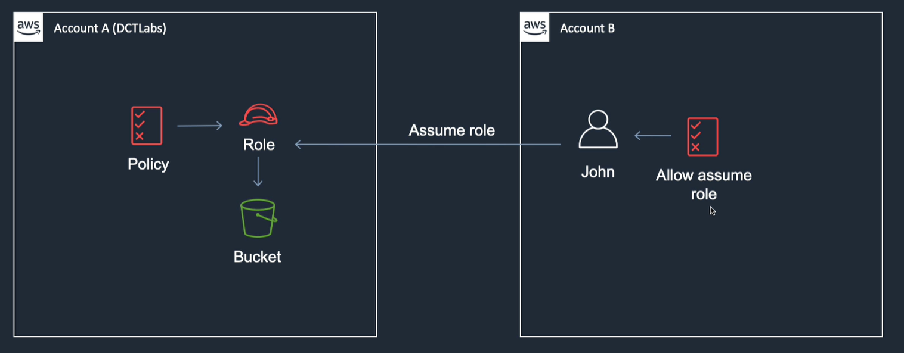

<LINK href="jb1.css" rel="stylesheet" type="text/css">

#### [Back to index](index.html)

# AWS IAM and Security

- [AWS IAM and Security](#aws-iam-and-security)
  - [IAM](#iam)
    - [IAM Access methods](#iam-access-methods)
  - [Cognito](#cognito)
  - [Key management Service](#key-management-service)
  - [Cloud HSM](#cloud-hsm)
  - [AWS Web application Firewall (WAF)](#aws-web-application-firewall-waf)
    - [Firewall manager](#firewall-manager)
  - [Shield](#shield)
  - [AWS Organisations](#aws-organisations)
    - [Consolidated billing](#consolidated-billing)
  - [Service control policies (SCP)](#service-control-policies-scp)
    - [SCP setup](#scp-setup)
  - [IAM Identity Providers and Federation](#iam-identity-providers-and-federation)
  - [AWS Single sign on](#aws-single-sign-on)
  - [Sign on use cases](#sign-on-use-cases)
  - [AWS Directory service](#aws-directory-service)
    - [3 AD service flavours](#3-ad-service-flavours)
    - [Directory services Best Choices](#directory-services-best-choices)
  - [Resource access manager (RAM)](#resource-access-manager-ram)
  - [Advanced IAM](#advanced-iam)
    - [General process](#general-process)
    - [Managed policies](#managed-policies)
    - [Customer managed policies](#customer-managed-policies)
    - [Definitions](#definitions)
    - [Policy Evaluation Logic](#policy-evaluation-logic)
    - [IAM instance profiles](#iam-instance-profiles)
    - [Cross account access](#cross-account-access)
    - [IAM best practices](#iam-best-practices)
    - [Access keys](#access-keys)

## IAM

Secure individual and group access to AWS resources
Can be used to manage

- users
- groups
- access policies
- roles
- MFI, CLI keys, passwords

New users no access to services.
Permissions need to be granted
IAM not used for application authentication: use AD or SAML or cognito etc, or other identity providers (identity federation) without creating IAM account.

Best practice: MFA for all users, and use U2F or hardware MFA for privileged users
IAM is global
Don;t use root account for anything other than billing

### IAM Access methods

1. Console
2. Access keys
   - access key id and secret access key
   - These used for API in code or CLI (don't embed in code)
3. Server certificates (Use Certificate manager)

IAM users are a person or a service
Applications can use IAM, that's a service account.
Groups: collections of users. One level only. Can be assigned a policy.

Use least privilege when assigning permissions.

Roles: assumed by a trusted entity.
Mean can delegate permissions to resources for users and services without using permanent credentials (user name and password) so don't need to embed access keys

IAM policies: define permissions for user, group, role.
All permissions implicitly denied, most restrictive applied.

Best practices

- lock away root user access keys
- create individual IAM users
- use groups
- grant least privilege
- use pre configured policies
- Use custom managed policies, not inline policies
- Use Access Levels to review IAM permissions
- Strong password policy and MFA
- Use roles for apps, not copying access keys to EC2
- use roles to delegate
- rotate credentials regularly
- monitor activity

## Cognito

- Used with web and mobile apps
- Offers user pools and identity pools.

- User pools are user directories which provide sign up and sign in options for app users
- Sign in with various providers (federated) e.g. google, facebook, SAML, OpenID
- Choose e.g. password policy, MFA, attributes, user id type etc

Identity pools provide AWS credentials to grant users access to AWS services. Temporary credentials.

## Key management Service

Customer master keys

- Create a customer managed key, choose to get from KMS or external.
- Define key usage permissions IAM users, roles etc
- Can rotate every year
- When want to delete, needs to be delayed by 7 to 30 days

When you encrypt your data, your data is protected, but you have to protect your encryption key. One strategy is to encrypt it. Envelope encryption is the practice of encrypting plaintext data with a data key, and then encrypting the data key under another key.  

When you encrypt a data key, you don't have to worry about storing the encrypted data key, because the data key is inherently protected by encryption. You can safely store the encrypted data key alongside the encrypted data.  

## Cloud HSM

- Implementation of hardware security model.
- dedicated hardware device for you
- Needed for compliance or regulations where hardware security needed.  
- Create cryptographic keys for your use only.
- Tamper resistent hardware device.
- Just got a lot cheaper.
- No upfront cost, pay per hour.
- On a cluster, the hardware is replicated in multi AZs, so get high availability and load balancing.
- Need to sign certificates, upload.

## AWS Web application Firewall (WAF)

- Application firewall
- Lets you monitor HTTP and HTTPS requests
- **Integrates with cloudfront, API Gateway, ALB, GraphQ API**
- Based on conditions (e.g. query strings, IP address) responds with either requested content or 403 (Forbidden)  

Usage examples:

- Allow all except configured
- block all except configures
- can count matching requests before configuring

Conditions

- IP
- country
- request headers
- string content
- string length
- sql injection in request
- script in request

Basically create a Web ACL from these conditions.  
Set e.g. cloudfront to use this Web ACL.  

A new version of the AWS Web Application Firewall was released in November 2019. With AWS WAF classic you create “IP match conditions”, whereas with AWS WAF (new version) you create “IP set match statements”. Look out for wording on the exam.  

The IP match condition / IP set match statement inspects the IP address of a web request's origin against a set of IP addresses and address ranges. Use this to allow or block web requests based on the IP addresses that the requests originate from.  

### Firewall manager

for WAF across accounts

## Shield

- Provides DDOS protection.
- Standard and advanced: Standard is free, advanced more features, but costs 3000 pm
- If you use some AWS services, get DDOS protection anyway.
- Minimise attack surface area, so only resources needing internet are exposed
- Architect for resilience: architecture can absorb spikes
- Can use AWS WAF access control lists (Web ACLs) to minimize DDOS.
- Shield on top of WAF.

## AWS Organisations

- Centrally manage multiple accounts
- Manage billing, access, compliance, security.
- Share resources across AWS Accounts
- Automate account creation
- apply policies to all accounts
- Single payment method for all accounts
- Create hierarchy of accounts

### Consolidated billing

Discounts for certain levels, e.g. S3 costs
Consolidate and get more discounts.

## Service control policies (SCP)

- SCP control rights that can be granted
- e.g. if SCP says can't create EC2, then whatever the account permissions you can't do it.
- e.g. deny Run EC2 where instance not t2.micro
- Where multiple policies, **the most restrictive applies** (e.g. a deny rule trumps allow)
- Set tag policy across all accounts

### SCP setup

- Create organisation
- Create / invite accounts emails invites to other accounts
- Create multiple organisational units
- Attach SCP to an organisational unit, inherited by units below.

## IAM Identity Providers and Federation

- Allows users to come from other identity providers and use AWS services
- e.g. corporate user directory using Active Directory, or any SAML 2.0 source
- Active Directory uses LDAP to query user database. Local directory access provider.
- OpenID connect is known as Web Identity Federation
- Means users can be managed by an identity provider outside of AWS and then use AWS resources.
- Don't need to manage sign in code.
- Don't need to embed security credentials in your app.
- User doesn't need to create a user in your app.
- Works with identity providers compatible with OpenID Connect, or SAML 2.

## AWS Single sign on

- Single sign on so single user identity has access to multiple services, don't need to enter passwords repeatedly.
- Identity sources can be AWS SSO, or provider using SAML.
- Centrally manage access to multiple AWS accounts
- Can use SSO to manage access and user permissions
- Can customise permissions

**Key scenario: company has own identity source (active directory) want to configure single sign on to multiple accounts, use AWS SSO.**

## Sign on use cases

- Mobile apps: best off using AWS Cognito
- If authenticating users to an AWS account on corporate network, use SAML.
- If going to give access to multiple accounts, use single sign on

## AWS Directory service

### 3 AD service flavours

1. AWS managed microsoft active directory

    Fully featured AD in AWS.
    Set up trust relationship between 2 active directories e.g. with on prem active directory
    So keep users in one please, but allow them to authenticate to AWS.
    Can e.g. connect to EC2 instances, Amazon workdocs etc

    **Best choice if > 5000 users, or if need to set up trust relationships**

    Runs on windows
    Can use with SQL Server, .NET apps etc
    Requires VPN or Direct connect

2. Simple Active Directory

    Stand alone fully managed Active Directory in AWS
    Cheap, less features, good for lower user numbers
    Compatible with AWS Workdocs etc
    2 editions: small to 500 users, large to 5000 users
    Highly available
    Doesn't support some AD features: SQL Server, schema extensions etc
    DOesn't support trust relationships with AD on prem

3. AD Connector

    Connect your on prem AD to AWS for seamless connection between AWS services and AD.
    Map AD identity to IAM role.
    Noting cached to the cloud so more secure
    **Best choice when want to use existing AD with AWS**

### Directory services Best Choices

- One more case:
- AS on prem, add a second in AWS EC2. Means low latency authentication in cloud. But needs synchronizing and identities copying, so not ideal.

## Resource access manager (RAM)

- Share resources between account.
- Share: Aurora, EC2, Codebuild, Route 53, subnets, etc.
- Useful where e.g. share between test and development accounts.

Create a resource share: e.g. subnet, then visible in RAM for the other user.

## Advanced IAM

### General process

- Users in groups
- Create roles
- Assign permissions to roles
- Assign users or instances to roles for a temporary period to do something

### Managed policies

- Created and administered by AWS, has an ARN, designed for common use cases, cant change them
- e.g. DynamoDbFullAccess
- Some for job specific functions, e.g. data scientist

### Customer managed policies

You create your own, attach to multiple principal entities  
when attach, you give the entity permissions in the policy

- Effect: allow or deny
- Action: resource actions
- Resource: limit the resource
- Conditions: e.g. IP address

Use when job specific functions, or where permissions in a managed policy are ok but want to customise.  

### Definitions

These 2 are key:

- **Identity based policy: apply to user, group role**
- **Resource based policy: apply to e.g. S3**

- inline policies: Attached directly to the identity, not to a role.
- IAM permissions boundary: limit of what you can grant to IAM
- AWS Organisations SCP: specify max permissions for an org or OU
- Session policies: pass as parameters for a session role

### Policy Evaluation Logic

- By default everything denied (root account is different)
- Explicit allow overrides the default deny
- If permission boundary, SCP, or session policy may override the allow
- explicit deny overrides any allow

Main thing is that identity based and resource based can have explicit allows

### IAM instance profiles

Container for a single IAM role that you can set for an EC2 instance at startup  
These are visible in EC2 instance details screen on startup

### Cross account access

Use this when user in one account wants to access resource in another account  
e.g. production and development accounts, just sign into console and switch roles in console
or can add resource permissions  

### IAM best practices

- Lock away your root user access keys
- create individual IAM users, so all have their own
- use groups, job roles, assign permissions to groups
- use least privilege
- use AWS managed permissions
- use customer managed policies, not inline policies
- use access levels
- strong password policy
- enable MFA for all
- use roles for applications on EC2 instances, don't store the keys on there.
- use roles to delegate permissions
- never share access keys
- rotate credentials regularly
- remove unnecessary credentials
- Use policy conditions for extra security
- monitor activity

### Access keys

Stored in ~.aws/credentials  
includes region
