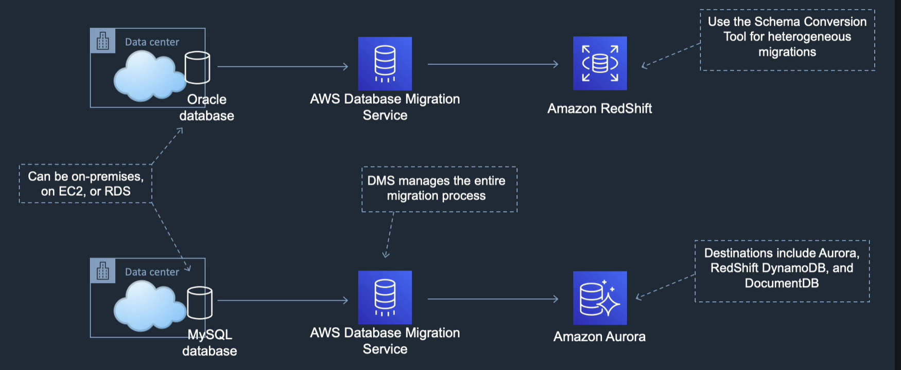
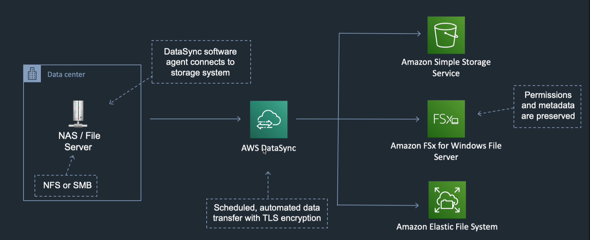
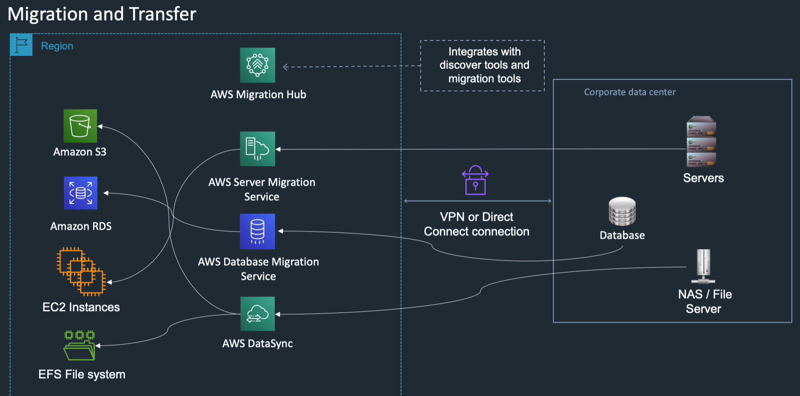

<LINK href="jb1.css" rel="stylesheet" type="text/css">

#### [Back to index](index.html)

# AWS Migration and transfer services

- [AWS Migration and transfer services](#aws-migration-and-transfer-services)
  - [Tools for migration](#tools-for-migration)
  - [VM Import Export](#vm-import-export)
  - [Database migration service](#database-migration-service)
  - [Server migration service](#server-migration-service)
  - [AWS Data Sync](#aws-data-sync)
  - [Snowball / Snowmobile](#snowball--snowmobile)
  - [AWS migration hub](#aws-migration-hub)

## Tools for migration

- AWS pricing calculator (new)
- AWS total cost of ownership calculator: looks at on prem vs cloud

## VM Import Export

- Imports virtual machines. Your on prem uses a virtualisation stack. Export to an OVA file, upload, - run CLI command to import the image, becomes an AMI, run.

## Database migration service

- Move between prem and cloud, or e.g. Oracle to Redshift.
- Source database stays on line through process.
- Final cut over.
- Schema conversion tool where different types of schema.
- Fully managed

## Server migration service

- Sources: VMWare, Hyper-V, Azure
- Install AWS Server migration service (SMS). This does automates migration, scheduled, incremental.
- Allows you to test before cutting over.
- Creates AMI for each migrated server, launch instances from these.

## AWS Data Sync

- Migrate large data sets to AWS.
- Do online: Use Direct Connect, internet or VPN.
- Source is NAS or SMB.
- Data Sync connects to source using software agent
- Schedule transfer
- Uses encryption as it goes
- Destinations: S3, Amazon SFx (windows), EFS.
- Preserves permissions and metadata

## Snowball / Snowmobile

- For large data sets from storage devices, when network link too slow. 
- VPN is public internet, so busy and slow, calculate the time. Other services will slow down.
- Direct Connect is better, but could be saturated. Takes time to get this set up, > 1 month.
- Snowball is tamper proof device to load to S3 bucket.
- Snowmobile is lorry.

- Snowball: 80Tb or 50Tb per device.
- Snowball edge: 100 Tb
- Snowmobile: 100 Petabytes

## AWS migration hub

Discover, assess, migrate

