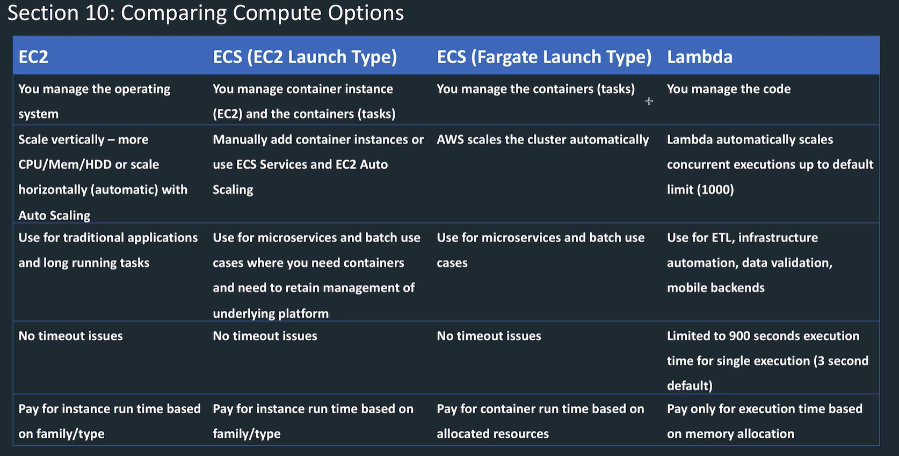

<LINK href="jb1.css" rel="stylesheet" type="text/css">

#### [Back to index](index.html)

# AWS SAA-CO2 Serverless

- [AWS SAA-CO2 Serverless](#aws-saa-co2-serverless)
  - [Basics](#basics)
  - [Lambda doc site](#lambda-doc-site)
    - [Terms](#terms)
    - [Concepts](#concepts)
    - [Concurrency](#concurrency)
    - [Invocation types](#invocation-types)
    - [Languages](#languages)
    - [setup](#setup)
  - [Use cases](#use-cases)
    - [EC2 scaling](#ec2-scaling)
  - [Notifications](#notifications)
    - [Push notifications](#push-notifications)
    - [Pull based](#pull-based)
  - [Example Lambda app image resize](#example-lambda-app-image-resize)
  - [Lambda steps](#lambda-steps)
  - [API Gateway](#api-gateway)
    - [Websocket](#websocket)
    - [RESTful APIs](#restful-apis)
  - [example dynamo db & lambda application](#example-dynamo-db--lambda-application)

## Basics

Lambda is compute service to run code as functions. Don't need to set up infrastructure

## Lambda doc site

- Invoke to respond to events (S3, SQS, DynamoDB), requests from API Gateway, AWS SDK calls from client.
- AWS manages compute float to balance memory and CPU etc.
- You can't see into compute, or customise the runtime.  
- Edit code on console, deploy with .zip. or deploy container.

### Terms

- Functions: basic unit
- Qualifier: version and alias for a function, e.g. func:1, func: BLUE
- Layer: .zip archive with libraries, other dependencies. Share between functions. Don't use with containers.
- Runtime: language specific environment.
- Extensions: custom tool integration, separate process invoked first, runs in parallel.
- Event: the JSON input data for the function
- Concurrency: number of processes running at one time to run process requests to your function.
- Trigger: a resource that invokes a lambda function.
- Initialisation: first time a function loads to memory. Then stays available. Runs code to setup. Pay for time spent initialising.  

Triggers:

1. Event source automatically triggers Lambda
   - is an AWS service or developed app which produces events which trigger a Lambda function.
   - E.g. API Gateway, S3, Cloudwatch timer or event
1. Event source mapping where Lambda does the polling
   - setup in Lambda that reads items from a queue and invokes lambda function
   - stream based services SQS, Kinesis stream, DynamoDb stream the polling is on the Lambda side

### Concepts

- Scales by running additional instances
- Instance when alive can run one invocation, then waits for next.
- Use local storage in /tmp
- Store state in other services, don't rely on instances being long lived.
- Use class level object to increase performance
- event sources maintain the mapping (e.g. S3), except for stream based services where the config is on the Lambda side and Lambda does polling (.e.g. Kenesis, DynamoDB)

### Concurrency

Set a concurrency limit. Default quota of 1000 concurrent for a region for an account  
Set reserved concurrency for each function to limit the amount of your account concurrency each function can take  

Use provisioned concurrency where initialisation is expensive or low latency required.

### Invocation types

- Synchronous: wait for the function response before continuing. Can be returned an error and retry.
- Asynchronous: queue event for function, return immediate response. Lambda handles retries, configure this or use failed queue.
- Event source queue: Batch invocation, sends multiple events from e.g. DynamoDB queue to Lambda as batch.

### Languages

- Node JS
- .NET C#
- Java 8
- Python
- Ruby
- Go
- Powershell

Limits on memory size, layers, payload size, storage etc.

### setup

Choose an IAM role

Events: Lambda polls (DynamoDB, ), or services poll lambda (S3)

Set memory, allocates CPU proportionately

Set timeout 3s to 15 mins.

If go high memory then goes multi thread

Concurrency:  default limit 1000 per account, limit per function

Billed for the duration and memory.
Logs: start, end, report

## Use cases

- Iaas - EC2
- Caas - containers (ECS)
- FaaS - lambda

- EC2 good for custom code or big packages
- Vendor packages gradually moving to containers.
- Lambda good for custom code.

### EC2 scaling

- Horizontal scaling: more machines
- Vertical scaling: more CPU / mem / disk. Taller machine.

## Notifications

### Push notifications

### Pull based

Lambda does the polling of the other services

## Example Lambda app image resize

>aws lambda create-function --function-name CreateThumbnail --zip-file fileb://function.zip --handler index.handler --runtime nodejs12.x --timeout 10 --memory-size 1024 --role arn:aws:iam::205850140633:role/jb-lambda-S3-role \
> --cli-binary-format raw-in-base64-out \
>
>
>aws lambda invoke \
> --function-name CreateThumbnail \
> --invocation-type Event \
> --payload file://inputFile.txt \
> --cli-binary-format raw-in-base64-out \
> outputfile.txt

## Lambda steps

- Set up policy to read write to S3 and logs
- Set up role
- attach the policy
- set up trust relationship so lambda service can assume the role
- package the software to a zip file
- aws Lambda create-function to upload a function, give the function rights to assume the role
- aws Lambda invoke to run
- aws lambda create-event-source-mapping: create the polling event.
- look at the logs

Layers contain the libraries, custom runtime, dependencies you need to run the code

Function display show the resources it has access to.

Use AWS server application model (SAM) to deploy and manage Lambda functions.

Automate release process using AWS codePipeline and AWS CodeDeploy

AWS x-ray for lambda tracing.

## API Gateway

- AWS service for creating, publishing, maintaining, securing REST and websocket apis at any scale.
- HTTP based, stateless client server comms via REST, implement standard HTTP methods GET, POST, PUT, PATCH, DELETE.
- Scales for any number of API calls.
- Pay based on number of calls and volume of data transferred out.
- Only HTTPS

- Handles multiple versions
- Monitor in cloudwatch (or cloudtrail)
- Uses edge locations on cloudfront
- Optionally set to require authorisation.
- Can use AWS signature version 4 (access and secret keys) or Lambda Authorisers (use a bearer token e.g. OAuth) and return IAM policies which are used to authorise the request.
- costs decrease as scale goes up
- Route requests to private resources in your VPC behind private ALBs.
- Set throttling rules based on calls per second to each method.
- API endpoint types can be edge, regional, or private.

### Websocket

Real time 2 way comms e.g. chat apps, streaming dashboards. Persistent connection between client and server.

### RESTful APIs

- HTTP API: simpler, cheaper, good where only need API proxy functions (ie call Lambda or other endpoint with parameters). Basically just a pass through to the HTTP call on the ALB / Lambda.
- REST API: If need API proxy and API management features, use REST api. REST method is a resource and a method, e.g. /income & POST could mean add info to the users income. The integration requests is what the API Gateway sends to other resources, e.g. pass to DynamoDB with action, role, policies, transformation. Integration response back to API Gateway, then responds to client.

## example dynamo db & lambda application

Stream based services: Dynamo FB, Kenesis, SQS: lambda need to poll these services, not respond to events from them.

Look at the dynamo db example
