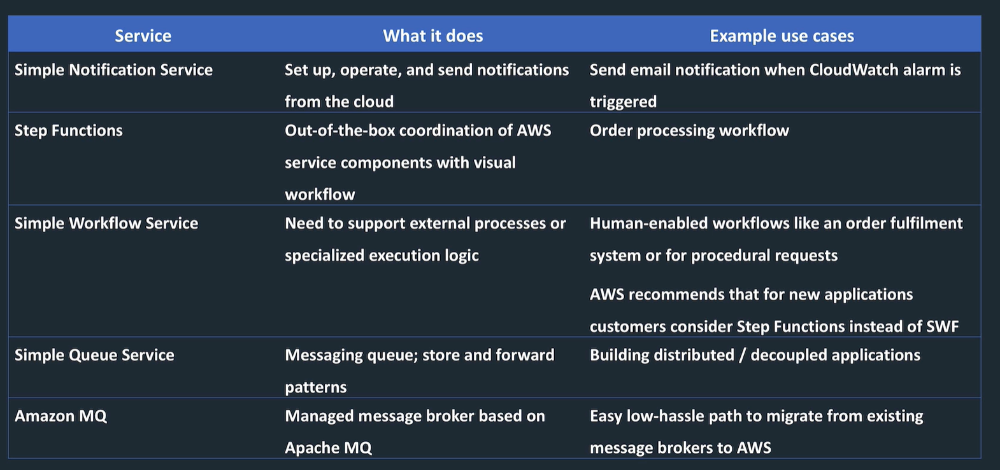
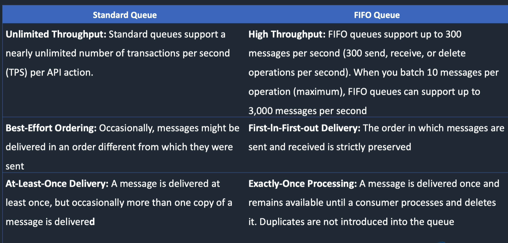
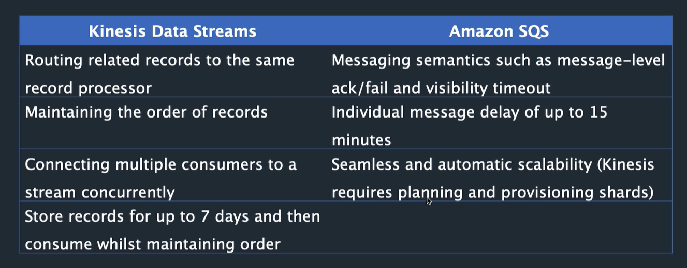
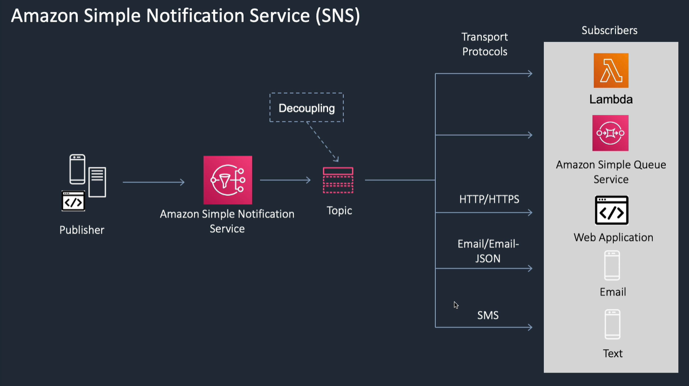

<LINK href="jb1.css" rel="stylesheet" type="text/css">

#### [Back to index](index.html)

# AWS Application integration SQS, SNS, Step, MQ

- [AWS Application integration SQS, SNS, Step, MQ](#aws-application-integration-sqs-sns-step-mq)
  - [Summary](#summary)
    - [SQS example cases](#sqs-example-cases)
  - [SQS](#sqs)
    - [SQS Queue types](#sqs-queue-types)
    - [SQS vs Kinesis Data streams](#sqs-vs-kinesis-data-streams)
    - [SQS queue flags](#sqs-queue-flags)
    - [SQS extended client library for java](#sqs-extended-client-library-for-java)
    - [Lambda call](#lambda-call)
  - [Simple notification service (SNS)](#simple-notification-service-sns)
  - [Step functions](#step-functions)
  - [Simple Workflow Service (SWF)](#simple-workflow-service-swf)
  - [Amazon MQ](#amazon-mq)

## Summary

- Step functions are new recommended thing in place os Simple Workflow service
- SQS lots of questions. Good for decoupling with a queue
- AWS MQ is similar but uses Apache MQ

### SQS example cases

- decoupling applications. e.g. front end and back end as 2 processes separated by SQS.
- use before EC2 auto scaling group, scale based on SQS message queue length

## SQS

- Queue is temporary storage to hold messages from one component before being processed by another.
- Acts as a buffer to decouple components
- Good where producer producing work quicker than consumer can process
- Also good where intermittent connection
- Loose coupling.
- Pull based, not push, so consumers are polling.
- Messages < 256kb, 1 min to 14 days, default 4 days.
- cli, e.g. AWS SQS create-queue
- basically you poll and consumer needs to delete messages
- Max message size 256Kb
- Scale by adding more queues
- Scale EC2 autoscaling by length of SQS queue

### SQS Queue types

- Standard queue Guarantees messages processed at least once.
- standard queue not guaranteed in order except FIFO queue
- standard may deliver moe than once, FIFO is exactly once
- FIFO doesn't allow duplicates, need to supply unique key, deduplication id. 5 mins interval. Plus message group id identifies a group for FIFO.

### SQS vs Kinesis Data streams

### SQS queue flags

- Dead letter queue is to handle message failure, put things not processed successfully into here, e.g. when receive count > 3 for a message move to DL queue automatically. This is a flag on a standard queue.
- Delay queue is a flag on a queue. Set a duration, messages added are not visible until after this delay. Can apply to queue, or at message level when put in queue. Max 900 secs.
- Visibility timeout: tim that message is invisible after message picked up. if consumer fails, want the message to still exist, but message goes invisible for a time. Could result in same message delivered twice.
- Long polling vs short polling: short polling is immediate response but not all servers queried. Long polling only returns when it finds a message. Cheaper because less API calls which are chargeable. Use WaitTimeSeconds.

### SQS extended client library for java

- Messages can include a reference to an object in an S3 bucket.
- Allows for large messages.

### Lambda call

- Lambda needs to poll the SQS queue.
- Role needs a policy to execute SQS polling

## Simple notification service (SNS)

- Publisher subscriber
- Send a message to a topic
- SNS delivers message over various means to subscribers
- Good for many to many messaging
- Good for decoupling
- Topics are access points to get identical copies of the same message
- Transports can be email, SMS, http etc
- Subscribers can be Lambda, SQS, web app, email, text
- Producer sends one message to SNS topic, each subscriber will get the message.
- Subscribers can filter.

SNS + SQS fan out: one topic, multiple SQS queues subscribe to all get the message

## Step functions

- State machine with graphical interface
- Does coordinated workflows, orchestration service.
- Good for combining Lambda
- Also does long running workflows needing human interaction
- can link lambda with output -> input, or branch, or e.g. wait for email response
- More recent than SWF

## Simple Workflow Service (SWF)

- Web service to coordinate work across AWS services
- main use case is where human interactions needed - but step functions more recent.
- processes get tasks and return results, SWF coordinates

## Amazon MQ

- Uses Apache MQ,
- good where on prem uses MQ.
- Priced based on instance sizes
- SQS is better because serverless, so priced based on number of requests.
