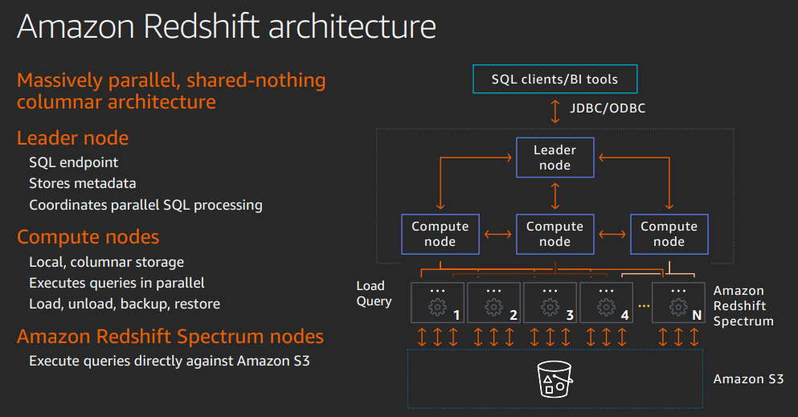
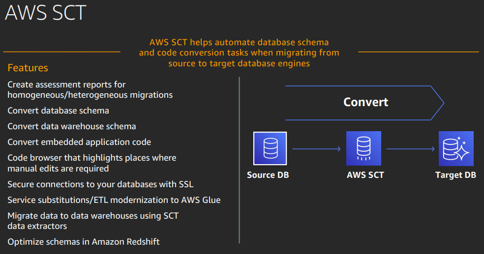

<LINK href="jb1.css" rel="stylesheet" type="text/css">

#### [Back to index](index.html)

# AWS data analysis approaches

- [AWS data analysis approaches](#aws-data-analysis-approaches)
  - [What you need to build a modern data lake](#what-you-need-to-build-a-modern-data-lake)
    - [History](#history)
    - [Needs](#needs)
    - [Definition](#definition)
    - [Solutions](#solutions)
    - [AWS solution](#aws-solution)
    - [Demo](#demo)
  - [Building](#building)
    - [S3 choices](#s3-choices)
    - [AWS lake formation](#aws-lake-formation)
  - [Move to managed database](#move-to-managed-database)
    - [Migration tools](#migration-tools)
  - [Modernise your data warehouse](#modernise-your-data-warehouse)
    - [Amazon Redshift](#amazon-redshift)
    - [Terminology / Concepts](#terminology--concepts)
    - [Tools](#tools)
  - [Streaming and real time analytics](#streaming-and-real-time-analytics)
    - [Streaming Principles](#streaming-principles)
    - [Amazon Kenesis](#amazon-kenesis)
    - [Amazon Quicksights](#amazon-quicksights)
    - [Video streaming](#video-streaming)

## What you need to build a modern data lake

Goal is to make data widely available.

### History

SQL. Slows down when reporting.
Lots of data outside of database hard to report on.
Hadoop for this data.
But them more and more data.
Need to analyse data at higher speed, and more data.
Multiple languages used, people using various tools.

### Needs

- catalogue what's there
- version it
- handle different sources
- allow many applications and tools
- allow many people
- anaylsis and reporting

### Definition

Data lakes is a centralised repository with a catalogue. Allows for self service and reporting. Easy plug in of analytical engines.

### Solutions

Possible to have an open source solution, but need lots of tools and open source. Apache, hadoop, hive etc. Many tools, hard to manage. Hard to update, security hard, cluster is mainly idle, no time to experiment.

Cloud is a better solution. Serverless. Some are open source, some are open source managed by AWS.

### AWS solution

Easy to build on AWS: S3 for storage.  

Only pay for storage, and compute when you use it.  

Flexible pricing tiers, so e.g. use intelligent tiering so you can automatically move to data a cheaper tier if you don't access it for a month.  

Security: lots of facilities for compliance, don't need to build yourself.  

Comprehensive set of services: storage, analysis, data transformation and loading. Mainly based on open standards or open source, so that makes it easy away from AWS.  

!

### Demo

- use the "AWS Lake Formation" tool
- Crawler to go through files and work out if all consistent, make sense of the data and interpret.  e.g. CSV or JSON. Imports data into a table, works out columns etc. Can schedule and adapts schema.
- Can then run SQL directly on files without ingesting the data.

Amazon EMR: hadoop based automatic scaling  
Amazon Redshift: warehousing  
Amazon Glue: transformation  
Amazon Athena: queries  

## Building

1. choose storage platform based on ingestion
2. ingest
3. store
4. analysis

Pipeline architecture: start in raw data in S3, use amazon glue or EMR

### S3 choices

- standard
- glacier
- auto tier

Use object tagging to flag data to apply secuity policy, archiving.  
Batch operations  

### AWS lake formation

one stop shop for easy data lake.  
Transforms, catalogues, enforces security, provides self service access to data.

## Move to managed database

Amazon RDS: move without changing applications. Reduce admin, get better performance. scalability, security.  

- Amazon Aurora: free relational. MySQL
- Amazon RDS: Paid relational (SQL Server, Oracle)
- Amazon Document DB: non relational, MongoDB
- Amazon Keyspaces: Cassandra
- Amazon Elasticache: Redis, Memcached.

### Migration tools

AWS databates nmigration services (DMS) - to move data.
Schema conversion tools (SCT)  to go from one db to another - to move schema. Not 100% but simpler.  
DMS can do replication. E.g. take an SQL backup, migrate, then apply more recent transaction logs.  
Database freedom program to move from in house to AWS quickly, scale up and down cheaply.  

## Modernise your data warehouse

Issues:

- exponential growth
- insights needed
- migration has lots of benefits

### Amazon Redshift

A technical platform to store data with various facilities and capabilities.

Allows data warehouse and data lake interactions

Business data in data warehouse, structured, relatively static. Complex analytic queries.  
Data lake for event data, allows data in multiple formats, less structured.  

Developed on Postgres SQL, added OLAP.

### Terminology / Concepts

Lots of concepts to store data in appropriate configuration  

- Columnar storage: not row storage. This makes it fast for specific columns.
- Compression: 2-4 times compression so cheaper. Better IO performance. Different compression types by column.
- Blocks: large unit read in query
- Zone maps: eliminate unneccesary IO by storing block metadata.
- Sorting: rows in order defined in DDL. Allows less blocks to be read. Less IO.
- Slices: data distributed through the cluster.
- Nodes: large unit of storage

### Tools

## Streaming and real time analytics

- e.g. fortnite, all real time data to Amazon kenesis.
- High speed data creation.
- Need to get insights to sell more in game purchases.
- Value of data diminishes over time, best to analyse
- Cant wait for batch processes.

Use Data streams to react to application events

1. Ingest data as generated
2. Process data without interrupting flow
3. analyse immediately

### Streaming Principles

Process quickly  
Buffer to enable parallelization  
Use data streams for real time architecture.

Producers and consumers and decoupled.

### Amazon Kenesis

Easily collect store process anaylise in real time.

### Amazon Quicksights

End to end platform  
Integrates with ML  
Gives easy analysis tools  

### Video streaming

Feed data stream to Rekognition  
or sageMaker  
Can play back online.  

