<LINK href="jb1.css" rel="stylesheet" type="text/css">

#### [Back to index](index.html)

# AWS development lets build

- [AWS development lets build](#aws-development-lets-build)
  - [Moving wordpress to Lightsail](#moving-wordpress-to-lightsail)
    - [Facilities](#facilities)
    - [Migrating](#migrating)
    - [Content delivery netork (CDN): cache, saves images closer to end user](#content-delivery-netork-cdn-cache-saves-images-closer-to-end-user)
    - [set up custom domain](#set-up-custom-domain)
    - [target architecture](#target-architecture)
  - [Host your full-stack app on Elastic Beanstalk with a RDS database](#host-your-full-stack-app-on-elastic-beanstalk-with-a-rds-database)
    - [Services used](#services-used)
    - [RDS setup](#rds-setup)
    - [Beanstalk setup](#beanstalk-setup)
  - [Keeping your application running under load](#keeping-your-application-running-under-load)
    - [Services](#services)
    - [cpu scaling](#cpu-scaling)
    - [db scaling](#db-scaling)
  - [Maintain your web application cost (while scaling)](#maintain-your-web-application-cost-while-scaling)
    - [Scaling target architecture](#scaling-target-architecture)
    - [Compute pricing](#compute-pricing)
    - [Things to change](#things-to-change)
  - [How to add a Serverless backend and path-based routing](#how-to-add-a-serverless-backend-and-path-based-routing)
    - [serverless](#serverless)

## Moving wordpress to Lightsail

### Facilities

AWS can host on:  

- EC2 (big)
- Amazon S3 (good for simple static web sites - but doesn't support server side scripting e.g. wordpress)
- AWS Amplify Console (single page web sites, complete workflow, e.g. react.. )
- Amazon lightsail (good for server back ends, e.g. wordpress)

Lightsail

- easy to Launch
- manage on console

Lightsail instance is virtual private server.  
Choose a region near your users, choose an AZ.  
Lightsail has many click to launch operating stacks, e.g. ubuntu, linux, wordpress  
Create snapsots - as backups.  

### Migrating

- console -> lightsail -> choose region -> wordpress
- Choose plan: $5 per month
- give it a name, unique in your set
- starts, gives wordpress default page
- check bitnami instructions
- connect to wordpress: connect with SSH console on browser.
- password in special file in root.
- update wordpress and plugins as AWS not up to date
- Go to wordpress console to update
- Load the all-in-one WP migration to do the migration. Install on both. Better than the built in wordpress  migration tool.
- Export from old site: export to file. Includes users and plugins etc
- Import to lightsail
- edit php.ini to change file size limitation
- restart apache in lightsail with ctrlscript.php
- overwrites users table

### Content delivery netork (CDN): cache, saves images closer to end user

edit wp_config.php to change site_url to use SSL / cloudfront  
disable banner  

### set up custom domain

Use SSL: have a static IP.  
create SSL certificate  
Need to prove ownership. create DNS transfer info from provider that proves you've valid owner  
paste in name of cloudfront distribution  

### target architecture

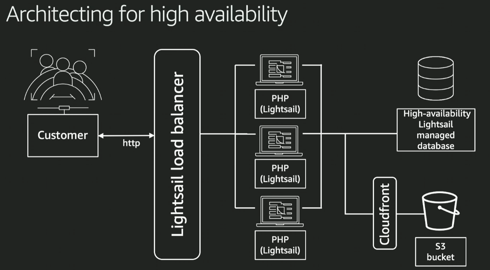
blog posts on AWS compute blog

## Host your full-stack app on Elastic Beanstalk with a RDS database

implement ML to recognise images.

### Services used

- Amazon RDS - managed database  
- Elastic beanstalk: fully managed web application hosting. INcludes load balancer, web server. Easy, low management, gateway to modernisation. Can do a/b testing etc. Supports python, ruby, docker, etc.  
- Can use EB console or CLI.  
- Rekognition: deep learning image and video analysis, e.g. object and scene detection  
- S3: image storage  

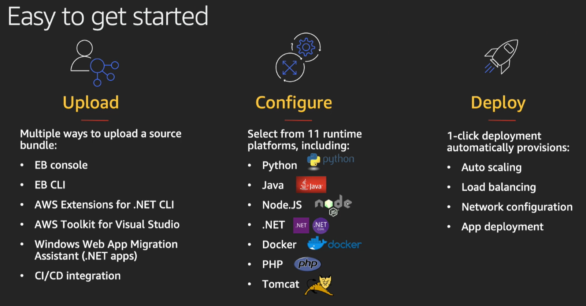

target architecture

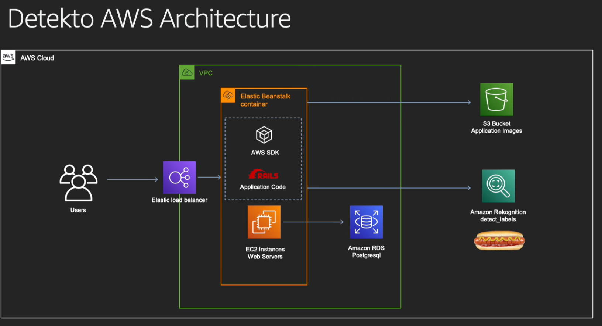

Database is inside VPC, outside of EB - because want to presist database when EB is torn down. That wipes the EB database.  

### RDS setup

- Postgres, dev settings, name, user name  
- Create security group as firewall around database  
- endpoint name, used by beanstalk.  

### Beanstalk setup

- choose linux with ruby  
- upload your code (java etc) uploaded as zip  
- Needs configuration settings  

## Keeping your application running under load

### Services

Elastic beanstalk
test scale with j-meter  

### cpu scaling

- set up alarms
- set scaling triggers to start new servers
- use larger machines - running ones shut dow, new ones start up, not coordinated.
- set time based scaling: e.g. lunchtime
- CPU credits build up with low cpu, used when heavy cpu - then run out and then the server gets bad response.
- set e.g. cpu > 50% scale up, < 20% scale down based on history of past minute
- set scaling interval to control how often it scales

### db scaling

choose scaling window - can do immediately but downtime.  

## Maintain your web application cost (while scaling)

### Scaling target architecture

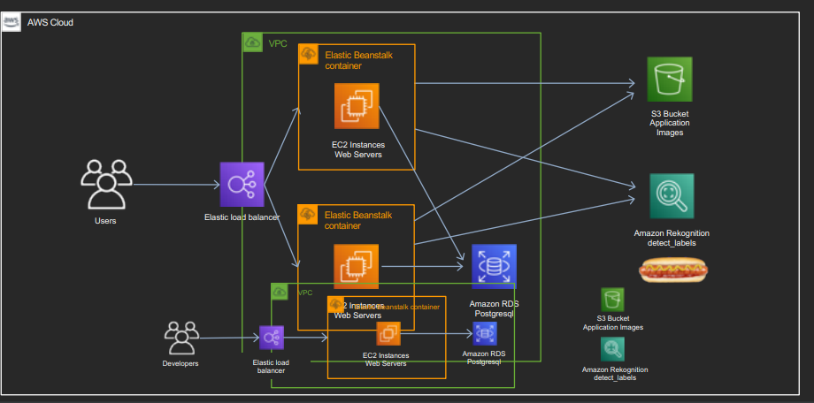

Developers have clone of environment: can save money by overlapping

### Compute pricing

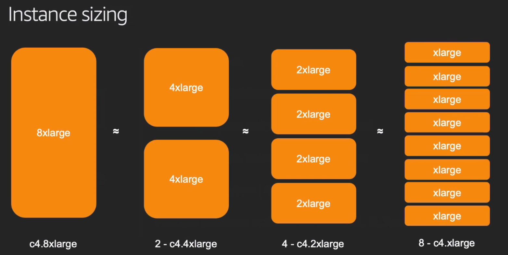

- price roughly in line with machine size.
- more smaller sized instances are more flexible, potentially cheaper.
- different processor architectures (eg ARM, intel) different costs
- Region costs are different
- Licencing costs
- spot: can be taken back at 2 mins warning.

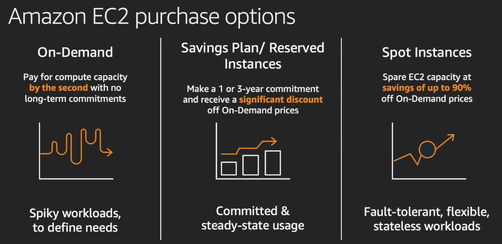

Best to combine different types:

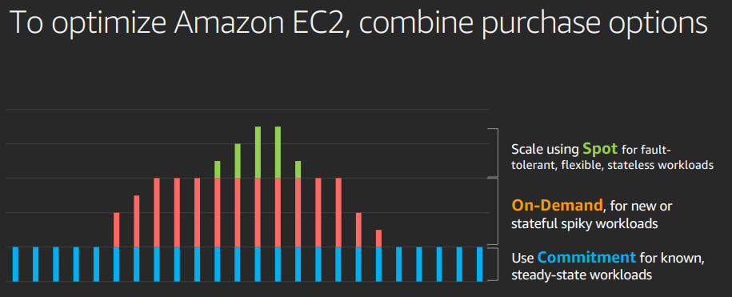

### Things to change

- RDS databases: stays for a long time. May as well use RI. 1 or 3 years, can pay upfront. Steady state.

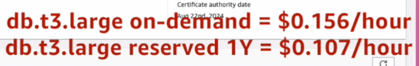

- Development environment: not used 24/7. Shut down in idle time. Use AWS instance scheduler (uses a dynamo db to set schedules etc). Saves much of the cost.
- Base instance runs as one all the time, set to smaller machine. Easier to align the correct number of machines if they're smaller.

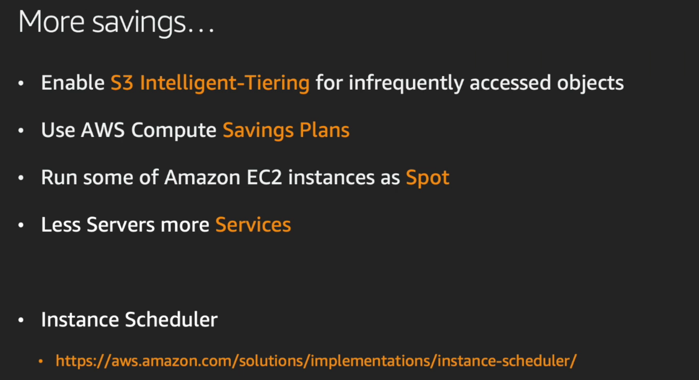

## How to add a Serverless backend and path-based routing

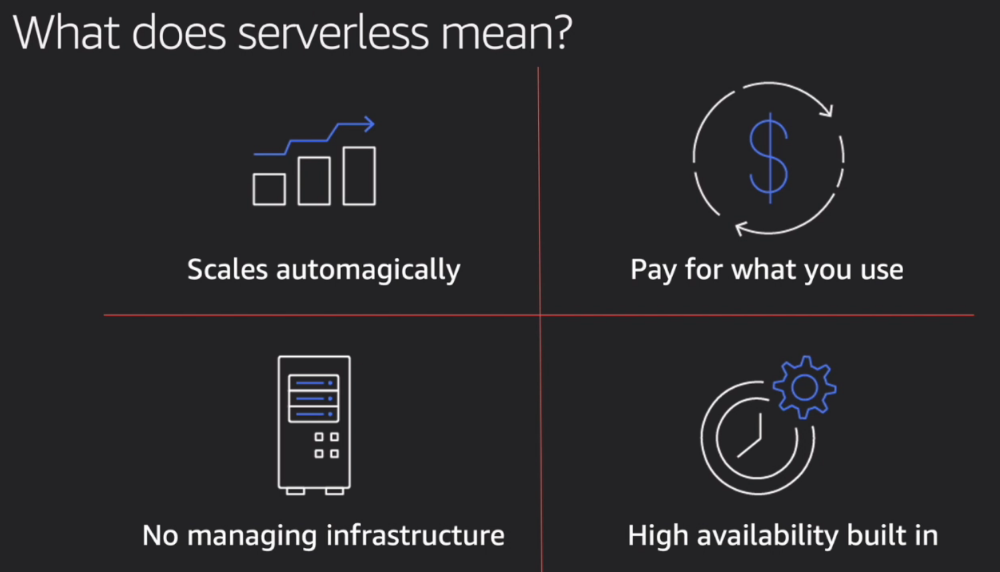

Moves operating of servers to AWS  
All scaling automatic  
Serverless is the native architecture of the cloud that enables you to shift more of your operational responsibilities to AWS, increasing your agility and innovation

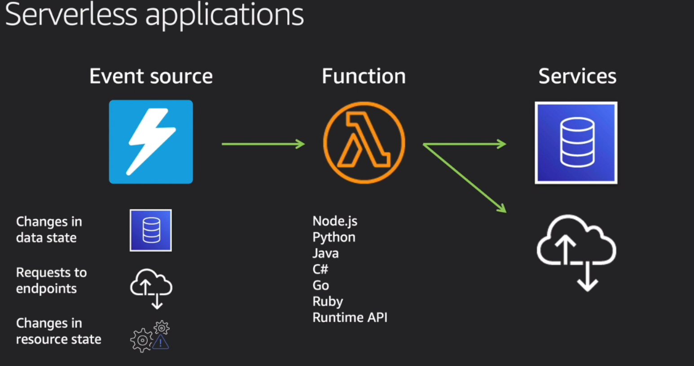

### serverless

- Event source -> function -> services
- All event driven. 
- Infrastructure as code (use SAM Yaml to define)
- e.g. event is file uploaded to S3, call function to calculate dimensions, store in DB.
- Completely stateless.
- Pay per invocation and for extended duration
- create sam file, deploy and that creates the infrastructure  

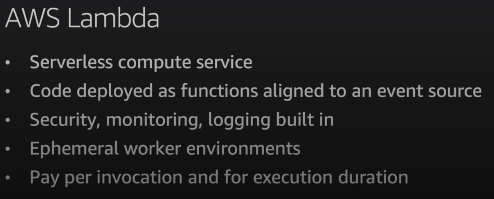

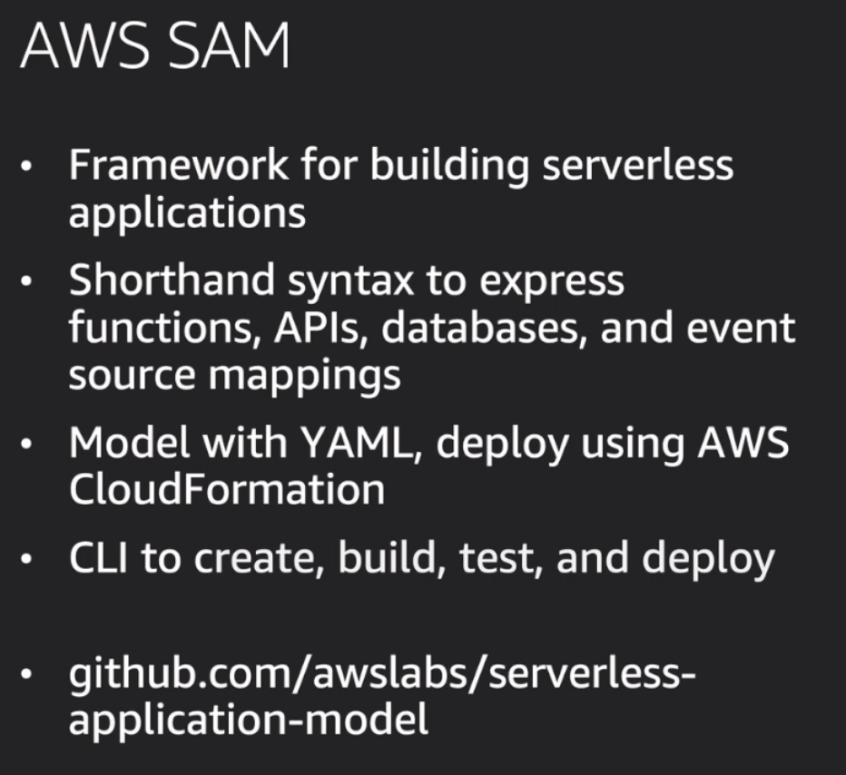

target architecture:

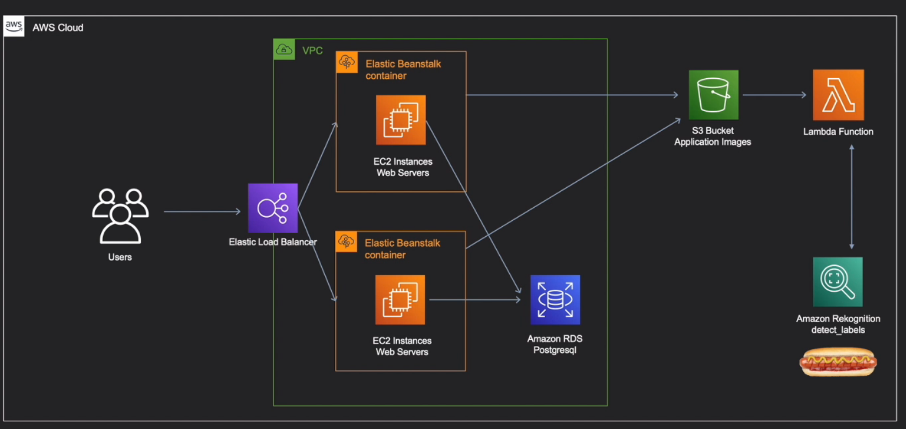
