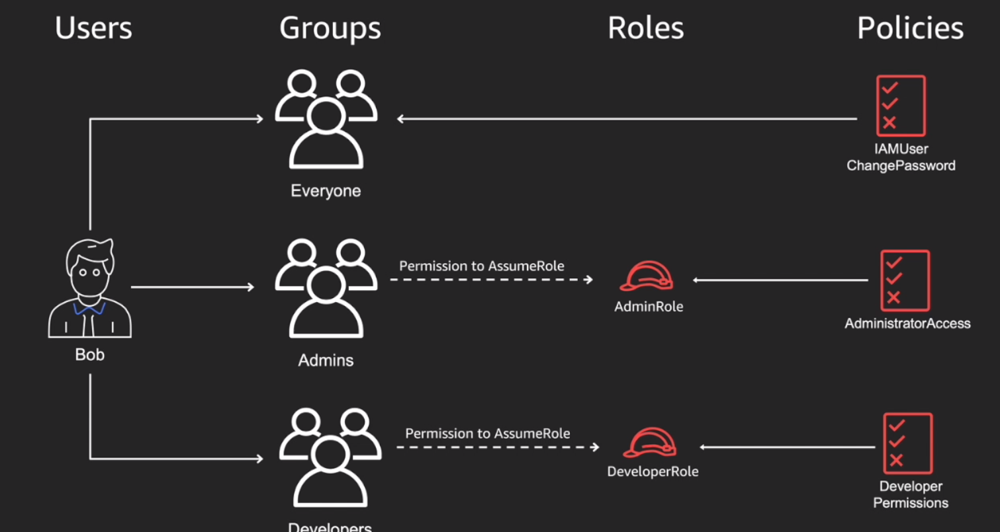
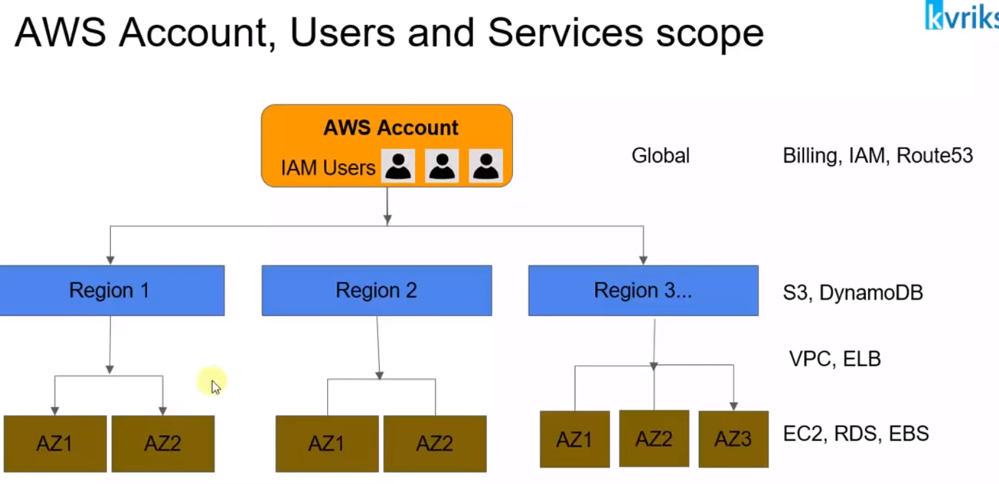
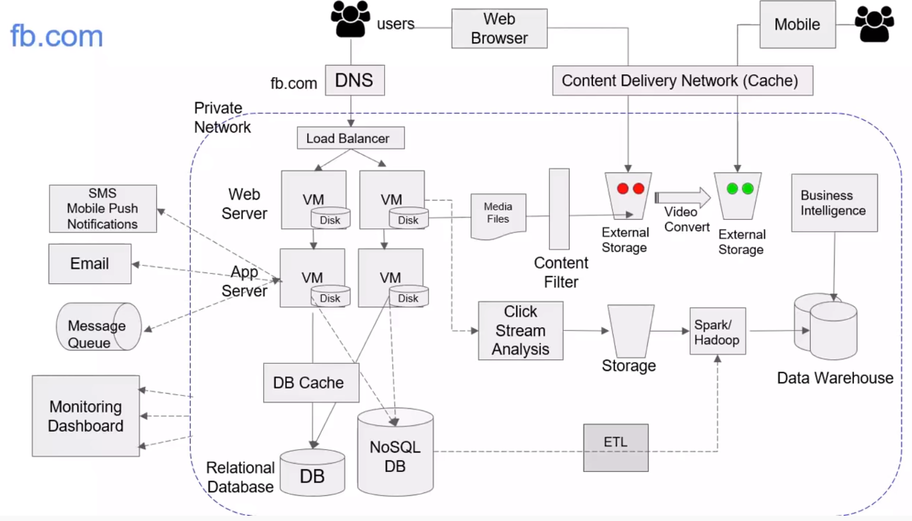
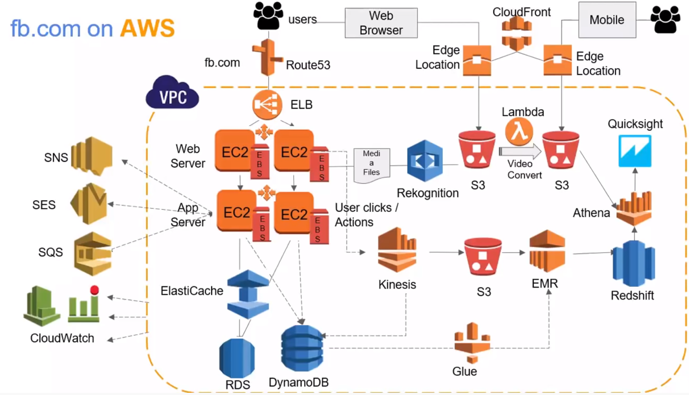
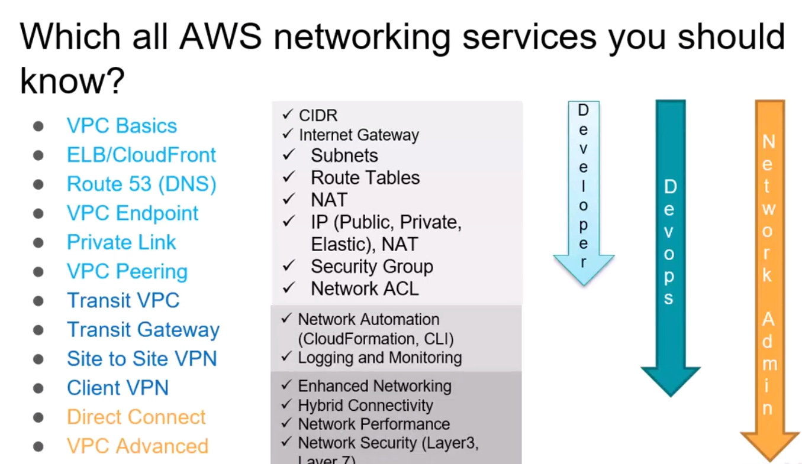

<LINK href="jb1.css" rel="stylesheet" type="text/css">

#### [Back to index](index.html)

# AWS development tools

- [AWS development tools](#aws-development-tools)
  - [setup](#setup)
    - [AWS toolkit for VS code](#aws-toolkit-for-vs-code)
    - [code sharing](#code-sharing)
    - [Security](#security)
    - [code monitoring in production](#code-monitoring-in-production)
    - [improving code](#improving-code)
  - [Infrastructure as code](#infrastructure-as-code)
    - [tools](#tools)
    - [AWS Cloud development kit (CDK)](#aws-cloud-development-kit-cdk)
  - [Role based access control](#role-based-access-control)
    - [Example](#example)
  - [AWS Services and how they work together](#aws-services-and-how-they-work-together)
    - [Facebook example architecture](#facebook-example-architecture)
    - [Implementation on AWS](#implementation-on-aws)
    - [AWS Application services to manage these and allow integration](#aws-application-services-to-manage-these-and-allow-integration)
    - [AWS Dev and Devops services](#aws-dev-and-devops-services)
    - [AWS Networking](#aws-networking)
    - [AWS Certified Cloud Practitioner](#aws-certified-cloud-practitioner)

## setup

### AWS toolkit for VS code

### code sharing

git is ok, but hard to work on the same code.  
AWS cloud9 is IDE for writing code shared. Browser based, see in real time others working.

### Security

Can use cloud9 console to block other connections for remote collaborative working.  
CI/CD pipeline: continuous integration continuous development

### code monitoring in production

- Debugging linux binary which is crashing, hard on serverless. Can use tracing to record more information than logging. Can find bottlenecks.
- Use AWS X-ray. Analyse and debug distributed applications which may be slowing things down. Service maps.
- Watch application running in production

To use,  

- import x-ray recorder, can log call capture method to save segment, but this is laborious
- better to import aws lambda power tools, set up tracer, and you're done. Records all function calls between serverless applications.
- can import json logger, do lots of formatting work, but laborious
- better to import lambda power tools, get json object logging with minimal code.

### improving code

build, review, test, deploy, measure, improve  
Amazon Codeguru: ML service to improve quality, find expensive bits of code.  

- CodeGuru reviewer, identifies hard to find bugs. Use at review stage. Like spell checker for code. Currently only java, will be python.  
- Codeguru profiler - use in build phase and measure phase.

## Infrastructure as code

### tools

yaml is easier than json, but still a problem.  
Terraform is similar to json but more readable.  
But how about using python to set up infrastructure rather than static files.  

### AWS Cloud development kit (CDK)

model infrastructure as reusable components.  
Good time saving tool.  
supports lots of languages  

## Role based access control

user / group based permissions.  
Create user, create login profile  
aws iam create-user..  
attach policy to be able to change password.  
Create a group "everyone" for multiple users  
add user to the group  
aws iam attach-group-policy  
better to attach permissions to the group.  
create "admins" group  
attach policy to this group to grant admin access  
create "developers" group  
attach a specific policy to this.  
so multiple groups with multiple iam policies.  
Then can add Bob to admins group and developers group.  
Ability to add users to groups, users inherit permissions from group.  
But this is not great because Admin access at all times.  

Principal of least privilege: should have the bare minimus privileges to perform the function and only during the time needed to perform the function.

Solution is roles based access control, not just users and groups.  
Best to make users take a specific action to escalate their privileges, so step into a role. e.g. temporarily set into an admin role.  
Give permission to the group to assume a role.  

Use the "assume role" api

### Example

- Use IAM dashboard
- Create 2 groups: admin and developers. no permissions.
- Create 2 roles: admin-role, developer-role. no permissions.
- Add policy to admin-role
- Create new policy for developers: allow all lambda actions, add all resources, call "developer serverless"
- Associate new policy with developer-role.
- Then they can list and use lambda functions.
- for the "developer" group, give them permissions to assume developer role using inline policy
- for the "admins" group, give them permissions to assume admins role using inline policy
- For admin-role, create a trust policy between the role and the user in this account.
- Add Bob to admins and developers
- When bob logs in, all he can do is change password. Minimal permissions.
- But bob can switch role join the console e.g. developer-role (use top right menu on user name)
- Now he can view Lambda functions.

To assume roles in cli:

- aws sts assume-role --role-arn ....
- get back access key, secret access key, session token..
- You can set these, and then use permissions.
- set up multiple roles in aws config to allow you to assume multiple roles.
- aws cli also has built in config to assume role in account: edit .aws/config
- Add to this file set role_arn = admin-role, set up bob-admin

Basically stop attaching policies and resources to groups, instead create roles and allow them to assume roles.  

## AWS Services and how they work together

- 20+ regions in all,
- Choose a region to deploy a service in.
- A region has 2+ availability zones.
- Edge locations and like caching devices, 160 locations. Resources cached to nearest location to help performance.
- AWS account is a top level entity, can deploy infrastructure in any region.
- Different services work at different levels: global, region, AZ.

About 130 AWS services: compute, analytics, storage, network, development, etc.

### Facebook example architecture

For example, build a facebook application, what do you need?

- Private network for security.
- Web server to give web pages.
- As gets bigger need App server to run business logic.
- 3 tier: web server to do the pages, app server to run business logic, database to store data
- Vertical scaling: increase machine capacity
- Horizontal scaling: more web servers and application servers
- In services, generally scale horizontally.
- When you have multiple web servers, you have multiple ip addresses. Need to distribute the load from users to different web servers, so use a load balancer to evenly distribute user requests.
- You don't want people to access with ip address, want a domain name, so use DNS above load balancer.
- As grow, the database becomes a bottleneck. Bring in NoSQL database for some of the data.
- Maybe RDBMS is still bottleneck, need a DB cache in front of the RDBMS. Query this frequently without hitting database.
- Storage of e.g. pictures on file storage becomes a problem: media files go to external storage.
- When you upload content, need to stop e.g. nudity, add a content filter.
- Want to capture user clicks, likes etc. Add a click stream analysis tool. That needs to store it's data somewhere.
- Need to get meaning from the click stream analysis: need spark / hadoop to perform computing on this. Need data warehouse to store the output of this, and business intelligence to analyse this.
- Want to allow users to look at storage via web browser, or access via mobile in a different format: so need a converter to allow conversion of video to different formats.
- This is heavy traffic, need a content delivery network to cache this.
- Need services for email, sms, chat via message queue.
- Need monitoring service to see how everything is performing.

### Implementation on AWS

- VPC gives you a private isolated network  
- EC2 gives VMs to run for web server or app server, Autoscaling enabled for EC2.  
- EBS (elastic block storage) for storage  
- RDS for the RDBMS, Dynamo DB for NoSql  
- Elasticache for db cache.  
- ELB for load balancing  
- Route53 for DNS.  
- S3 for file media storage  
- Rekognition for content filter.  
- Lambda service for video conversion (serverless, write code and execute when a new video arrives to convert video to other format)  
- Kinesis for click stream analysis  
- EMS for the Spark / hadoop aggregation, sorting, etc.
- Glue for extract and transform (ETL)  
- Redshift data warehouse to store analysis results  
- Amazon Quicksight or Athena for Business intelligence  
- Cloudfront to store and cache static data e.g. photos, so caches in nearest edge location  
- SNS to send SMS  
- SES to send emails  
- SQS to queues  
- Cloudwatch to monitor all services  

### AWS Application services to manage these and allow integration

API gateway to generate a RestAPI  
IAM for Access permissions between all services  
KMS to encrypt data across all EBS, S3, RDS etc.  
ACM (amazon Certificate manager) to manage certificates for access (like SSL)  
WAF: wave application firewalls to prevent attacks on your application. Deploy on cloudfront or in front of API gateways.
AWS inspector: looks for security vulnerabilities  

### AWS Dev and Devops services

Don't want to deploy by hand!  
AWS CloudFormation: auto deploy. Takes a template and creates infrastructure from scratch.  
AWS Code Commit: Repository service like Git.  
AWS CodeBuild: builds and runs unit tests, produces artifacts.  
AWS Code Deploy: puts the code artifacts into EC2 instances  
AWS CodePipeline: Devops CI / CD (continuous integration / continuous development) runs CodeCommit,    CodeBuild, CodeDeploy all automated  
AWS Codestar: like Jira and project management, issue tracking, continuous delivery.  

### AWS Networking

What you need to know:

- VPS is an isolated private cloud.
- Some components are public, some private.
- VPC needs a region. Includes  multiple availability zones.
- CIDR is the ip number inside the VPC.
- VPC has a main route table.
- Must create a subnet inside the VPC.

### AWS Certified Cloud Practitioner

https://www.youtube.com/watch?v=dUXZUAj_fCE

- Tests knowledge of business practices
- Architectural design principles
- Key services and when to use them
- not too technical
- security
- pricing
- documentation and support

Exam guide, sample questions as an amazon resource

https://d1.awsstatic.com/training-and-certification/docs-cloud-practitioner/AWS-Certified-Cloud-Practioner_Sample_Questions_v1.1_FINAL.PDF

https://d1.awsstatic.com/training-and-certification/Docs%20-%20Cloud%20Practitioner/AWS%20Certified%20Cloud%20Practitioner_Exam_Guide_v1.4_FINAL.PDF

register at www.aws.training

No penalty for incorrect answers
Look at aws web site, documentation, forums.

Whitepapers: overview of services, architecting for the cloud, aws support plans etc.

https://www.aws.training/Details/Curriculum?id=27076
