<LINK href="jb1.css" rel="stylesheet" type="text/css">

#### [Back to index](index.html)

# AWS emerging technologies

- [AWS emerging technologies](#aws-emerging-technologies)
  - [AWS reinforcement learning](#aws-reinforcement-learning)
  - [AWS IOT](#aws-iot)
  - [AWS IOT at the Edge](#aws-iot-at-the-edge)
    - [limitations](#limitations)

## AWS reinforcement learning

AWS deepRacer has sensors, ranging sensors, stereo cameras. 3D simulator, community races.

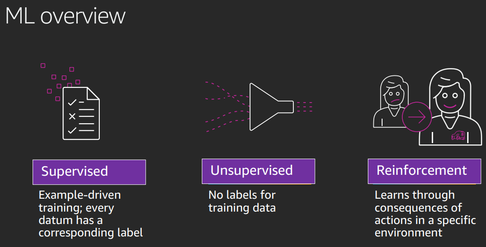

Supervised: data has labels
Unsupervised: no explicit lables.
Reinforcement: learn through outcome of action

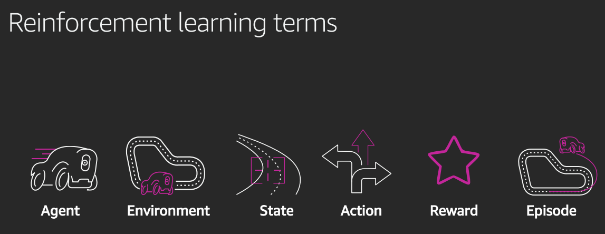

Aim is to optimise the reward function. 

Agent does the action
Agent works in an Environment
current State
Action can be rewarded or negative reward.
Reward given by the envronment by the reward function
Episode is an iteration from start to termination state.

State is current square.
Reward function is logic which looks at next state. 
Iterates to test the reward function to build up knowledge. 
Higher reward for the centre line.
If explore too much, no convergence. too little and convergence not good. 
policy function to expect the next outcome
Aiming for max cumulative rewards

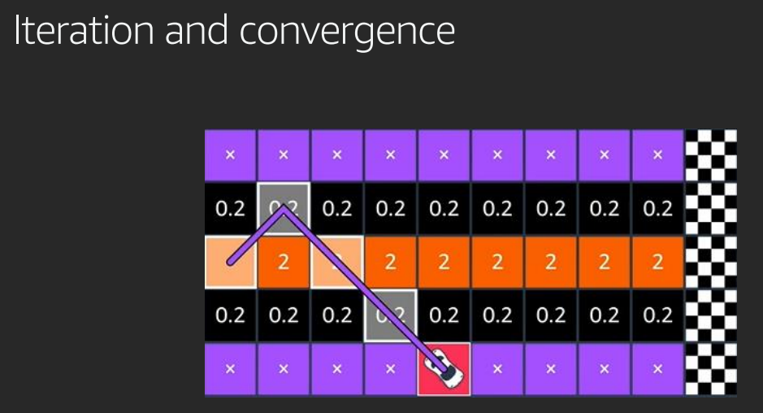

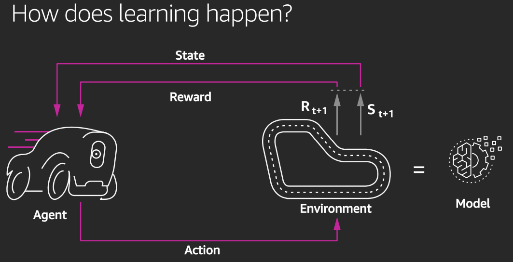

Can't explore all states, so need to approximate: policy optimisation. Use gradient descent. 
Uses Policy proxy optimisation, PPO. 
Set hyperparameters, e.g. entropy, number of epochs.

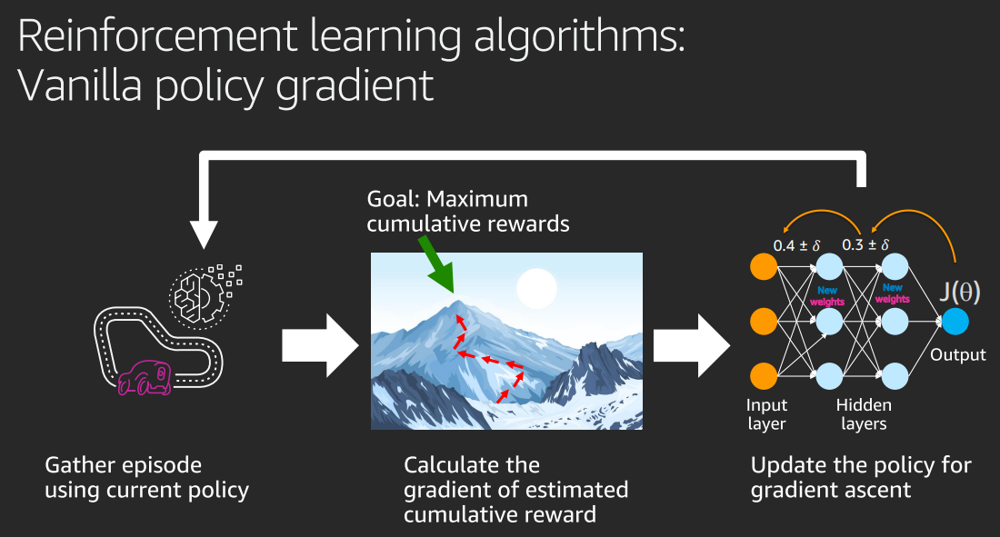

Input layer and feature layers, neural network. 
Weights are adjusted to optimise. 

Go to AWS deep racer, some learning resources there. 

## AWS IOT

Know the state of everything!
products that get better with time because can update. 
Understand what customers want. 
Operational efficiency: manufacturing, processes, moving to data driven. 

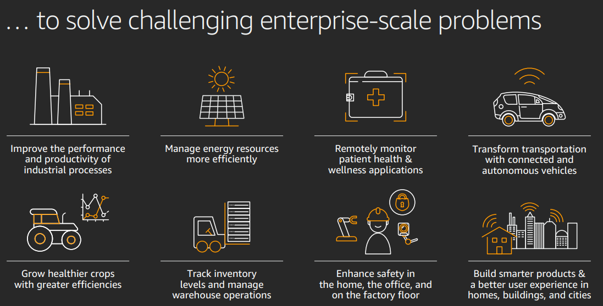

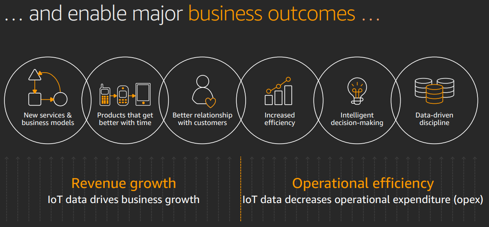

General process: Change what you build, then change how you operate, then change yout market economics. 
e.g. sell a service based on data

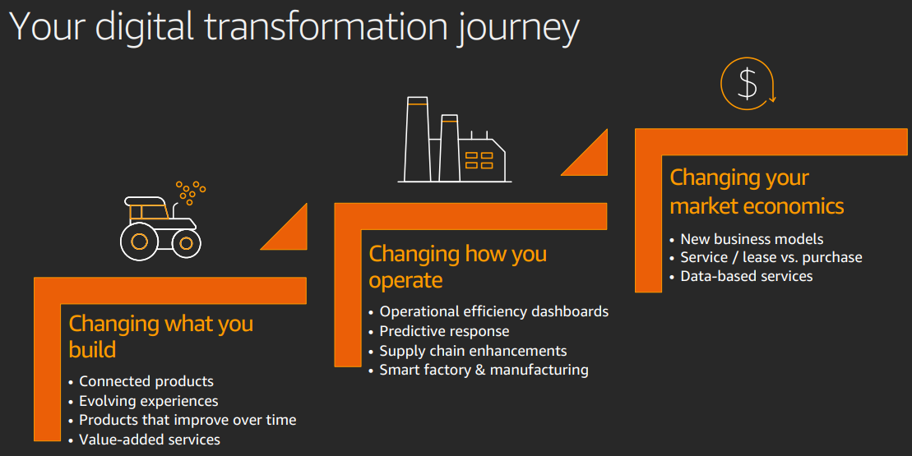

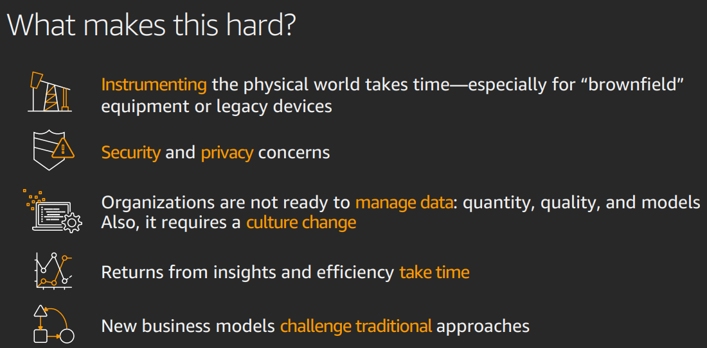

Need to start with the building blocks. Get data sorted. Put it in a data lake. 

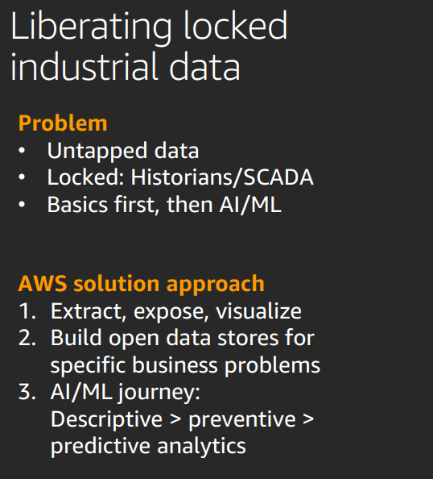

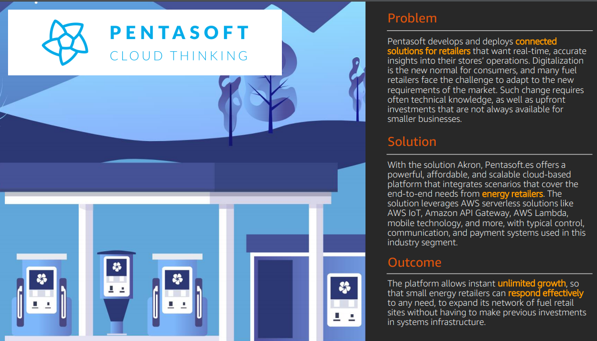

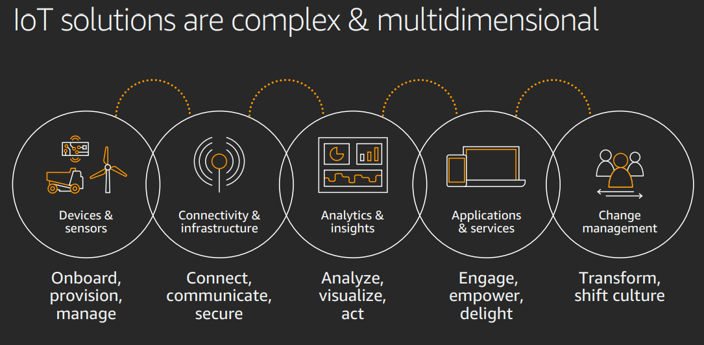

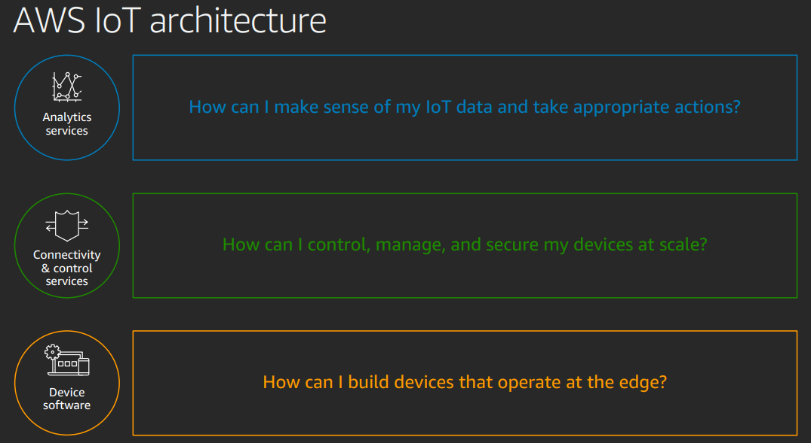

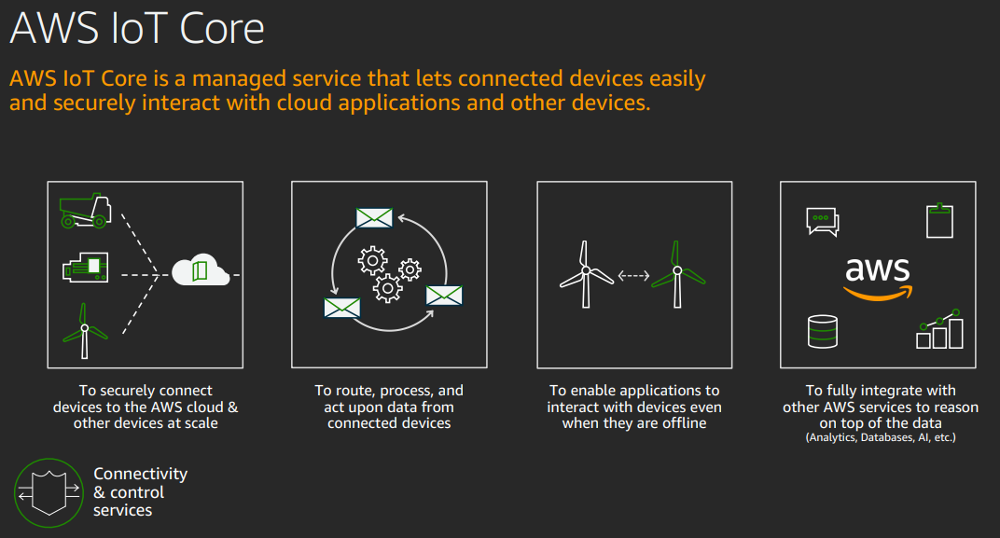

AWS IOT core: does basic connectivity to cloud: connect, secure, scale. Route, rules. Allows to integrate with other services. SDK to extend. Rules engine to filter the information coming from IoT, or respond to events. 

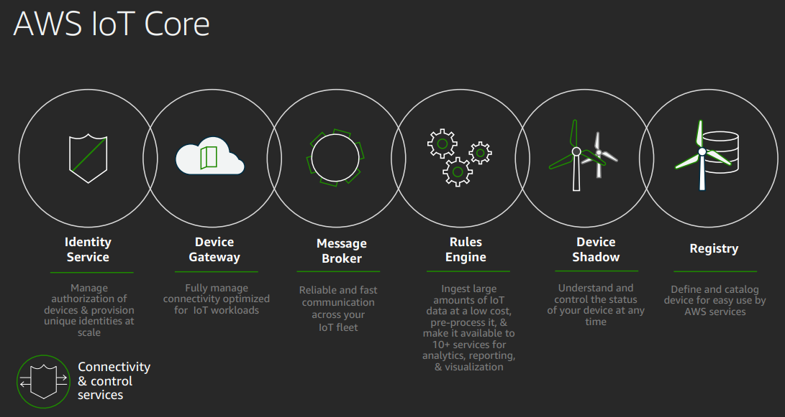

Take a look at AWS IoT Solutions for examples. 
25 free AWS courses for IOT

## AWS IOT at the Edge

All sorts of smart devices. 75 billion by 20205. Challenge to manage and control these. 
Powered by embedded controllers (simple low power, common and cheap. ESP32 is common)
Or by microprocessors (bigger, CPU & storage, software). Used in cameras, rapserry pi, industrial plants, cars. 

Lots of data produced. Needd to send to the cloud, filter, preprocess, store, analyse. 

### limitations

Physics: connectivity not available everywhere (e.g. underwater, flight), speed of data transfer means some decisions need to be amde localley e.g. cars
Economics: Huge amount of data, maybe to better process locally and send limited to cloud.
Legal: privacy needs to be taken into account.

Decide where to process data local vs cloud.

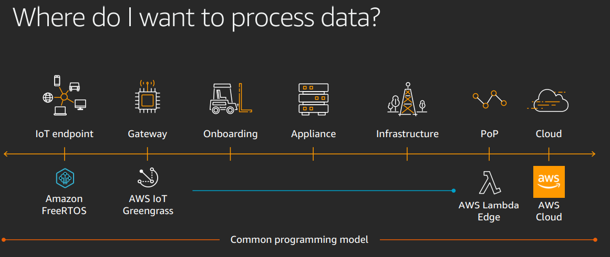

Cloud is cheapest and most available cpu power, not really available at the edge. 
RTOS: microcrontroller op system. 
AWS IOT Greengrass for microprocessors, or AWS IOT SDKs to provide connection between AWS and your own software.

Economics: Hardware means can update the functionality, and also collect customer data. Allows more operational efficiency and heads towards data driven business. 

Feedback loop: device software -> connectivity and control services -> analytics software -> updates to device software. 

AWS facilities to do the connectivity, and you do the business logic.

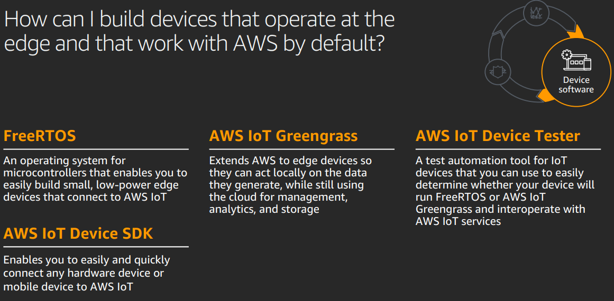

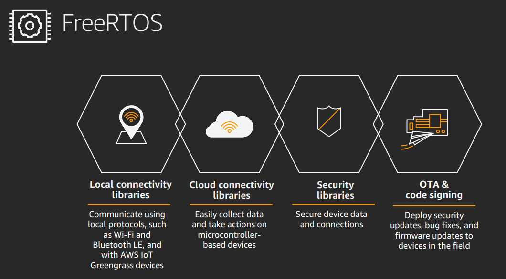

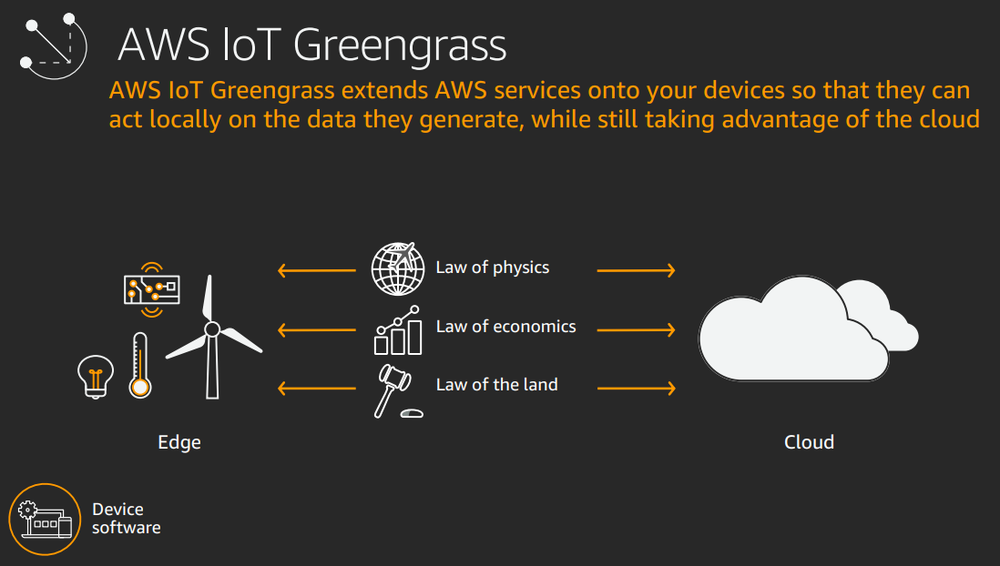

FreeRtos: low power, over teh air updates. Send data somewhere else to process it.  
Greengrass: Brings cloud capabilities to the edge. Means can process locally to meet the limitations. Allows reconnection, TLS security, local lambda functions etc. All kinds of connectors. ML inference. Container support (docker).

Machine learning inference: perform locally. Train in the cloud, deploy to the Edge by deploying to your device. Send data back to improve accuracy.  

