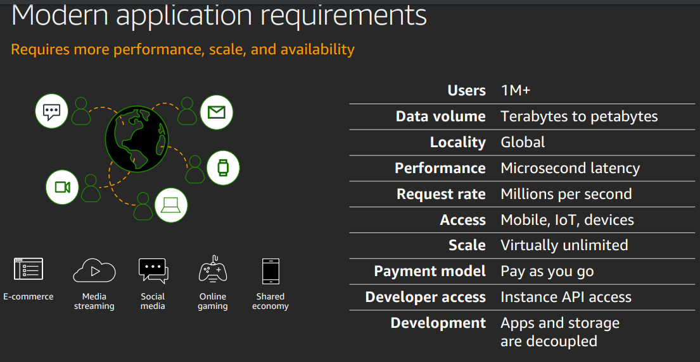
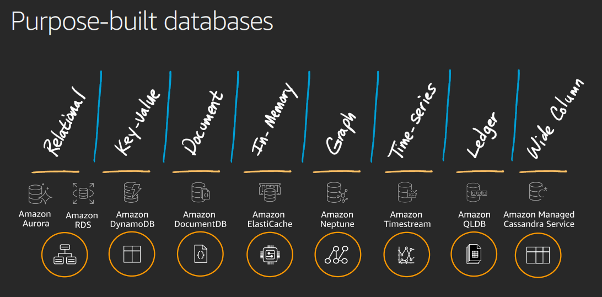
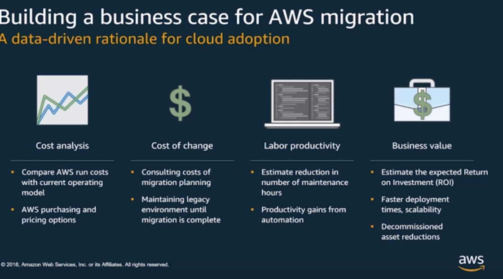
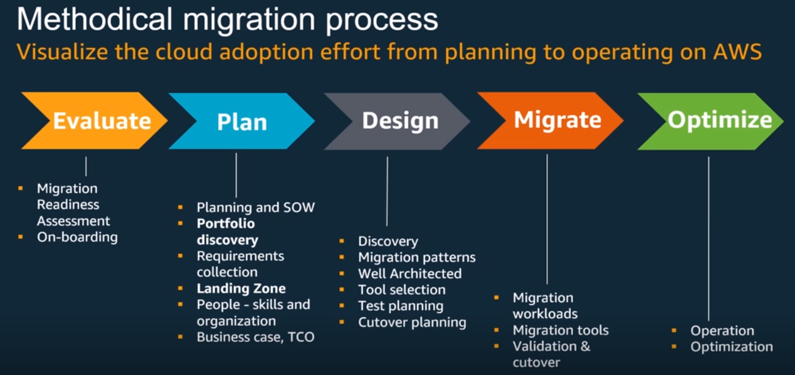
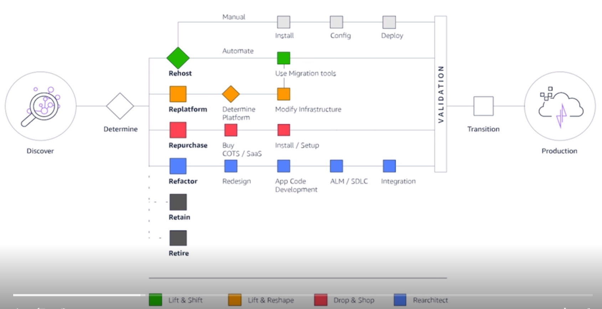
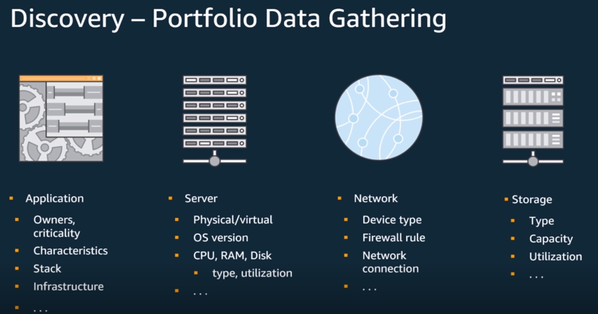
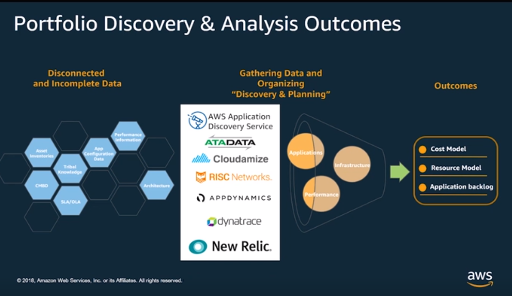
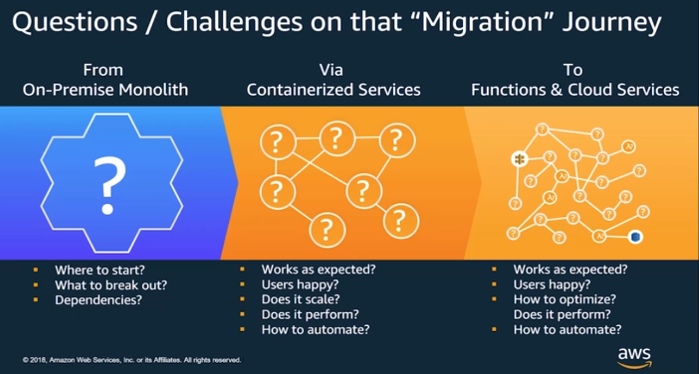

<LINK href="jb1.css" rel="stylesheet" type="text/css">

#### [Back to index](index.html)

# AWS Modern Applications

- [AWS Modern Applications](#aws-modern-applications)
  - [Purpose build Databases](#purpose-build-databases)
    - [Aurora](#aurora)
    - [Dynamo DB](#dynamo-db)
    - [Document DB](#document-db)
    - [Elasticache](#elasticache)
    - [Neptune](#neptune)
  - [Timestream](#timestream)
    - [Quantum ledger database](#quantum-ledger-database)
    - [Cassandra](#cassandra)
  - [Migrating to AWS](#migrating-to-aws)
    - [Building a business case](#building-a-business-case)

## Purpose build Databases

Easy to go to large scale on a pay as you go basis.  
Applications separate from storage, different tiers.  
Enormous scale for e.g. amazon prime day.  
Purpose built.  
Modern apps need purpose built database.  

Choices:

1. monolithic executable.
2. Half way step is SOA: service orientated architecture. But need service bus to orchestrate.
3. Microservices: break components into services, purpose built for individual service. Different language, choice over everything. Everything called over Http with APIs, so loosely coupled.  

Relational has scaling limitations. Dynamo DB came from this. Cassandra, Mongo etc flavours of non SQL.

Purpose built gives scale, performance, availability: specific to each individual purpose, not SQL as only way of doing everything.  
100s of choices. CHoose the right technology for the job.

### Aurora

MySQL relational for the cloud. Storage based on writing to db logs, reading from file system. Good at relational operations at large scale. E.g. write to oregon node, replicate to Singapore in small time lag so can do local reads there.  

### Dynamo DB

Key value, scalable. Flat linear scaling for object retrieval that you can't do with relational.

### Document DB

Mongo DB compatible. Emulates Mongo DB apis, so easy to shift. Mongo is hard to scale up and down, but Document DB is easy.

### Elasticache

In memory data store. memcached: store stream, get it out. Redis: things like counters and publish / subscribe, and has more functions to control way data comes back. Put cache in front of relational database to handle the read only part of access, protect it.

### Neptune

Graph database. e.g. You, friends, their friends, posts, comments etc. QUite a complex graph. Could be purchasing patterns, or Fraud where looking for similar addresses. Query many relationships very fast, better than relational for these queries.

## Timestream

Time is hard in RDS. e.g. manufacturing plant, oil refinery with pressure sensors. Want to see when pressure goes out of range, but also look for trends over time. Timestream does this.

### Quantum ledger database

Fully managed ledger database. verify history. Immutable and transparent. History can't be deleted or modified, fully audited. Chained, like blockchain.

### Cassandra

wide column database. Implemented cassandra APIs.

## Migrating to AWS

### Building a business case

AWS run cost tool.  
Only use what you need, optimise.  

Evaluate: is the cloud the right choice.
Plan: portfolio, data. Discovery tools to understand workloads.  

Tools for plan: get high level metrics, understand data flows between server and client. Planning and discovery phase.  

AWS application discovery service is a tool to understand your current stack. Dynatrace another tool.
Migrate the data, make AWS the live copy, redirect the reads.

Re-host: lift and shift. VM image, least invasive.  

Re-platform: e.g. move from self hosted db to AWS MySql. Containerize an application, e.g. docker, move to AWS. Use containers because this accelerates development cycle: dev and build base image, share dependencies. More people developing on the same app.  

Migration landing zone: tool to help migration, shows you what it should look like post migration.  

Automation is necessary from developer process to deployment, promote from one environment to the next environment. Confidence that an application is working as it migrates through the process.  

Containerize the application is the first step, and migrate. Next step is to quickly iterate to improve. Now operate and optimise. Use the AwS tools to understand the performance, track metrics, improve interactions. Plan to have metrics in place. Are we performing as expected?

