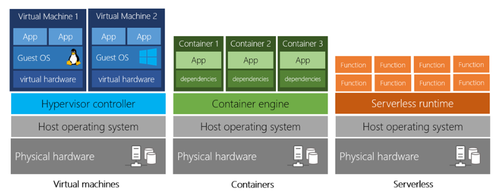
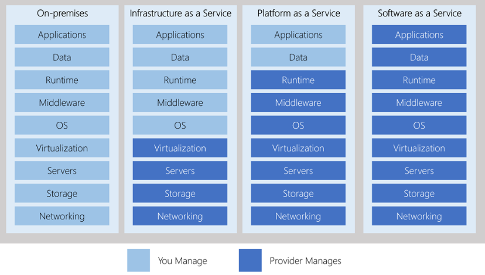

<LINK href="jb1.css" rel="stylesheet" type="text/css">

#### [Back to index](index.html)

# Azure Cloud

## Fundamentals

- VM has an op system. Emulation of a machine.
- Container no op system, so quick startup. Have a standard runtime system. e.g. Docker. Portable between machines, a process runs in a container, multuiple containers. 
- Serverless computing: dont need a server, simple automated tasks. Only pay for function prlcessing time. VM and containers charged whilst running, even when app is idle. Instant startup. Build multiple separate functions.

### Benefits

- cost effective
- scalable, vertical (add resources, CPU - scale up) and horizontal (add more servers - scale out).
- elastic
- reliable
- global for quick response time
- secure
- compliant with regs GDPR. CJIS
- economy of scale
- no cap ex, rev is tax deductible
- costs for what you use, no gap.

### Deployment

Public cloud: common, e.g. Azure. regulatory or business reuquirements may not be met. 
Private cloud: you set up your own data centre
Hybrid: e.g. have the database on your private cloud, storage on public. Flexible, support legacy, security and compliance.

### Types of cloud

- Infrastructure IAAS: most flexible. Rent hardware, control the hardware, install software on it. Shared responsibility for support. Good for gradual migration, scalable test and dev environments, storage etc. CLoud provider does the VM, storage, networking.

- Platform PAAS: they manage the infrastrucure, you deploy web application. Development and deployment environment. Good for development framework, gives scalability, less work for developers. Good for analytics hosting.

- Software SAAS: one application for all customers, e.g. office 365, skype.

sd

