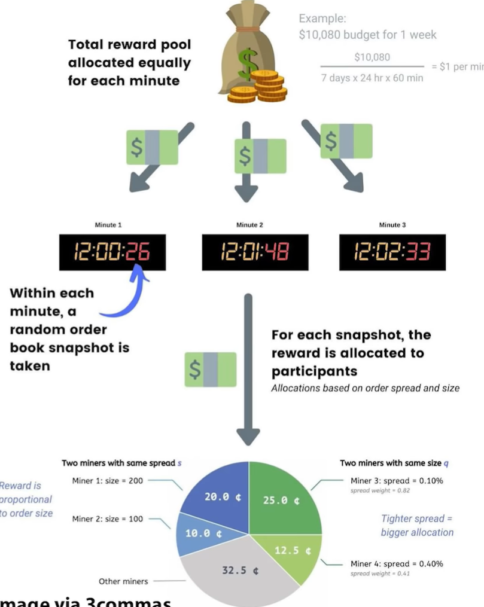

# Crypto Currencies

- [Crypto Currencies](#crypto-currencies)
  - [Coins](#coins)
    - [Polka Dot](#polka-dot)
    - [Cardano (ADA)](#cardano-ada)
    - [Litecoin](#litecoin)
    - [Concordium](#concordium)
  - [Stable coins](#stable-coins)
  - [Usage](#usage)
    - [Bitcoin loans](#bitcoin-loans)
    - [You hodler deposits](#you-hodler-deposits)
    - [P2P exchanges](#p2p-exchanges)
    - [Centralised exchanges](#centralised-exchanges)
      - [Coinbase](#coinbase)
      - [Gemini](#gemini)
      - [Kraken](#kraken)
      - [Crypto.com](#cryptocom)
      - [Binance](#binance)
      - [etoro](#etoro)
      - [Kucoin](#kucoin)
    - [Trading BOTs](#trading-bots)
      - [3 Commas](#3-commas)
    - [Crypto spending card](#crypto-spending-card)
    - [Buy crypto with FIAT](#buy-crypto-with-fiat)
  - [Wallets](#wallets)
    - [how wallets work](#how-wallets-work)
  - [Etherium](#etherium)
    - [Etherium wallets](#etherium-wallets)
    - [Etherium accounts](#etherium-accounts)
    - [Transactions](#transactions)
    - [Etherium wallet types](#etherium-wallet-types)
    - [Gas fees](#gas-fees)
    - [How to save gas fees](#how-to-save-gas-fees)
  - [metamask](#metamask)
    - [metamask on Binance smart chain](#metamask-on-binance-smart-chain)
  - [Trust wallet](#trust-wallet)
  - [Staking](#staking)
    - [Crypto passive income](#crypto-passive-income)
      - [Centralised lending platforms](#centralised-lending-platforms)
      - [defi lending](#defi-lending)
      - [yield farming](#yield-farming)
      - [liquidity mining](#liquidity-mining)
      - [Staking in POS coins](#staking-in-pos-coins)
      - [staking scams](#staking-scams)
  - [Tokenisation](#tokenisation)
  - [Tax tracking](#tax-tracking)
  - [Alt coins](#alt-coins)
    - [Axie Infinity Shards (AXS)](#axie-infinity-shards-axs)
    - [Chiliz (CHZ)](#chiliz-chz)
    - [HXRO (HXRO)](#hxro-hxro)
    - [Arweave (AR)](#arweave-ar)
    - [Thorchain (RUNE)](#thorchain-rune)
      - [Validation](#validation)
    - [Solana (SOL)](#solana-sol)
    - [Definity](#definity)
  - [Fund managers](#fund-managers)
  - [News sources](#news-sources)
  - [Portfolio tracking](#portfolio-tracking)

## Coins

### Polka Dot

Fully open permissionless space. Paradigm for developers to develop their own smart contracts. Etherium standard contracts, Dot you can customise much more. Fork from Etherium by same people, better version of Ethereum 2.0. Launchpad for next generation of layer 1. Relay chains: central chain to link the multiple other chains. Build your own layer 1, link it to the Polka dat parachain to provide security.

- Layer 0: Polka Dot. Because nothing built in, just a layer for security and transport.
- Layer 1: Base layer of tech. Bitcoin, Etherium, Dot.
- Layer 2: Add extra functions on top. Offload work from layer 1. e.g. extra data stored.

Originally was interoperability, because platform for all. But now it's a generic platform.

Binance smart chain is like a copy of Etherium with simpler nodes to reduce congestion. Quick play to get users. But how decentralised?

Polka dot crypto vision interview with Gavin Wood: it's a full eoc system. Etherium an experiment, Polka dot is much more industrial. Solves the speed and scalability problems. Provides infrastructure for building parachains, solves security problems. Good for real world apps. Don't need to use DOT tokens, can use anything to verify. Consensus mechanism better than Etherium.  

### Cardano (ADA)

- non profit, smart contracts coming soon.
- Etherium variant.
- PoS.
- Not loads of developers.
- NFTs are on here.

### Litecoin

- means cheap micro transaction on BTC
- 2 users set up a shared multisig wallet. Conduct unlimited number of small transactions, agree them both. These doesn't need storing on the blockchain. When close the channel, store on blockchain.
- Not as secure so only for low value.

### Concordium

- building business useful Blockchain.
- Doing layer 1 blockchain, with API on top, and a smart contract language
- They provide infrastructure, like Polkadot, but also have centralised features, e.g. allow regulators to inspect given a court order.
- Covers proof of identity
- high performance, quick transactions, shards.
- Use case e.g. escrow when you want both transactions to happen at the same time - banks can do this but complex to arrange given cross border and KYC.
- or e.g. vaccine passports - prove you have permissions for something but not give away all your data when you scan a QR code containing loads of things when you just want a litre of milk. SO they have a way for you to limit your data that you give out, just give controlled attributes from a trusted source.
- Use identity providers to prove, then open accounts. Then can disclose to regulators via court order.
- Not giving away equity with the coins.

training video https://www.youtube.com/watch?v=7HDH7l94rFM  
interview: https://www.realvision.com/shows/the-interview-crypto/videos/concordium-spearheading-business-adoption-of-blockchain  

## Stable coins

- small market cap are more volatile, affected by buy / sell.
- Other benefits are defi structures.
- get the transportability and convenience of crypto with the stability of Fiat.
- Payment still hard. Used lots on crypto exchanges. Exchange BTC for USDT to reduce risk.
- Move between exchanges easily, good for arbitrage.
- Good for utility.

To maintain a peg:

1. create trust with collateral. USDT (Tether) backed by actual USD. DSG backed by gold. Or back with crypto, that's easier to audit as it's visible on blockchain.
2. algorythmic peg. Write smart contract which increases / decreases supply based on price. No assets held, the smart contract is like a central bank.

collateralised issues:

- secure real world assets
- capital sits idle
- capital can be stolen
- hard to prove. e.g. Tether accused of insufficient collateral

algorithmic issues:

- easy to audit collateral
- crypto volatile, so need to be over collateralisied
- does the supply demand mechanism really work in distress?

Business model: fees for coins, marketing, etc. e.g .coinbase have one to get users.

- USDT Tether: Fiat collateralised pegged to USD
- TUSD True USD: Fiat collateralised, bank accounts audited
- GUSD: Gemini. Fiat collateralised, regulated.
- USDC: issued by Coinbase / Circle. Fiat collateralised.
- DAI: crypto collateralised.

Issues:

- will peg work? All fail due to cost of maintaining them. e.g. Gold standard.
- Governance: they are basically centralised as controlled by a company.
- Is there a real problem to solve with stable coins? Vol of BTC will calm down so not needed.
- Regulation may come in.
- So stable coins could be short term.

## Usage

### Bitcoin loans

main ones are nexo, blockfi, unchained capital, bitbond  
You hodler has best rates,

generally about 50% LTV  
APR varies, was 6% to 16%  

Lending: deposit BTC, get FIAT as a loan. Means defer tax on sale. No credit checks as fully collateralised.  

Can also deposit BTC for interest.  

Margin calls  
Fees about 2%  
some companies rehypothecize your crypto so it's a credit risk.  

unchained capital do a multisig where you have some control over the ownership still.

- Are loans collateral backed? This is crucial if you’re an investor.
- Loan terms (APV, LTV, payment schedule)
- Collateral holding (multisig vs. custodial vs. in the company’s wallet)
- Does the company use user funds for additional investments?

### You hodler deposits

- BTC pays 4.8%
- min 0.1 BTC
- instant access
- not clear on collateral pledge

### P2P exchanges

- Just offer and match.
- Escrow to hold funds during transfer
- Less KYC than on exchanges
- e.g. Paxful, Localbitcoins, Binance P2P, HODL HODL

charge e.g. 1% for sellers, 0 for buyers

### Centralised exchanges

#### Coinbase

- 35m customers, 100 countries.
- it's an exchange not a wallet, so you don't have access to your private keys.
- credit or debit card payments - these can be delayed while checked for fraud
- Card purchases on coinbase are 4% - only 1.5% for transfers.
- Coinbase pro is lower fees - not 1.5%, pay 0.5% for < $10K.

#### Gemini

winkelvoss. advanced platform Active trader fees are 0.35%

#### Kraken

Low fees, secure. 0.25% fees in advanced

#### Crypto.com

more expensive. Have a debit card

#### Binance

Mainly crypro to crypto, cheap. Binance jersey is dead. Lots of cryptos, big range, 0.1%

#### etoro

User friendly. CFDs dep on regulations.  
copy other traders  
long delays if pay with card.  
Higher fees.  

#### Kucoin

Great for alt coins
discount: https://guy.coinbureau.com/kucoin/

### Trading BOTs

#### 3 Commas

https://guy.coinbureau.com/3commas/

### Crypto spending card

Crypto.com visa card.  

https://guy.coinbureau.com/crypto-mco/

### Buy crypto with FIAT

SwissBorg is good. 

## Wallets

- wallet stores and manages the functions for the private key.
- Seed is string of common words that can be used to reconstruct the private key,
- Can create many addresses from the same seed, all for the same wallet.
- Keep private key and seed safe.

Wallets can use full node or just recent nodes

wallet types:

1. Hot wallets at exchanges:
    - dont have access to your private keys
    - less secure

2. desktop wallets:
    - store on PC (Exodus is best).

3. Mobile phone:
    - insecure, not private, phones broken

4. Cold wallet:
    - independent of internet connection
    - need to keep the dongle with you to send stuff,

Have multiple wallets, one for small transactions.

If you had $50,000, you wouldn't keep it all in your wallet. So why should your BTC be any different?

Using more than one Bitcoin address — meaning your cryptocurrency isn't in one place — can be a smart move.

### how wallets work

https://medium.com/tradecloud/crypto-wallets-and-addresses-1-d874c75ebe11

## Etherium

### Etherium wallets

Etherium wallet holds private key, and provides a public Etherium address.  
Eth is a currency but Etherium is more complex because not just payments.  

### Etherium accounts

- EOA - externally audited account. Controlled by PK, have as many as you want, can create and trigger contract. Bit like a bitcoin wallet.
- Contract account: has an address, code associated. Every contract has it's own account. No private key. Controlled by predefined triggers, hard coded from teh start. Can send and receive Eth. Can't be changed once launched.

### Transactions

transactions allow accounts to communicate.

- transactions wrap messages
- transfer of value is one type of transaction to move money between EOAs.
- transactions to create a new smart contract.  
- transactions used to trigger a contract

### Etherium wallet types

some only allow transfer of value.
Others allow contract interaction (smart contract wallets)

Full node clients: holds full blockchain. Extra memory etc, but you can verify your own transactions.

- GETH: most popular, full techy.
- MIST: less technical.  
- PARITY: business user.  

Light nodes: rely on 3rd party full nodes. Need less memory etc, can run on phone. Partial blockchain.  

Hardware wallets are not smart contract wallets.

### Gas fees

Etherium network pays gas in Eth.  
Eth splits to 1e18.  
Add a miner fee to a transaction to incentivize miners.  
Network runs on gas for each line.  
Can't refuel on the way, so smart contracts need to be lean. If incomplete, contract stops executing.  
Eth price changes all the time, so fees priced in Gas. Fixed amount of work.  Predefined amount of Gas for each line of code.  
Price of 1 gas unit varies depending on how crowded network is. You can offer more to get your contract more priority.
Send a transaction, specify a gas limit. Pay full amount up front, halts if not enough, but refund if cost is less than you provided.  
Gas amount x gas price = total cost.  

### How to save gas fees

Single transactions currently e.g. 20 to 50 USD.  

Gas fees on dapp aggregators much higher than e.g. going direct to uniswap.  

[www.ethgasstation.info](https://www.ethgasstation.info/) is a good place to look at expected gas price. Gives up to date gas fees, better than e.g. metamask calculations.  

## metamask

Allows you to access dapps without providing the private keys. Can just supply permissions.  
Founded by Consensus data, builder for Etherium.  
Makes money from Gas fees from sales and swap fees.  
Not as secure as cold wallet.  

Put funds in here when ready to trade or stake.  

- Chrome plugin, iphone app. simple and free.  
- used as a middleman wallet, store on cold storage.  
- heavily used for defi, uniswap etc

- need secret phrase for seed. 12 words to recreate wallet.
- Get a unique address. Send from other wallet to this address.  
- Stores ERC20 tokens only.
- lots of stuff to see gas prices  
- uni can connect to metamask

Every account has a unique Etherium address, have as many as you want.  

Metamask contracts useful.

### metamask on Binance smart chain

Use metamask but pay on the BNB network as it's cheaper.

e.g. Venus is MakerDAO of the binance smart chain.  

Add support for Binance smart chain to metamask. Binance does have it's own mobile wallet (Binance chain wallet extension), but lots of Dapps which can use Binance smart chain can't use the Binance mobile wallet, they can all use metamask. Uses same wallet seed phrase.  e.g. Venus is top dapp on Binance smart chain doesn't support Binance chain wallet).  

Use BEP20 to withdraw tokens from Binance on binance smart chain. This is compatible with ERC20 tokens. Extends ERC20. Can withdraw other ERC20 tokens on Binance smart chain. But can you stake them?

Metamask doesn't have a record of any binance smart chain assets, so need to manually add tokens. Need to go to binance smart chain explorer (https://www.bscscan.com/) and add activity via contract address. instructions here: https://www.youtube.com/watch?v=MfkqgXNPiHg

## Trust wallet

Good to have crypto on mobile
includes some staking

## Staking

Staking on Exchanges

- Coinbase - http://bit.ly/35bKkSJ​
- Binance - http://bit.ly/3b86vgq​
- Cex - http://bit.ly/3b6ofZJ​
- Kraken - https://bit.ly/3hKhIVF​

Staking through Wallets

- Atomic Wallet: http://bit.ly/38XGk9D​
- Guarda Wallet: https://bit.ly/389JIis​

Staking Pools

- Rocket Pool - https://bit.ly/3nbYNV4​

Validator as a Service

- Staked.US - http://bit.ly/2MywO5d

### Crypto passive income

#### Centralised lending platforms

Offer loans. Hold your crypto, they lend it out. Generally instant access, multiple coins, collateralised. But, ***credit risk**. Regulated. Have to give up keys.

- nexo: Based in europe, instant credit, card. Nexo utility token. Rates are e.g. 8 to 12%. 
- Celcius: 6% bitcoin. Good. lots of facilities.
- Blockfi: US. big deposits. up to 8%. Hacked last year for customer data.

#### defi lending

Don't have to give up keys.
Smart contracts to adapt interest rates based on supply and demand.  
Full control of keys. No KYC, no identity.  
Continuous interest.
No lockup period.  

TVL = funds locked in.  
Check https://defipulse.com/ for latest market share.  
check [Defirate.com](https://defirate.com/lend/) for latest rates across all.  

- AAVE: e.g. 10% on DAI.
- Compound
- Maker

Stable coins earn higher than other cryptos.
WBTC is tokenized BTC: so use defi but still exposed to BTC price.  
No regulator or agency when use Defi, so subject to hack.

#### yield farming

Potentially very high yields but higher risk.  
Complex.  

some platforms to automate complex strategies

Yearn finance: basically it moves money between pools. Offers insurance against smart contract exploits for more security. You don't get to see the clever mechanisms. Risky.  

#### liquidity mining

Supply liquidity to a protocol which helps defi exchange. get fees when assets swapped. 
e.g. supply USD and ETH to a USD/ETH pool, and aet a share of fees. Get Liquidity provider token.  
Fees vary depending on volumes.  
Available on AMM (automated market maker dex) platforms like uniswap, 1inch, sushiswap, Bancor.  
Liquidity mining incentives paid as governance tokens.  

#### Staking in POS coins

Staking to help maintain consensus.  
Also get decent returns  
Just take for extra income on coins you are hodling.  

- Pure proof of stake - direct stake
- Delegated proof of stake to validator nodes, validators with lots of stake have more power.

Considerations:

1. Wallet support
2. Staking complexity
3. Payout terms
4. Lockup periods
5. Staking rewards

e.g. ADA, delegate to staking pool for 7% pa
e.g. DOT, delegate to nominator, 13% pa.

Could run a validator node, but more risk and slightly more reward.

Most coins have native wallet which allows you to stake.
Some have cold wallet support for staking.

Cold staking: secure offline whilst getting returns.  

Exchange staking: e.g. Binance.  

#### staking scams

Lots of ponzi schemes  

1. investment schemes where someone else does the trading
2. mining schemes
3. lending platforms

Hard to see as advertised on facebook, google. 

Suspiciously high rates of returns. Can go a long time

red flags:

1. high returns
2. does it work on tiered referral? Get users to advertise
3. are returns guaranteed? not possible.
4. DYOR

## Tokenisation

- Take a non fungible thing, tokenise, then can sell a part of it or exchange temporarily.
- E.g. part of a house, time, art, book rights etc
- There's an art to making the incentives right to get the network to prosper.
- But it's hard to get completely correct: e.g. extra transaction fees on ETH when it's busy, result in movement away for lower value transactions onto cheaper networks, reduce liquidity, mean it dies.
- Anish Mohammed talk on real vision.

## Tax tracking

Accointing good for UK tax tracking and portfolio tracking.
https://www.accointing.com/
£79 pa for tax return and portfolio tracker up to 500 transactions

## Alt coins

### Axie Infinity Shards (AXS)

Game where you collect stuff. 
Recc by Jeff Dorman
Battling, bit like Pokemon.  

### Chiliz (CHZ)

Socios fan engagement
3bn market cap
Fan engagement.  
Buy tokenised voting rights.  
Juventus, lots of others.  

### HXRO (HXRO)

Option market for cryptos. Gamified.  
market cap 134m.  
ETH token on solana.  
https://hxro.io/

### Arweave (AR)

market cap 800m.
decentralized storage for indefinite storage.  
Uses AR to pay miners to store.  

### Thorchain (RUNE)

No founder or team - Community, transparent.  
Weekly development updates, open source. Raised money from various sources  

Makes it possible to swap between blockchains. E.g. BTC to ETH.  
Thorswap web interface to exchange tokens.  
Various DEXs coming.  

#### Validation

PoS. Each node must stake 1m RUNE. Anonymous validators, rotate.  
Send BTC to validator, it sends out ETH. 2/3 validators need to agree.  

### Solana (SOL)

Defi protocol.  
Very fast validation and smart contract execution.  
Good for corporates or building Defi.

### Definity

Like google / amazon combined.  
worth 40bn before there's a token.  
Blockchain platform for institutions to exchange assets in immediate tokenised form.  
On chain order book.  
real time settlement, clearing, zero counterparty risk, decenralized validation.  
FX markets as a start, private equity, debt markets.  
Settlement via tokenised fiat payments.  

10 fund managers backing it.  
Launching early may.

## Fund managers

Arca: Lots of cryptovision input

Hyperion Decimus: Reeal vision talk about hedging and managing risk, a hedge fund doing crypto. Chris sullivan.

## News sources

Decrypt: https://decrypt.co/  
Coindesk https://www.coindesk.com/

defi examples: https://defipulse.com/defi-list/
defi revenues: https://terminal.tokenterminal.com/

Crypto news app

## Portfolio tracking

Blockfolio for portfolio tracking  
Messari for filtering based on stats eg vol, stock to flow  
3 commas for back testing trading strategy. Easy to manage bot  

