# Defi

- [Defi](#defi)
  - [Overview](#overview)
  - [Another overview](#another-overview)
  - [news sites](#news-sites)
- [Dapps](#dapps)
  - [KeeperDAO](#keeperdao)
  - [MakerDAO](#makerdao)
  - [Uniswap](#uniswap)
    - [uniswap v2](#uniswap-v2)
      - [Swap](#swap)
      - [Send](#send)
      - [pool](#pool)
    - [Uniswap V3](#uniswap-v3)
    - [Positioning](#positioning)
    - [Basics](#basics)
    - [Token swaps](#token-swaps)
  - [UMA](#uma)
    - [basics](#basics-1)
    - [example](#example)
    - [mechanisms](#mechanisms)
    - [priceless contracts](#priceless-contracts)
    - [oracles](#oracles)
    - [DMV (Data verification mechanism)](#dmv-data-verification-mechanism)
    - [Synthetic tokens](#synthetic-tokens)
    - [liquidation and disputes](#liquidation-and-disputes)
    - [Issues](#issues)
    - [Economic incentives](#economic-incentives)
    - [Token holders](#token-holders)
    - [Allison Lu lectures](#allison-lu-lectures)
    - [Regina Cai lecture on UMA](#regina-cai-lecture-on-uma)
    - [applications](#applications)
  - [Perpetual protocol](#perpetual-protocol)
  - [dydx](#dydx)
  - [Nexus Mutual (NXM)](#nexus-mutual-nxm)

## Overview

Can build e.g. exchanges which are not controllled by aynone

Etherium a good platform for smart contracts. Write decentralised applications (DAPS)
set the rules in the code, then you don't control the rules once published.
need to start with some money. ETH is volatile, so generally use stablecoins (pegged to e.g. USD).
You don't want to have directly cash backed stablecoin as then you can't decentralise
DAI is an example of a stablecoin pegged to USD, overcollateralised with crypto asset basket. Decentralised because doens't need Fiat currency. Deposit $1 ETH, get. $0.66 Dai. Or buy DAI. Overcollateraliseation covers for ETH volatility. So it's decentralised, secure.

Services:

- decentralised exchange (DEX). Rules to buy / sell. No central exchange operator, no identity, no fees. Just smart contracts. Don't need to deposit funds, just exchange directly.
- decentralised money markets. e.g. uniswap. Connect borrowers and lenders. e.g. Compond. Deposit crypto, borrow against it with a smart contract. (yield farming).
- decentralised insurance. people willing to buy insurance vs sellers. Mix and match services.

Money legos to build services. put services together.

advantages:

- transparency
- interoperability
- decentralisation
- free
- flexable

problems:

- infancy
- smart contracts could be hacked
- some partially centralised services can be compromised
- hard to understand

examples: https://defipulse.com/defi-list/
revenues: https://terminal.tokenterminal.com/

## Another overview

Use Etherium, good for writing decentralised apps.
Write smart contracts to manage the financial service. Deploy rules on Etherium network, can't change them.
Bitcoin has only basic programmable functionality.
Stable coins: crypto but pegged to a stable fiat currency USD.
So use Etherium based on USD
DAI is a stablecoin, decentralised, over collateralised. Platform for lots of DeFi.

DEX: decentralized exchange.
No signups, fees, et.c Just smart contracts.
Don't need to put money there first, a direct transfer.

Everything happens autonomously, no intermediaries. Open source.

Lots of advantages: decentralised, cheap, automated etc
Risks: in infancy, so things can go wrong.

## news sites

DAPP radar

# Dapps

## KeeperDAO

Compound, MakerDAO, and other DeFi protocols require user positions to be liquidated if their underlying collateral becomes worth too little. This exploits that for pay. 

3 roles

1. Liquidity providers
   most people
   Put ETH20 funds on the platform, used to win work on Defi smart contract execution
   get a rate of interest

2. Keepers

    DO arbitrage between DEXs, and liquidate unhealthy contracts on Defi for a fee.
    require capital, borrow it form liquidity providers and give profits.
    Need a strategy to make a profit as one transactions, e.g. arbitrage between Uniswap and Kyber.
    Implement as smart contract (a keeper)

3. Under writers

    Find a contract that needs to be terminated, wrap it instead of terminating.
    This is cheaper for the owner and offers more profit, especially when volatile. Has same effect of removing the risk.

## MakerDAO

Uses DAI, stablecoin, $1.
On Etherium.
MakerDAO manages DAI and does the governance.
Maker protocol is a set of smart contracts which maintain DAI.
Dai is overcollateralised, locked in to smart contracts.  

Lots of Jobs.

well worth a look. 
Revenue growing on https://terminal.tokenterminal.com/

MKR coin. Buy some.

## Uniswap

### uniswap v2

decentralised exchange aggregator and liquidity increaser  
does ETH to USDC, but only has wrapped bitcoin.  
Better trading terms I think.  
Most volume in ETH  
argument that this value should increase as coinbase gets clearer value  

UNI are governance tokens, you can vote, plus get a share of the fees  
Should be valuable.  
Uniswap is open source. You provide liquidity and get rewarded.  
Looks good technically.  

Uniswap you control your own keys.
Uses ETH for fees

options: swap, send pool.
Connect to metamask
Uses smart contracts to interact with Etherium.

#### Swap

Swap any 2 tokens. Only really want to exchange liquid pairs.
Prices are just an estimate.
Set time limit

1. Liquidity provider fees (0.3%)
2. slippage - amount price can change between placing and execution
3. price impact of your order. E.g. Exchange ETH for DIA, little impact. But if go for obscure token then more price impact.

#### Send

Swap and send to someone else.

#### pool

Liquidity pools sit in smart contracts.  
These take the other side to every trade.  
See the details of liquidity pools.  
Each token has it's own LP.  
Crowd sourced liquidity.  
Pay 0.3% fee to LP. Mechanism to increase liquidity.

To join pool, deposit equal dollar value of the 2 tokens you are happy to provide.  
e.g. ETH vs PAX
As swaps happen, your share of the pool is updated.

Have to have a strategy: need to provide to pairs where you expect more activity in future. Don;t get rewards if no activity. Larger pools less profitable because more sharing of rewards.
Look at uniswap.info analytics website for overview of activity.

### Uniswap V3

- coming out May
- Liquidity providers make markets in customized price ranges
- LPs place assets in liquidity pools, uniswap users trade against these. Bit like market makers, provide liquidity.
- LPs were required to have capital on standby for any price, so only a small part of it being used at the current price.
- in V3 can set your price point, so like an individual curve, higher rate of return.
- also better scaling
- new fee tiers.
- compensation for LPs depends on vol of the chosen pair. More vol more income.
- Token for different pairs not fungible because different fees etc.
- sushi is a direct clone of Uni, using open source. But now more protected. Licence can be adjusted by UNI holders.
- question if enough of a head start to fend of competitors.
- Big war chest to rewards developers

V3 white paper here: https://www.scribd.com/document/499988185/whitepaper-v3#from_embed

### Positioning

Uniswap at 25% of transactions on ETH per day.
60% of DEX market
Competitors: Curve, DODO, Balancer. Visible on Coingecko.com.
Can e.g. trade weighted baskets of cryptos

### Basics

automated liquidity on ETH, implemented with smart contracts.
Decentralized, security sorted etc
Each uniswap smart contract (pair) managed a liquidity pool mode up of reserves of 2 ERC-20 tokens.

### Token swaps

Exchange ERC-20 tokens at current market price
No order book used, just automated formula in smart contract.
constant product formula means that 

## UMA

### basics

umaproject.org  
Protocol for developers to build synthetic assets  
Good for derivatives, anything with a price.  
democratic, not legal resolution so no regional issues.  
crypto vision talk with Hart Lambur  
smart contracts on the Etherium network  
optimistic dispute resolution: so there's an incentive to behave well, and a mechanism with penalties to resolve if not.  

tokens can track the price of anything  
minimal on chain transactions to reduce costs  
quick to launch assets  

Not overcollateralised, instead they incentivize validators to find contracts that don't have enough collateral.  

### example

want to issue a new synthetic gold token  
Put some collateral on Etherium (e.g. $5000 of WBTC)  
use the collateral to create 2000 tokens  
sell the tokens  
smart contract mirrors the price of gold  
issuer is naturally short the tokens  
if they go down, buy back at less, and destroy to get your collateral back.  

### mechanisms

mechanisms to provide honesty:

- economic guarantees
- network incentives
- Data verification mechanism (DVM) provided by UMA

Token sponsors: lock collateral to mint tokens. Need to always maintain overcollateral.  

Liquidators: monitor collateral on smart contracts, and incentivised to liquidate where undercollateralized, with 2 hours notice. Use off chain price feeds.  

Disputors: use the 2 hour window to check liquidation. Escalate to DVM for 48 hour resolution, or use optimistic oracle.

UMA token holders: DVM proposes a vote of token holders to get price of an asset at the time of dispute. They get the price off chain, and vote on the price for resolution.

If disputer correct, DVM rewards disputor and token sponsor.  
If liquidator correct, DVM rewards liquidator, penalize the disputor, token sponsor loses funds.

### priceless contracts

Problem with APIs submitting prices is you're not sure they are correct.  
Priceless means you only write the price on chain in the event of a dispute, which is rare.  
Hence need for incentives for sponsors to act properly.  
Means you  can have derivs on unreliable price feeds, so many more.  

### oracles

2 parts: optimistic oracle and DMV.

- Optimistic oracle to receive price info, escalation game between price givers and disputers.
- UMA Optimistic oracle can request and receive price info.  
- specify asset, timestamp, reward, liveness time limit.  
- price proposers get prices and submit, getting reward. Proposers need to pay a bond, can lose this if the price is disputed and found incorrect.  
- Disputers can dispute the price within the liveness time period by looking at their own feeds. Generally not disputed as that could be expensive.  
- Disputes sent to the DVM to resolve disputes, triggering UMA token vote.  
- If disputors don't dispute, price goes to requestor.

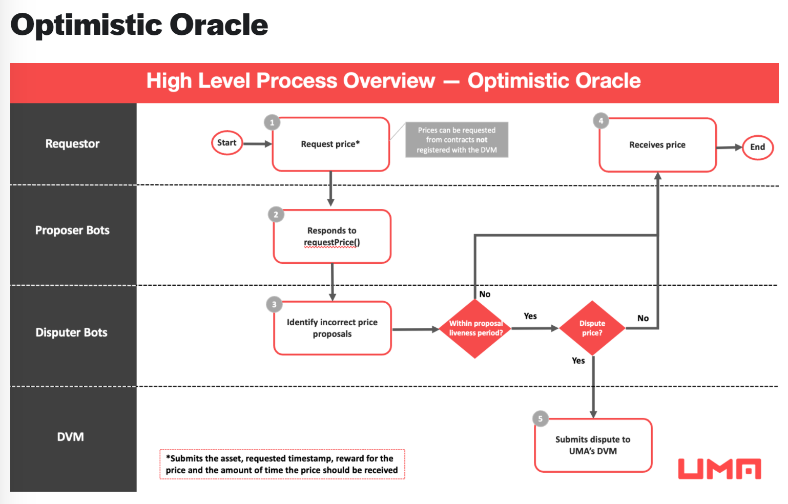

### DMV (Data verification mechanism)

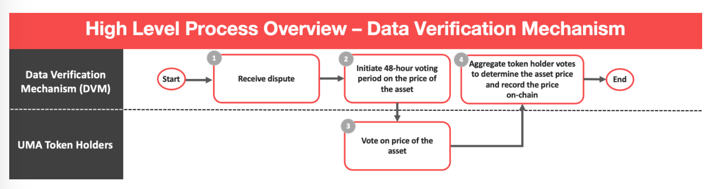

Disputes from oracles and liquidators.  
Vote of UMA token holders, 48 hours
UMA holders use the UMA Voter dapp to vote, calculate the price using UMIP identifier.  
DVM aggregates votes to determine final price.  
loser loses their bond.  

This human interaction reduces manipulation in volatile and manipulatable markets.  

Economic guarantee that it costs more to corrupt the DVM than you could gain from corrupting the oracle.  

### Synthetic tokens

Collateral backed tokens where value based on reference index.  
Can create prediction markets, futures markets, collateralised loans.  
e.g. gold, Tesla share price, cryptos, non tradable indices.  
e.g. Uniswap volume, wall street bets success, chrome downloads.  
e.g. options

1st type is priceless synthetics

Securely collateralised without an on chain price feed.
Incentives for token sponsors to properly collateralise.  
Due to gas fees for liquidating / disputing, need to have a minimum sponsor size, min number of tokens created against the contract.  

Use the token template and contract factory. Parameters:

1. token price identifier
2. expiration timestamp
3. collateral requirement (e.g. 120% of current value)

Expiring synthetic tokens 1st implementation

Token sponsors can deposit additional collateral or withdraw excess collateral.  
Fast if retained collateral > global  collateral level  
Slow mechanism otherwise where token holders can liquidate.  

Allows any synthetic asset with a price.  

May: value about $4bn, TVL 1.8bn and not really growing.  Recc by VC guy.  

### liquidation and disputes

anyone can liquidate based on price feed vs collateral.  
dispute this liquidation within the Liquidation liveness period.  
Liquidators post a liquidation bond to the smart contract of x synthetic tokens.  

liquidation bond functions:

- economic bet
- indicates size of position to be liquidated
- enough to close the token sponsor position
- covers the cost of calling DVM if disputed

bond returned if not disputed.
lose a proportion if disputed and found incorrect.

if sponsor disputes, they pay bond. 

If lose, lose the bond and all collateral goes to the liquidator.  

If disputer wins, get bond back, get dispute reward. Incorrect liquidator gets some of their stake back. 

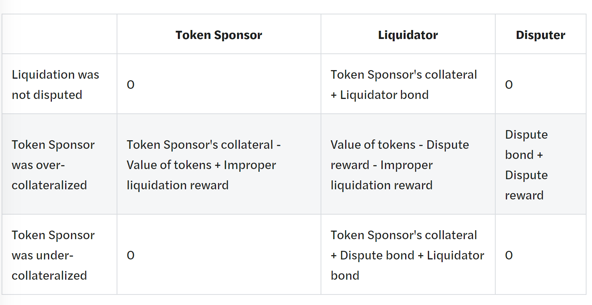

Before expiry, sponsors can redeem tokens to get their collateral back. 
After expiry, anyone may settle contract. Get DVM to give the price at expiration.  

### Issues

Audited by OpenZeppelin.
Various theoretical attacks and liquidity possibilities.

### Economic incentives

Oracles need an economic guarantee around the cost of corrupting the oracle. Make sure no profitable way to corrupt the DVM.  
Look at potential profit from corruption (PFC) vs cost of corruption (COC).  
Each smart contract needs to implement a function for profit of corruption. PFC. Fees are varied to make COC > PFC.

### Token holders

Owning UMA means can contribute price info, govern UMA protocol.  
Rewards for voting on price requests  
rewards for voting on parameter changes and upgrades  
Vote correctly to get reward.  
UMA price must go up as value of contracts increases to keep COC up.  
UMA discord to discuss the disputes
Rebate for Etherium gas fees

Price identifiers: e.g. Gold_June2020_24hTWAP. Defined in a UMIP.  
defines the reference index.  

UMIP: UMA improvement proposal. For voting.  

### Allison Lu lectures

Good lecture to Defi summit, 2019 so a bit old but good.  
https://www.youtube.com/watch?v=T-AbXAeTKtQ

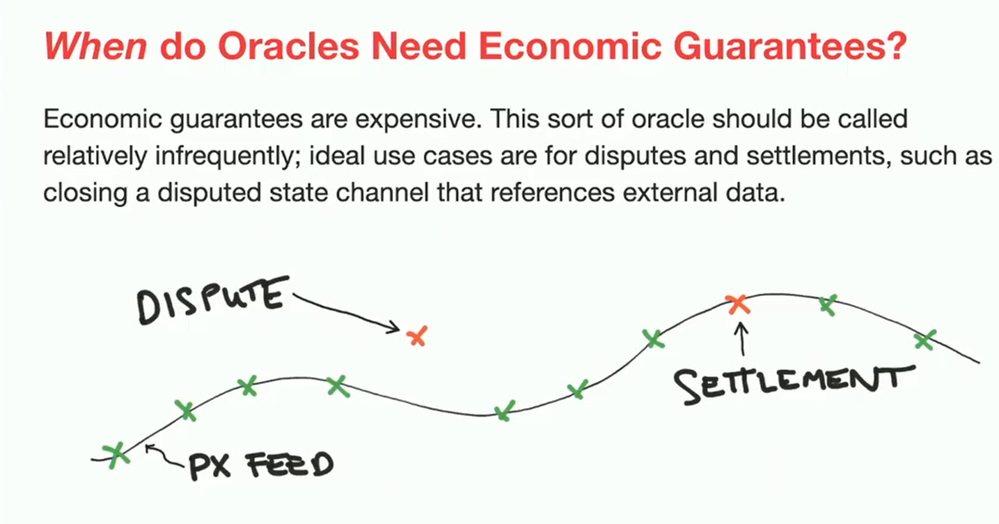

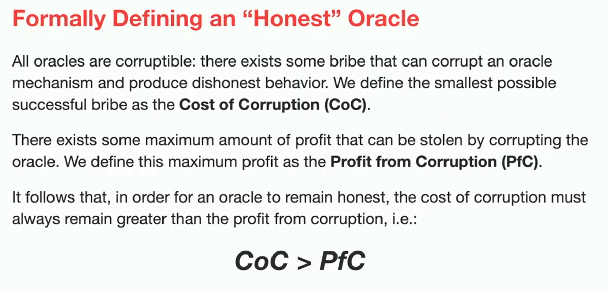

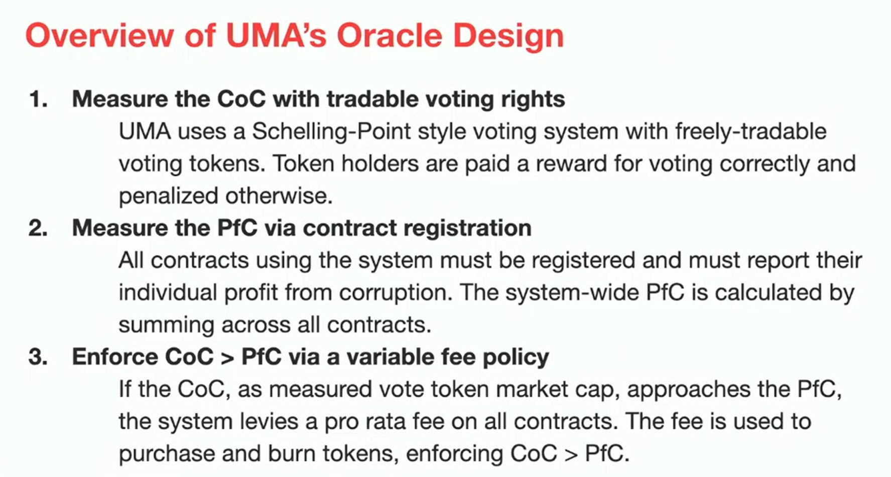

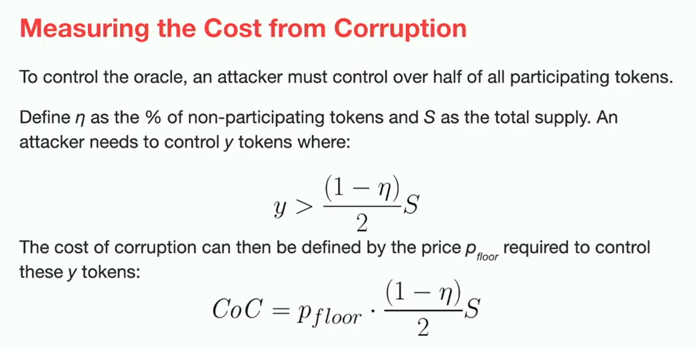

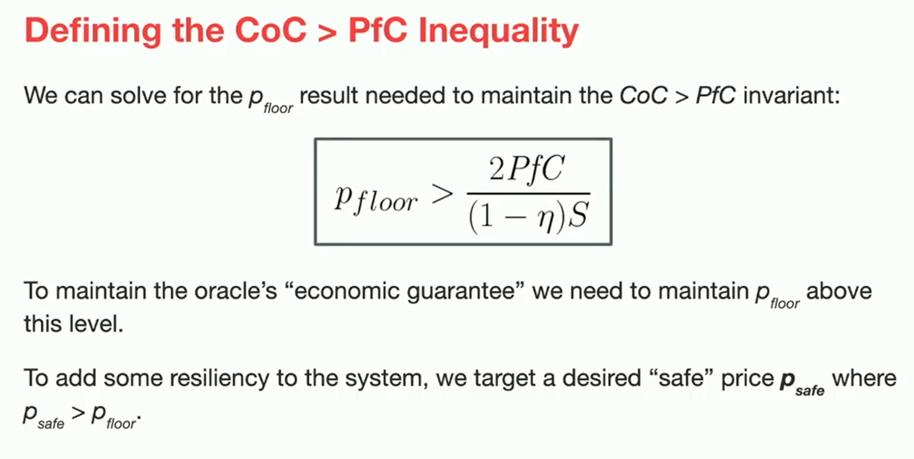

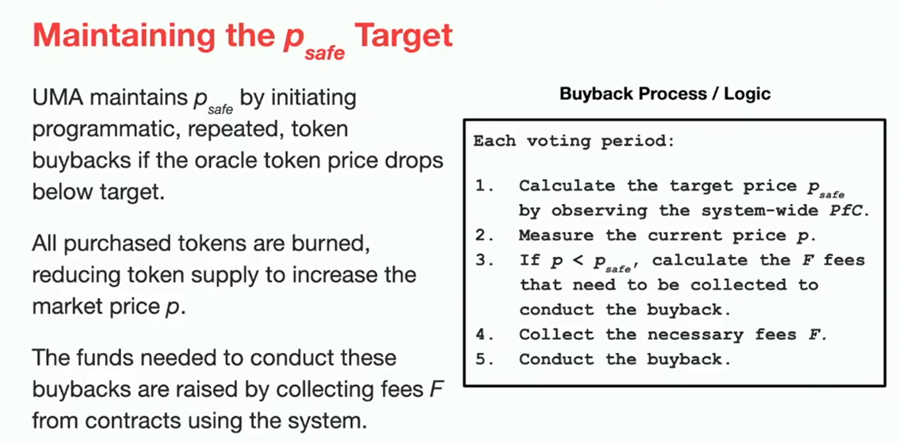

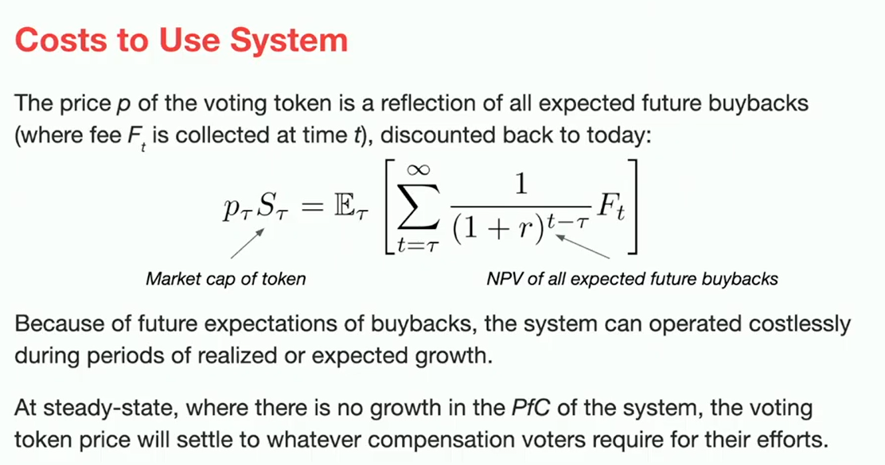

video on building synthetic derivs on UMA

https://www.youtube.com/watch?v=TjeB27zIn4g

### Regina Cai lecture on UMA

Synthetic assets good because more free from physical limits.  Get risk exposure without holding the asset.  
Can depend only on the price feed from physical world.  
Synthetic assets as ERC20 tokens which are familiar, so community can understand.  e.g. synthetic gold token, and trade those. Get all the same price exposure and risk.  
Tokens backed by collateral, escrowed in a smart contract.  
Amount of collateral depends on the price feed. Deposit stable asset to create a volatile synthetic asset.  

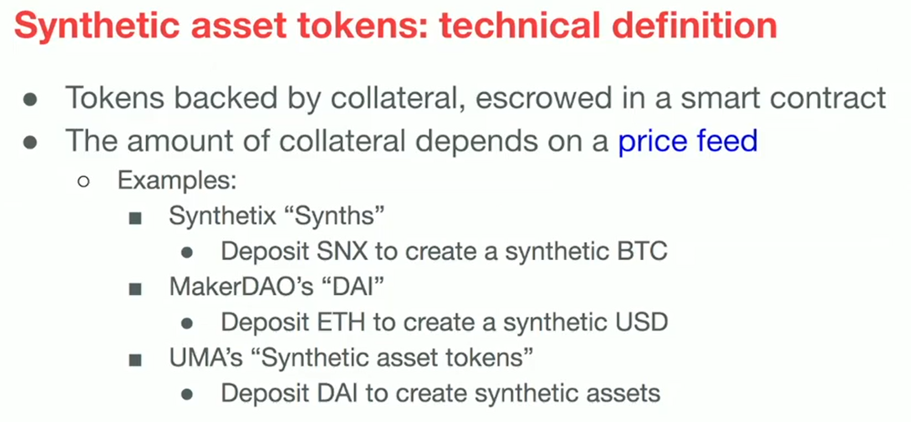

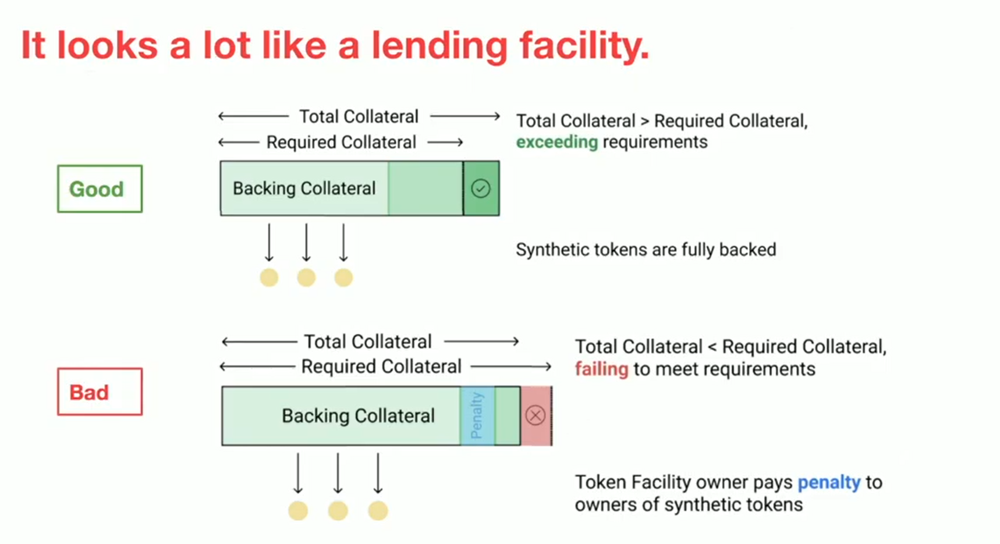

If undercollateralised relative to the minimum, detected and a penalty is imposed whilst you're still overcollateralised relative to the asset. Penalty paid to the token holders.  

If moves too quick, that's a big problem, but that's because the overcollateralisation was not set high enough.  

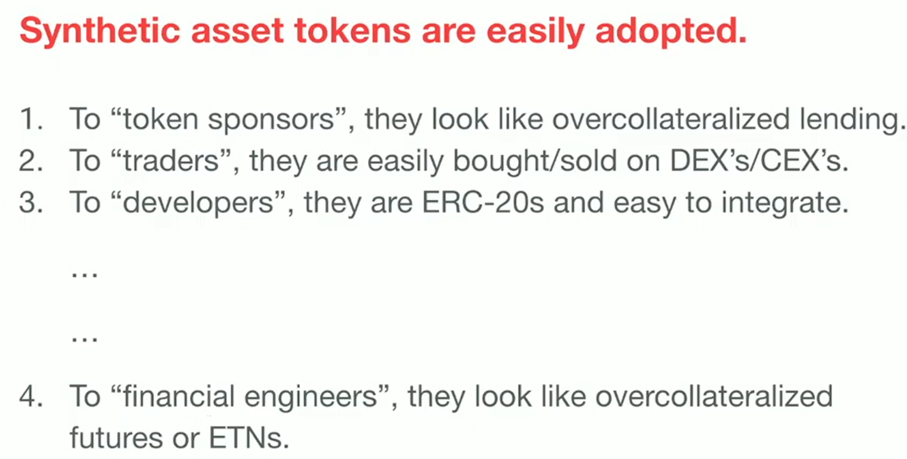

Mechanism needs to be set to generate liquidity, sort out inefficient markets, proper financial processes and features.  

Answers:

1. Make tokens mature, that makes it easy for the creatorts.
2. Non fungible, so only the creator can redeem them against the same token facility used to create them.
3. Make trading price tend towards the collateral price.

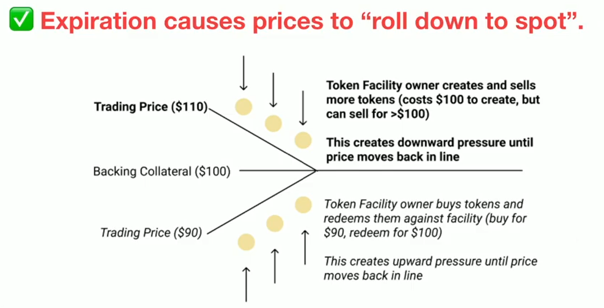

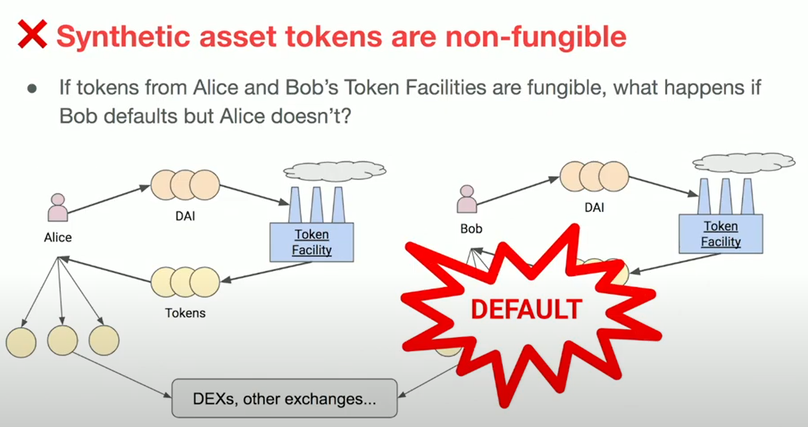

### applications

1. Leveraged short BTC
2. CNY stable coin
3. reddit upvotes

4. IRS

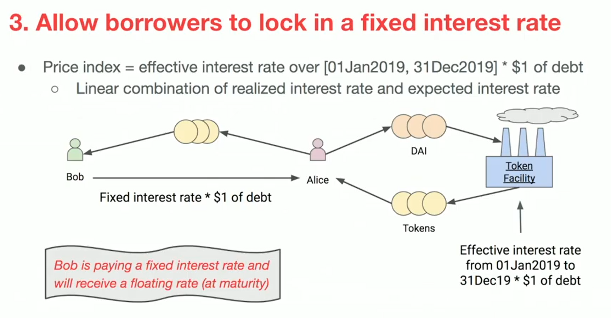

## Perpetual protocol

Perpetual contracts: no expiry or settlement date.  
Uses xDAI chain for low gas fees  

## dydx

Spot, margin, perpetual trading.

## Nexus Mutual (NXM)

https://nexusmutual.io/

Insurance for smart contract hacks.  
Mutual funded by Tokens  
Limited UK company, tokens limited to members.

Premiums received into capital pool  
Claims processed by assessors, and escalated to all if not consensus.  
Incentive to be an assessor  
Incentive to pay out fairly to get good reputation
Keep minimum capital pool by changing value of tokens.  

