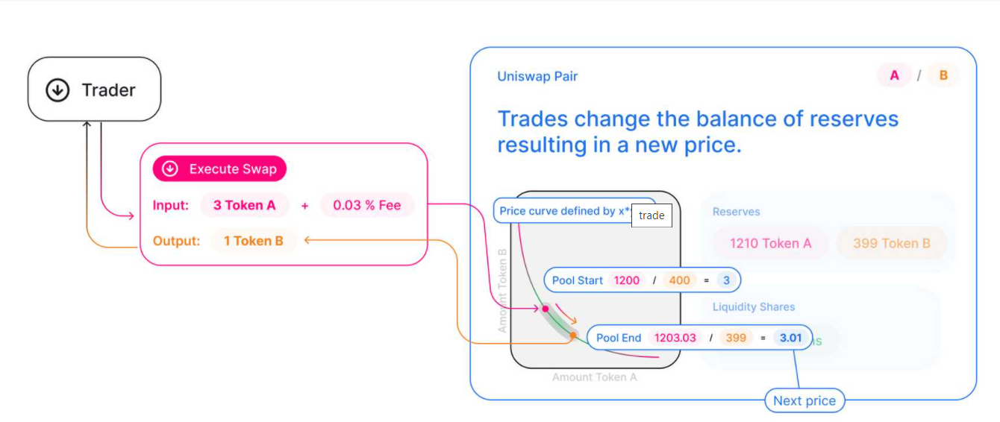

# Defi Dapps

## KeeperDAO

Compound, MakerDAO, and other DeFi protocols require user positions to be liquidated if their underlying collateral becomes worth too little. This exploits that for pay. 

3 roles

1. Liquidity providers
   most people
   Put ETH20 funds on the platform, used to win work on Defi smart contract execution
   get a rate of interest

2. Keepers

    DO arbitrage between DEXs, and liquidate unhealthy contracts on Defi for a fee.
    require capital, borrow it form liquidity providers and give profits.
    Need a strategy to make a profit as one transactions, e.g. arbitrage between Uniswap and Kyber.
    Implement as smart contract (a keeper)

3. Under writers

    Find a contract that needs to be terminated, wrap it instead of terminating.
    This is cheaper for the owner and offers more profit, especially when volatile. Has same effect of removing the risk.

## MakerDAO

Uses DAI, stablecoin, $1.
On Etherium.
MakerDAO manages DAI and does the governance.
Maker protocol is a set of smart contracts which maintain DAI.
Dai is overcollateralised, locked in to smart contracts.  

Lots of Jobs.

well worth a look. 
Revenue growing on https://terminal.tokenterminal.com/

MKR coin. Buy some.

## Uniswap

### Uniswap V3 

- coming out May
- Liquidity providers make markets in customized price ranges
- LPs place acssets in Liqidity pools, uniswap users trade against these. Bit like market makers, provide liquidity.
- LPs were required to have capital on standby for any price, so only a small part of it being used at the current price.
- in V3 can set your price point, so like an individual curve, higher rate of return.
- also better scaling 
- new fee tiers.
- compensation for LPs depends on vol of the chosen pair. More vol more income.
- Token for different pairs not fungible because different fees etc.
- sushi is a direct clone of Uni, using open source. But now more protected. Licence can be adjusted by UNI holders.
- question if enough of a head start to fend of compeditors.
- Big war chest to rewards devlopers

V3 white paper here: https://www.scribd.com/document/499988185/whitepaper-v3#from_embed

### Positioning

Uniswap at 25% of transactions on ETH per day.
60% of DEX market
Competitors: Curve, DODO, Balancer. Visible on Coingecko.com.
Can e.g. tradeweighted baskets of cryptos

### Basics

automated liquidity on ETH, implemented with smart contracts.
Decentralised, security sorted etc
Each uniswap smart contract (pair) managed a liquidity pool mode up of reserves of 2 ERC-20 tokens.

### Token swaps

Exchange ERC-20 tokens at current market price
No order book used, just automated formula in smart contract.
constant product formula means that 

