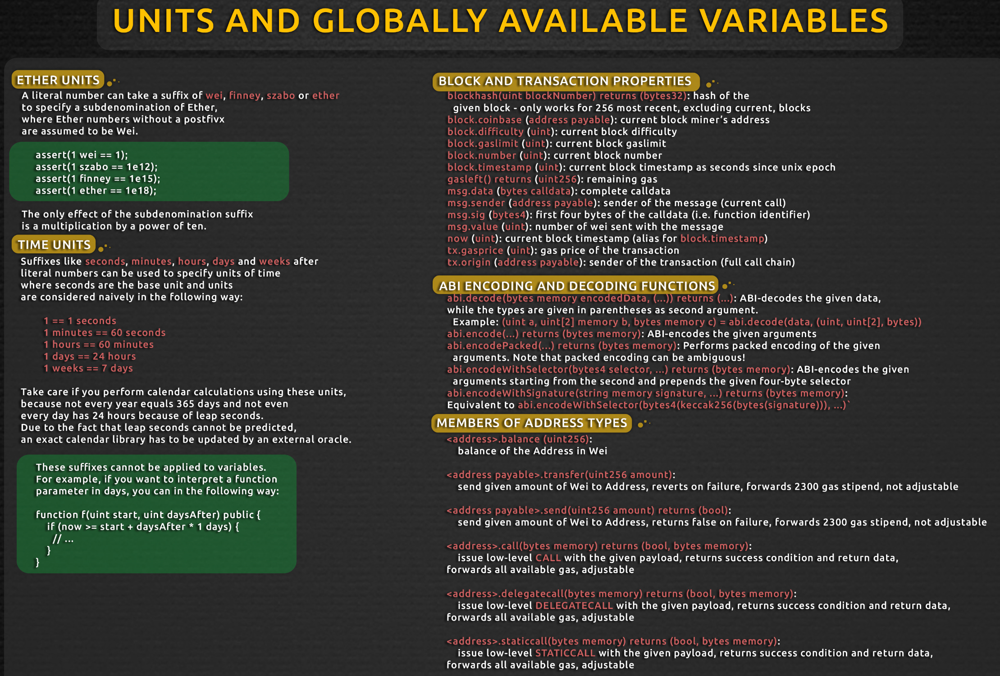

# Etherium Blockchain developer boot camp

- [Etherium Blockchain developer boot camp](#etherium-blockchain-developer-boot-camp)
  - [Basics](#basics)
    - [Metamask setup for developer](#metamask-setup-for-developer)
    - [Transaction details](#transaction-details)
    - [Transaction Signatures](#transaction-signatures)
    - [Cryptographic hashing](#cryptographic-hashing)
    - [lab info](#lab-info)
    - [1st smart contract](#1st-smart-contract)
  - [Solidity](#solidity)
    - [Language Structure](#language-structure)
    - [Blockchain nodes](#blockchain-nodes)
    - [Test networks](#test-networks)
    - [deploy a contract with Remix](#deploy-a-contract-with-remix)
    - [Local Javascript VM blockchain in Remix](#local-javascript-vm-blockchain-in-remix)
    - [Ganache](#ganache)
    - [Cheat sheets](#cheat-sheets)
    - [variables](#variables)
    - [Transaction vs Call](#transaction-vs-call)
    - [Important Concepts](#important-concepts)
    - [strings](#strings)
    - [transferring funds](#transferring-funds)
    - [account definitions](#account-definitions)
    - [Start stop update smart contracts](#start-stop-update-smart-contracts)
    - [immutable blocks and lifecycle](#immutable-blocks-and-lifecycle)
    - [redeployment](#redeployment)
    - [Mappings](#mappings)
    - [checks/effects/interaction pattern](#checkseffectsinteraction-pattern)
    - [Variable types](#variable-types)
    - [structs](#structs)
    - [Exception handling](#exception-handling)
      - [try / catch](#try--catch)
    - [Transactions](#transactions)
    - [function types](#function-types)
      - [Constructor](#constructor)
      - [fallback function](#fallback-function)
      - [view functions](#view-functions)
      - [pure functions](#pure-functions)
      - [function execution](#function-execution)
      - [Function visibility](#function-visibility)
      - [Function modifier](#function-modifier)
      - [Functions in files](#functions-in-files)
      - [class inheritance](#class-inheritance)
      - [usage](#usage)
      - [return variables](#return-variables)
      - [events and return values](#events-and-return-values)
  - [Internals and Debugging](#internals-and-debugging)
    - [ABI array](#abi-array)
    - [Compilation details](#compilation-details)
    - [Deployment](#deployment)
    - [Gas and operational cost](#gas-and-operational-cost)
  - [Libraries](#libraries)

## Basics

### Metamask setup for developer

Installed on separate developer chrome profile. Not logged in to google or that will sync with main account.

Use test network, Ropsten or Goerli network.  
Facets: use to get test ETH.  

https://etherscan.io/ for block explorer. Locate transactions from Wallet Address or from transaction id.  

Metamask interfaces with Infura service, that has a full blockchain and provides easy services to wallets. 


Create multiple accounts in this wallet, and send test ETH between them. 

### Transaction details

Transaction object has:

- From
- To
- value (integer in Wei, 10-18 eth)
- transaction fee
- data (for smart contracts)
- nonce (integer incremented with each transaction to avoid replay attacks)

How does it know the transaction is allowed? Use signatures.  

### Transaction Signatures

function to sign a transaction.
Needs an unlocked account.

e.g. web3.signTransaction(transactionObject, address)
creates transaction signature using the private keys, get output with v, r, s fields included. These 3 are used to verify the signature.

Private key is 32 bytes, made up of 64 hex characters.  
Can create a public key from a private key using elliptic process (ECDSA).  
Public key used to create Etherium account (using last 20 bytes of the keccak hash of the public key).  
One way, can't go back  
Transaction signed with private key generating v, r, s fields.  
With the r and s you can use ECrecover to recreate the public key and the account number.  
This makes it easy to verify that the transaction is valid to come from the account.  

### Cryptographic hashing

Hash function takes input and outputs a long number (digest).

properties:

- small change in input gives a big change in output
- can't recreate the original
- nearly unique
- fast
- deterministic

Blockchain does hashing of hashes.  
Adds new transactions plus previous hash, so all linked together, on many nodes.  
Can't change an old block, need to change all blocks after that.  

On Etherscan, see the block number (sequential). See the parent block. Can walk through the whole blockchain.  

### lab info

https://ethereum-blockchain-developer.com/

### 1st smart contract

Can use various envs, but remix is online smart contract dev environment. https://remix.ethereum.org  
Activate debugger and compiler plugins  
Create new solidity text file, myContract.sol  
1st line is pragma line with target version info

HTTP vs HTTPS: Be careful with the https vs http domain. Remix stores edited files in local storage of the browser. If your smart contracts are suddenly gone, look at the protocol. In this course we work with http, not https. This is especially important later when we do private blockchains which require CORS to be setup correctly.

SPDX License identifier: license under which smart contract published.  
pragma: tells the compiler which version of solidity (pre-compiler statement). It follows the SemVer versioning standard. ^0.8.1 means >=0.8.1 and <0.9.0.

## Solidity

- derived from ECMA script, javascript.  
- changes in smart contracts need to be mined before they take effect.  
- Compiled language, binary bytecode is sent to the blockchain.  
- every node executes the transaction and checks it's valid.  
- Other languages are Viper, Serpent. But solidity is taking over.  

### Language Structure

- class like structure
- contains functions
- IF/ELSE
- Loops
- variables, datatypes (no floats)
- inheritable
- imports

### Blockchain nodes

Don't want to wait for full deployment to blockchain in a development environment. 2 solutions:

1. use local javascript VM (environment dropdown on deploy and run)
2. connect to web3 provider in external blockchain. e.g. Ganache truffle suite. Install for windows. It's a local app, runs RPC server.  

Multiple implementations of Etherium nodes, e.g. Parity, GoEtherium are 2 implementations, both know how to talk the Etherium protocol to other nodes.  
Nodes can be private: there's a main Etherium blockchain, but you can use the Etherium protocol to set up a private network.  
You could e.g. fork the data on the main network, copy the data, run a private network.  
Genesis block is the first block, need to configure this in your private network.  

### Test networks

Lots of Etherium test networks. May be be in advance of main network, these still require mining.  
Slight differences, so you should test on a real network after developing on Ganache.  
Test network transactions can be deleted.  

- Ropstan is a clone of the real network.
- Gorly, kovan for beta testing
- Ganache is a developer network, more for unit testing. Fast mining, not persistent.  
- Private, run your own chain.

### deploy a contract with Remix

- use developer chrome profile
- Go to Remix to write smart contract
https://remix.ethereum.org/#optimize=false&runs=200&evmVersion=null&version=soljson-v0.8.1+commit.df193b15.js
- activate plugins for smart contact compiler, and deploy and run.
- compile
- on deploy and run, choose injected web 3 as the source of the deployment (that's metamask)
- that opens metamask, make sure the account is active. May have to refresh the page.
- choose the contact
- deploy
- wait for mining
- test

### Local Javascript VM blockchain in Remix

The JavaScript VM is a simulated Blockchain Environment that only exists in your browser. It also only exists as long as you keep the browser-tab open. Close it or reload it, you start from scratch.

On the positive side: it's super fast! No waiting for Transactions to be mined. No complicated setup. It's just there and it works out of the box

On the negative side: There's only limited ways to connect to it. Once you reload everything is gone (non persistant). Sometimes things in the browser simulation work, which won't work on a real blockchain.

Just choose it on the remix dropdown, and it works, but you can't do much, Ganache is better.

### Ganache

Connecting using a Web3 Provider actually establishes a connection to a software outside of the browser. Like you'd connect to a database. Or to any other API. It's either a RESTful interface or a WebSocket interface. And behind that interface sits a blockchain. This can be Go-Ethereum, Hyperledger Besu, Nethereum - or - Ganache for Development.

https://www.trufflesuite.com/ganache

Quickstart crates 10 accounts with 100 Eth

Http end point: HTTP://127.0.0.1:7545

Ganache is now a Blockchain and a Wallet. Two in one. Anyone can connect to it using a Web3 Provider Method either via http RPC or WebSockets.  

Deploy to ganache by choosing web3 provider in remix, paste in the RPC server id (http:127...) and deploy. Quick.  

### Cheat sheets




### variables

```solidity
uint256 public myInt;
# all variables are initialized to false, zero etc
# uint is a unit256

function setMyUint(uint _myUint) public {
    myUint = _myUint
}

bool public myBool;

function setMyBool(_myBool bool) public {
    myBool = _myBool
}

# wraparound
# uint8 goes from 0 to 255
uint8 public myUin8;

function incrementMyUint8() public {
    myUint8++
}

function decrementMyUint8() public {
    myUint8--
}

# increment 0 -> 1
# decrement 1->0->255
# no warnings on wrap around need to take care yourself

# address
address public myAddress;

function setAddress(_myAddress) public {
    myAddress = _myAddress
}

function getBalanceOfAddress() public view returns(uint) {
    # view function read only
    return myAddress.balance;
    # balance stored on blockchain in wei
    # return address(this).balance to get the balance of this smart contract
}

# strings
# need to specify memory type, different gas price. 
internally stored as byte array. no string manipulation functions, expensive to use. Easier to store outside in blockchain, hash in blockchain.
string public myString = "hello world";

function setMyString(string memory _myString) public {
    myString = _myString
}
```

All variables

- initialized as default
- no null or undefined
- public variables have an auto getter generated, same name.
- reference types need to specify memory location (either memory or storage, generally use memory.

Integers

- uint8 to uint256 in 8 bit increments
- Int8 from -128 to 127
- Uint8 from 0 to 255
- auto wrap around, until version 0.8
- after 0.8, decrement zero gives error and rolls back transaction
- to keep the wrap around behavior, use unchecked block
- unchecked {myUint8--;}

Floats

- not implemented yet!
- set decimal point variable and use ints

Addresses

- Every interaction address based
- 20 byte values
- has Balance value
- "address payable" has additional values, amount and from.

Strings and Bytes

- both are special arrays
- don't really use as few manipulations, expensive
- for byte arrays can access an index

### Transaction vs Call

A transaction is necessary, if a value in a Smart Contract needs to be updated (writing to state). A call is done, if a value is read (a view method). Transactions cost Ether (gas), need to be mined and therefore take a while until the value is reflected, which you will see later. Calls are virtually free and instant.

### Important Concepts

- The Smart Contract is stored under its own address
- The Smart Contract can store an address in the variable "myAddress", which can be its own address, but can be any other address as well.
- All information on the blockchain is public, so we can retrieve the balance of the address stored in the variable "myAddress"
- The Smart Contract can transfer funds from his own address to another address. But it cannot transfer the funds from another address.
- Transferring Ether is fundamentally different than transferring ERC20 Tokens, as you will see later.

### strings

- Natively, there are no String manipulation functions.
- No even string comparison is natively possible
- There are libraries to work with Strings
- Strings are expensive to store and work with in Solidity (Gas costs, we talk about them later)
- As a rule of thumb: try to avoid storing Strings, use Events instead (more on that later as well!)

### transferring funds

- make a function 'payable' if it needs to send / receive funds (since 0.8, need to make the address a payable)
- get balance of this smart contract with address(this).balance
- message object is a global available inside the contract during the transaction
  - message.value property is the amount in wei stored with this transaction (sent to the smart contract)
  - message.sender is the address which called the smart contract
- address object has a transfer function, 1 arg which is the amount.

### account definitions

- Externally owned accounts: private key behind it. External accounts live on the edge of the blockchain, have a balance on the blockchain, store funds. Ledger stores the balance of the address.
- Contract account: inside the blockchain, code is there to manage account, no private key. Has a balance, stores funds.

Initiate transaction from an external account to a contract account.  
Contract accounts can't initiate transactions, have to be externally triggered.  

Atomic transactions, during this a contract can interact with another contract account, but always external initiation.

Address has 2 important members:

- address.balance
- address.transfer(amount)
- address.send() returns boolean for success / fail, you need to recover, older version of transfer, doesn't cascade exceptions.
- address.call.gas().value() lets you forward a specific amount of gas

send and transfer both only transfer 2300 gas.  

Global Objects

- msg.sender: the address of the account initialising the transaction
- msg.value: how much Eth
- now: the current timestamp, but not very reliable

payable functions addresses

A function can't receive either unless

- function marked as payable (function MyFunc() public payable{})
- address marked as payable (address payable MyAddress)
- will fail with exception otherwise

### Start stop update smart contracts

check for owner permissions:

constructor() - called only during contract deployment. Good to save msg.sender to variable owner, then check operations with require statement.  
Require checks if a specific state is met at a specific point
e.g. require(msg.sender == owner, "you are not the owner")

Pause contract:

set a paused boolean variable

Destroy:

Call solidity function selfDestruct, argument for address to receive remaining funds.  
historical data remains on blockchain, but current state is dead, can't interact.  
Address has no code, but can still send ether there, but can;'t get it back - no error codes.  
Can deploy to same address if use CREATE2 addresses where you specify the contract address.  
Contract address is normally derived from external account + nonce.  

```solidity
// SPDX-License-Identifier: GPL-3.0
pragma solidity ^0.8.1;

contract StartStopUpdateExample {

    
    address public creator;
    bool public paused;

    // constructor runs on contract creation, can't be called again. special name.
    constructor() {
        creator = msg.sender;
    }
    
    function setPaused(bool _paused) public {
        require(msg.sender == creator, "cant pause not the creator");
        paused = _paused;
    } 
    
    function sendMoney() public payable {
    // just receives money from external account    
    }
    
    function withdrawAllMoney(address payable _to) public {
        // require checks state
        require(msg.sender == creator, "You are not the creator, not allowed");
        require(paused == false, "paused so can't withdraw");
        _to.transfer(address(this).balance);
    }
    
    function getBalance() public view returns(uint) {
        return address(this).balance;
    }
    
    // destroy function
    function destroy(address payable _to) public {
        require(msg.sender == creator, "youre not allowed");
        require(!paused, "no");
        selfdestruct(_to);
    }
}
```

### immutable blocks and lifecycle

Nodes download all blocks, build up state tree.  
If delete an intermediate block, would need to delete on all nodes.  
Lifecycle: start, gets address, running, stop.  

- deploy: sendTransaction(from.., to: (empty), data: contract byte code)
- interact: sendTransaction(to: smart contract address, data: encoded interaction with function calls and arguments, value: amount in Wei)
- destroy: call selfDestruct(address to send funds) in a solidity function, then not available for interaction

smart contracts compiled and sent to the blockchain as a transaction  
once mined transactions are immutable.  

### redeployment

With new function CREATE2, can put the smart contract at a specific address.  
Without, goes to new address every time.  
so can call selfDestruct, then redeply to same address.  

### Mappings

store value like key map or array.  
mapping(key type => value type) myMapping  
e.g. mapping(uint => bool) public MyMapping  
automatically initialized with default values.  
index can be e.g. address  
Access with e.g. address[123], no out of bounds exceptions as all possible key/values pairs are default initialized.  
can do mappings of mappings: mapping (uint => mapping(uint => bool)) uintUintBoolMapping;  
good for e.g. storing balance for each address.  

```solidity
//SPDX-License-Identifier: MIT

pragma solidity ^0.8.4;

contract SimpleMappingExample {

    mapping(uint => bool) public myMapping;
    mapping(address => bool) public myAddressMapping;
    mapping (uint => mapping(uint => bool)) uintUintBoolMapping;
    
    function setValue(uint _index) public {
        myMapping[_index] = true;
    }

    function setMyAddressToTrue() public {
        myAddressMapping[msg.sender] = true;
    }

    function set2dMappingValue(uint _1d, uint _2d, bool _bool) public {
        uintUintBoolMapping[_1d][_2d] = _bool;
    }

    function get2dMappingValue(uint _1d, uint _2d) view public returns(bool) {
        return uintUintBoolMapping[_1d][_2d];
    }
}
```

### checks/effects/interaction pattern

1. check you are ok to do the transaction
2. make the effects
3. do interactions with other accounts (interaction needs to come last, prevents re-entry bug)


a rule of thumb is: Do only the most necessary functions on the blockchain, and everything else off-chain. But for sake of explaining Structs, we will track every single payment in the greatest detail possible with our Smart Contract.  

### Variable types

- Mappings.
  - Like hashmaps
  - key to value
  - Keys can be any solidity type
  - value type can be any type, including mappings.
  - all values initialized by default.
  - don't have a length, unless you implement it separately
  - all possible members are already initialized with the default value
  - generally can't iterate because no length, but external library has iterable mappings
  - access with map[key]
- Structs
  - custom variable types
  - access with struct.member
  - member can't be same type of struct iteslf, but can be another struct
  - initialized with a default value, like everything else, so you get no errors when you access but could accidentally access the wrong value.
- Arrays
  - Fixed or dynamic size
  - T[k] : fixed size of type T, k elements
  - T[] : dynamic of T
  - T[][5] : 5 dynamic arrays.
  - be careful of gas costs, mappings are cheaper
  - members to array.push(element), array.length
- Enums
  - Another way to get user defined types
  - e.g. enum allowancePeriod [days, weeks, months};

  - converts and stores as uint8, or more if > 256 values.

Mappings are better then arrays.

### structs

- Bit like calss variables
- access with . notation
- all initialized

```solidity
//SPDX-License-Identifier: MIT

pragma solidity ^0.8.4;

contract MappingsStructExample {

    struct Payment {
        uint amount;
        uint timestamp;
    }

    struct Balance {
        uint totalBalance;
        uint numPayments;
        mapping(uint => Payment) payments;
    }

    /*
    one contract for all addresses
    each address has a balance
    each balance has totalBlaance, number of payments, and an array of all the payments
    */

    mapping(address => Balance) public balanceReceived;

    function getBalance() public view returns(uint) {
        return address(this).balance;
    }

    /// deposits money into the smart contract for the calling address
    function sendMoney() public payable {
        balanceReceived[msg.sender].totalBalance += msg.value;
        balanceReceived[msg.sender].numPayments ++;

        Payment memory payment = Payment(msg.value, block.timestamp);

        /// difficult here to get the index for the new member of the payments
        /// cant just use the current length of the array, need to have another helper variable 
        balanceReceived[msg.sender].payments[balanceReceived[msg.sender].numPayments] = payment;

    }

    function withdrawMoney(address payable _to, uint _amount) public {
        require(balanceReceived[msg.sender].totalBalance < _amount, "negative balance");
        balanceReceived[msg.sender].totalBalance -= _amount;
        _to.transfer(_amount);
    }

    function withdrawAllMoney(address payable _to) public {
        balanceReceived[_to].totalBalance = 0;
        _to.transfer(balanceReceived[_to].totalBalance);
    }
}
```

### Exception handling

- Can use if  {}
- better to use require, which returns the error message and exits. Good for checking user entry.
- Can also use assert - this is good for checking conditions on internal states, e.g. check for wrap around in old versions
- revert: like a require which evaluates to false
- asset uses all remaining gas
- require returns remaining gas.
- some system errors raise an assert, e.g. division by zero
- some system errors raise a require, e.g. external function contains no code

```soilidity
require(_amount <= balanceReceived[msg.sender], "Not Enough Funds, aborting");

assert(balanceReceived[msg.sender] >= uint64(msg.value));

```

#### try / catch

It will catch the error, and instead of unsuccessfully showing an error, it will successfully mine the transaction. During the transaction it will emit an event that shows the error message. You can see it later in the transaction logs.

```solidity
//SPDX-License-Idenfitier: MIT
pragma solidity 0.8.4;

contract WillThrow {
    function aFunction() public {
        require(false, "Error message");
    }
}

contract ErrorHandling {
    event ErrorLogging(string reason);
    function catchError() public {
        WillThrow will = new WillThrow();
        try will.aFunction() {
            //here we could do something if it works
        }  catch Error(string memory reason) {
            emit ErrorLogging(reason);
        }
    }
}
```

### Transactions

- Transactions are atomic. Whole transactions.
- errors are "state reverting".
- require, assert, revert to control this, 
- old mechanism was "throw" - but now depricated.
- errors cascade, but only for high level functions (e.g. transfer, with other contracts) but not for low level e.g. address.send
- catching errors not possible inside solidity, so can't react to an error thrown
- revert like a require(false)

### function types

#### Constructor

Called once and only once  
called during deployment  
In old versions, had a function with the same name as the contract.  

#### fallback function

function with no args. takes data as input.  
Here to receive Ether as a simple transaction.  
used to be function(), but now it's receive(), fallback()  
called when transaction without a function call sent to smart contract, or function name wrong.  
Always only external.  
If no fallback function and name wrong, it throws an error.  

Good to process Ether receipt without a function call.  
You can't avoid receiving ether. Could be :

- miner rewards or self destruct
- gas refund
- etc, so don't assume the sum of variables = amount of ether in contact. 

Can have a fallback function, and in it check the data length is zero: then it's just a money receipt, not a mis-specified function call.  

#### view functions

can return something without being a transaction, without interacting with the state.  
instant.  
can read local variables.  

#### pure functions

no interaction with storage variables. Like a class variable.
pure keyword in function line  
not interacting with any storage variables  
just like a utility function with no data access  

e.g.
function convertWeiToEither(uint _amountWEI) public pure returns(uint) {
    return _amountWEI / 1 ether;
}

Pure functions can call pure functions
Pure can't call view function or regular function

regular -> view -> pure

#### function execution

deploy: needs to be mined. SHows in log with a VW tick. Gas costs. 
call to local variable: just a call, instant.  Just accesses local data. virtually free: gas mechanism but paid back to yourself.
Both view and pure functions used to be called constant functions.

#### Function visibility

- Public: called internally / externally
- Private: only within the contract
- External: cab be called from other contacts
- Internal: only from the contract itself or derived contracts. Can't be invoked by transaction.  

#### Function modifier

set up a modifier (bit like a function) and can then reference it in another function heater. The second function will import the code from the modifier function. 

works in derived contracts below in the class structure.

#### Functions in files

import "./owned.sol";  
this copies content and compiles.  
./ means same folder.  
can import all file: import "filename"  
can import all members of a file: import * as symbolName from "filename"  
can import specific members of a file: import {symbol1 as alias, symbol2} from "filename"  

#### class inheritance

Multiple inheritance
Polymorphism
Uses the "is" keyword

- A is X, Y, Z
- Z is the most derived contract
- use "super." to access the base contract

Inherited contracts are deployed as a single contract, not separate ones.  

#### usage

Modifiers great was yo check preconditions, but confusing to read.  
Can put modifiers into other smart contracts.  
Can have multiple contracts in one file, names don't need to match. But good to organise property.

#### return variables

Can't return anothing outside the contract as a returen variable.  
But can return values from a function inside the contract.  
When you do this in the Java VM, it works - but not on e.g. web 3 deployment,
Use events to get around this. 

e.g. event TokensSent(address _from, address _to, uint _amount);  
trigger the event with:  
emit TokensSent(msg.sender, _to, _amount);  

#### events and return values

EVM stores Logs and events in side chain,.  
Can make an event arg indexed, then its quick to search  
Use events for return values  
use to externally trigger functionality  
use as cheap storage  
better than returning transaction hash, because transaction can take a long time, can be in e.g. pending state.  
Can listen for events in e.g. metamask.  

Storing data on chain is very expensive so can

- store data off chain 
- store in other chain e.g. IPFS
- if data not needed directly by smart contract then put it on the log.

Applications can subscribe and listen to these events through RPC interface of an etherium client.  
Events cant be used in solidity, but you can access it outside.  
indexed events can be searched.  

## Internals and Debugging

### ABI array

Application binary interface  
Gives you a function description as parameters.  
json array describing interface for smart contract

### Compilation details

shows bytecode  
shows ABI  
function hashes: signature for a function. how the BC interacts with the function. Converts function name to a hash. Useful in debugger.  
op codes show the low level interactions with the stack.  
Can see the function hash.  

### Deployment

Smart contracts compiled to bytecode  
similar to assembler  
ABI array application binary interface contains the functions / parameters / return values used to interact with the smart contract.  
JSON file.  
Client software doesn't know the interfaces from teh comp[iled code, it needs to be told via the ABI.  

Debugger no breakpoints, just sept into after it executes.  

### Gas and operational cost

Gas to detach execution cost form the money being passed around.  
Like a car, it needs an amount of petrol, but easier to measure in volume than in price as the price changes.  
Gas price isn't always the same, but the amount the contract uses is constant.  
Different assembler steps cost different amounts, schedule is set.  
Determined by operational complexity.  

transactions have a specific base fee, no matter what happens in the transaction.  
you can vary how much you want to pay per gas unit to change the speed of execution  
Loops use lots of gas!  

## Libraries

import file directly from github  
Access functions in library with using keyword
Keyword library, but rest of file is like a contract.  
Executed in context of calling contract.  
libraries are stateless. Write back to local state.  
just a toolset of functions  

- no state variables
- can't inherit or be inherited.
- cant receive ether

execute a bit like copying code into contract.  
Good way to extend functionality.  
Not a good way to give future upgradeability: instead, better to have multiple smart contracts, logic in one returning values to another.  

https://openzeppelin.com/ is a good example. Lots of good quality contracts and modules for reuse.
https://github.com/OpenZeppelin/openzeppelin-contracts  
remix online can import directly from here

