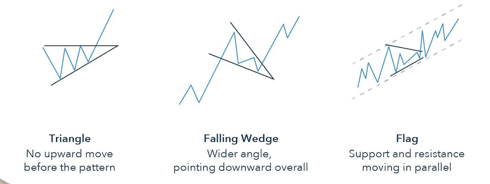
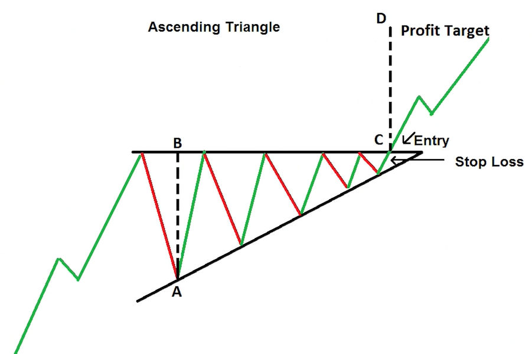
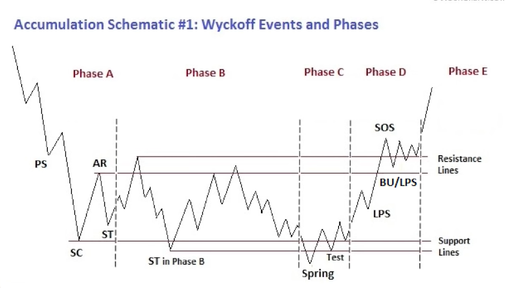

# Crypto Technical analysis

## Standard technical indicators

### Candles

Solid is start of period / end of period.  
Wick is the range of movement outside of this.  
Long wick means a strong bid / sel at the support / resistance level.  

### Triangles, falling wedge, flag

### Zones of support

Horizontal line, ceiling or floor. When breached, resistance becomes support.   

### Relative strength indicator RSI

Momentum to show over bought / over sold.  
Rate of change of the price over the last 14 periods.  

### Moving average

lagging indicator. Filters out noise, just the trend.  
SMA: average over period.  
EMA: exponential average, more weight to recent price.  
Price crossing moving average can be buy or sell signal.  

### Moving average convergence divergence MACD

Another momentum indicator  
Relationship between 2 moving averages.  
MACD line is 26 EMA - 12 EMA.  
Signal line is 9 EMA
Shows strength of current trend.  

### Stochastic RSI

another Momentum measure. oscillator.  
Take RSI and apply stochastic oscillator.  

### Bollinger bands

Measure the volatility of the market.  
SMA is middle band.  
Upper and lower bands normally 2 SD away from middle.  
Higher vol, wider bb lines.  
Overbought when close to or over the BB.  

## Wyckoff method

Composite man directs the market. Aim is to extract all the money from the retail traders with a series of peaks / troughs to scare people into selling.  
When everyone is relying on technical indicators, profitable to push the market above or below the support levels.  

Wyckoff movements require large volumes.  

