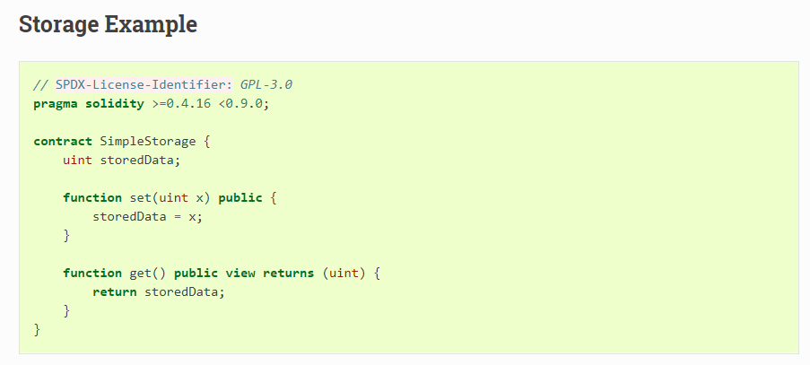
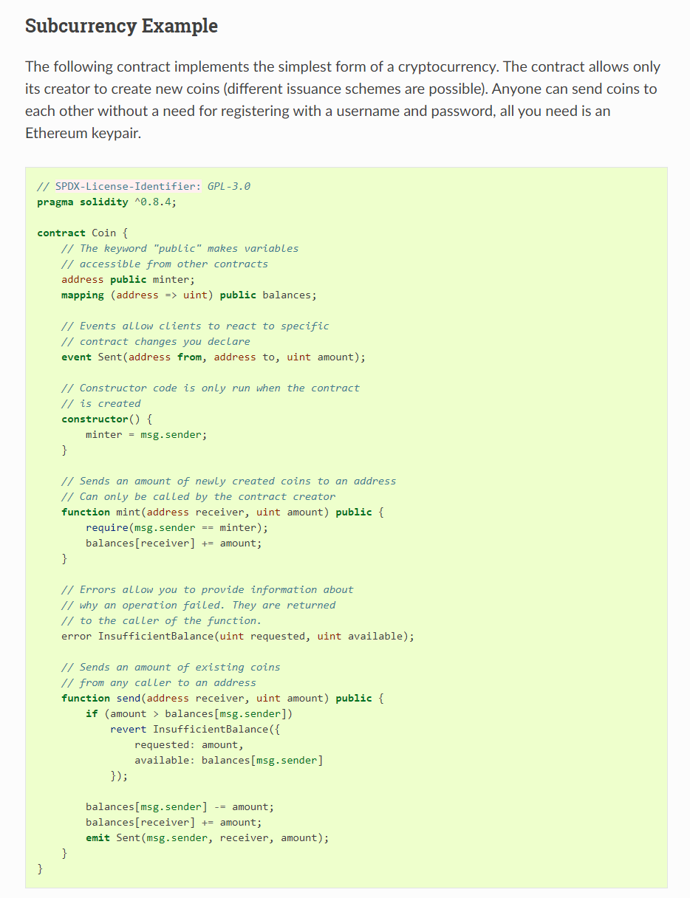

# Smart contracts on Etherium

## Basics

Contract is code (functions) and data (state) at a specific address on Etherium blockchain.

Example lets anyone store and any access the variable. History stored in the blockchain. Access restrictions to limit access.  

GPL to specify licence
pragma to specify the versions of solidity compatible.  

address: a type, 160 bit value for storing address of contracts, or hash of the public key for an external account.

public: for a variable, compiler generates public functions to get the variable.  

mapping (address => uint): map address to uint.

event: clients can react to this message

## Etherium Blockchain

blockchain is a globally shared transactional database.  
Anyone can read.  
A transaction has to be accepted by all others  
Transaction, so either 2 entries or not done at all. ACID transactions.  
Whilst your transaction being applied, no other transaction can be applied.  
Transactions always cryptographically signed by the sender (creator).  

separate Services: mining, hashing, elliptical curve cryptography, peer to peer networks.  

### Blocks

When spend same money twice (double spend attack), only one can be valid. Typically the first. But on peer to peer, so first is vague. Choice can be arbitrary, one will go in a block and that will become accepted and the second will be rejected.  

Blocks added in a chain. Etherium every 17 secs.  

Blocks at the tip of the chain may be reverted occasionally. More added, less likely.  

Up to the miners to choose which transactions in which block.  

### Etherium VM

Runtime environment for smart contracts.  
Completely isolated, so code has no access to the network, filesystem, processes, other smart contracts.  

#### Accounts

same address space, and same EVM treatment, for:

1. external accounts (controlled by humans with public private key pairs). public key is the external address.  

2. contract accounts (controlled by code stored with the account). Address from the time the contract created plus creator and transaction number (nonce).

Storage: Accounts have a persistent key-value store, mapping 256 bit words to 256 bit words.  

Balance: each account has a balance in Eth (or actually Wie, 10e-18 eth.). Can be modified.  

#### Transactions

Transaction is a message sent from one account to another account. It can include binary data (payload) plus Eth. If the target account contains code, the code is executed with the payload data as input.  

If target account is null, transaction creates a new contract. Address created. Payload is the EVM bytecode, and executed. Output of the execution permanently stored as the code of the new contract. This means that in order to create a contract, you do not send the actual code of the contract, but in fact code that returns that code when executed.  

While a contract is being created, its code is still empty. Because of that, you should not call back into the contract under construction until its constructor has finished executing.  

#### Gas

Upon creation, each transaction is charged with a certain amount of gas, whose purpose is to limit the amount of work that is needed to execute the transaction and to pay for this execution at the same time. While the EVM executes the transaction, the gas is gradually depleted according to specific rules.

The gas price is a value set by the creator of the transaction, who has to pay gas_price * gas up front from the sending account. If some gas is left after the execution, it is refunded to the creator in the same way.

If the gas is used up at any point (i.e. it would be negative), an out-of-gas exception is triggered, which reverts all modifications made to the state in the current call frame.

#### Storage, Memory and the Stack

The Ethereum Virtual Machine has three areas where it can store data- storage, memory and the stack, which are explained in the following paragraphs.

Each account has a data area called **storage**, which is persistent between function calls and transactions. Storage is a key-value store that maps 256-bit words to 256-bit words. It is not possible to enumerate storage from within a contract, it is comparatively costly to read, and even more to initialize and modify storage. Because of this cost, you should minimize what you store in persistent storage to what the contract needs to run. Store data like derived calculations, caching, and aggregates outside of the contract. A contract can neither read nor write to any storage apart from its own.

The second data area is called **memory**, of which a contract obtains a freshly cleared instance for each message call. Memory is linear and can be addressed at byte level, but reads are limited to a width of 256 bits, while writes can be either 8 bits or 256 bits wide. Memory is expanded by a word (256-bit), when accessing (either reading or writing) a previously untouched memory word (i.e. any offset within a word). At the time of expansion, the cost in gas must be paid. Memory is more costly the larger it grows (it scales quadratically).

The EVM is not a register machine but a stack machine, so all computations are performed on a data area called the **stack**. It has a maximum size of 1024 elements and contains words of 256 bits. Access to the stack is limited to the top end in the following way: It is possible to copy one of the topmost 16 elements to the top of the stack or swap the topmost element with one of the 16 elements below it. All other operations take the topmost two (or one, or more, depending on the operation) elements from the stack and push the result onto the stack. Of course it is possible to move stack elements to storage or memory in order to get deeper access to the stack, but it is not possible to just access arbitrary elements deeper in the stack without first removing the top of the stack.

#### Instruction Set

The instruction set of the EVM is kept minimal in order to avoid incorrect or inconsistent implementations which could cause consensus problems. All instructions operate on the basic data type, 256-bit words or on slices of memory (or other byte arrays). The usual arithmetic, bit, logical and comparison operations are present. Conditional and unconditional jumps are possible. Furthermore, contracts can access relevant properties of the current block like its number and timestamp.

For a complete list, please see the list of opcodes as part of the inline assembly documentation.

#### Message calls

Contracts can call other contracts or send Ether to non-contract accounts by the means of message calls. Message calls are similar to transactions, in that they have a source, a target, data payload, Ether, gas and return data. In fact, every transaction consists of a top-level message call which in turn can create further message calls.

A contract can decide how much of its remaining gas should be sent with the inner message call and how much it wants to retain. If an out-of-gas exception happens in the inner call (or any other exception), this will be signaled by an error value put onto the stack. In this case, only the gas sent together with the call is used up. In Solidity, the calling contract causes a manual exception by default in such situations, so that exceptions “bubble up” the call stack.

As already said, the called contract (which can be the same as the caller) will receive a freshly cleared instance of memory and has access to the call payload - which will be provided in a separate area called the calldata. After it has finished execution, it can return data which will be stored at a location in the caller’s memory preallocated by the caller. All such calls are fully synchronous.

Calls are limited to a depth of 1024, which means that for more complex operations, loops should be preferred over recursive calls. Furthermore, only 63/64th of the gas can be forwarded in a message call, which causes a depth limit of a little less than 1000 in practice.

#### Delegatecall / Callcode and Libraries

There exists a special variant of a message call, named delegatecall which is identical to a message call apart from the fact that the code at the target address is executed in the context of the calling contract and msg.sender and msg.value do not change their values.

This means that a contract can dynamically load code from a different address at runtime. Storage, current address and balance still refer to the calling contract, only the code is taken from the called address.

This makes it possible to implement the **library** feature in Solidity: Reusable library code that can be applied to a contract’s storage, e.g. in order to implement a complex data structure.

#### Logs

It is possible to store data in a specially indexed data structure that maps all the way up to the block level. This feature called logs is used by Solidity in order to implement **events**. Contracts cannot access log data after it has been created, but they can be efficiently accessed from outside the blockchain. Since some part of the log data is stored in bloom filters, it is possible to search for this data in an efficient and cryptographically secure way, so network peers that do not download the whole blockchain (so-called “light clients”) can still find these logs.

#### Create

Contracts can even create other contracts using a special opcode (i.e. they do not simply call the zero address as a transaction would). The only difference between these create calls and normal message calls is that the payload data is executed and the result stored as code and the caller / creator receives the address of the new contract on the stack.

#### Deactivate and Self-destruct

The only way to remove code from the blockchain is when a contract at that address performs the selfdestruct operation. The remaining Ether stored at that address is sent to a designated target and then the storage and code is removed from the state. Removing the contract in theory sounds like a good idea, but it is potentially dangerous, as if someone sends Ether to removed contracts, the Ether is forever lost.

Even if a contract is removed by selfdestruct, it is still part of the history of the blockchain and probably retained by most Ethereum nodes. So using selfdestruct is not the same as deleting data from a hard disk.

Even if a contract’s code does not contain a call to selfdestruct, it can still perform that operation using delegatecall or callcode.

If you want to deactivate your contracts, you should instead disable them by changing some internal state which causes all functions to revert. This makes it impossible to use the contract, as it returns Ether immediately.

## Examples
