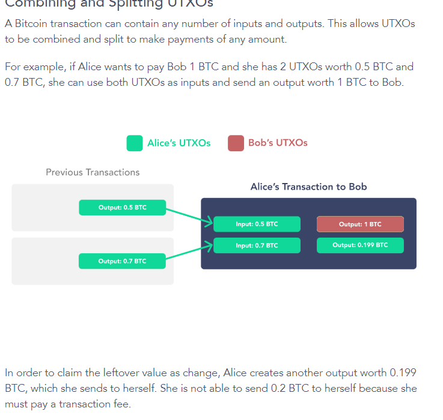
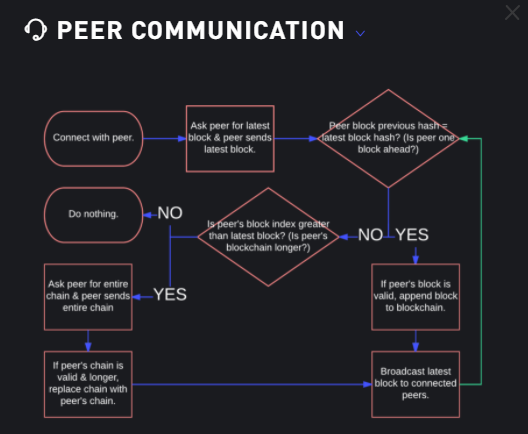
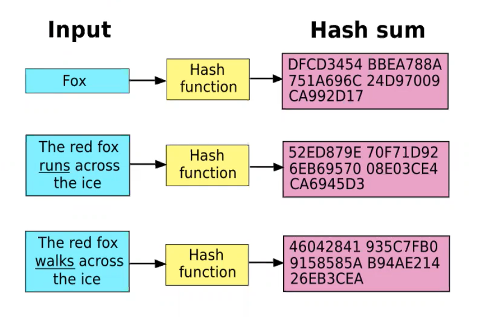
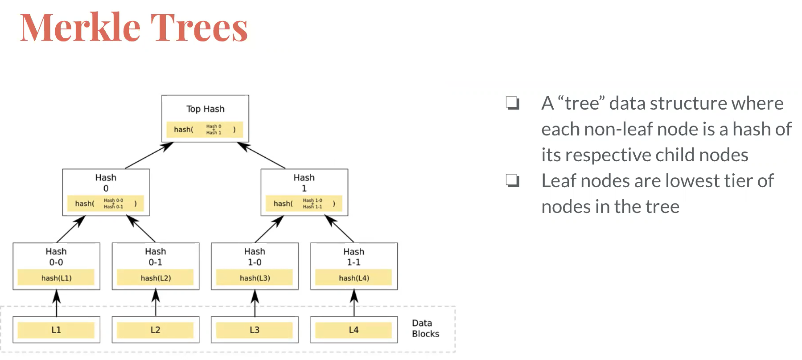
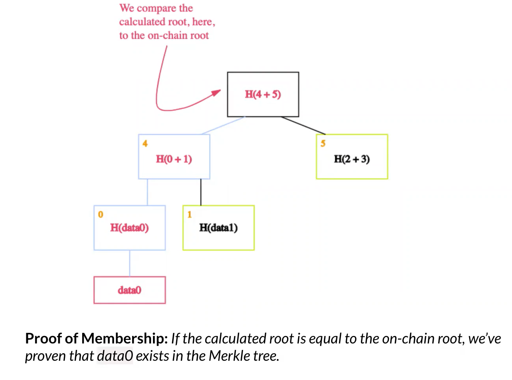
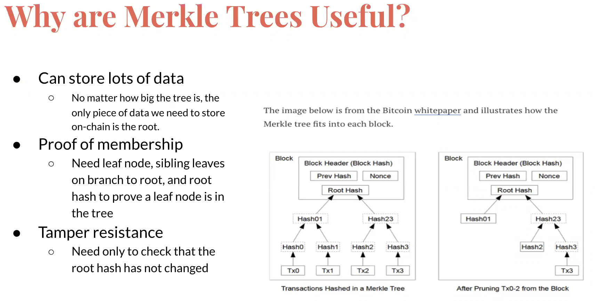

# Crypto Technology

- [Crypto Technology](#crypto-technology)
  - [Asymetric key encryption](#asymetric-key-encryption)
  - [blockchain](#blockchain)
    - [Blockchain mechanics](#blockchain-mechanics)
    - [Bitcoin transactions](#bitcoin-transactions)
    - [Bitcoin UTXO model](#bitcoin-utxo-model)
    - [Transactions vs accounts](#transactions-vs-accounts)
    - [Peers](#peers)
    - [Problems to be solved](#problems-to-be-solved)
    - [private blockchain](#private-blockchain)
  - [Consensus mechanisms](#consensus-mechanisms)
    - [Proof of Work](#proof-of-work)
    - [Proof of stake](#proof-of-stake)
  - [Merkle trees and hashing](#merkle-trees-and-hashing)
    - [Hash functions](#hash-functions)
    - [Merkle tree](#merkle-tree)
    - [Blockchain usage of Merkle trees](#blockchain-usage-of-merkle-trees)
  - [Decentralised web protocols](#decentralised-web-protocols)
  - [IPFS](#ipfs)
  - [Layer 2: lightning](#layer-2-lightning)
  - [The Graph](#the-graph)
    - [How The Graph Works](#how-the-graph-works)
  - [Web 3.0](#web-30)
  - [Smart Contracts](#smart-contracts)
  - [Bridges](#bridges)

## Asymetric key encryption

multiply 2 numbers is easy, to find the factors is hard.

Asymetric keys:
public key used to encrypt, private can decrypt.
So share the public, sender encrypts with it, decrypt with the private.
Can encrypt with either public or private

private key is for you to give authorisation (or verification). Never send private key. public key derived from the private key, can be sent over the internet, used to decrypt. Can't get from the public key to the private key.

message plus private key gives a message signature. send this message and signature to someone else. Recipient has the public key. Can use the public key to verify that the message was signed with the private key. The public key is the account id.

Algorithm to generate keys can be

- RSA (3 names)
- ECC: elliptical curve (elliptical curve: cubic terms, that gives one of the numbers). Used by Bitcoin, etherium.
- DSA digital signature algorithm
e.g. SSL uses 2048 bit RSA keys.

Asymetric key pair gives security of message and identity of sender.

Security of message

- sender: looks up the public key of the recipient, encrypts a message with it
- recipient uses their private key to decrypt it.

Identity proof

- sender uses private key to encrypt a message,
- recipient (or anyone) and use the senders public key to decrypt it. If you can decrypt with th public key, it must have come from teh private key, so identity proved.
- transmission not secure but proof of origin.

Quantum compute is a threat.

## blockchain

Blockchains are p2p, open source, public.
Consensus mechanisms protect from cyber attacks.
Lots of copies so no points of failure..
POW: nee 51% of nodes to agree a change to blockchain,
Transaction = block. Lots of blocks in a blockchain, Record of movements.
past blocks are inflexible, unless 51% of people agree which is an unlikely scam.

### Blockchain mechanics

demo at https://blockchaindemo.io/

Block has:

- index: incrementing
- timestamp: keeps order
- hash: digital fingerprint, nearly unique, one way. For bitcoin, valid hash has a number of zeros at the start. Number of zeros is the difficulty. Covers all the data, previous hash, timestamp, index etc so all is unalterable
- previous hash
- data: transactions
- nonce: number used in combination with the other data inputs to get a hash which is valid, ie with the leading zeros.

Mining means determine the nonce.
Can't change block data without changing the hash, and that invalidates subsequent blocks.

### Bitcoin transactions

Address is a representation of a public key, can have multiple.  
Most wallets will automatically create new public keys each time you want to receive bitcoin.  
Transaction must be signed with private key of the owner of the UTXOs  

### Bitcoin UTXO model

Unspent transaction output is a discrete bit of bitcoin, any amount.  
Input to a transaction is a set of UTXOs, the output of the transaction is a UTXO.  
UTXOs can be combined or split to make further payments.  
Like coins: spend a UTXO, get unspent UTXO output as change.  
Most are dust, nearly valueless.  
Combine them in the next transaction, then they are spent, and a new UTXO is created.  

UTXOs stored in the UTXO set. 

Miners do **coinbase** transactions, these are different. No inputs, just outputs. That's a new UTXO.  
You can trace the history of UTXOs through transactions.  

### Transactions vs accounts

Transactions have benefits:

- bitcoin makes it easy to set up multiple accounts, no apparent connection between accounts, so better privacy
- accounting is secure as it's about the coins. In account based systems, it's very hard to get a complete picture as chargebacks and overdrawn accounts.  
- transaction based with coins and UTXOs are easy to add up.  

### Peers

Peers exchange last block when they connect.
If the peer is one block ahead, requests one block.
If peer is ahead and valid, requests whole blockchain and replaces it.
Ends up with all peers moving to latest blockchain.
If one goes wrong, will be superseded by the corrected chain.

### Problems to be solved

- Keep records of ownership
- avoid double spending
- generally solved with centralised authorities, which can be corrupted.
- visible trail
- remove centralised problem of corruption of central authority.
- avoid falsification

Need 5 things

1. peer to peer network nodes, equally privileged.
2. cryptography to verify messages and prove ownership
3. consensus mechanism to add new blocks. POW / POS / others
4. punishment and reward to make it in your best interest to follow the rules.
5. market adoption to get punishment / rewards meaningful

### private blockchain

companies screen participants  
not decentralised.  
could just share a spreadsheet - not using decentralization / tamper proof features.

## Consensus mechanisms

### Proof of Work

Needs multiple consensus to add to blockchain
every 10 mins
rewards in BTC - halfings half rewards, about every 4 years.
Used by BTC, Litecoin, etc

### Proof of stake

Deposit funds on a node as a stake. Contest to forge the next block. Winner chosen based on stake, time of stake, plus random. This means it's hard to take control.
e.g. Cardano.

- ETH was POW until 2020. ETH 2.0 is POS.
- Need to lock up 32 ether as collateral on each node.
- Soon Eth 2.0 will merge with ETH 1.0, 2022 - the docking. Then just POS
- only get staking rewards after docking.
- For Eth 2.0, each validator gets a share of the next block. Pie reduces as more validators. Staking calculators.
- Signing up hard: only 900 new validators per day. 20K validators waiting now.
- Needs dedicated computer with online connection. Can be penalties for problems.
- Alternative simpler staking solutions: e.g. some exchanges can do it for you. But need to let exchange control the coins.
- Staking pool: group doing the staking. reduces minimum stake. But is it reliable, customer support, user reviews, collateral etc.
- Validator as a service: rent a validator, your stake. easy to do but get control.

## Merkle trees and hashing

### Hash functions

Hash function: one way algorithm which maps an input to a fixed size output of bits.  
Pass in any size data, get fixed length.

- deterministic (repeatable)
- infeasible to reverse
- collision resistance so nearly unique
- avalanche effect so small change gives complete change
- hash speed

So huge amounts of data identified solely through hash value. Like a fingerprint.

examples: Good application with e.g. email: hash it, pass the hash, check at the other end that it's not been altered.
examples: download hash to check file is good. e.g. ledger download.  

### Merkle tree

Merkle tree / hash tree - data tree data structure where each non-leaf node is a hash of it's child nodes.  

Properties:  

- check lots of data quickly: If the root hash is not changes, you can be confident all root nodes have not been changed.
- proof of membership: you can check if a price of data is in the tree by checking the hash of a small part of the tree
- tamper resistant: it's not been changed

### Blockchain usage of Merkle trees

Bitcoin just a Merkle tree
Etherium uses Merkle Patricia tree
Git: version control in MT.

Uni allocation to 100k people: UNI generates file with 100k proofs. You log in, it gets your wallet, checks for the proof in the file, passes to smart contract, that did the transfer. Better than doing 100k transfers.  

## Decentralised web protocols

Good training / demo site:
https://proto.school/

## IPFS

interplanetary file system. Peer to peer file storage.  

HTTP downloads from one computer at a time.  
IPFS downloads from multiple
Distributes the hash so you can work out where to access your data from  
Stores all versions of data permanently  
Can link from blockchains to immutable permanent links, so you don't need to store it all on the chain.  
Can connect to other peers directly  

Because content stored in multiple locations, can't easily address by location Instead address by hash of the content.  
New versions get a different address
Problem when an update, you want the latest version, but the id has changed. Uses mutable file system MFS.

Covers web pages, files, apps, data.

1. Content addressing: protocol to make addresses translatable across protocols.
2. Directed acyclic graphs (DAG): Merkle DAGs each node has a unique id which is a hash of the contents. Hash of the child blocks.
3. Distributed Hash tables (DHT): database of key / values. Handles which peers have which content, and routing to the peer.  

## Layer 2: lightning

Layer 2 doesn't store transactions on the blockchain, so no mining, fast and cheap.  

- 2 parties agree to open a lightning channel, each store some bitcoin on the channel.
- multisig
- defined amount of bitcoin
- bitcoin moved between the 2 participants, any number of transactions, quickly
- close with another on chain transactions, reflects the net change
- can use a third party to pass on the payment for a fee, with guaranteed delivery.
- many implementations of the protocol, all compatible

## The Graph

https://thegraph.com/docs/introduction#what-the-graph-is

Decentralised protocol for indexing and querying data from blockchains, 1st is Etherium.  
Makes it possible to query data which is difficult to query directly.  

Some queries easy, where the contract exposes useful methods.  
But where the query is more complex it's hard.  
Can take a long time to get an answer because of finalization, block reorganisations, uncycled blocks etc.  

The graph solves with a hosted service which indexes blockchains.  
These are subgraphs.  
Can then be queries with standard GraphQL API.  
Will move to non hosted decentralised.  

### How The Graph Works

The Graph learns what and how to index Ethereum data based on subgraph descriptions, known as the subgraph manifest. The subgraph description defines the smart contracts of interest for a subgraph, the events in those contracts to pay attention to, and how to map event data to data that The Graph will store in its database.

Once you have written a subgraph manifest, you use the Graph CLI to store the definition in IPFS and tell the hosted service to start indexing data for that subgraph.

- A decentralized application adds data to Ethereum through a transaction on a smart contract.
- The smart contract emits one or more events while processing the transaction.
- Graph Node continually scans Ethereum for new blocks and the data for your subgraph they may contain.
- Graph Node finds Ethereum events for your subgraph in these blocks and runs the mapping handlers you provided. The mapping is a WASM module that creates or updates the data entities that Graph Node stores in response to Ethereum events.
- The decentralized application queries the Graph Node for data indexed from the blockchain, using the node's GraphQL endpoint. The Graph Node in turn translates the GraphQL queries into queries for its underlying data store in order to fetch this data, making use of the store's indexing capabilities.
- The decentralized application displays this data in a rich UI for end-users, which they use to issue new transactions on Ethereum.
- The cycle repeats.

## Web 3.0

Websites & apps can process info in a smart human like way, using ML and big data.  
Data decentralized, smart contracts.  
Convergence with blockchain and crypto currencies.  
Defi.  

## Smart Contracts

Designed to facilitate / verify, enforce negotiation or execution of a contract, without 3rd party.  
Exchange things of value without intermediary.  
Don't need an intermediary when you use one so cheaper.  
Automatically executed to transfer money or produce / service.  
Define the penalties around an agreement, and automatically enforce the agreement.  

Written as code, stored on blockchain.  
Publicly visible.  
Triggered on events (e.g. date, target price)
Privacy of actors but public visibility of contract.  

Certainty of outcome if conditions are met, so no need for intermediary.  
E.g. lease a flat, release the key for payment.  
Don't need a trustee in the centre, automated.  

Everyone in the supply chain can see status, and e.g. trigger an action to make a new product on delivery of a different one.  

## Bridges

