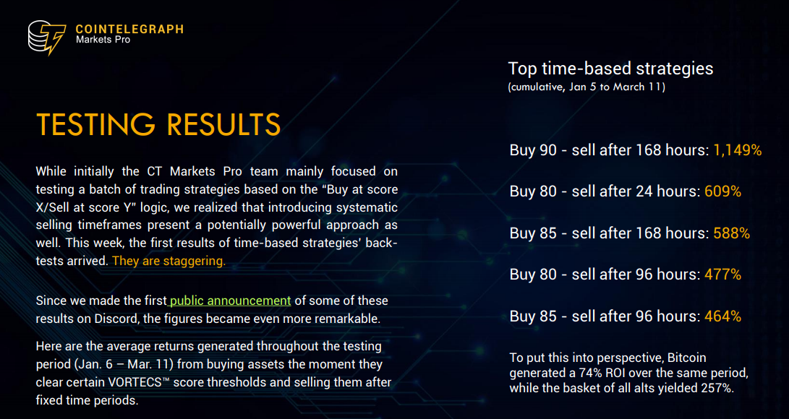
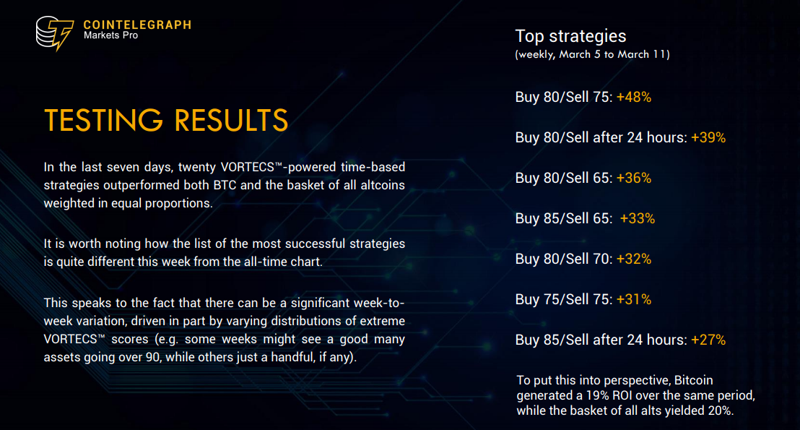
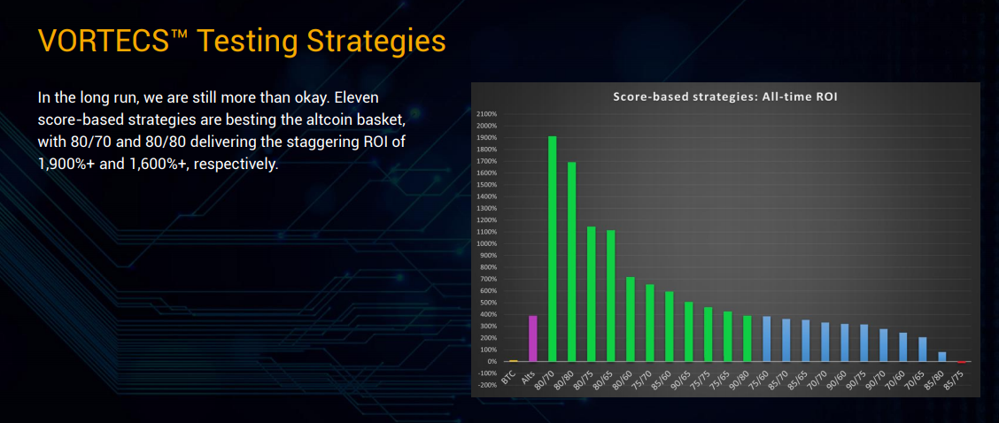
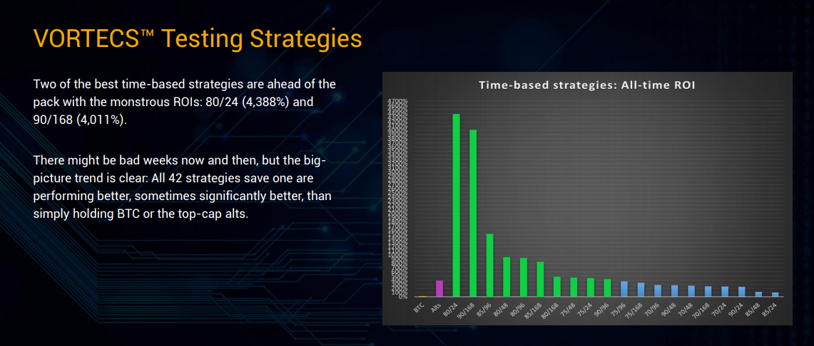
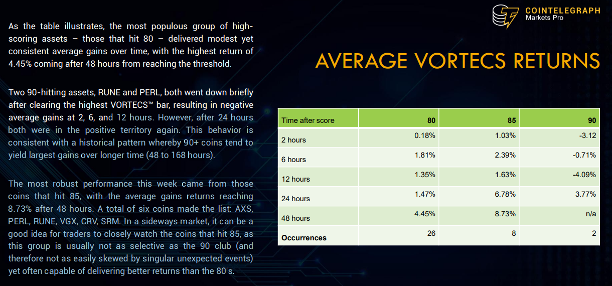
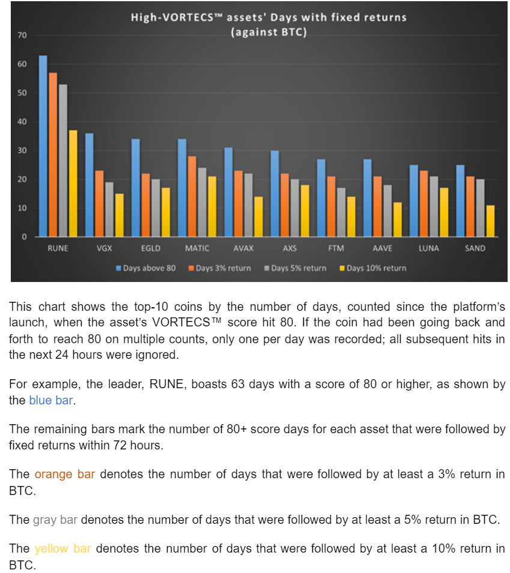
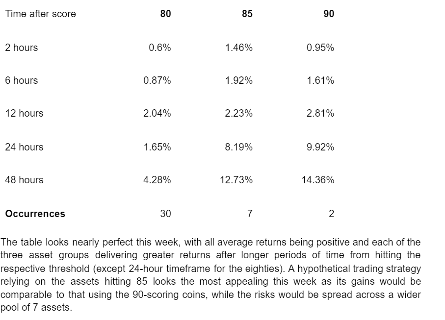

# Crypto Vortecs

## Assumptions and implementation

The average time to peak price amplitude (up or down) ranges from a few hours to several days

As mentioned above, timing is secondary to assessing market outlook in terms of historical directional change and magnitude. So strategies with strict timing rules (e.g. buy at 80, sell in 24 hours) tend to do worse than score-based strategies.

However, timing-based strategies still do beat the market on average.

The user sees a smoothed score over the last 12 hours (updated every 5 minutes), which is thus an average of 35-50 raw scores (half of the last day of scores). This smoothing provides a more accurate estimation of market conditions.

To address movements relative to other coins, we also consider dominance change (“Dom Change”). This is how much the coin’s market cap dominance changed over the same period. Market cap dominance is the market cap of a particular asset divided by the total market cap of all cryptocurrencies. Thus, if everything goes up 5%, the market cap dominance of every asset does not change.

This is further reflected in the time it takes to reach a peak return (maximum value of market cap dominance). We find that on average, it takes about 3.5 days to achieve maximum returns after a score first crosses a score threshold. However, keep in mind that a score may stay above a certain threshold for multiple consecutive days, indicating a large buy window.

The Sharpe ratio gives a measure of how consistent the strategy is, where larger values represent more consistent, positive returns. Specifically, it is the average hourly return divided by the standard deviations of hourly returns. Thus, a high Sharpe ratio can either come from very high, positive hourly returns, and/or from low standard deviations in returns.

We find that high score thresholds (90) with small look-back windows (12, 24 hours) show the largest ratios, but still relatively high final balances. This implies that they are making riskier “all-in” bets. Because 90’s come less frequently, a strategy that uses X = 90, Y = 24 will often be holding no alts (defaults to BTC when there is nothing to buy).

## indicators

Twitter for social sentiment
Volume says if this is real

## strategies

1. Buy when first crosses a threshold, hold for a certain time
2. Buy when crosses over score X, sell when falls below Y

2 is better performing. 

The best returns we found between these two strategies was 3.8x, simply buying and holding a coin while its score is above 80. This performance is shown by the orange line in the bottom plot.

The highest Sharpe, however, was achieved with buy at 80, sell at 60. This strategy holds more coins at any time, on average (because it takes longer to sell). Thus, performance is not determined by single “homeruns”.

