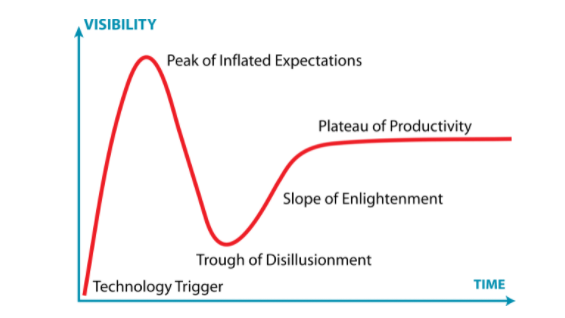
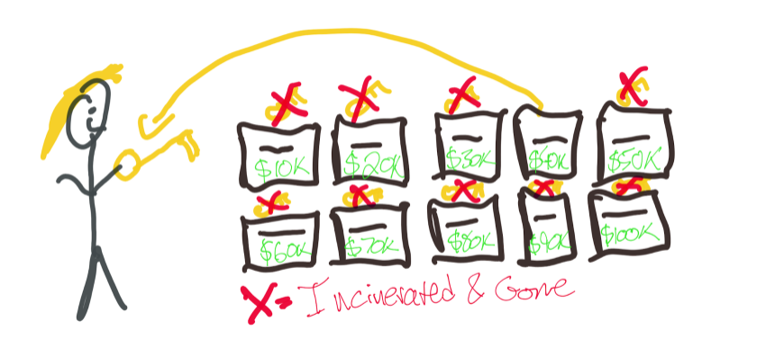

# Zero knowledge proofs

## summary

ZKPs essentially let someone prove that they know or have something without giving up any information about what they know or have.

For example, I could prove that I know the password to an account without entering the password and risking its exposure, or that I have enough money to cover rent for the next year without telling some random broker all of the details of my personal finances. The technology has implications for personal privacy, crypto, businesses, and even nuclear disarmament.

What’s ultimately so promising about ZKPs is that they have the potential to eliminate a major trade-off inherent in living, working, and transacting online: the convenience, speed, reach, and scale of the internet in exchange for our privacy. They also allow for nuance in a privacy landscape that’s often black-and-white. 

## Example: balls

My color blind friend and I are looking at balls on a table that are identical except that one is red and the other green. He is not sure that he believes me when I tell him they are two different colors. We decide to establish that they are, in fact, different colors by playing a game: 

I give him the two balls to hide behind his back. 

He takes one ball out and shows it to me. 

Then he puts this ball back behind his back, withdraws his hand again, shows me a ball and asks, “Did I switch the balls?” 

If we repeat this game enough times, and if I answer correctly every time, then I will demonstrate to him that the balls are almost certainly two different colors. Importantly, here, I have proven this to him without revealing any other information. Perhaps frustratingly for him, he still doesn’t know which ball is red and which ball is green.

In such a system, there are two parties: a prover of some information and a verifier of that information. Generally in these systems, it is assumed that the prover cannot be trusted while the verifier can be. It is the goal of the system to be designed in such a way that: 

- The verifier can be convinced of a true statement by an untrusted prover, and 
- That it is impossible for the prover to convince the verifier of an untrue statement.

## Example: passwords

When you go to login to a website using a password, often what happens is that you type in your password and send it to the server, which condenses your password into a string of gobbledygook and then compares it to see if it matches the gobbledygook they have stored next to your name in their system. If the values are the same, you’re in. The gobbledygook is there as a layer of password protection: your password cannot be derived from it and it keeps the company or whoever from storing your password as plaintext. However, there is still an issue here: you are still disclosing your password to the server in the first place! Protocols for using zero-knowledge proofs to solve this vulnerability were uncovered over the course of the 2000s: some of the first examples of applying ZKPs to a real-world problem.

## Example: zcash

In Zcash, zero-knowledge proofs specifically enable the network of computers running the Zcash protocol to verify that every transaction is valid (i.e. I actually have the 10 Zcash I am sending to you) while maintaining the privacy of the transaction data.

Example: proving income

You need to check if someone has enough income to pass a threshold to rent a flat. Create lots of boxes, each for a different amount. Retain the key to the threshold you set, and throw away the rest. Get the customer to put in each box if their salary is over or under that amount. Open the box at the end, you can see if they have over that amount.

They've not told you much, but have told you something. Just enough to pass the test. And still not a proof because it's self assertion. Bit if you do this digitally with many more boxes, and automated digital completion of the form, digital evidence?

## Example: stable coin payments

Why don’t these businesses use something like Zcash then? Or a privacy-oriented stablecoin? Because, in addition to worrying about data security, these businesses also have to worry about compliance! They can’t use something that is all the way at the other end of the privacy spectrum because they will not have an audit trail to prove that they were making a payment to a known counterparty and not, say, a sanctioned state actor or a terrorist organization?

The cool thing about ZKPs as they are being developed today is that they facilitate not only privacy functionality, but also selective disclosure of knowledge! As such, you can now imagine (and build) a stablecoin product that would meet both the data and compliance needs of a company: an asset for which the issuer could have a complete audit trail and be able to verify the compliance status of all of the holders, but which, to the view of most of the world, moves around completely privately among anonymous accounts.

## Example: scaling

Novel designs of blockchains leverage ZKPs to do away with this problem. The entire history of transactions can be compressed down to a single proof. Rather than verify the whole ledger, now you can just verify the proof. That proof will never be more than the size of a few tweets, meaning it can be done by anyone. 

## Example: Commitment schemes, rock paper scissors

Commitment schemes are a crucial ingredient of ZKPs and frankly, of cryptography in general. In simple terms, they are cryptographic primitives that allow a party to commit to a specific value without revealing the actual value while providing a way to reveal the value and verify the commitment in a later phase.

More formally, let C be a commitment scheme, it must provides these two properties:

- Hiding: Hard to distinguish between commitments of different values. i.e:
- Binding: There should be no way for a person who commits to one bit, to claim that he has committed to another value later:

One way to create a commitment scheme is by using one-way hash functions and cryptographically secure random bytes. It should be noted that in such case the security of the scheme is governed by the cryptographic assumptions of the hash function itself (i.e. it’s truly one-way).

To add more clarity, let’s walk through an example with the usual suspects. Alice and Bob decide to play a game of rock, paper, scissors digitally. They both make their choices and exchange them such that a winner is decided. Naturally, in a digital world, one of them has to share his/her pick first, which brings her/him in a disadvantageous position as he/she can just share a different choice after reviewing what the other player picked. This is exactly the kind of problems that commitment schemes solve!

Alternatively, they can create a commitment based on their choices and share the commitment instead of their actual choice! For instance:

Let a set:  
S = {“Rock”, ”Paper”,”Scissors”}  
Bob and Alice both randomly pick Pᴬ and Pᴮ from S respectively. Now they calculate: ( || -> represents concatenation)  
Cᴬ = sha256(Rᴬ || Pᴬ) and Cᴮ = sha256(Rᴮ || Pᴮ)  
Bob shares Cᴬ with Alice and Alice Cᴮ with Bob. Note that by now, they both committed to these values.

Finally, they share their original choices and random bytes Pᴬ, Rᴬ and Pᴮ, Rᴮ. With this information, each party can verify the commitment by hashing P || R and assert their equivalence. Based on their picks the winner can be decided and none of them could have altered their initial choice since the hashes wouldn’t match.

## Example: Sudoku proof

https://medium.com/coinmonks/walkthrough-of-an-interactive-zero-knowledge-proof-for-sudoku-puzzle-ac563588f1a8

You want to prove you've solved it but not give away the solution. 

Transpose the answer to new numbers  
get a random nonce for each cell  
hash the transposed answer + nonce for each row / column / grid  
Pass over these values (commitment)

Validator chooses one row or col or box  
pass the transposed numbers and nonces for those  
validator checks the commitment  
validator checks the solution.  

repeat whole process multiple times

but: if you don't change the nonce and transpose scheme and pass multiple, you've given away all the knowledge. So you need to rerun with different transpose scheme and nonce each time.

## The NP (for non-deterministic polynomial time)

NP is a complexity class on describing problems where the soundness of their solutions have proofs which can be efficiently verified by deterministic computations in said polynomial, or let’s say linear-sequential blockchain time.  
