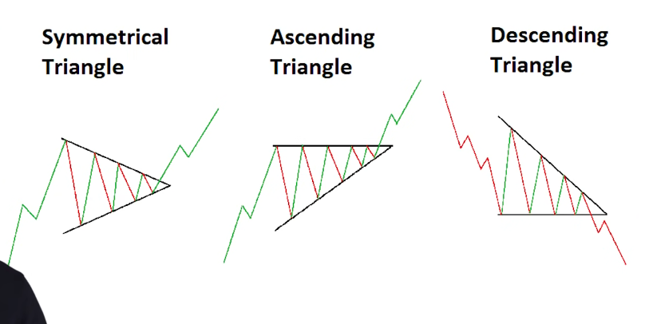
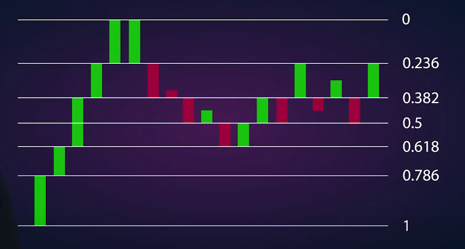
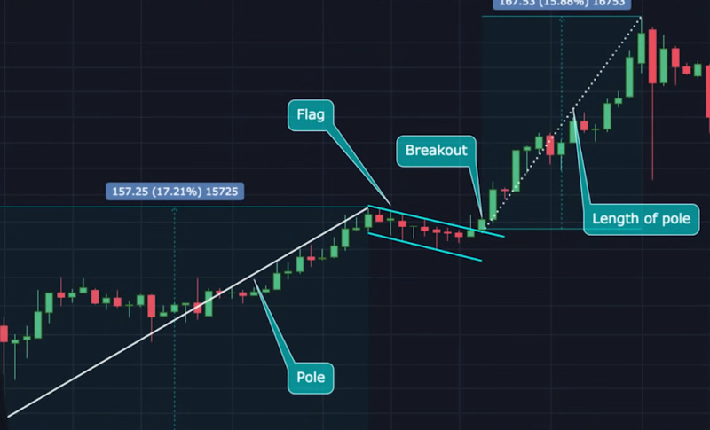
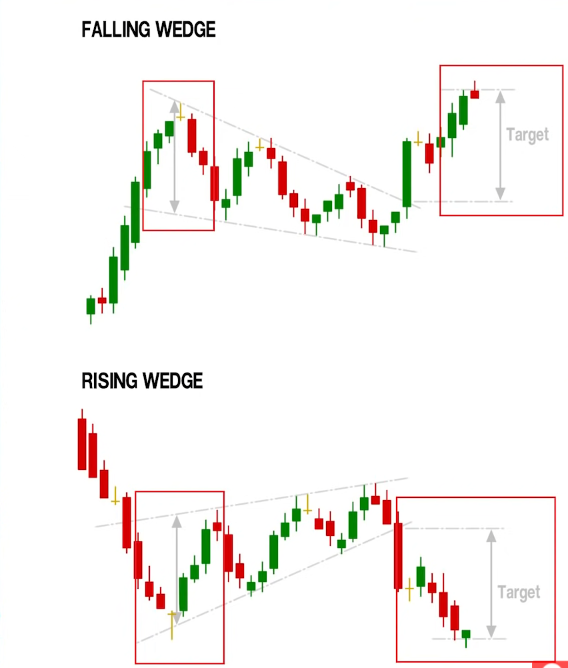
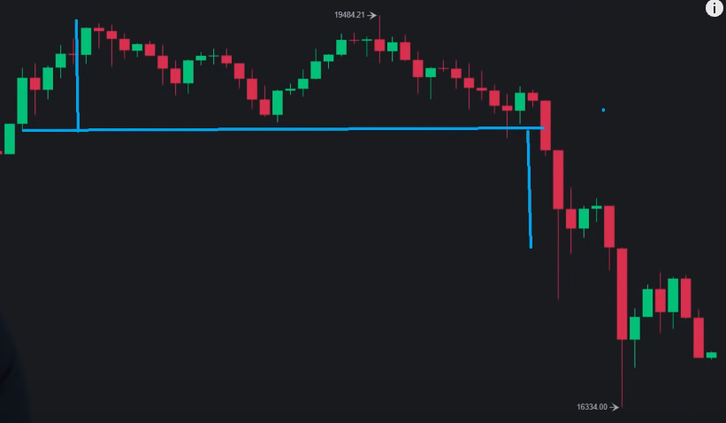
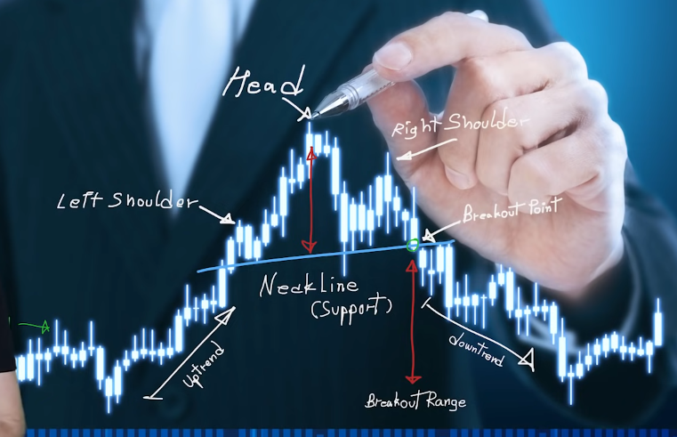

# Technical analysis

Based on human emotion.

## Candlesticks

Candle is one time interval
Body represents open and close, green if went up
wick represents high and low in the interval.

Long wick on bottom means people buying hte dup - bullish.
Long wick at top means people selling the peak - bullish.
But need to use volume to show if these are meaningful.

Check volume at small time interval to check market is liquid.

if downtrend, but volume is low and decreasing, the downtrend is not strong. The bulls are ready. Volatility increases as volume decreases.

## Lines

- support
- resistance
- price pattern

Draw support and resistance lines shows price patterns.

Ascending triangle: resistance line flat, support line angled up. When it gets to the end, it will break out upwards.  
Use the left of the triangle to show the strength of the move.  

Resistance lines often at psycologically important numbers.  

## Technical indicators

### Moving averages

EMA are exponential moving averages. More emphasis on the recent time periods, react faster to price changes.  
200 day EMA is the base case for the price zone. May hit resistance when crosses 200 day EMA.  

Death cross: shorter term EMA crosses long term EMA from above.  
Golden cross: shorter term EMA crosses long term EMA from below. Many good days ahead.  

### MACD

Moving average convergence divergence.  
Used for new trends in price, plus vol indicator.  
When 2 lines far apart, price vol is low.  
When 2 lines close, price vol is high.  
When lines cross, price will change direction soon.  

### RSI

Relative strength index.  
Tells you if chart is undervalued or overvalued.  
Range of 0 to 100  
When < 30, undervalued. Time to buy.  
If > 70, in a bubble, sell.  
Trend of RSI line tells you which direction.  
If between 30 and 70, price is ok.  

calculated by: 

### Bollinger bands

Measures volatility.
Wider bands indicate more volatility.
Buy when low vol and sell when high vol, assuming price goes up.
When outside of indicator, there will be mean reversion.

### Fibbonnacci

Naturally occuring, shows natural levels of support and resistance.  
Need to identify 2 points: the swing high and swing low. These are points of obvious change from bear to bull.  
Draw fib indicator between low and high if looking for how high it can go.

0.5 line on fib indicator is the strongest point of resistance. When falls below this, could be big change coming.

### Bitcoin dominance

Bitcoin dominance rising, alts to BTC, and vice versa.  
When bitcoin is sideways people go to alts. When BTC moves, people back to BTC.  

### Sentiment analysis

Look at twitter for feeling.  

## Patterns

### Bull flag

Uptrend in medium term, then a pull back with low volume. (If volume is high, more likely to be a correction).  
Identify the flag, then find the pole.  
Bottom of the pole is at the start of the med term uptrend, top of the pole is the start of the downturn.  
Bear flag breaks with the first big candle  
Likely % change is the same as the pole % change
Logic is that ma strong medium trend overrides a short term trend. 

Bear flag the other way around.

### Wedges

Easy to spot. 2 trend lines converge.
Vol is declining, it's time for a trend reversal. 

Rising wedge results in a drop in price, and vice versa.
Look at the widest part of the wedge to see the likely change when the wedge breaks.  
Wedge breaks when a candle is outside of the wedge.

### Double top

Tries to break a resistance level twice.  
Looks like letter M for double top, W for double bottom.  
Likely to see a drop after a double top, size is same as the height of the double top.

 

### Head and shoulders

Middle peak is large, shoulders peaks are smaller (bit not necc same size).
Signals start of a downtrend  
Size of downtrend from the distance from support line to middle peak.  

## Time frames

What you see changes dep on time frame.  
Swing traders are one day or longer.  
Day are one day or less
Scalp traders are second by second.  

The longer the time frame the stronger the trend.  

## Swing trading

1. Follow the trend
2. Patterns
3. Moving averages
4. Indicators
5. Wait if it doesn't make sense.

Long term trend focussed. Do this on long term uptrend coins.  
Use log scales to see better.  

