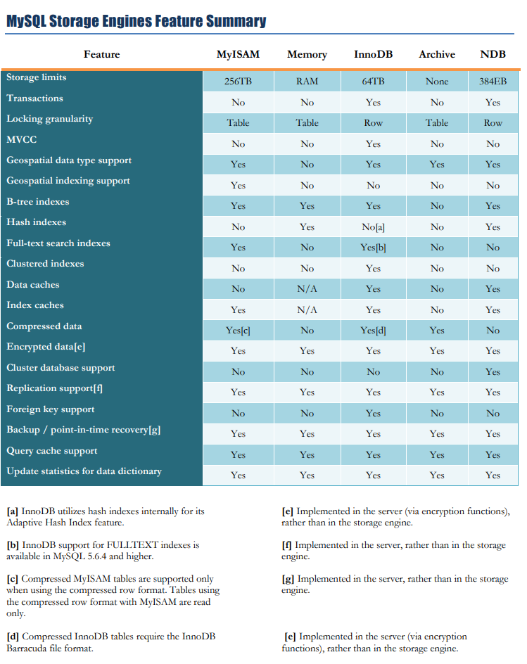
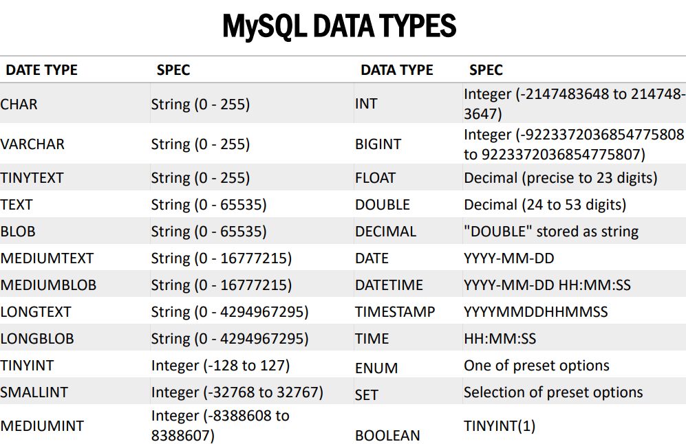

<LINK href="jb1.css" rel="stylesheet" type="text/css">

#### [Back to index](index.html)

# MySQL

- [MySQL](#mysql)
  - [New Features for me](#new-features-for-me)
    - [replace](#replace)
    - [group_concat](#group_concat)
    - [SHOW](#show)
    - [Explain](#explain)
    - [Function names](#function-names)
    - [select into](#select-into)
    - [UPDATE Differences](#update-differences)
  - [usage and conventions](#usage-and-conventions)
  - [Queries](#queries)
    - [odds and sods](#odds-and-sods)
    - [field](#field)
    - [limit](#limit)
    - [Alias](#alias)
    - [Joins](#joins)
      - [Inner join](#inner-join)
      - [USING syntax](#using-syntax)
      - [Left join](#left-join)
      - [Right join](#right-join)
      - [Cross join](#cross-join)
      - [Join operators](#join-operators)
      - [Where conditions vs ON clause conditions](#where-conditions-vs-on-clause-conditions)
      - [Self join](#self-join)
    - [Group by](#group-by)
    - [Rollup group by](#rollup-group-by)
    - [Subqueries](#subqueries)
    - [Materialized subquery / derived table](#materialized-subquery--derived-table)
    - [Correlated subquery](#correlated-subquery)
    - [Exists subquery](#exists-subquery)
    - [Derived tables](#derived-tables)
    - [Common table expressions (CTE)](#common-table-expressions-cte)
    - [Union](#union)
    - [Minus](#minus)
    - [Intersect](#intersect)
  - [Ordering](#ordering)
  - [Data modification](#data-modification)
    - [Insert](#insert)
      - [Insert duplicate keys](#insert-duplicate-keys)
      - [Insert IGNORE](#insert-ignore)
      - [Strict mode](#strict-mode)
    - [Update](#update)
      - [Update Join](#update-join)
    - [Delete](#delete)
    - [Replace](#replace-1)
    - [prepared statement](#prepared-statement)
  - [Transactions](#transactions)
    - [transaction control](#transaction-control)
    - [Locking](#locking)
      - [Read lock](#read-lock)
      - [Write lock](#write-lock)
    - [Generated columns](#generated-columns)
  - [Managing databases and tables](#managing-databases-and-tables)
    - [Creating, managing](#creating-managing)
    - [Storage engines](#storage-engines)
    - [Create table](#create-table)
    - [useful dynamic scripting of DDL](#useful-dynamic-scripting-of-ddl)
    - [SQL Sequence](#sql-sequence)
    - [Temporary tables](#temporary-tables)
  - [Datatypes](#datatypes)
  - [Constraints](#constraints)
    - [Primary keys](#primary-keys)
    - [Foreign keys](#foreign-keys)
    - [Unique constraint](#unique-constraint)
    - [Check constraints](#check-constraints)
  - [Character set and collation](#character-set-and-collation)
  - [Importing CSV data](#importing-csv-data)

## New Features for me

Covers MySQL V8.0

### replace

REPLACE works exactly like INSERT, except that if an old row in the table has the same value as a new row for a PRIMARY KEY or a UNIQUE index, the old row is deleted before the new row is inserted

### group_concat

This function returns a string result with the concatenated non-NULL values from a group. It returns NULL if there are no non-NULL values

```sql
SELECT student_name,
GROUP_CONCAT(DISTINCT test_score
ORDER BY test_score DESC SEPARATOR '   ')
FROM student
GROUP BY student_name;
```

### SHOW

extension.  
SHOW has many forms that provide information about databases, tables, columns, or status information about the server.

```sql
SHOW CREATE PROCEDURE proc_name
SHOW CREATE TABLE tbl_name
SHOW TABLE STATUS [FROM db_name] [like_or_where]
SHOW [FULL] TABLES [FROM db_name] [like_or_where]
SHOW TRIGGERS [FROM db_name] [like_or_where]
SHOW [GLOBAL | SESSION] VARIABLES [like_or_where]
SHOW WARNINGS [LIMIT [offset,] row_count]
```

### Explain

The DESCRIBE and EXPLAIN statements are synonyms. In practice, the DESCRIBE keyword is more often used to obtain information about table structure, whereas EXPLAIN is used to obtain a query execution plan (that is, an explanation of how MySQL would execute a query).

DESCRIBE is a shortcut for SHOW COLUMNS. provided for compatibility with Oracle.

When EXPLAIN is used with an explainable statement, MySQL displays information from the optimizer about the statement execution plan.

### Function names

Independence of function names from table or column names. For example, ABS is a valid column name.

### select into

MySQL Server doesn't support the SELECT ... INTO TABLE Sybase SQL extension. Instead, MySQL Server supports the INSERT INTO ... SELECT standard SQL syntax, which is basically the same thing. See Section 13.2.6.1, “INSERT ... SELECT Statement”. For example:

```sql
INSERT INTO tbl_temp2 (fld_id)
    SELECT tbl_temp1.fld_order_id
    FROM tbl_temp1 WHERE tbl_temp1.fld_order_id > 100;
```

### UPDATE Differences

If you access a column from the table to be updated in an expression, UPDATE uses the current value of the column. The second assignment in the following statement sets col2 to the current (updated) col1 value, not the original col1 value. The result is that col1 and col2 have the same value. This behavior differs from standard SQL.

```sql
UPDATE t1 SET col1 = col1 + 1, col2 = col1;
```

## usage and conventions

- ; delimiter, each statement executed in sequence
- change delimiter with `DELIMITER delimiter_character`
- A stored procedure typically contains multiple statements separated by semicolon (;).  To use compile the whole stored procedure as a single compound statement, you need to temporarily change the delimiter from the semicolon (;) to anther delimiters such as $$ or //:
- to get current database, ```select database()```
- there's a default db for a login
- to get current connection id, ```SELECT CONNECTION_ID()```
- to get processes, ```SHOW PROCESSLIST```

```sql
DELIMITER $$

CREATE PROCEDURE sp_name()
BEGIN
  -- statements
END $$

DELIMITER ;
```

keywords in upper or lower case, convention is upper.
comments with /*
inline comments with --[space]

ctrl+enter to run in SQLWorkbench

## Queries

### odds and sods

- between includes both ends
- like is % and _ for one char
- where field IS NULL
- group by like distinct when no aggregte functions
- Can use distinct in aggregate functions
- OR is higher precedence than AND
- no BOOLEAN datatype: use TINYINT(1) with 1 and 0 for true and false.  
- NULL is NULL gives true (1)
- IS NULL of date field 0000-00-00 gives true, special case.
- filed names with spaces, use `descriptive name` (different slant apostraphies)
- no support for FULL OUTER JOIN
- Foreign key is the primary key of another table
- use database ... to switch

### field

FIELD returns the index of the status in the list.

FIELD(status, 'In Process', 'On Hold', 'Cancelled', 'Resolved', 'Disputed', 'Shipped');

```sql
SELECT 
    orderNumber, 
    status
FROM
    orders
ORDER BY 
    FIELD(status,
        'In Process',
        'On Hold',
        'Cancelled',
        'Resolved',
        'Disputed',
        'Shipped');
```

### limit

`SELECT ... where .. LIMIT [offset,] row_count;`

The offset specifies the offset of the first row to return. The offset of the first row is 0, not 1.  
The row_count specifies the maximum number of rows to return.  
Limit is risky unless the order is specified

This query uses the LIMIT clause to get the rows of the second page that include row 11 – 20:

```sql
SELECT 
    customerNumber, 
    customerName
FROM
    customers
ORDER BY customerName    
LIMIT 10, 10;
```

### Alias

column names

```sql
SELECT 
   [column_1 | expression] AS descriptive_name
FROM table_name;
```

table names  

```sql
table_name AS table_alias
```

### Joins

#### Inner join

Does intersection

The INNER JOIN is an optional clause of the SELECT statement. It appears immediately after the FROM clause. Here is the syntax of the INNER JOIN clause:

```sql
SELECT column_list
FROM table_1
INNER JOIN table_2 ON join_condition;


SELECT
    select_list
FROM t1
INNER JOIN t2 ON join_condition1
INNER JOIN t3 ON join_condition2
```

#### USING syntax

If the join condition uses the equal operator (=) and the column names in both tables used for matching are the same, you can use the USING clause instead:

```sql
SELECT column_list
FROM table_1
INNER JOIN table_2 USING (column_name);
...;
```

Here, t1 is the left table and t2 is the right table

#### Left join

The left join selects data starting from the left table. For each row in the left table, the left join compares with every row in the right table. If the values in the two rows cause the join condition evaluates to true, the left join creates a new row whose columns contain all columns of the rows in both tables and includes this row in the result set.

If the values in the two rows are not matched, the left join clause still creates a new row whose columns contain columns of the row in the left table and NULL for columns of the row in the right table.

Generally, this query pattern can find rows in the left table that does not have corresponding rows in the right table, e.g.

```sql
SELECT 
    m.member_id, 
    m.name member, 
    c.committee_id, 
    c.name committee
FROM
    members m
LEFT JOIN committees c USING(name)
WHERE c.committee_id IS NULL
```

#### Right join

Same as left but order reversed

Left and right are relative to the JOIN word on the from clause.

#### Cross join

Doesn't have a join condition, get cartesian product.

```sql
SELECT select_list
FROM table_1
CROSS JOIN table_2;
```

#### Join operators

In addition to the equal operator (=), you can use other operators such as greater than ( >), less than ( <), and not-equal ( <>) operator to form the join condition.

#### Where conditions vs ON clause conditions

For INNER JOIN clause, the condition in the ON clause is equivalent to the condition in the WHERE clause.

For LEFT JOIN, doesn't filter the left table rows based on the condition, but does filter the right table values.

```SQL
SELECT 
    o.orderNumber, 
    customerNumber, 
    productCode
FROM
    orders o
LEFT JOIN orderDetails d 
    ON o.orderNumber = d.orderNumber AND 
       o.orderNumber = 10123;
```

#### Self join

```sql
SELECT 
    CONCAT(m.lastName, ', ', m.firstName) AS Manager,
    CONCAT(e.lastName, ', ', e.firstName) AS 'Direct report'
FROM
    employees e
INNER JOIN employees m ON 
    m.employeeNumber = e.reportsTo
ORDER BY 
    Manager;

SELECT 
    IFNULL(CONCAT(m.lastname, ', ', m.firstname),
            'Top Manager') AS 'Manager',
    CONCAT(e.lastname, ', ', e.firstname) AS 'Direct report'
FROM
    employees e
LEFT JOIN employees m ON 
    m.employeeNumber = e.reportsto
ORDER BY 
    manager DESC;
```

### Group by

```sql
SELECT 
    c1, c2,..., cn, aggregate_function(ci)
FROM
    table
WHERE
    where_conditions
GROUP BY c1 , c2,...,cn;
```

MySQL evaluates the GROUP BY clause after the FROM, WHERE and SELECT clauses and before the HAVING , ORDER BY and LIMIT clauses

Standard SQL does not allow you to use an alias in the GROUP BY clause, however, MySQL supports this.

### Rollup group by

The ROLLUP generates multiple grouping sets based on the columns or expression specified in the GROUP BY clause. Does multi level aggregation, so get a value for sum of all the groups.

```sql
SELECT 
    productLine, 
    SUM(orderValue) totalOrderValue
FROM
    sales
GROUP BY 
    productline WITH ROLLUP;
```

### Subqueries

When the query is executed, the subquery runs first and returns a result set. Then, this result set is used as an input for the outer query.

```sql
SELECT 
    customerNumber, 
    checkNumber, 
    amount
FROM
    payments
WHERE
    amount > (SELECT 
            AVG(amount)
        FROM
            payments);


SELECT 
    customerName
FROM
    customers
WHERE
    customerNumber NOT IN (SELECT DISTINCT
            customerNumber
        FROM
            orders);
```

### Materialized subquery / derived table

When you use a subquery in the FROM clause, the result set returned from a subquery is used as a temporary table. This table is referred to as a derived table or materialized subquery.

```sql
SELECT 
    MAX(items), 
    MIN(items), 
    FLOOR(AVG(items))
FROM
    (SELECT 
        orderNumber, COUNT(orderNumber) AS items
    FROM
        orderdetails
    GROUP BY orderNumber) AS lineitems;
```

### Correlated subquery

Unlike a standalone subquery, a correlated subquery is a subquery that uses the data from the outer query. In other words, a correlated subquery depends on the outer query. A correlated subquery is evaluated once for each row in the outer query.

```sql
SELECT 
    productname, 
    buyprice
FROM
    products p1
WHERE
    buyprice > (SELECT 
            AVG(buyprice)
        FROM
            products
        WHERE
            productline = p1.productline)
```

The inner query executes for every product line because the product line is changed for every row. Hence, the average buy price will also change. The outer query filters only products whose buy price is greater than the average buy price per product line from the subquery.

### Exists subquery

When a subquery is used with the EXISTS or NOT EXISTS operator, a subquery returns a Boolean value of TRUE or FALSE.  The following query illustrates a subquery used with the EXISTS operator:

Correlated exists subquery:

```sql
SELECT 
    customerNumber, 
    customerName
FROM
    customers
WHERE
    EXISTS( SELECT 
            orderNumber, SUM(priceEach * quantityOrdered)
        FROM
            orderdetails
                INNER JOIN
            orders USING (orderNumber)
        WHERE
            customerNumber = customers.customerNumber
        GROUP BY orderNumber
        HAVING SUM(priceEach * quantityOrdered) > 60000);
```

### Derived tables

A derived table is a virtual table returned from a SELECT statement. A derived table is similar to a temporary table, but using a derived table in the SELECT statement is much simpler than a temporary table because it does not require steps of creating the temporary table.

Note that a stand-alone subquery is a subquery that can execute independently of the statement containing it.

Unlike a subquery, a derived table must have an alias so that you can reference its name later in the query. If a derived table does not have an alias, MySQL will issue the following error:

```sql
SELECT 
    column_list
FROM
    (SELECT 
        column_list
    FROM
        table_1) derived_table_name;
WHERE derived_table_name.c1 > 0;


SELECT 
    productName, sales
FROM
    (SELECT 
        productCode, 
        ROUND(SUM(quantityOrdered * priceEach)) sales
    FROM
        orderdetails
    INNER JOIN orders USING (orderNumber)
    WHERE
        YEAR(shippedDate) = 2003
    GROUP BY productCode
    ORDER BY sales DESC
    LIMIT 5) top5products2003
INNER JOIN
    products USING (productCode);
```

### Common table expressions (CTE)

Introduced in v8.0

A common table expression is a named temporary result set that exists only within the execution scope of a single SQL statement e.g.,SELECT, INSERT, UPDATE, or DELETE.

Similar to a derived table, a CTE is not stored as an object and last only during the execution of a query.

Unlike a derived table, a CTE can be self-referencing (a recursive CTE) or can be referenced multiple times in the same query. In addition, a CTE provides better readability and performance in comparison with a derived table.

The structure of a CTE includes the name, an optional column list, and a query that defines the CTE. After the CTE is defined, you can use it as a view in a SELECT, INSERT, UPDATE, DELETE, or CREATE VIEW statement.

```sql
WITH cte_name (column_list) AS (
    query
) 
SELECT * FROM cte_name;
```

```sql
WITH topsales2003 AS (
    SELECT 
        salesRepEmployeeNumber employeeNumber,
        SUM(quantityOrdered * priceEach) sales
    FROM
        orders
            INNER JOIN
        orderdetails USING (orderNumber)
            INNER JOIN
        customers USING (customerNumber)
    WHERE
        YEAR(shippedDate) = 2003
            AND status = 'Shipped'
    GROUP BY salesRepEmployeeNumber
    ORDER BY sales DESC
    LIMIT 5
)
SELECT 
    employeeNumber, 
    firstName, 
    lastName, 
    sales
FROM
    employees
        JOIN
    topsales2003 USING (employeeNumber);
```

Can have multiple CTEs

```sql
WITH salesrep AS (
    SELECT 
        employeeNumber,
        CONCAT(firstName, ' ', lastName) AS salesrepName
    FROM
        employees
    WHERE
        jobTitle = 'Sales Rep'
),
customer_salesrep AS (
    SELECT 
        customerName, salesrepName
    FROM
        customers
            INNER JOIN
        salesrep ON employeeNumber = salesrepEmployeeNumber
)
SELECT 
    *
FROM
    customer_salesrep
ORDER BY customerName;
```

a WITH clause can be used at the beginning of SELECT, UPDATE, and DELETE statements:

```sql
WITH ... SELECT ...
WITH ... UPDATE ...
WITH ... DELETE ...
```

a WITH clause can be used at the beginning of a subquery or a derived table subquery

```sql
SELECT ... WHERE id IN (WITH ... SELECT ...);

SELECT * FROM (WITH ... SELECT ...) AS derived_table;
```

Third, a WITH clause can be used immediately preceding SELECT of the statements that include a SELECT clause

```sql
CREATE TABLE ... WITH ... SELECT ...
CREATE VIEW ... WITH ... SELECT ...
INSERT ... WITH ... SELECT ...
REPLACE ... WITH ... SELECT ...
DECLARE CURSOR ... WITH ... SELECT ...
EXPLAIN ... WITH ... SELECT ...
```

### Union

Number of cols and datatypes must match

By default, the UNION operator removes duplicate rows even if you don’t specify the DISTINCT operator explicitly. Use UNION ALL to stop that.

Order by on last select only.

```sql
SELECT column_list
UNION [DISTINCT | ALL]
SELECT column_list
UNION [DISTINCT | ALL]
SELECT column_list
...
```

### Minus

in SQL Standard but not supported, replicate with joins.

The MINUS compares the results of two queries and returns distinct rows from the result set of the first query that does not appear in the result set of the second query.

```sql
SELECT select_list1 
FROM table_name1
MINUS 
SELECT select_list2 
FROM table_name2;

-- replicate this with joins:

SELECT 
    select_list
FROM 
    table1
LEFT JOIN table2 
    ON join_predicate
WHERE 
    table2.column_name IS NULL;
```

### Intersect

in SQL Standard but not supported, replicate with joins.

The INTERSECT operator is a set operator that returns only distinct rows of two queries or more queries.

```sql
(SELECT column_list 
FROM table_1)
INTERSECT
(SELECT column_list
FROM table_2);
```

```sql
SELECT DISTINCT 
   id 
FROM t1
   INNER JOIN t2 USING(id);
```

## Ordering

Sometimes need to do something special to sort to get natural order.
default Ordering is chat by char, not ideal.

```sql
INSERT INTO items(item_no)
VALUES ('1'),
       ('1C'),
       ('10Z'),
       ('2A'),
       ('2'),
       ('3C'),
       ('20D');

-- separate suffix / prefix
SELECT 
    CONCAT(prefix, suffix)
FROM
    items
ORDER BY 
    prefix , suffix;


-- try changing numerics:
SELECT 
    item_no
FROM
    items
ORDER BY CAST(item_no AS UNSIGNED) , item_no;


-- try length
SELECT 
    item_no
FROM
    items
ORDER BY LENGTH(item_no) , item_no;

```

## Data modification

### Insert

```sql
-- single row
INSERT INTO table(c1,c2,...)
VALUES (v1,v2,...);

-- multiple rows
INSERT INTO table(c1,c2,...)
VALUES 
   (v11,v12,...),
   (v21,v22,...),
    ...
   (vnn,vn2,...);
```

Auto increment columns
Where not null not specified, default is null
to insert a default value

- Ignore both the column name and value in the INSERT statement.
- Specify the column name in the INSERT INTO clause and use the DEFAULT keyword in the VALUES clause.
- specify DEFAULT on table creation with e.g.

```sql
priority TINYINT NOT NULL DEFAULT 3
```

- can insert with expressions, e.g.

```sql
INSERT INTO tasks(title,start_date,due_date)
VALUES('Use current date for the task',CURRENT_DATE(),CURRENT_DATE())
```

Note that when you insert multiple rows and use the LAST_INSERT_ID() function to get the last inserted id of an AUTO_INCREMENT column, you will get the id of the first inserted row only, not the id of the last inserted row.

```sql
-- insert into to create a new table
INSERT INTO table_name(column_list)
SELECT 
   select_list 
FROM 
   another_table
WHERE
   condition;

-- can use select in the values
INSERT INTO stats(totalProduct, totalCustomer, totalOrder)
VALUES(
(SELECT COUNT(*) FROM products),
(SELECT COUNT(*) FROM customers),
(SELECT COUNT(*) FROM orders)
);
```

#### Insert duplicate keys

The INSERT ON DUPLICATE KEY UPDATE is a MySQL’s extension to the SQL standard’s INSERT statement.

When you insert a new row into a table if the row causes a duplicate in UNIQUE index or PRIMARY KEY , MySQL will issue an error.

However, if you specify the ON DUPLICATE KEY UPDATE option in the INSERT statement, MySQL will update the existing row with the new values instead.

The syntax of INSERT ON DUPLICATE KEY UPDATE statement is as follows:

```sql
INSERT INTO table (column_list)
VALUES (value_list)
ON DUPLICATE KEY UPDATE
   c1 = v1, 
   c2 = v2,
   ...;

-- eg
INSERT INTO table_name(c1)
VALUES(c1)
ON DUPLICATE KEY UPDATE c1 = VALUES(c1) + 1;
```

The only addition to the INSERT statement is the ON DUPLICATE KEY UPDATE clause where you specify a list of column-value-pair assignments in case of duplicate.

Basically, the statement first tries to insert a new row into the table. If a duplicate error occurs, it will update the existing row with the value specified in the ON DUPLICATE KEY UPDATE clause.

#### Insert IGNORE

Makes duplicate insert ignored and just a warning for the duplicate rows

When you use the INSERT statement to add multiple rows to a table and if an error occurs during the processing, MySQL terminates the statement and returns an error. As the result, no rows are inserted into the table.

However, if you use the INSERT IGNORE statement, the rows with invalid data that cause the error are ignored and the rows with valid data are inserted into the table.

The syntax of the INSERT IGNORE statement is as follows:

```sql
INSERT IGNORE INTO table(column_list)
VALUES( value_list),
      ( value_list),
      ...
```

Note that the IGNORE clause is an extension of MySQL to the SQL standard.

To find the detail of the warning, you can use the SHOW WARNINGS command as shown below

#### Strict mode

Can also e.g. truncate long strings to col length, enforced by STRICT mode.

### Update

```sql
UPDATE [LOW_PRIORITY] [IGNORE] table_name 
SET 
    column_name1 = expr1,
    column_name2 = expr2,
    ...
[WHERE
    condition];
```

The LOW_PRIORITY modifier instructs the UPDATE statement to delay the update until there is no connection reading data from the table. The LOW_PRIORITY takes effect for the storage engines that use table-level locking only such as MyISAM, MERGE, and MEMORY.

The IGNORE modifier enables the UPDATE statement to continue updating rows even if errors occurred. The rows that cause errors such as duplicate-key conflicts are not updated.

You can supply the values for the SET clause from a SELECT statement that queries data from other tables.

#### Update Join

```sql
-- update 2 tables:
UPDATE T1, T2,
[INNER JOIN | LEFT JOIN] T1 ON T1.C1 = T2. C1
SET T1.C2 = T2.C2, 
    T2.C3 = expr
WHERE condition

--Also works:
UPDATE T1, T2
SET T1.c2 = T2.c2,
      T2.c3 = expr
WHERE T1.c1 = T2.c1 AND condition
```

1. specify the main table ( T1 ) and the table that you want the main table to join to ( T2 ) after the UPDATE clause. Notice that you must specify at least one table after the UPDATE  clause. The data in the table that is not specified after the UPDATE  clause will not be updated.
2. specify a kind of join you want to use i.e., either INNER JOIN  or LEFT JOIN  and a join predicate. The JOIN clause must appear right after the UPDATE clause.
3. assign new values to the columns in T1 and/or T2 tables that you want to update.
4. specify a condition in the WHERE clause to limit rows to rows for updating.

```sql
-- examples
UPDATE employees
        INNER JOIN
    merits ON employees.performance = merits.performance 
SET 
    salary = salary + salary * percentage;

-- left join
UPDATE employees
        LEFT JOIN
    merits ON employees.performance = merits.performance 
SET 
    salary = salary + salary * 0.015
WHERE
    merits.percentage IS NULL;
```

### Delete

- TRUNCATE is non logged
- If want to delete child table rows based on foreign keys, use DELETE CASCADE
- use DELETE JOIN to delete from 2 tables at once

```sql
-- basic
DELETE FROM employees 
WHERE officeCode = 4;

-- delete join
-- delete rows from both T1 and T2 tables that meet a specified condition
DELETE T1, T2
FROM T1
INNER JOIN T2 ON T1.key = T2.key
WHERE condition;
```

Notice that you put table names T1 and T2 between the DELETE and FROM keywords. If you omit T1 table, the DELETE statement only deletes rows in T2 table. Similarly, if you omitT2 table, the DELETE statement will delete only rows in T1 table.

```sql
-- delete from t1 and t2 where match
DELETE t1,t2 FROM t1
        INNER JOIN
    t2 ON t2.ref = t1.id 
WHERE
    t1.id = 1;

-- left join deletes from t1 and t2 where match, and t2 where no match
DELETE T1 
FROM T1
        LEFT JOIN
    T2 ON T1.key = T2.key 
WHERE
    T2.key IS NULL;

-- cascade delete
CREATE TABLE rooms (
    room_no INT PRIMARY KEY AUTO_INCREMENT,
    room_name VARCHAR(255) NOT NULL,
    building_no INT NOT NULL,
    FOREIGN KEY (building_no)
        REFERENCES buildings (building_no)
        ON DELETE CASCADE
);
```

Sometimes, it is useful to know which table is affected by the ON DELETE CASCADE  referential action when you delete data from a table. You can query this data from the referential_constraints in the information_schema  database as follows:

```sql
USE information_schema;

SELECT 
    table_name
FROM
    referential_constraints
WHERE
    constraint_schema = 'database_name'
        AND referenced_table_name = 'parent_table'
        AND delete_rule = 'CASCADE'
```

### Replace

Extension to SQL standard

Step 1. Insert a new row into the table, if a duplicate key error occurs.

Step 2. If the insertion fails due to a duplicate-key error occurs:

Delete the conflicting row that causes the duplicate key error from the table.
Insert the new row into the table again.
To determine whether the new row that already exists in the table, MySQL uses PRIMARY KEY or UNIQUE KEY index. If the table does not have one of these indexes, the REPLACE works like an  INSERT statement.

```sql
-- insert equivalent (insert, or delete and insert)
REPLACE [INTO] table_name(column_list)
VALUES(value_list);

REPLACE INTO cities(id,population)
VALUES(2,3696820);

-- using replace to update data values
REPLACE INTO table
SET column1 = value1,
    column2 = value2;

-- can use replace like INSERT INTO SELECT
REPLACE INTO table_1(column_list)
SELECT column_list
FROM table_2
WHERE where_condition;
```

### prepared statement

Precompiles a statement, sends in binary with parameters. Faster when rerunning multiple times.

- PREPARE
- EXECUTE
- DEALLOCATE PREPARE

```sql
PREPARE stmt1 FROM 
'SELECT 
    productCode, 
        productName 
FROM products
    WHERE productCode = ?';

SET @pc = 'S10_1678'; 

EXECUTE stmt1 USING @pc;

DEALLOCATE PREPARE stmt1;
```

## Transactions

### transaction control

MySQL transaction allows you to execute a set of MySQL operations to ensure that the database never contains the result of partial operations. In a set of operations, if one of them fails, the rollback occurs to restore the database to its original state. If no error occurs, the entire set of statements is committed to the database.

- To start a transaction, you use the START TRANSACTION  statement. The BEGIN or  BEGIN WORK are the aliases of the START TRANSACTION.
- To commit the current transaction and make its changes permanent,  you use the COMMIT statement.
- To roll back the current transaction and cancel its changes, you use the ROLLBACK statement.
- To disable or enable the auto-commit mode for the current transaction, you use the SET autocommit statement.
- By default, MySQL automatically commits the changes permanently to the database.

### Locking

Read locks are “shared” locks which prevent a write lock is being acquired but not other read locks.
Write locks are “exclusive ” locks that prevent any other lock of any kind.
Can be explicit:

```sql
-- explicit table locks
LOCK TABLES table_name1 [READ | WRITE],
            table_name2 [READ | WRITE],
             ... ;

UNLOCK TABLES;
```

#### Read lock

- A READ lock for a table can be acquired by multiple sessions at the same time. In addition, other sessions can read data from the table without acquiring the lock.
- The session that holds the READ lock can only read data from the table, but cannot write. And other sessions cannot write data to the table until the READ lock is released. The write operations from another session will be put into the waiting states until the READ lock is released.
- If the session is terminated, either normally or abnormally, MySQL will release all the locks implicitly. This feature is also relevant for the WRITE lock.

#### Write lock

- The only session that holds the lock of a table can read and write data from the table.
- Other sessions cannot read data from and write data to the table until the WRITE lock is released.

### Generated columns

- MySQL provides two types of generated columns: stored and virtual.
- The virtual columns are calculated on the fly each time data is read
- The stored column are calculated and stored physically when the data is updated.

```sql
-- general syntax
column_name data_type [GENERATED ALWAYS] AS (expression)
   [VIRTUAL | STORED] [UNIQUE [KEY]]


-- example
CREATE TABLE contacts (
    id INT AUTO_INCREMENT PRIMARY KEY,
    first_name VARCHAR(50) NOT NULL,
    last_name VARCHAR(50) NOT NULL,
    fullname varchar(101) GENERATED ALWAYS AS (CONCAT(first_name,' ',last_name)),
    email VARCHAR(100) NOT NULL
);

-- alter
ALTER TABLE products
ADD COLUMN stockValue DOUBLE 
GENERATED ALWAYS AS (buyprice*quantityinstock) STORED;

```

## Managing databases and tables

### Creating, managing

```sql
CREATE DATABASE [IF NOT EXISTS] database_name;

-- list databases
-- information_schema and mysql are installed by default
SHOW DATABASES 

USE database_name;

DROP DATABASE [IF EXISTS] database_name;
```

### Storage engines

Each storage engine has its own advantages and disadvantages. It is crucial to understand each storage engine features and choose the most appropriate one for your tables to maximize the performance of the database.

- MyISAM
  - optimsed for compression and speed.
  - Portable.
  - Not transaction safe.
  - Old default
- InnoDB
  - **new default**
  - **ACID compliant**
  - good for performance
  - portable
- MERGE
  - combines multiple ISAM to look like one table
  - can select, update, insert, delete
- MEMORY (HEAP)
  - in memory
  - hash indexes
- ARCHIVE
  - compressed
  - only insert and select
- CSV
  - full table scans only
  - stores CSV data
- FEDERATED
  - store data in remote databases and query one



### Create table

```sql
CREATE TABLE [IF NOT EXISTS] table_name(
   column_1_definition,
   column_2_definition,
   ...,
   table_constraints
) ENGINE=storage_engine;

-- column definition
column_name data_type(length) [NOT NULL] [DEFAULT value] [AUTO_INCREMENT] column_constraint;

--table Constraints: 
UNIQUE, CHECK, PRIMARY KEY and FOREIGN KEY.

-- table info
DESCRIBE table;

-- create with PK and FK
CREATE TABLE IF NOT EXISTS checklists (
    todo_id INT AUTO_INCREMENT,
    task_id INT,
    todo VARCHAR(255) NOT NULL,
    is_completed BOOLEAN NOT NULL DEFAULT FALSE,
    PRIMARY KEY (todo_id , task_id),
    FOREIGN KEY (task_id)
        REFERENCES tasks (task_id)
        ON UPDATE RESTRICT ON DELETE CASCADE
);

-- alter 
-- FIRST | after to specify position of new col, default end
ALTER TABLE table_name
ADD 
    new_column_name column_definition
    [FIRST | AFTER column_name]

-- add multiple cols
ALTER TABLE vehicles
ADD color VARCHAR(50),
ADD note VARCHAR(255);

-- modify datatype or nullability
ALTER TABLE table_name
MODIFY column_name column_definition
[ FIRST | AFTER column_name];    

-- rename col
ALTER TABLE table_name
    CHANGE COLUMN original_name new_name column_definition
    [FIRST | AFTER column_name];


-- drop a col
ALTER TABLE table_name
DROP COLUMN column_name;

-- rename table (works on temp tables also)
ALTER TABLE table_name
RENAME TO new_table_name;

-- rename table 2nd way
RENAME TABLE old_table_name TO new_table_name;

-- check which tables a view depends on
CHECK TABLE v_employee_info;

-- drop table
DROP [TEMPORARY] TABLE [IF EXISTS] table_name [, table_name] ...
[RESTRICT | CASCADE]

DROP TABLE IF EXISTS aliens;
-- to see if any warnings
SHOW WARNINGS
```

### useful dynamic scripting of DDL

.e.g. to remove all tables prefixed with 'test%', no statement for DROP TABLE LIKE '%pattern%'

Workaround to create a proc to select names and execute dynamic statement

```sql
-- set table schema and pattern matching for tables
SET @schema = 'classicmodels';
SET @pattern = 'test%';

-- construct dynamic sql (DROP TABLE tbl1, tbl2...;)
SELECT CONCAT('DROP TABLE ',GROUP_CONCAT(CONCAT(@schema,'.',table_name)),';')
INTO @droplike
FROM information_schema.tables
WHERE @schema = database()
AND table_name LIKE @pattern;

SELECT @droplike;

-- use a prepared statement to run the contents
PREPARE stmt FROM @droplike;
EXECUTE stmt;
DEALLOCATE PREPARE stmt;
```

### SQL Sequence

In MySQL, a sequence is a list of integers generated in the ascending order

To create a sequence in MySQL automatically, you set the AUTO_INCREMENT attribute for a column, which typically is a primary key column.

- one per table
- integer
- must be indexed
- NOT NULL constraint implied
- starts at 1, increments by 1
- select LAST_INSERT_ID() to get last number
- lots of fiddly things to create gaps etc

### Temporary tables

A temporary table is a special type of table that allows you to store a temporary result set, which you can reuse several times in a single session.

A temporary table is very handy when it is impossible or expensive to query data that requires a single SELECT statement with the JOIN clauses. In this case, you can use a temporary table to store the immediate result and use another query to process it.

- A temporary table is created by using CREATE TEMPORARY TABLE statement.
- MySQL removes the temporary table automatically when the session ends or the connection is terminated. Of course, you can use the  DROP TABLE statement to remove a temporary table explicitly when you are no longer use it.
- A temporary table is only available and accessible to the client that creates it. Different clients can create temporary tables with the same name without causing errors because only the client that creates the temporary table can see it. However, in the same session, two temporary tables cannot share the same name.
- A temporary table can have the same name as a normal table in a database. For example, if you create a temporary table named employees in the sample database, the existing employees table becomes inaccessible. Every query you issue against the employees table is now referring to the temporary table employees. When you drop the employees temporary table, the permanent employees table is available and accessible.
- Even though a temporary table can have the same name as a permanent table, it is not recommended. Because this may lead to confusion and potentially cause an unexpected data loss.
- For example, in case the connection to the database server is lost and you reconnect to the server automatically, you cannot differentiate between the temporary table and the permanent one. Then, you may issue a DROP TABLE  statement to remove the permanent table instead of the temporary table, which is not expected. To avoid this issue, you can use the DROP TEMPORARY TABLE statement to drop a temporary table.

```sql
CREATE TEMPORARY TABLE table_name(
   column_1_definition,
   column_2_definition,
   ...,
   table_constraints
);

CREATE TEMPORARY TABLE temp_table_name
SELECT * FROM original_table
LIMIT 0;

If you develop an application that uses a connection pooling or persistent connections, it is not guaranteed that the temporary tables are removed automatically when your application is terminated. good practice to always remove the temporary tables whenever you are no longer use them.

MySQL does not provide a function or statement to directly check if a temporary table exists

-- proc to find if a temp table exists
DELIMITER //
CREATE PROCEDURE check_table_exists(table_name VARCHAR(100)) 
BEGIN
    DECLARE CONTINUE HANDLER FOR SQLSTATE '42S02' SET @err = 1;
    SET @err = 0;
    SET @table_name = table_name;
    SET @sql_query = CONCAT('SELECT 1 FROM ',@table_name);
    PREPARE stmt1 FROM @sql_query;
    IF (@err = 1) THEN
        SET @table_exists = 0;
    ELSE
        SET @table_exists = 1;
        DEALLOCATE PREPARE stmt1;
    END IF;
END //
DELIMITER ;

-- to call
CALL check_table_exists('credits');
SELECT @table_exists;
```

## Datatypes



- MySQL does not have the built-in BOOLEAN or BOOL data type. To represent boolean values, MySQL uses the smallest integer type which is TINYINT(1). In other words, BOOLEAN and BOOL are synonyms for TINYINT(1).
- ZEROFILL makes default 0
- The MySQL DECIMAL data type is used to store exact numeric values in the database. We often use the DECIMAL data type for columns that preserve exact precision e.g., money data in accounting systems.
- for accounting, the GAAP standard is ```amount DECIMAL(19,4);```
- CHAR for fixed size, padded to length. But padding blanks removed when using expressions
- DATETIME is 5 byte, no timezone
- TIMESTAMP is 4 bytes, with UTC timezone, only up to 2038. REsults depend on which timezone your db is configured for

```sql
-- decimal
-- specify precision and decimal places. space for mantissa is P - D.
column_name  DECIMAL(P,D);


-- Date functions
SET @dt =  NOW();

-- extract the date
SELECT DATE(@dt);

-- mach on any record with the same day irrespective of time
SELECT *
FROM test_dt
WHERE DATE(created_at) = '2015-11-05';

-- time only
SELECT TIME(@dt);

-- get dateparts
SELECT 
    HOUR(@dt),
    MINUTE(@dt),
    SECOND(@dt),
    DAY(@dt),
    WEEK(@dt),
    MONTH(@dt),
    QUARTER(@dt),
    YEAR(@dt);

-- datetime presentation
SELECT DATE_FORMAT(@dt, '%H:%i:%s - %W %M %Y');

-- datetime increments
SELECT @dt start, DATE_ADD(@dt, INTERVAL 1 SECOND) '1 second later'
SELECT @dt start, DATE_SUB(@dt, INTERVAL 1 SECOND) '1 second before',

SELECT dt, DATEDIFF(NOW(), dt)

-- ENUM
-- MySQL extension
-- an ENUM is a string object whose value is chosen from a list of permitted values defined at the time of column creation.
-- hard to use becuase not portable
CREATE TABLE table_name (
    ...
    col ENUM ('value1','value2','value3'),
    ...
);
-- creates an auto-sequence automatically
```

JSON:

The native JSON data type allows you to store JSON documents more efficiently than the JSON text format in the previous versions.

MySQL stores JSON documents in an internal format that allows quick read access to document elements. The JSON binary format is structured in the way that permits the server to search for values within the JSON document directly by key or array index, which is very fast.

select with special syntax: ```SELECT id, browser->'$.name' browser
FROM events;```

## Constraints

### Primary keys

- A primary key must contain unique values. If the primary key consists of multiple columns, the combination of values in these columns must be unique.
- A primary key column cannot have NULL values. Any attempt to insert or update NULL to primary key columns will result in an error. Note that MySQL implicitly adds a NOT NULL constraint to primary key columns.
- A table can have one an only one primary key.
- When you define a primary key for a table, MySQL automatically creates an index called PRIMARY

```sql
-- can define PK in cols when one
CREATE TABLE table_name(
    primary_key_column datatype PRIMARY KEY,
    ...
);

-- or as table constraint
CREATE TABLE table_name(
    primary_key_column1 datatype,
    primary_key_column2 datatype,
    ...,
    PRIMARY KEY(column_list)
);

CREATE TABLE user_roles(
   user_id INT,
   role_id INT,
   PRIMARY KEY(user_id,role_id),
   FOREIGN KEY(user_id) 
       REFERENCES users(user_id),
   FOREIGN KEY(role_id) 
       REFERENCES roles(role_id)
);

-- indexes can have nullable cols
-- can have multiple unique cols
ALTER TABLE users
ADD UNIQUE INDEX username_unique (username ASC) ;

ALTER TABLE users
ADD UNIQUE INDEX  email_unique (email ASC) ;
```

### Foreign keys

Foreign key in the child table relates to the primary key in parent table

```sql
[CONSTRAINT constraint_name]
FOREIGN KEY [foreign_key_name] (column_name, ...)
REFERENCES parent_table(colunm_name,...)
[ON DELETE reference_option]
[ON UPDATE reference_option]

ALTER TABLE table_name 
DROP FOREIGN KEY constraint_name;

-- if don't know the constraint name
SHOW CREATE TABLE table_name;

-- to suspend foreign key checks for a while:
SET foreign_key_checks = 0;
-- then con load data in any order
SET foreign_key_checks = 1;
```

- CASCADE: if a row from the parent table is deleted or updated, the values of the matching rows in the child table automatically deleted or updated.
- SET NULL:  if a row from the parent table is deleted or updated, the values of the foreign key column (or columns) in the child table are set to NULL.
- RESTRICT:  if a row from the parent table has a matching row in the child table, MySQL rejects deleting or updating rows in the parent table.
- NO ACTION: is the same as RESTRICT.
- SET DEFAULT: is recognized by the MySQL parser. However, this action is rejected by both InnoDB and NDB tables.

If you don’t specify the ON DELETE and ON UPDATE clause, the default action is RESTRICT.

### Unique constraint

```sql
CREATE TABLE table_name(
    ...,
    column_name data_type UNIQUE,
    ...
);

CREATE TABLE table_name(
   ...
   column_name1 column_definition,
   column_name2 column_definition,
   ...,
   UNIQUE(column_name1,column_name2)
);

-- can do both
CREATE TABLE suppliers (
    supplier_id INT AUTO_INCREMENT,
    name VARCHAR(255) NOT NULL,
    phone VARCHAR(15) NOT NULL UNIQUE,
    address VARCHAR(255) NOT NULL,
    PRIMARY KEY (supplier_id),
    CONSTRAINT uc_name_address UNIQUE (name , address)
);

-- to get DDL
SHOW CREATE TABLE suppliers;

SHOW INDEX FROM suppliers;

DROP INDEX index_name ON table_name;

```

When you define a unique constraint, MySQL creates a corresponding UNIQUE index and uses this index to enforce the rule.

### Check constraints

- Recent change to support these for all engines
- specify a Boolean expression which must evaluate to TRUE or UNKNOWN for each row of the table. If the expression evaluates to FALSE, the values violate the constraint or a constraint violation occurs.
- optionally specify enforcement clause to indicate whether the check constraint is enforced:
  - Use ENFORCED or just omit the ENFORCED clause to create and enforce the constraint.
  - Use NOT ENFORCED to create the constraint but do not enforce it.
- you can specify a CHECK constraint as a table constraint or column constraint.

```sql
[CONSTRAINT [constraint_name]] CHECK (expression) [[NOT] ENFORCED]

-- e.g. col constraint
CREATE TABLE parts (
    part_no VARCHAR(18) PRIMARY KEY,
    description VARCHAR(40),
    cost DECIMAL(10,2 ) NOT NULL CHECK (cost >= 0),
    price DECIMAL(10,2) NOT NULL CHECK (price >= 0)
);

-- table constraint
CREATE TABLE parts (
    part_no VARCHAR(18) PRIMARY KEY,
    description VARCHAR(40),
    cost DECIMAL(10,2 ) NOT NULL CHECK (cost >= 0),
    price DECIMAL(10,2) NOT NULL CHECK (price >= 0),
    CONSTRAINT parts_chk_price_gt_cost 
        CHECK(price >= cost)
);
```

## Character set and collation

MySQL allows you to specify character sets and collations at four levels: server, database, table, and column.

```sql
-- to list
SHOW CHARACTER SET 

-- The CONVERT function converts a string into a specific character set. 
-- changing set changes the length
SET @str = CONVERT('MySQL Character Set' USING ucs2);
SELECT LENGTH(@str), CHAR_LENGTH(@str);

-- Cast is similar to convert
CAST(string AS character_type CHARACTER SET character_set_name)

-- client needs to set it's character set
SET NAMES 'utf8';

CREATE DATABASE database_name
CHARACTER SET character_set_name;
COLLATE collation_name

CREATE TABLE table_name(
   ...
)
CHARACTER SET character_set_name
COLLATE collation_name

column_name [CHAR | VARCHAR | TEXT] (length)
CHARACTER SET character_set_name
COLLATE collation_name
```

- The default character set in MySQL is latin1.
- If you want to store characters from multiple languages in a single column, you can use Unicode character sets, which is utf8 or ucs2.
- set at client end

A MySQL collation is a set of rules used to compare characters in a particular character set. Each character set in MySQL can have more than one collation, and has, at least, one default collation. Two character sets cannot have the same collation.

character set name and ends with _ci (case insensitive) _cs  (case sensitive) or _bin  (binary), these are the collations

These are the rules for setting the character set and collation:

- If you specify both a character set and a collation explicitly, the character set and collation are used.
- If you specify a character set and omit the collation, the default collation of the character set is used.
- If you specify a collation without a character set, the character set associated with the collation is used.
- If you omit both character set and collation, the default character set and collation are used.

## Importing CSV data

Read a file into a table, like bcp

```sql
LOAD DATA INFILE 'c:/tmp/discounts.csv' 
INTO TABLE discounts 
FIELDS TERMINATED BY ',' 
ENCLOSED BY '"'
LINES TERMINATED BY '\n'
IGNORE 1 ROWS;

-- with transformation use SET
LOAD DATA INFILE 'c:/tmp/discounts_2.csv'
INTO TABLE discounts
FIELDS TERMINATED BY ',' ENCLOSED BY '"'
LINES TERMINATED BY '\n'
IGNORE 1 ROWS
(title,@expired_date,amount)
SET expired_date = STR_TO_DATE(@expired_date, '%m/%d/%Y');

-- to run from a remote client use LOCAL
LOAD DATA LOCAL INFILE  'c:/tmp/discounts.csv'
INTO TABLE discounts
FIELDS TERMINATED BY ',' 
ENCLOSED BY '"'
LINES TERMINATED BY '\n'
IGNORE 1 ROWS;

-- Export to a file
SELECT 
    orderNumber, status, orderDate, requiredDate, comments
FROM
    orders
WHERE
    status = 'Cancelled' 
INTO OUTFILE 'C:/tmp/cancelled_orders.csv' 
FIELDS ENCLOSED BY '"' 
TERMINATED BY ';' 
ESCAPED BY '"' 
LINES TERMINATED BY '\r\n';


-- to export to a file named dynamically based on timestamp
-- use prepared statement
SET @TS = DATE_FORMAT(NOW(),'_%Y_%m_%d_%H_%i_%s');

SET @FOLDER = 'c:/tmp/';
SET @PREFIX = 'orders';
SET @EXT    = '.csv';

SET @CMD = CONCAT("SELECT * FROM orders INTO OUTFILE '",@FOLDER,@PREFIX,@TS,@EXT,
   "' FIELDS ENCLOSED BY '\"' TERMINATED BY ';' ESCAPED BY '\"'",
   "  LINES TERMINATED BY '\r\n';");

PREPARE statement FROM @CMD;

EXECUTE statement;


-- to include col headings:
(SELECT 'Order Number','Order Date','Status')
UNION 
(SELECT orderNumber,orderDate, status
FROM orders
INTO OUTFILE 'C:/tmp/orders.csv'
FIELDS ENCLOSED BY '"' TERMINATED BY ';' ESCAPED BY '"'
LINES TERMINATED BY '\r\n');
```

SQL Workbench has import tools also.
