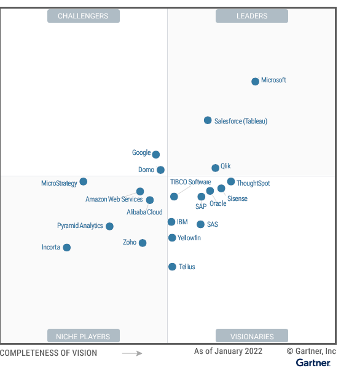

# Business Analytics

Gartner report from qlikview  
https://www.gartner.com/doc/reprints?id=1-292LEME3&ct=220209&st=sb

Analytics and business intelligence (ABI) platforms enable less technical users, including businesspeople, to model, analyze, explore, share and manage data, and collaborate and share findings, enabled by IT and augmented by artificial intelligence (AI). ABI platforms may optionally include the ability to create, modify or enrich a semantic model including business rules.

## trends

- Moving from analysts to decision makers
- Natural language capability helps
- AI
- convergence between AI, Data science, cloud data.

## Microsoft

Power BI, part of office 365  
cheap and powerful, clear leader.  
use with power apps and power automate to drive business value.  
AI text, sentiment, image analytics in BI Premium
Cloud service has more capabilities than the stand alone.  
Only Azure.  
Difficult to manage governance. One workspace can have one Power BI app, so you need lots.  

## Qlik

Strong vision.  
Qlik sense has associative and cognitive engines.  
Aquired nodeGraph and Big Squid to help.  
Qlik forts  
Qlik application automation: no code solution for automation. 

allows any cloud or cross cloud  
data literacy program  

not all qlikview users moving to qlik sense
complex licencing, with lots of addons

### Education 

https://inter.viewcentral.com/events/uploads/qlik/QlikEducationServices-CourseDiagram.pdf#CVQS

Qlik sense $30 pm per user, free trial  

LOts of free courses  
https://learning.qlik.com/mod/page/view.php?id=24708&Price=Free&_ga=2.190695656.27285392.1673356222-1539202205.1673356222

