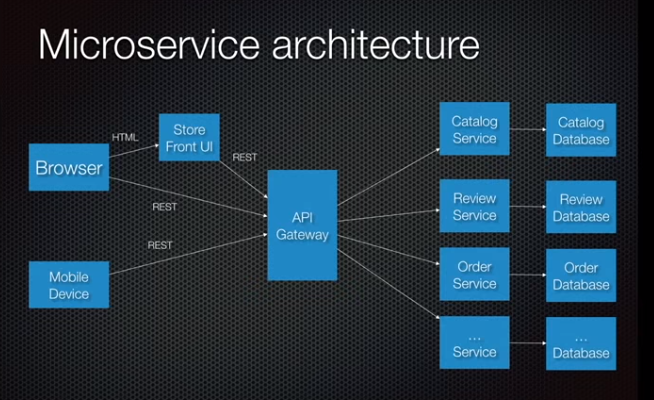
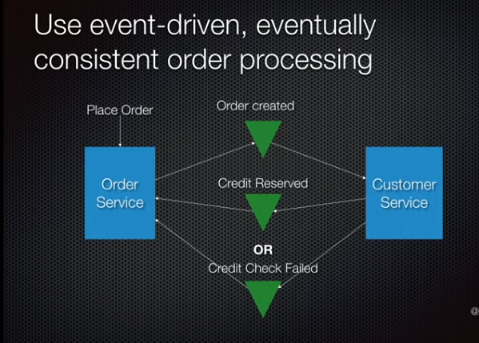
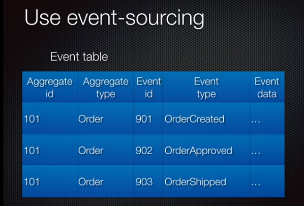
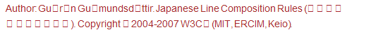

<LINK href="jb1.css" rel="stylesheet" type="text/css">

#### [Back to index](index.html)

# Technology concepts

- [Technology concepts](#technology-concepts)
  - [Web Frameworks for python](#web-frameworks-for-python)
  - [Rest API](#rest-api)
  - [URL / URI / URN](#url--uri--urn)
  - [HTTP](#http)
  - [Microservices + events + Docker](#microservices--events--docker)
  - [Docker](#docker)
  - [NoSQl Database](#nosql-database)
  - [Blockchain](#blockchain)
  - [Hive / Hadoop](#hive--hadoop)
  - [Translytical data platform providers](#translytical-data-platform-providers)
  - [SQL Server 2016](#sql-server-2016)
  - [Microsoft PowerBI](#microsoft-powerbi)
  - [Github](#github)
  - [Character encoding](#character-encoding)
  - [Vba](#vba)
  - [Google sheets](#google-sheets)
    - [Apps script hints](#apps-script-hints)
    - [Data transfer](#data-transfer)
  - [Facebook](#facebook)

## Web Frameworks for python

Modules to write web applications.

Mainly just server side. Handles the low level comms, can just use
conventions and get services. Interpret requests, parameters, handle
cookies, sessions. Responses as HTML or other, store data, etc. Can be
full service or less.

A web application may use a combination of a base HTTP application
server, a storage mechanism such as a database, a template engine, a
request dispatcher, an authentication module and an AJAX toolkit. These
can be individual components or be provided together in a high-level
framework.

Django, TurboGears, Web2py are high level full stack.

Less popular: Grok, pylons

Less complete: CherryPy, Flask, Hug, Pyramid.

Basically use Django for full facilities, Flask for solid foundation
with less features.

<https://palletsprojects.com/p/flask/>

## Rest API

Api: talk to objects methods. Expose methods.

Web service: api over the web.

Rest API follows rules of Rest spec.

Rest = "Representational state transfer"

HTTP is a way to send a receive messages over a network. Get method,
post method, headers.

Rest is for distributed systems.

Rest is a way to implement HTTP.

Roy Feilding defined rules for best practice. requests and responses,
type of messages

1.  Client tells service provider which operation to perform. Expressed
    in HTTP verb. E.g. use the DELETE http verb, not just a GET request
    (not restful)

2.  Client tells service provider what data to operate on (scoping
    information). Scoping information should go in the URI / URL.
    Scoping info is parameter in URI.

GET for get data, POST for creating, DELETE for deleting etc.

Common data formats for data (basically JSON)

Communication is stateless

Service consumer calls service provider with HTTP request, verb plus
data as JSON.

## URL / URI / URN

URI: uniform resourse identifier. Have Name and location.

URL: uniform resourse locator. Just the location. Needs to have Protocol
(http, ftp etc) and domain ([www.me.com](http://www.me.com)).

Optional are port (which door into the service), default is 80 for http.
Path.

URN: uniform resourse name. Just the name. 2 can have same name, so
better to use URL.

Both the URL and URN are types of URI's

Query strings: proceeded by ?, key value pairs.

Fragments: \#fragment. Used for location in document.

## HTTP

Http is connectionless. After making request, dies. No state. Any sort
of data transferred. Stateless, so client and server only know about
eachother during request. Created to fetch HTML and return to the
client.

Web request:

TCPIP handles the connection.

HTTP established connection, sends HTTP message, disconnects.

Server processes request, prepares response, established connection,
sends message.

Http message:

Start line, headers, body. Plain text.

Request:

Start line with method (command: these are POST, PUT, DELETE), URI
(domain, path), HTTP version

Headers: Host (server), language, accept (mime type)

Response:

http version

status code (200 for OK, 404 for file not found)

body (file data)

## Microservices + events + Docker

<https://www.youtube.com/watch?v=sSm2dRarhPo>

Monolithic: modules packaged to one or more JARs. Problem is that it
grows endlessly. When you have a large app like this you can't be agile.
Deployment is painful. No autonomy between teams. Complex merging,
integration testing.

Microservice architecture:

Functional decomposition. Separate modules in application into
standalone separately deployable application. Each has it's own
database. Api gateway in between the clients and the multiple services,
acts as a façade.

{width="6.268055555555556in"
height="3.8333333333333335in"}

Book: the art of scalability, written by ebay people.

Advantages: Enables agile, continuous deployment, deployment
independently. Allows teams less interaction, new technologies.

Disadvantages: complexity of developing distributed systems, so
interprocess communication, not just function call. Need to handle
partial failure (service down or slow..). Complexity of transactions
which need to span multiple databases. Complexity of testing with
dependencies. Deployment complex. Not 3 copies of big app, but 100
versions of different modules (use Docker). Develop and deploy across
multiple teams.

There are solutions.

Questions and answers:

- How to deploy the services? Use docker.
- How do the services communicate
- How to clients communicate with services
- How to partition the system into services
- How to deal with distributed data management: use "events"

Shared Database issue: in monolithic app, modules generally have their
own tables in the shared database, but also need to access common
tables, customer data. Decreases autonomy, lack of knowledge of who
accesses each table. Distributed transactions over multiple databases
are not practical.

Event driven architecture is solution to this. Chain events and
transactions. Order service creates order in a pending state. Publishes
event. Consumed by Customer service, which checks credit line and
returns an event for success of credit check. Consumed by Order service
to commit the order.

{width="6.239583333333333in"
height="4.46875in"}

Event log: Hard to guarantee that the db update and the message are
delivered, but ways around this. E.g. event log. Use an events table,
insert event to say order created, another even to say approved. Other
services poll the event table to see the current state.

{width="6.229166666666667in"
height="4.21875in"}

Benefits: Gives reliable event publishing mechanism, solves data
consistency issue, helps with NOSQL databases where there's no
transaction control. Store events with simple structure with state
changes. Audit log. Temporal queries. Can replay.

Drawbacks: needs application rewrite. Weird way to structure business
logic. Stuck with bad history if badly designed events. Querying event
store can be difficult to get current status.

Microservice drawbacks:

Different databases so hard to do BI queries.

Docker: solution to deploy the 10s or 100s of services. Challenges are
lots of services need to be deployed and monitored. Multi languages,
frameworks, versions of languages, scalability. Services need to be
independent and balanced. Deployment reliable and cost effective.
Container based approach. Service packaged as container image. At
runtime each container runs on a VM. Good isolation, manageability, low
overhead to machine layer, fast to deploy, efficient resource
utilisation.

Simplifies development: less work getting development environment
because this info is in the resource file. Integration testing easy
because can use docker compose to set up environment. Build docker
image.

## Docker

Docker install: download for windows.

Easy to configure environments and deploy on any platform. Good for
scaling, each environment can have many instances, scales easily. Can
e.g. run bash in windows cmd prompt by telling docker to run bash
instance.

## NoSQl Database

e.g. MongoDb.

Good for lost of data unstructured. Collections with documents.
Documents are the rows in the tables, but they can have any schema. So
rows have different schemas.

Downside is you don't control the data on the way in, upside is you can
add anything.

You can kind of relate the multiple collections, but that's not the
idea. Instead you put all the orders in one collection, with key data.
It's denormalised. Less relation merging, all the data's in one table,
May have another table of products. You may need to update the orders
when you change the products.

Good for different purposes.

SQL good for schemas, control, relationships which change frequently,
scaling is limited.

Horizontal scaling: add more servers. Not good for SQL, easy for Mongo.

Vertical scaling: a more powerful computer. Good for SQL but gets
limited.

## Blockchain

Ledger: record money in / out / balance.

Bank: you believe their balance ledger.

Decentralized: everyone has a ledger. Which one do you believe?
Blockchain answers this.

Blockchain: update the ledger every 10 mins. Miners compete for the
right to do the update. Solve a maths problem.

After 10 mins, first person solves. If more than 50% of the other miners
agree, then the update happens. New transactions arrive, in a block.
Going form this address to that address. Good for transparency,
authentication, accuracy.

Banking:

## Hive / Hadoop

Both built by apache.

Hadoop good for storing data from IOT, social media on commodity
hardware. Uses map reduce. Good for unstructured data. Volume, variety
and velocity = big data. Schema-on-read: just push it into a data lake,
without worrying about the format or how it's going to be used.

Runs on clusters like Cloudera.

Hive is built on top of Hadoop for providing summary, qruey, analysus.
SQL like interface. HQL.

Cloudera manager is a tool to use Hive.

Hadoop good for batch systems. Lots of latency to access data.

**Downsides:**

Because don't need to define what you are writing, people wrote all
sorts into data lakes. No governance over the lineage of data, contents
of data lake. Data not ready to be consumed, lose faith, turns into data
swamp.

Many open source compute engines e.g. Hive, these are too many and too
complex to configure. Specialised skills.

Data lakes not really used to build business applications. They store
data, do reporting, feed other systems. But not business applications.
Lots of complexity just for reports.

Solutiuon is to modernise a business application to get it to access the
data lake with SQL.

It's easier now to run analytics and OLTP on the same data.

You want to get the models working in the OLTP so they can dynamiocally
react to changes and make in the moment decisions. ML needs to be built
in at the database level so updated data is always available to the
models.

## Translytical data platform providers

A unified database that supports transactions, analytics, and other
workloads and access patterns in real time without sacrificing
transactional integrity, performance, or scalability. No data movement.

14 most significant ones --- Actian, Aerospike, GigaSpaces, GridGain
Systems, IBM, InterSystems, MemSQL, Microsoft, MongoDB, Oracle, Redis
Labs, SAP, Splice Machine, and VoltDB

Have the OLTP and analysis and data science all using one data source.

Microsoft's solution for unified OLTP and OLAP workloads is ramping up.
Although Microsoft has been offering multiple database engines for
online transaction processing (OLTP) and online analytical processing
(OLAP), its upcoming SQL Server 2016 release will deliver a single
unified database for these workloads. In SQL Server 2012, Microsoft
delivered an in-memory column-store for data warehousing to support
faster business intelligence, analytics, and predictive analytics. And
SQL Server 2014 provided an in-memory OLTP database platform to support
high-performance transactional applications requiring minimal changes to
the application. With SQL Server 2016, Microsoft offers the capability
to use in-memory column store with in-memory OLTP for in-memory
performance and real-time operational analytics

VoltDB offers a viable translytical database platform. VoltDB is an
in-memory database platform that combines streaming analytics with
transactions in a single integrated platform. It supports ACID
compliance, high performance, and low-latency data access in a scalable
distributed shared-nothing in-memory database. VoltDB relies on
horizontal partitioning of data to scale out on commodity hardware and
the public cloud. It also supports synchronous replication within the
database cluster to support high availability. Unlike other vendors,
VoltDB is available as open source software under the Affero General
Public License (AGPL) as well as under a commercial license. Typically,
customers use VoltDB to support real-time analytics and low-latency
transactional and operational applications across the telecom, financial
services, energy, advertising, security, and gaming industries.

## SQL Server 2016

Gartner magic quadrant. Good for experience and value, admin.

Cosmos is a non relational DB

Non relational DBMS are only 1% of the market. MS growning quickly.

Security: encryption built in. "Always encrypted" only application has
the key.

Operational analytics: in memory OLTP and in memory analytics. One
datastore for OLTP and analysis.

## Microsoft PowerBI

Access easily, cloud or local. Easily manipulate. Reports and
dashboards.

Ask questions in English

Good on web or mobile, good visualisations.

BA's use power BI desktop to build visualisations. Can build custom
visualisations.

Easy Excel integration. Can bring in data model from Excel.

It's free!! PowerBI.com and download free version. Included in Office
365.

Try power BI on German spreadsheet?

One version of the data. Fragmentation is poisonous. Unified platform:
one platform for access, for data lake, AI.

Builds on SQL Server heritage and interaction.

Good governance and control.

Power BI desktop has a good ER modelling tool.

Can cache data in memory in Power BI, at aggregated level. Can still
drill down to the core data level by sending a query to the underlying
system.

Can link into multiple databases for analysis without moving the data.

Data flow to clean data, not tied to a specific report or table. Uses
power query. Lots of datasources, and transformation types.

Drag and drop data science.

R and Python directly integrated.

## Github 

Lifecycle:

- Create a repository
- Put some files in it
- To edit
- Create a branch
- Edit and commit changes to branch
- Open a pull request for others to pull your changes into their code
- and comment
- Merge branch into the master

<https://github.com/jezza64/hello-world>

---

## Character encoding

Words and sentences in text are created from **characters**. Examples of
characters include the Latin
letter [á](https://www.w3.org/International/questions/qa-what-is-encoding-data/225.png) or
the Chinese
ideograph [請](https://www.w3.org/International/questions/qa-what-is-encoding-data/35531.png) or
the Devanagari
character [ह](https://www.w3.org/International/questions/qa-what-is-encoding-data/2361.png).

Characters that are needed for a specific purpose are grouped into a
character set (also called a repertoire). (To refer to characters in an
unambiguous way, each character is associated with a number, called a
code point.)

The characters are stored in the computer as one or more bytes.

Basically, you can visualise this by assuming that all characters are
stored in computers using a special code, like the ciphers used in
espionage. A character encoding provides a key to unlock (ie. crack) the
code. It is a set of mappings between the bytes in the computer and the
characters in the character set. Without the key, the data looks like
garbage.

A font is a collection of glyph definitions, ie. definitions of the
shapes used to display characters.

Once your browser or app has worked out what characters it is dealing
with, it will then look in the font for glyphs it can use to display or
print those characters. (Of course, if the encoding information was
wrong, it will be looking up glyphs for the wrong characters.)

A given font will usually cover a single character set, or in the case
of a large character set like Unicode, just a subset of all the
characters in the set. If your font doesn\'t have a glyph for a
particular character, some browsers or software applications will look
for the missing glyphs in other fonts on your system (which will mean
that the glyph will look different from the surrounding text, like a
ransom note). Otherwise you will typically see a square box, a question
mark or some other character instead. For example:

{width="5.479166666666667in"
height="0.5520833333333334in"}

As a content author or developer, you should nowadays always choose the
UTF-8 character encoding for your content or data. This Unicode encoding
is a good choice because you can use a single character encoding to
handle any character you are likely to need. This greatly simplifies
things. Using Unicode throughout your system also removes the need to
track and convert between various character encodings.

In the coded character set called ISO 8859-1 (also known as Latin1) the
decimal code point value for the letter é is 233. However, in ISO
8859-5, the same code point represents the Cyrillic character щ.

These character sets contain fewer than 256 characters and map code
points to byte values directly, so a code point with the value 233 is
represented by a single byte with a value of 233. Note that it is only
the context that determines whether that byte represents either é or щ.

---

## Vba

Alt + F11 to open VBA editor

Functions: take multiple named arguments, set a variable to the name of
the function to return it.

```vb
Function DISCOUNT(quantity, price)
If quantity >=100 Then
DISCOUNT = quantity * price * 0.1
Else
DISCOUNT = 0
End If

DISCOUNT = Application.Round(Discount, 2)
End Function
```

Can't take action in a function (use a macro), but can do calculations.

Comment with apostrophe.

To use a custom function, the workbook containing the module in which
you created the function must be open. If that workbook is not open, you
get a #NAME? error when you try to use the function. If you reference
the function in a different workbook, you must precede the function name
with the name of the workbook in which the function resides. For
example, if you create a function called DISCOUNT in a workbook called
Personal.xlsb and you call that function from another workbook, you must
type **=personal.xlsb!discount()**, not simply **=discount()**.

An easier way to make your custom functions available at all times is to
store them in a separate workbook and then save that workbook as an
add-in. You can then make the add-in available whenever you run Excel.

Ranges:

Function J\_ENTROPY(r As Range)

For Each c In r.Cells

Total = Total + c.Value

Next

J\_ENTROPY = Total

End Function

Array passing to functions:

You may have noticed that the static array StaticArray in AAATest has
the same data type (Long) as the array Arr declared in the parameter
list to PopulatePassedArray . This is no coincidence.  The rule here is
that the data type of the array declared in the calling
procedure ***must*** match the data type declared in the called
procedure\'s parameter list.   While you can declare a simple
parameter As Variantto accept a parameter to be of any data type, this
does** *not ***work for arrays.** **It is a very common misconception
that declaring the function parameter As Variant() will allow you to
accept an array of any type. This is flat wrong.  

Use dynamic arrays, pass by reference to functions which then redim the
array.

ReDIM PRESERVE IS EXPENSIVE, SO USE A MAX SIZED ARRAY AND REDIM AT THE
END.

To pass an array of any type to a procedure, don\'t declare the
parameter as an array. Instead, declare it as a Variant (not an array of
Variants).  A single Variant variable may contain an array.  This is
illustrated in the code below.  

## Google sheets

<https://www.benlcollins.com/spreadsheets/how-to-use-google-sheets/>

This is my number 1 productivity tip in Google Sheets. To remove all
formatting from a cell (or range of cells), hit Cmd + \\ on a Mac or
Ctrl + \\ on a PC.

Datatypes: ust numbers (dates, numbers) or text (left aligned). If you
want to force something to be stored as text, you can prepend a single
quote, \' before the cell contents.

Code with Apps Script.

### Apps script hints

// for comments

Ctrl + / to comment / uncomment a block

Alt + up / down to move a code block

Highlight and press tab to clear up indentation

Ctrl + space to bring up auto complete

Use logger.log() to debug steps

Variables are any type. E.g. var counter = 0

Arrays use square brackets:

var fruitsArray = \[ \"apple\", \"banana\", \"pear\" \];

Objects use curly brackets and store key / value pairs:

var book = {\
  \"title\": \"Apps Script Book\",\
  \"author\": \"Ben Collins\"\
}

For loop:

for (var i = 0; i \< 10; i++) {\
    Logger.log(i);\
}

Foreach loop: Basically it grabs all the data from your array and loops
over each item in turn. You can do something, by applying a function, to
each item during each loop of the array.

array.forEach(function(item) {\
    Logger.log(item);\
});

### Data transfer

Calculations in Google Sheets are done in your browser and are fast.
Similarly, calculations done in Apps Script on the Google servers are
lightning fast. But passing data back and forth from Sheet to Apps
Script or vice versa, oh boy! That's slow in comparison. (We're still
talking seconds or minutes here, but that's slow in computing terms.)

Try to minimize the number of calls you make between your Apps Script
and your Google Sheets.

The [Apps Script
documentation](https://developers.google.com/apps-script/) is your
friend.

[Stack Overflow Apps Script
Tag](https://stackoverflow.com/questions/tagged/google-apps-script)

[Google Apps Script Community
Group](https://groups.google.com/forum/#!forum/google-apps-script-community)

## Facebook

- Marketing manager gives you the details of campaigns, ad sets, ads. 
- Define the audience based on interests, location etc.
- pixel data is the cookie data. Tracking you via shared cookies.
