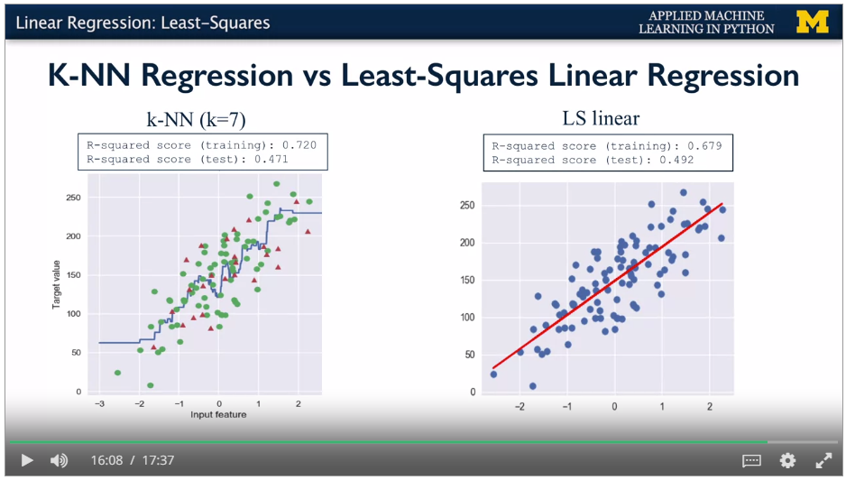
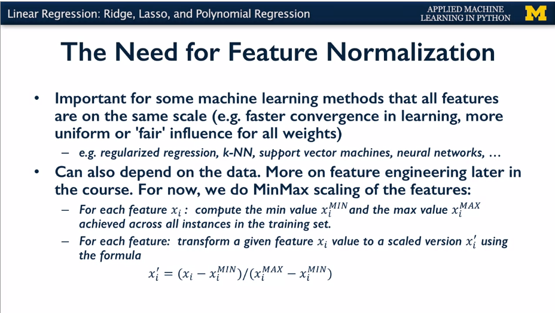

<LINK href="jb1.css" rel="stylesheet" type="text/css">

#### [Back to index](index.html)

# Applied Machine Learning

- [Applied Machine Learning](#applied-machine-learning)
  - [Key concepts](#key-concepts)
  - [Scikit learn](#scikit-learn)
  - [Supervised learning](#supervised-learning)
    - [Least squares](#least-squares)
    - [Normalization](#normalization)
    - [Min Max scaling](#min-max-scaling)
    - [Overfitting](#overfitting)
    - [Regularization](#regularization)
    - [Knn](#knn)
    - [Linear regression](#linear-regression)
    - [Ridge regression](#ridge-regression)
    - [Lasso regression](#lasso-regression)
    - [Polynomial regression](#polynomial-regression)
    - [Logistic regression](#logistic-regression)
    - [Linear classifiers: support vector machines](#linear-classifiers-support-vector-machines)
    - [Multi Class classifiers](#multi-class-classifiers)
    - [Kernelised support vector machines](#kernelised-support-vector-machines)
    - [Cross Validation](#cross-validation)
    - [Decision trees](#decision-trees)
    - [Useful things to know](#useful-things-to-know)

## Key concepts

Classifier: predict a category

Regression: predict a value, continuous quantities

Supervised learning: you know the target value on the learning set.
Initial target values generally from human input, crowdsourcing (e.g.
Crowdflower) for paid people to classify. Maybe get implicit values from
user actions, e.g. happy with search results when don't come back to to
a search.

Unsupervised: find structure where no labels known. Clustering,
unsupervised outlier detection.

Workflow:

1. Representation (choose features, type of classifier). Features are
    columns of the dataframe. Feature extraction.

2. Evaluation (choose criterion, e.g. % of target variables correctly
    predicted on test set)

3. Optimisation (how to get the best parameters, e.g. try a range of K
    values in Knn).

## Scikit learn

Score gives matches.

Predict gets values

Sklearn values ending with \_ are model derived values from training
data.

## Supervised learning 

For maths see Andrew Ngs machine learning course on coursera.

Instance or sample are the rows. Features are the columns. Convention is
X for the matrix of data.

Target value is label (classification) or continuous value (regression).
Convention is y.

Default split for train / test is 75%

Train test split function returns the partitioning of X, y into
X\_train, X\_test, y\_train, y\_test.

Model fitting uses the scikit learn estimator to set the parameters for
the model. Updates internal state of the model.

Evaluation methods.

Score method

Predict method for new instances.

Binary classification has 2 outputs, normally 0 and 1 (eg credit card
fraud). Multi class classification gives more complex classification
(e.g. label for fruit, each has only one label). Multi-label
classification where there are multiple target values applicable, e.g.
classifier for the multiple things that a web page is about with
different strengths. Continuous value means regression problem.

Some models have both regression and classification applications e.g.
SVM.

Unstable predictions mean that small changes to the training data can
produce different predictions.

Overfitting: Relationship between model complexity and model accuracy.
Overfitting is detrimental to new data predictions.

{width="4.791666666666667in"
height="2.721790244969379in"}

Model is the mathematical representation which translates the input
variables to the output variables.

Language: Independent variables / dependent variables in stats, Features
/ target values in ML.

### Least squares

For each training point, take the difference between the predicted y and
the known y. Square.

Known as RSS, residual sum of squares. Often this is the objective
function being minimized.

{width="4.707503280839895in"
height="2.65625in"}

{width="4.726061898512686in"
height="2.65625in"}

{width="4.706944444444445in"
height="2.6486340769903762in"}

{width="4.708333333333333in"
height="2.659847987751531in"}

{width="4.614583333333333in"
height="2.617623578302712in"}

### Normalization

transform input features so all are on the same scale. Necessary when
using ridge regression. Feature normalization is generally done.

{width="4.385416666666667in"
height="2.4764534120734907in"}

### Min Max scaling

get range, get difference between a value and the min, divide by the
range. Gets 0 for min, and 1 for max.

Need to apply the same scaling object to training and test sets. Fit the
scaler to the training data only, otherwise get data leakage from the
test data to the training data. Model may be harder to interpret after
scaling.

{width="4.479166666666667in"
height="2.515003280839895in"}

### Overfitting

Memorize the data -\> 100% accuracy.

Generalize well: Ability to perform well on held out test set.
Assumption that the future test set is drawn from the same population as
the training set.

Inadequate amount of training data means overfitting, and doesn't
generalize well.

Underfit: don't match the complexity of the data well. Linear model on a
curve.

Overfit: too much memorising, doesn't generalise well. E.g. Highly
polynomial for smooth curve. Not enough data to regognise the global
trend. Captures too many fluctuations in the training data.

Knn: with a low value of K, get highly granular decision boundaries, so
higher risk of overfitting. With high value, doesn't capture enough
features.

Data sets with many features are common in real world (high dimensions).

### Regularization

This penalises complexity, reduces overfitting. E.g. the penalty factors
in ridge regression.

### Knn

Knn memorizes whole training set, gets the k nearest neighbours for a
new point, takes vote of the outcomes. Higher k gives lower model
complexity. Can be used on non binary classifiers, and regression. For
regression, takes k values nearest to the test point and averages (or
other measure e.g. weights) to get target variables. Not good model for
large number of features

R-squared regression score (also called coefficient of regression) gives
1 for perfect prediction.

Get training set R squared, and test set r squared. Get the graph of
model complexity vs model accuracy.

Distance function: Euclidean is default.

### Linear regression

Sum of weighted variables. Training means estimate the parameters for
the model to minimise the error. Strong assumption that there's a linear
relationship.

B term is y intercept, also called the bias term.

{width="4.5in"
height="2.509250874890639in"}

Least squares is square of the difference between the model predicted
value and the training points set. Sum of squared differences is RSS
(residual sum of squares).

Maximise the objective function. Typically this is some kind of loss
function of the predicted target values vs actual target values.
Learning algorithm sets the parameters to minimuse the objective
function. Simple case this is to minimise the RSS.

No params for model complexity, just a straight line using all training
data.

Sklearn.linear_model.LinearRegression. Coefficients are in
linreg.coef_ and linreg.intercept_ values.

Use linreg.score to get RSS.

{width="4.75in" height="2.67496719160105in"}

### Ridge regression

Ridge regression adds a penalty for high weights (w) to the function
being optimised. This penalizes complexity, reduces overfitting, called
**Reglularization.** Good when lots of features. Linear\_model.Ridge
class, and specify alpha parameter. Need to normalize first.

Regularization is useful when small amounts of training data relative to
number of features. Less useful when large amounts of training data. As
change alpha, get the usual overfitting vs complexity trade off, with a
value of alpha that is a good trade off between complexity and
overfitting.

{width="4.8125in"
height="2.679238845144357in"}

### Lasso regression

Penalty is L1, sum of the mods of the w's. Model is easier to interpret.
Forces unimportant factors to zero. Good when a few features have a
large effect. This is a sparse solution, automatically selects features.

{width="4.856826334208224in"
height="2.7604166666666665in"}

Use lasso:

{width="4.947916666666667in"
height="2.79080927384077in"}

### Polynomial regression

Artificially take combinations of the factors (squares, x~0~x~1~ etc)
and get factors for these. Treat as a linear regression, and minimise
RSS. Degree of polynomial says the combinations. Still a linear model.

{width="4.447916666666667in"
height="2.5526487314085737in"}

{width="4.5in"
height="2.541159230096238in"}

{width="4.5in"
height="2.5471412948381453in"}

### Logistic regression

Used to produce a binary outcome, not continuous. Standard linear, but
apply the logistic expression to compress the output to a range 0 -\> 1.
Can also be multi class, non binary. Same as linear but runs it through
the sigma function. This compresses the result to 0 or 1.

With 2 features, 3d view sort of looks like this.

Output value is the probability of belonging to the class.

Regularization (penalty for complexity) is on by default. Controlled
with parameter C, defaults to 1. Higher C is less regularisation. Small
C, tries to find coefficients closer to zero even if fit is worse. Power
of regularization only really visible with higher number of features.

### Linear classifiers: support vector machines

Take output of linear function and apply sign function to get +1 or -1.

Classier is good if get a broad decision boundary. Best is maximum
margin. SVM can have linear or non linear model behind them. Kernel.

{width="6.268055555555556in"
height="3.561111111111111in"}

{width="6.268055555555556in"
height="3.561111111111111in"}

Trade off between wide decision boundary and misclassifying some points,
controlled by Regularisation parameter C, set to 1 by default. Small C
means more regularisation, so large decision boundary, even if more
points are misclassified.

{width="6.268055555555556in"
height="3.5347222222222223in"}

### Multi Class classifiers

Real world is multi category output. Scikit learn converts to series of
binary problems. Categorical items turned into binary for each class. 4
fruits -\> 4 binary classifiers. Runs against each classifier in tern,
and the highest one is the result.

{width="6.268055555555556in"
height="3.517361111111111in"}

### Kernelised support vector machines

Linear SVM good for simple where close to linearly separable. E.g.

{width="6.268055555555556in"
height="3.53125in"}

SVMs can do more complex classification and regression -- but this
lecture is just classification.

SVMs take feature space and transform to higher dimension space, and
then use a linear classifier. Add e.g. a square feature. Bit like
polynomial features to linear model.

{width="6.268055555555556in"
height="3.154166666666667in"}

{width="6.268055555555556in"
height="3.83125in"}

{width="6.268055555555556in"
height="3.553472222222222in"}

Linear classifier works well when have this extra dimension.

Create additional dimension and then use linear. When transform back to
1D, you get a parabolic decision boundary.

{width="6.268055555555556in"
height="3.5520833333333335in"}

With more features: add 1 -- (x~0~^2^ + x~1~^2^)

{width="6.268055555555556in"
height="3.573611111111111in"}

Moving back to original dimensions, get a parabola.

{width="6.268055555555556in"
height="3.5618055555555554in"}

Several different possible transformations. E.g. RBF kernel, polynomial
kernel.

{width="6.268055555555556in"
height="3.5569444444444445in"}

{width="6.268055555555556in"
height="3.5256944444444445in"}

For the radial basis function kernel, the similarity between two points
and the transformed feature space is an exponentially decaying function
of the distance between the vectors and the original input space as
shown by the formula here.

SVM makes the linear boundary with maximum margin in the transformed
feature space. In the original space, it's curved.

Kernel Trick: internally doesn't need to really transform the data
points. Just needs to do similarity calculations between points. So
works OK for different data and many dimensions.

{width="6.268055555555556in"
height="3.55625in"}

{width="6.268055555555556in"
height="2.5194444444444444in"}

Polynomial kernel: different function. Takes degree parameter to affect
complexity and cost.

RBF has parameter Gamma. Small gives larger similarity radius.

Small values of gamma give broader, smoother decision regions. While
larger values of gamma give smaller, more complex decision regions.

You can set the gamma parameter when creating the SVC object to control
the kernel width in this way, as shown in this code.

{width="6.268055555555556in"
height="3.551388888888889in"}

{width="6.268055555555556in"
height="3.0972222222222223in"}

You may have noticed that the RBF kernel has a parameter gamma.

Gamma controls how far the influence of a single trending example
reaches, which in turn affects how tightly the decision boundaries end
up surrounding points in the input space.

Small gamma means a larger similarity radius. So that points farther
apart are considered similar. Which results in more points being group
together and smoother decision boundaries.

On the other hand for larger values of gamma, the kernel value to K is
more quickly and points have to be very close to be considered
similar. This results in more complex, tightly constrained decision
boundaries.You can see the effect of increasing gamma that is sharpening
the kernel 

in this example from the notebook.

Small values of gamma give broader, smoother decision regions. While
larger values of gamma give smaller, more complex decision regions.You
can set the gamma parameter when creating the SVC object to control the
kernel width in this way, as shown in this code.

You may recall from linear SVMs that SVMs also have a regularization
parameter, C, that controls the tradeoff between satisfying the maximum
margin criterion to find the simple decision boundary, and avoiding
misclassification errors on the training set. The C parameter is also an
important one for kernelized SVMs, and it interacts with the gamma
parameter.

This example from the notebook shows the effect of varying C and gamma
together.

If gamma is large, then C will have little to no effect. Well, if gamma
is small, the model is much more constrained and the effective C will be
similar to how it would affect a linear classifier.

Typically, gamma and C are tuned together, with the optimal combination
typically in an intermediate range of values. For example, gamma between
0.0001 and 

10 and see between 0.1 and 100. Though the specifically optimal values
will depend on your application.

Kernelized SVMs are pretty sensitive to settings of gamma. The most
important thing to remember when applying SVMs is that it\'s important
to normalize the input data, so that all the features have comparable
units that are on the same scale. We saw this earlier with some other
learning methods like regularized regression.

{width="6.268055555555556in"
height="3.4444444444444446in"}

{width="6.268055555555556in"
height="3.548611111111111in"}

Kernel type defaults to RBF. Kernel has specific parameters, RBF very
sensitive to gamma. C regularisation applies to all, typically tuned
together with gamma.

### Cross Validation

Used to evaluate model, not tune.

Single train test split to get estimate for how well the model will
genaralise to unseen data. Test set drawn from the same distribution as
the training set.

Cross validation means multiple train test splits. Train test split
gives different results based on initial seed. Cross validation gets rid
of this.

K-fold validation: e.g. 5 fold

{width="6.268055555555556in"
height="3.55in"}

Get 5 accuracy values.

Use cross\_val\_score to implement.

{width="6.268055555555556in"
height="3.5395833333333333in"}

Different accuracy values tell you how sensitive the model is to
different training sets, understand range of performance.

{width="6.268055555555556in"
height="3.553472222222222in"}

{width="6.268055555555556in"
height="3.55in"}

Scikit learn does stratified cross validation by default for
classification. For regression, does standard.

Leave-one-out cross validation: test by leaving out just one sample for
each training set.

{width="6.268055555555556in"
height="3.55in"}

{width="6.268055555555556in"
height="3.5284722222222222in"}

### Decision trees

Regression and classification

Good to find influential features in dataset.

Have the most informative questions at the start.

Root node at the top, leaf nodes at the bottom. Route determined by yes
/ no answers. Decision tree for predicting the class. Get to accurate
classification quickly.

{width="6.268055555555556in"
height="3.5520833333333335in"}

Iris, continuous values for features.

{width="6.268055555555556in"
height="3.53125in"}

Each feature splits into 2 branches. Choose a split point for the value
of the feature. Aim is to put the split at the point which gets the most
information gain. If leaf is all one classification, then it's a pure
node.

{width="6.268055555555556in"
height="3.5256944444444445in"}

{width="6.268055555555556in"
height="3.529861111111111in"}

Can use for regression also.

{width="6.268055555555556in"
height="3.14375in"}

Overfitting control: can use pre-pruning with to stop the growth of
complexity. Or post pruning: let it grow then prune back to simpler
form. Scikit learn only does pre-pruning, using max\_leaf\_node, and
max\_depth. Plus Min\_samples\_leaf parameter.

{width="6.268055555555556in"
height="3.467361111111111in"}

Visualizing decision tree:

{width="6.268055555555556in"
height="2.9097222222222223in"}

Plot\_decision\_tree is own function, Calls export graph vis function in
scikit learn.

Useful to see the nodes being most informative. Feature importance
calculation. How important is the feature to overall prediction
accuracy. 0 means irrelevant, 1 means perfectly predicts. Numbers are
normalised. Stored in feature\_unimportances\_

{width="6.268055555555556in"
height="3.529861111111111in"}

{width="6.268055555555556in"
height="3.5340277777777778in"}

{width="6.268055555555556in"
height="3.5520833333333335in"}

Good for initial feature selection. Can use without normalisiation as
each feature runs independently. Good where different feature types
(binary, continuous, categorical).

Key parameters. Generally adjusting one is enough.

{width="6.268055555555556in"
height="3.529166666666667in"}

### Useful things to know

Domingos, P. (2012). [A few useful things to know about machine
learning](https://homes.cs.washington.edu/~pedrod/papers/cacm12.pdf). *Communications
of the ACM*, 55(10), 78. doi:10.1145/2347736.2347755
