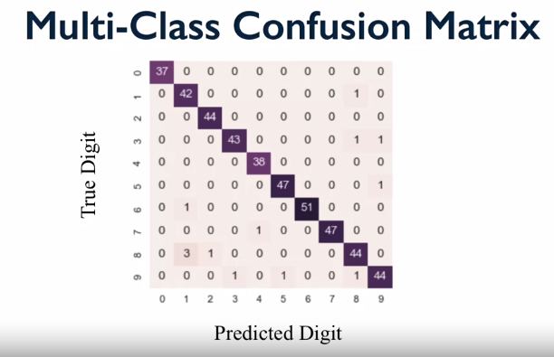

<LINK href="jb1.css" rel="stylesheet" type="text/css">

#### [Back to index](index.html)

# Evaluating Models

- [Evaluating Models](#evaluating-models)
  - [Evaluating Binary classifiers](#evaluating-binary-classifiers)
    - [Precision recall curves](#precision-recall-curves)
    - [ROC curves](#roc-curves)
  - [Multi class Evaluation](#multi-class-evaluation)
    - [Macro average precision](#macro-average-precision)
    - [Micro average precision](#micro-average-precision)
  - [Regression Evaluation](#regression-evaluation)
    - [R2 (R squared)](#r2-r-squared)
    - [Other regression measures](#other-regression-measures)
    - [Dummy regressors](#dummy-regressors)

## Evaluating Binary classifiers

### Precision recall curves

X is precision, Y is recall.

Ideal classifier would be perfect for both. Shows trade off between both. Apply varying decision boundary to get the curve. As precision goes up, recall goes down. Jagged: discrete counts used in calcs, so as you get to the edges the discrete counts cause big jumps as goes from 2 to 1.

### ROC curves

Receiver operating characteristic curves used for performance of a binary classifier.

X is false positive rate, y is true positive rate. Upper left is perfect. Dotted line is baseline. Look at area underneath the curve to maximise this on ROC curve.  

## Multi class Evaluation

Collection of true vs predicted binary outcomes, one per class. Confusion matrix for multi class and Classification reports work well.

Various measures to average multi class results, and imbalanced class issues. Also multi label is more complex than multi class evaluation.

Look at confusion matrix for an insight into whats going wrong.

create with:

A bad model example: use heatmap to show errors

### Macro average precision

Each class has equal weight. Compute e.g. precision for each class (true positive / ).
Then average over all classes.
If e.g. loads from one class, equal weight with other classes.

### Micro average precision

Each instance has equal weight.

## Regression Evaluation

Could look at predictions and categorise the error. But in practice, not so useful. 
Typically r2 score is enough.

### R2 (R squared) 

- computes how well future instances will be predicted
- perfect predictor give r squared = 1
- constant prediction gives r2 = 0
- can go negative for bad model fits (e.g. non linear models)

### Other regression measures

- mean_absolute_error. Expected value of L1 norm loss. 
- mean_squared_error. expected value of L2 norm loss. Widely used. Under and over treated the same.
- median_absolute_error (robust to outliers).

### Dummy regressors

provided by scikit learn.
e.g. flat line for one variable vs y
flat, quantile, etc.
