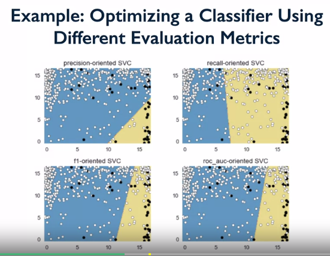
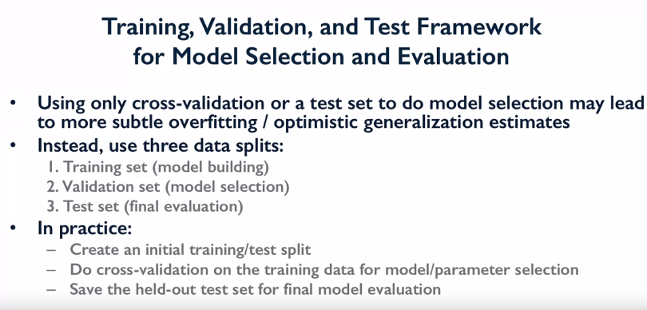
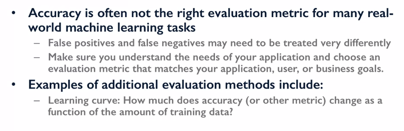

<LINK href="jb1.css" rel="stylesheet" type="text/css">

#### [Back to index](index.html)

# Evaluating success of a data project

- [Evaluating success of a data project](#evaluating-success-of-a-data-project)
  - [process](#process)
  - [Standard process](#standard-process)
  - [Models](#models)
  - [ML ideas](#ml-ideas)
  - [Deployment ideas](#deployment-ideas)
  - [Model Selection](#model-selection)

## process

1. Define a problem

    a.  Define a success metric

2. Data

    a.  Does the model need to work in real time?

    b.  Does the model need to be trained in real time?

    c.  Is there an inconsistency between train and test data

3. Evaluation

    a.  Train test split at random assumes data is homogenous. Probably
        not. Mayb slpit by time instead.

    b.  Baseline model

4. Features

    a.  Choose good ones

    b.  Remove redundant ones

5. Modelling

    a.  Does it need to be interperable?

    b.  How to tune

6. Experiment

    a.  Go into production and evaluate and update quickly

## Standard process

Have a standard boilerplate way to process data to investigate. Saves
lots of reengineering.

e.g. Qualitataive / quantitative cols

Null values

correlations

Uac / roc to score

Classification\_report to show the precision of models

## Models

Xgboost is new and good

Random forests -- tree decision, good at lots of things.

Use ridge not Lasso as lasso removes some features -- try Eslatic net
regression

Blueprint technologies flow chart to find best model. Also one on scikit

Mean absolute error is a good accuracy test.

Move to K fold

Open grid cv to go through parameters.
<https://scikit-learn.org/stable/modules/generated/sklearn.model_selection.GridSearchCV.html>

## ML ideas

- **tpot** for automated optimisation
- EthicalML/awesome-production-machine-learning: lots of good learning resources
- **shap** for model explanation

## Deployment ideas

- Heroku - don't need VM, just script. Charged per run of script.
- Azure, with linux
- cloud.digitalocean.com:
  - easier to use than google and AWS.
  - Good for hosting also. "droplets" are VMs. $5 pm
  - need to have a firewall with some ports open, need to lock down VM to make sure can't be hacked.
  - more data security than using AWS etc.

## Model Selection

in order of evolution

1. train on all data, test on all data (code check)
2. simple train test split
3. k fold cross evaluation and get averages and sensitivity
4. Truly held out test set

Grid Search (e.g. **GridSearchCV**) does cross valiation and parameter optimisation. 

Default measure used is accuracy, but can pass an evaluation metric as scoring parameter.

Get a different decision boundary when using different scoring pameters to tune the model. 

Just using cross validation is prone to data leakage, test data used partially for model selection. Hold out a final test set, not used in cross validation.

In practice, use 3 data splits

1. training set
2. validation set (model selection)
3. test set (final evaluation)

Select an evaluation metric which suits the particular application.

