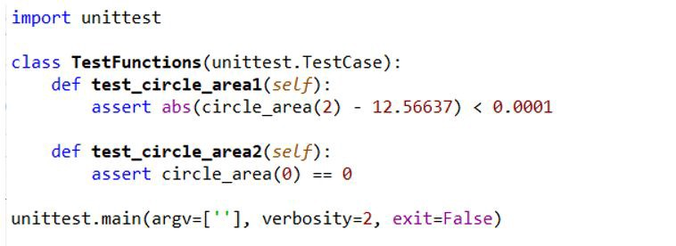

<LINK href="jb1.css" rel="stylesheet" type="text/css">

#### [Back to index](index.html)

# Machine Learning deployment

- [Machine Learning deployment](#machine-learning-deployment)
  - [Steps](#steps)
  - [Model export](#model-export)
  - [flask program to load pickle and expose end points](#flask-program-to-load-pickle-and-expose-end-points)
  - [Test the web service exists](#test-the-web-service-exists)
  - [Test predict function locally](#test-predict-function-locally)
  - [setup Docker](#setup-docker)
  - [Host on AWS EC2](#host-on-aws-ec2)
  - [Improvements](#improvements)
- [Alternate notes](#alternate-notes)
  - [Pickle](#pickle)
  - [Joblib](#joblib)
  - [Firefly](#firefly)
  - [Docker](#docker)
    - [Docker Terminology:](#docker-terminology)
  - [Public Platform deployment](#public-platform-deployment)
  - [Unit tests](#unit-tests)
  - [Sphinx](#sphinx)

Python, flask, Docker, AWS EC2.

## Steps

1. Train locally
2. Wrap in flask
3. docker to containerize flask
4. host docker on EC2 and consume web instance

## Model export

Model serialized into pickle file. 
Inference call (predict()) takes features as e.g. numpy array.

## flask program to load pickle and expose end points

FLask is good to build a web service to expose the predict call over URL rest API.

This is flask_code.py:

```python
# Serve model as a flask application

import pickle
import numpy as np
from flask import Flask, request

model = None
app = Flask(__name__)

# load to global
def load_model():
    global model
    # model variable refers to the global variable
    with open('iris_trained_model.pkl', 'rb') as f:
        model = pickle.load(f)


@app.route('/')
def home_endpoint():
    return 'Hello World!'


@app.route('/predict', methods=['POST'])
def get_prediction():
    # Works only for a single sample
    if request.method == 'POST':
        data = request.get_json()  # Get data posted as a json
        data = np.array(data)[np.newaxis, :]  # converts shape from (4,) to (1, 4)
        prediction = model.predict(data)  # runs globally loaded model on the data
    return str(prediction[0])


if __name__ == '__main__':
    load_model()  # load model at the beginning once only
    app.run(host='0.0.0.0', port=80)

```

## Test the web service exists

Now can run the web service locally.
run python app.py
check browser on 0.0.0.0:80 and See the home endpoint output.
Port 80 is privileged: used port 5000 if 80 is protected.

## Test predict function locally

```bash
curl -X POST \
   0.0.0.0:80/predict \
   -H 'Content-Type: application/json' \
   -d '[5.9,3.0,5.1,1.8]'
```

## setup Docker

Allows deployment on any cloud VM / OS

Docker file for docker daemon to build the docker image:

```docker
FROM python:3.6-slim

# take files from current folder to deploy folder.
COPY ./app.py /deploy/
# lists versions of python packages needed
COPY ./requirements.txt /deploy/
COPY ./iris_trained_model.pkl /deploy/

# change working directory
WORKDIR /deploy/

# expose python packages to the requirements file
RUN pip install -r requirements.txt

# make port 80 visible outside the container.
EXPOSE 80

ENTRYPOINT ["python", "app.py"]
```

Build the docker image:

```bash
docker build -t app-iris .
# Run the docker image
# -p option maps port 8 locally to port 80 on the docker instance.
docker run -p 80:80 app-iris .
```

Test locally in browser.

## Host on AWS EC2

Edit security groups to allow http traffic on port 80 to public. 
launch the EC2 instance

ssh to EC2, pass the key pair file .pem  
>`ssh -i /path/my-key-pair.pem ec2-user@public-dns-name`

Install docker on EC2 instance  
test with
>`docker info`

Copy all files needed to build image to EC2: requirements, app.py, pickle. 
>`scp -i /path/my-key-pair.pem file-to-copy ec2-user@public-dns-name:/home/ec2-user`

Build and run the Docker image (as for local)

Test the home endpoint with public dns name

Try a curl request from local to the server end point
>`curl -X POST \
public-dns-name:80/predict \
-H 'Content-Type: application/json' \
-d '[5.9,3.0,5.1,1.8]'`

## Improvements

* Use a WSGI (web server gateway interface) in the flask app. 
* improve security of EC2, restrict to set of IPs
* test cases

# Alternate notes

## Pickle

Native so don't need to install.
Dump() method writes binary model to a file, load() to read. Write with
'wb'

## Joblib

Better for large datasets

import the sklearn.externals.joblib package

do joblib.dump() to file, and load to open.

Both are not proecteded against malicious code.

## Firefly

Write your own python function to load the model from the file and wrap
the predict function. Input is the params, return the result.

Firefly is a module to turn a function into a service. Good for a
prototype, Alternatives are Flask and Flacon which are more heavy duty.

Use Firefly to turn the function into a service, and test locally.

Bind the function to a port on localhost:

firefly app.predict \--bind 127.0.0.1:5000

curl can make a post request to this port

**\$** curl -d \'{\"text\": \"Please respect each other.\"}\' \\
<http://127.0.0.1:5000/predict>

## Docker

A docker container runs an application in an isolated environment,
including dependencies, can be shipped as an image for simple setup.
Does operating system level abstraction, and creates a virtual
environment on Windows or Linux. Don't need to spend time worrying about
op system issues.

Set up the Dockerfile with the instructions to load and run the file,
and bind with firefly and expose. Instructions to setup the whole thing,
a bit like a dev environment.

Run the container.

Send a request to the port with the data.

Can run locally or deploy and scale in enterprise cluster.

### Docker Terminology:

containers are mini VMs. Technically threads created by docker commands.

Images are snapshots of containers. Running state saved using docker CLI
or generated with a dockerfile.

Dockerfile is an automated setip file.

## Public Platform deployment

Use e.g. Heroku to deploy for wide access. Free basic membership. Give
it the docker file and it hosts the service.

## Unit tests

Create a class inherited from TestCase

{width="6.268055555555556in"
height="2.282638888888889in"}

If you are using a Jupyter notebook, you can just place the unit tests
in the final cell of the notebook.

## Sphinx

Used to generate documentation from docstrings.
