<LINK href="jb1.css" rel="stylesheet" type="text/css">

#### [Back to index](index.html)

# Python

- [Python](#python)
  - [Sources](#sources)
  - [Basics](#basics)
    - [Installation](#installation)
    - [Imports](#imports)
    - [Mutable / immutable](#mutable--immutable)
    - [Built in scalar types](#built-in-scalar-types)
    - [Python operations](#python-operations)
      - [To print strings](#to-print-strings)
      - [Concatenate](#concatenate)
    - [Statements, indentation, comment](#statements-indentation-comment)
    - [printing](#printing)
    - [statements](#statements)
  - [Chapter 3: Lists, Dictionaries, Sets, Tuples](#chapter-3-lists-dictionaries-sets-tuples)
    - [Memory structures](#memory-structures)
    - [Lists](#lists)
    - [Tuples](#tuples)
    - [Dictionary](#dictionary)
    - [Sets](#sets)
  - [iterating](#iterating)
    - [Iterables](#iterables)
  - [Chapter 4: Functions and Modules](#chapter-4-functions-and-modules)
    - [Modules](#modules)
    - [Adding a module to site packages:](#adding-a-module-to-site-packages)
    - [Do Python function arguments support by-value or by-reference?](#do-python-function-arguments-support-by-value-or-by-reference)
    - [BULLET POINTS](#bullet-points)
  - [Chapter 5: building a web app](#chapter-5-building-a-web-app)
    - [Python decorators](#python-decorators)
    - [URLs](#urls)
    - [HTML template engine](#html-template-engine)
    - [Dunder name dunder main](#dunder-name-dunder-main)
  - [Chapter 6: File access](#chapter-6-file-access)
  - [Chapter 7 : Database access](#chapter-7--database-access)
  - [chapter 8: classes](#chapter-8-classes)
  - [Chapter 9: Context management protocol](#chapter-9-context-management-protocol)
  - [Chapter 10: Function decorators](#chapter-10-function-decorators)
    - [Pass a function to a function:](#pass-a-function-to-a-function)
    - [Invoke a passed function](#invoke-a-passed-function)
    - [Functions nested in functions](#functions-nested-in-functions)
    - [Return a function from a function](#return-a-function-from-a-function)
    - [Function accepting a list of arguments](#function-accepting-a-list-of-arguments)
    - [USE \* TO ACCEPT AN ARBITRARY LIST OF ARGUMENTS](#use--to-accept-an-arbitrary-list-of-arguments)
    - [* WORKS ON THE WAY IN, TOO](#-works-on-the-way-in-too)
    - [USE ** TO ACCEPT ARBITRARY KEYWORD ARGUMENTS](#use--to-accept-arbitrary-keyword-arguments)
    - [Decorator steps](#decorator-steps)
    - [Generic decorator code](#generic-decorator-code)
  - [Chapter 11: Exception handling](#chapter-11-exception-handling)
    - [Catching an Error Is Not Enough](#catching-an-error-is-not-enough)

## Sources

https://www.geeksforgeeks.org/python-programming-language/?ref=ghm

## Basics

### Installation

Conda install packagename  
Conda update packagename  
Pip install packagename (use conda if you can for conda environments)  
Objects have a type, and a set of methods that run on that type.

### Imports

Import somemodule  
somemodule.a(d, e)

Or:

From somemodule import a  
a(d, e)

### Mutable / immutable

Most are mutable (lists, dicts, numpy arrays, classes).  
Strings and tuples are immutable.

### Built in scalar types

Str (unicode), bytes, float, bool, int.

### Python operations

#### To print strings

Named arguments:

`"hello {name}".format(name = "Jeremy")`

`"cost is {cost:6.3f}.format(cost = "230.3498", ) -\> 230.35`

default arguments

`print(\"Hello {}, your balance is {}.\".format(\"Adam\", 230.2346))`

positional arguments

`print(\"Hello {0}, your balance is {1}.\".format(\"Adam\", 230.2346))`

keyword arguments

`print(\"Hello {name}, your balance is {blc}.\".format(name=\"Adam\",
blc=230.2346))`

mixed arguments

`print(\"Hello {0}, your balance is {blc}.\".format(\"Adam\",
blc=230.2346))`

arguments with index

`\"start: {}\".format(Df2.shape\[0\])`

#### Concatenate

**The join() is a string method which returns a string concatenated with
the elements of an iterable.**

**Concatenate with +**

`print('str1 + str2 = ', str1 + str2)`

String operations

1.  \>\>\> \"PrOgRaMiZ\".lower()

2.  \'programiz\'

3.  \>\>\> \"PrOgRaMiZ\".upper()

4.  \'PROGRAMIZ\'

5.  \>\>\> \"This will split all words into a list\".split()

6.  \[\'This\', \'will\', \'split\', \'all\', \'words\', \'into\',
    > \'a\', \'list\'\]

7.  \>\>\> \' \'.join(\[\'This\', \'will\', \'join\', \'all\',
    > \'words\', \'into\', \'a\', \'string\'\])

8.  \'This will join all words into a string\'

9.  \>\>\> \'Happy New Year\'.find(\'ew\')

10. 7

11. \>\>\> \'Happy New Year\'.replace(\'Happy\',\'Brilliant\')

12. \'Brilliant New Year\'

### Statements, indentation, comment

Multi line statements with any of (), {}, [], ;, \  
Indentation for blocks  

```python
s = 1 + 2 + 3 + \
    4 + 5 + 6

footballer = ['MESSI',
          'NEYMAR',
          'SUAREZ']

n = (1 * 2 * 3 + 7 
+ 8 + 9)

# single line comment
a = 2 # comment

"""
multi
line
comment
"""

'''
multi line 
comment
'''

# multi line docstrings
def my_function(arg1):
	"""
	Summary line.

	Extended description of function.

	Parameters:
	arg1 (int): Description of arg1

	Returns:
	int: Description of return value

	"""

	return arg1

print(my_function.__doc__)

```

### printing

```python
# print
# One object is passed
print("GeeksForGeeks")
 
x = 5
# Two objects are passed
print("x =", x)
 
# code for disabling the softspace feature
print('G', 'F', 'G', sep ='')
 
# using end argument
print("Python", end = '@') 
print("GeeksforGeeks")

>>> 
GeeksForGeeks
x = 5
GFG
Python@GeeksforGeeks

# print on same line
print("geeks", end =" ")
print("geeksforgeeks")
>>> geeks geeksforgeeks

# Python program showing how to use
# string modulo operator(%) to print
# fancier output

# print integer and float value
print("Geeks : %2d, Portal : %5.2f" % (1, 05.333))
>>> Geeks :  1, Portal : 5.33

# print integer value
print("Total students : %3d, Boys : %2d" % (240, 120))
>>> Total students : 240, Boys : 120

# print octal value
print("%7.3o" % (25))
>>> 031

# print exponential value
print("%10.3E" % (356.08977))
>>> 3.561E+02

# general formatting of numbers: 
# %[flags][width][.precision]type 
e.g. 
“%2d” means print 2 digits
“%5.2f” means print a float, total number of chars and decimal places.

# f strings are better
# Python3 program introducing f-string
val = 'Geeks'
print(f"{val}for{val} is a portal for {val}.")


name = 'Tushar'
age = 23
print(f"Hello, My name is {name} and I'm {age} years old.")

# Prints today's date with help
# of datetime library
import datetime

today = datetime.datetime.today()
print(f"{today:%B %d, %Y}")

```

### statements

```python
#if needs rackets, colo
if (a['asset'] == 'BNB'):
    print(a)

# one line if else for assignment
a = 1 if 20 > 10 else 0
# [on_true] if [expression] else [on_false] 

# Since all are false, false is returned
print (any([False, False, False, False]))

# Here the method will short-circuit at the
# second item (True) and will return True.
print (any([False, True, False, False]))

# Here the method will short-circuit at the
# first (True) and will return True.
print (any([True, False, False, False]))

# Here all the iterables are True so all
# will return True and the same will be printed
print (all([True, True, True, True]))

# Here the method will short-circuit at the
# first item (False) and will return False.
print (all([False, True, True, False]))

# This statement will return False, as no
# True is found in the iterables
print (all([False, False, False]))

# This code explains how can we
# use 'any' function on list
list1 = []
list2 = []

# Index ranges from 1 to 10 to multiply
for i in range(1,11):
	list1.append(4*i)

# Index to access the list2 is from 0 to 9
for i in range(0,10):
	list2.append(list1[i]%5==0)

print('See whether at least one number is divisible by 5 in list 1=>')
print(any(list2))

# python3 code to
# illustrate the
# difference between
# == and is operator
# [] is an empty list
list1 = []
list2 = []
list3=list1

if (list1 == list2):
	print("True")
else:
	print("False")

if (list1 is list2):
	print("True")
else:
	print("False")

if (list1 is list3):
	print("True")
else:
	print("False")

list3 = list3 + list2

if (list1 is list3):
	print("True")
else:
	print("False")

# Python program to illustrate
# Finding common member in list
# using 'in' operator
list1=[1,2,3,4,5]
list2=[6,7,8,9]
for item in list1:
	if item in list2:
		print("overlapping")	
else:
	print("not overlapping")

```

---

## Chapter 3: Lists, Dictionaries, Sets, Tuples

### Memory structures

**A variable takes on the type of the value assigned.**

Everything is an object in Python, and any object can be assigned to a
variable.

**Like in other programming languages, objects can
have state (attributes or values) and behavior (methods).**

### Lists

- an ordered mutable collection of objects
- Not predefined size
- any objects
- has sequence
- can have duplicates
- access by position


- Append(object) to add object
- remove(object) to remove
- pop(index) to remove on index (or last) and returns it
- list1.extend(list2) to add list2 to list1
- list.insert(index to insert before, object to insert)

```python
a = ['foo', 'bar', 'baz', 'qux', 'quux', 'corge']

# indexing
a[2]
>>> baz

# negative indexing
a[-2]
>>> quux

# list slicing

# If a is a list, the expression a[m:n] returns the portion of a from index m to, but not including, index n:
a[1:4]
>>> ['bar', 'baz', 'qux']
a[-5:-2] == a[1:4]
>>> true

# Omitting the first index starts the slice at the beginning of the list, and omitting the second index extends the slice to the end of the list:
print(a[:4], a[0:4])
>>> ['foo', 'bar', 'baz', 'qux'] ['foo', 'bar', 'baz', 'qux']

# You can specify a stride—either positive or negative:
a[::-1]
>>> ['corge', 'quux', 'qux', 'baz', 'bar', 'foo']

# operators - work very like string operators

# The in and not in operators:
>>> 'qux' in a
True

# concatenate lists
>>> a + ['grault', 'garply']
['foo', 'bar', 'baz', 'qux', 'quux', 'corge', 'grault', 'garply']

# replicate lists
>>> a * 2
['foo', 'bar', 'baz', 'qux', 'quux', 'corge', 'foo', 'bar', 'baz',
'qux', 'quux', 'corge']

>>> len(a)
6
>>> min(a)
'bar'
>>> max(a)
'qux'

# Nested lists
>>> x = ['a', ['bb', ['ccc', 'ddd'], 'ee', 'ff'], 'g', ['hh', 'ii'], 'j']
>>> x
['a', ['bb', ['ccc', 'ddd'], 'ee', 'ff'], 'g', ['hh', 'ii'], 'j']

>>> x[1]
['bb', ['ccc', 'ddd'], 'ee', 'ff']
>>> x[1][0]
'bb'
>>> print(x[1][1][0], x[1][1][1])
ccc ddd

# operators on nested lists only act on the level you specify
>>> len(x)
5
>>> 'ddd' in x
False
>>> 'ddd' in x[1]
False
>>> 'ddd' in x[1][1]
True

# modify single value
>>> a = ['foo', 'bar', 'baz', 'qux', 'quux', 'corge']
>>> a
['foo', 'bar', 'baz', 'qux', 'quux', 'corge']

>>> a[2] = 10
>>> a[-1] = 20
>>> a
['foo', 'bar', 10, 'qux', 'quux', 20]

>>> del a[3]
>>> a
['foo', 'bar', 'baz', 'quux', 'corge']

# modify multiple values
## replaces any size, shrinks or grows
>>> a = ['foo', 'bar', 'baz', 'qux', 'quux', 'corge']

>>> a[1:4]
['bar', 'baz', 'qux']
>>> a[1:4] = [1.1, 2.2, 3.3, 4.4, 5.5]
>>> a
['foo', 1.1, 2.2, 3.3, 4.4, 5.5, 'quux', 'corge']
>>> a[1:6]
[1.1, 2.2, 3.3, 4.4, 5.5]
>>> a[1:6] = ['Bark!']
>>> a
['foo', 'Bark!', 'quux', 'corge']

# insert to a list in a position
>>> a = [1, 2, 7, 8]
>>> a[2:2] = [3, 4, 5, 6]
>>> a
[1, 2, 3, 4, 5, 6, 7, 8]

# delete multiple elements
>>> a = ['foo', 'bar', 'baz', 'qux', 'quux', 'corge']
>>> a[1:5] = []
>>> a
['foo', 'corge']

# append to list
>>> a += ['grault', 'garply']
>>> a = [10, 20] + a

# Note that a list must be concatenated with another list, so if you want to add only one element, you need to specify it as a singleton list:
>>> a += 20 # error
>>> a += [20] # ok

# modifications: lists are mutable so these modify in place
>>> a = ['a', 'b']
>>> a.append(123)
>>> a
['a', 'b', 123]

# Remember that when the + operator is used to concatenate to a list, if the target operand is an iterable, then its elements are broken out and appended to the list individually:
>>> a = ['a', 'b']
>>> a + [1, 2, 3]
['a', 'b', 1, 2, 3]

# The .append() method does not work that way! If an iterable is appended to a list with .append(), it is added as a single object:
>>> a = ['a', 'b']
>>> a.append([1, 2, 3])
>>> a
['a', 'b', [1, 2, 3]]

# insert at a location
>>> a = ['foo', 'bar', 'baz', 'qux', 'quux', 'corge']
>>> a.insert(3, 3.14159)
>>> a[3]
3.14159
>>> a
['foo', 'bar', 'baz', 3.14159, 'qux', 'quux', 'corge']

# remove an object
>>> a = ['foo', 'bar', 'baz', 'qux', 'quux', 'corge']
>>> a.remove('baz')
>>> a
['foo', 'bar', 'qux', 'quux', 'corge']

# pop to remove by index
>>> a = ['foo', 'bar', 'baz', 'qux', 'quux', 'corge']
>>> a.pop()
'corge'
>>> a
['foo', 'bar', 'baz', 'qux', 'quux']

>>> a.pop()
'quux'
>>> a
['foo', 'bar', 'baz', 'qux']

>>> a = ['foo', 'bar', 'baz', 'qux', 'quux', 'corge']

>>> a.pop(1)
'bar'
>>> a
['foo', 'baz', 'qux', 'quux', 'corge']

>>> a.pop(-3)
'qux'
>>> a
['foo', 'baz', 'quux', 'corge']

# copy 
# For a list, a[:] is a copy of a—they do not reference the same object.

```

### Tuples

an ordered immutable collection of objects. Like a constant list.


like a list but immutable. Round brackets. Cant have a single object in a tuple unless add a comma.

Use type(object) to see if it's a list / dictionary etc.

Work just like lists, but can't be modified

execution faster, safer than lists

```python
>>> t = ('foo', 'bar', 'baz', 'qux', 'quux', 'corge')
>>> t
('foo', 'bar', 'baz', 'qux', 'quux', 'corge')

>>> t[0]
'foo'
>>> t[-1]
'corge'
>>> t[1::2]
('bar', 'qux', 'corge')
>>> t[::-1]
('corge', 'quux', 'qux', 'baz', 'bar', 'foo')

# define with one item a problem: 
>>> t = (1, 2)
>>> type(t)
<class 'tuple'>
>>> t = (2)
>>> type(t)
<class 'int'>
>>> t = (2,)
>>> type(t)
<class 'tuple'>

# packing and unpacking
>>> t = ('foo', 'bar', 'baz', 'qux')
>>> t[0]
'foo'
# unpacking. Need to have same number of items
>>> (s1, s2, s3, s4) = t
>>> s1
'foo'
>>> (s1, s2, s3, s4) = ('foo', 'bar', 'baz', 'qux')
>>> s1
'foo'

# packing without parentheses
# In assignments like this and a small handful of other situations, Python allows the parentheses that are usually used for denoting a tuple to be left out:

>>> t = 1, 2, 3
>>> t
(1, 2, 3)

>>> x1, x2, x3 = t
>>> x1, x2, x3
(1, 2, 3)

>>> x1, x2, x3 = 4, 5, 6
>>> x1, x2, x3
(4, 5, 6)

>>> t = 2,
>>> t
(2,)

# swapping variables
# Tuple assignment allows for a curious bit of idiomatic Python. Frequently when programming, you have two variables whose values you need to swap. In most programming languages, it is necessary to store one of the values in a temporary variable while the swap occurs like this:
>>> a = 'foo'
>>> b = 'bar'
>>> a, b
('foo', 'bar')

>>># Magic time!
>>> a, b = b, a

>>> a, b
('bar', 'foo')


```

### Dictionary

- an unordered set of key/value pairs
- mutable
- can be nested
- Load using curly braces, with a colon for the key.
- Access via keys  with square brackets.
- since 3.7 order is preserved


Check out this for the parser interpretation:
<https://docs.python.org/3/reference/lexical_analysis.html#operators>

For loop only iterates over the keys. Use sorted function e.g. for k in
sorted(dictionary). Sorted returns an ordered copy, doesn't change the
original.

Items method with for loop is best way to get the data.

```python
for k, v in sorted(found.items)):
    print(k, 'was found', v, 'times')
```

Dictionary keys must be initialized. So check membership with 'in'. Or
set the default

Often have e.g. dictionary of dictionaries.

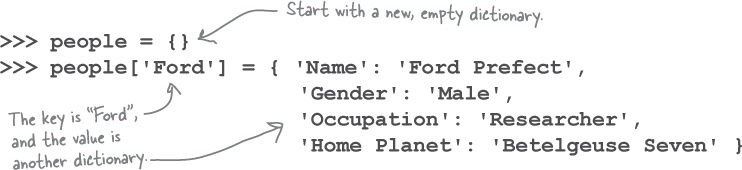

Access with people\['Ford'\]\['Gender'\]. Print with pprint

```python
d = {
    <key>: <value>,
    <key>: <value>,
      .
    <key>: <value>
}

>>> MLB_team = {
...     'Colorado' : 'Rockies',
...     'Boston'   : 'Red Sox',

# You can also construct a dictionary with the built-in dict() function. The argument to dict() should be a sequence of key-value pairs. A list of tuples works well for this:
d = dict([
    (<key>, <value>),
      .
      .
    (<key>, <value>)
])

# If the key values are simple strings, they can be specified as keyword arguments. So here is yet another way to define MLB_team:
>>> MLB_team = dict(
...     Colorado='Rockies',

# access
>>> type(MLB_team)
<class 'dict'>

>>> MLB_team
{'Colorado': 'Rockies', 'Boston': 'Red Sox', 'Minnesota': 'Twins', 'Milwaukee': 'Brewers', 'Seattle': 'Mariners'}

>>> MLB_team[1]
error

>>> MLB_team['Minnesota']
'Twins'

# add an entry
MLB_team['Kansas City'] = 'Royals'
>>> MLB_team
{'Colorado': 'Rockies', 'Boston': 'Red Sox', 'Minnesota': 'Twins',
'Milwaukee': 'Brewers', 'Seattle': 'Mariners', 'Kansas City': 'Royals'}

# update an entry
>>> MLB_team['Seattle'] = 'Seahawks'
>>> MLB_team
{'Colorado': 'Rockies', 'Boston': 'Red Sox', 'Minnesota': 'Twins',
'Milwaukee': 'Brewers', 'Seattle': 'Seahawks', 'Kansas City': 'Royals'}

# delete
>>> del MLB_team['Seattle']
>>> MLB_team
{'Colorado': 'Rockies', 'Boston': 'Red Sox', 'Minnesota': 'Twins',
'Milwaukee': 'Brewers', 'Kansas City': 'Royals'}


# can have any immutable as teh key, but this is not like a list!
>>> d = {3: 'd', 2: 'c', 1: 'b', 0: 'a'}
>>> d
{3: 'd', 2: 'c', 1: 'b', 0: 'a'}

>>> d[0]
'a'
>>> d[2]
'c'

# Note: Although access to items in a dictionary does not depend on order, Python does guarantee that the order of items in a dictionary is preserved. When displayed, items will appear in the order they were defined, and iteration through the keys will occur in that order as well. Items added to a dictionary are added at the end. If items are deleted, the order of the remaining items is retained.

# You can only count on this preservation of order very recently. It was added as a part of the Python language specification in version 3.7. However, it was true as of version 3.6 as well—by happenstance as a result of the implementation but not guaranteed by the language specification.

# nested dictionary
>>> person = {}
>>> type(person)
<class 'dict'>

>>> person['fname'] = 'Joe'
>>> person['lname'] = 'Fonebone'
>>> person['age'] = 51
>>> person['spouse'] = 'Edna'
>>> person['children'] = ['Ralph', 'Betty', 'Joey']
>>> person['pets'] = {'dog': 'Fido', 'cat': 'Sox'}

>>> person
{'fname': 'Joe', 'lname': 'Fonebone', 'age': 51, 'spouse': 'Edna',
'children': ['Ralph', 'Betty', 'Joey'], 'pets': {'dog': 'Fido', 'cat': 'Sox'}}

>>> person['fname']
'Joe'
>>> person['age']
51
>>> person['children']
['Ralph', 'Betty', 'Joey']

>>> person['children'][-1]
'Joey'
>>> person['pets']['cat']
'Sox'
#This example exhibits another feature of dictionaries: the values contained in the dictionary don’t need to be the same type. In person, some of the values are strings, one is an integer, one is a list, and one is another dictionary.

# Just as the values in a dictionary don’t need to be of the same type, the keys don’t either

# duplicate handling
# First, a given key can appear in a dictionary only once. Duplicate keys are not allowed. A dictionary maps each key to a corresponding value, so it doesn’t make sense to map a particular key more than once.

# You saw above that when you assign a value to an already existing dictionary key, it does not add the key a second time, but replaces the existing value:

# operators
# in
>>> 'Milwaukee' in MLB_team
True

# You can use the in operator together with short-circuit evaluation to avoid raising an error when trying to access a key that is not in the dictionary:
>>> MLB_team['Toronto']
Traceback (most recent call last):
  File "<pyshell#2>", line 1, in <module>
    MLB_team['Toronto']
KeyError: 'Toronto'

# uses short circuit evaluation, only first statement
>>> 'Toronto' in MLB_team and MLB_team['Toronto']
False

# dictionary methods
d.clear()

#The Python dictionary .get() method provides a convenient way of getting the value of a key from a dictionary without checking ahead of time whether the key exists, and without raising an error.
>>> d = {'a': 10, 'b': 20, 'c': 30}
>>> print(d.get('b'))
20
>>> print(d.get('z'))
None
# with default
>>> print(d.get('z', -1))
-1

# item list returns list of key value pairs
>>> d = {'a': 10, 'b': 20, 'c': 30}
>>> d
{'a': 10, 'b': 20, 'c': 30}

>>> list(d.items())
[('a', 10), ('b', 20), ('c', 30)]
>>> list(d.items())[1][0]
'b'
>>> list(d.items())[1][1]
20

# keys returns list of keys
>>> list(d.keys())
['a', 'b', 'c']

# values returns list of values
>>> list(d.values())
[10, 20, 30]
# Any duplicate values in d will be returned as many times as they occur:

# Technical Note: The .items(), .keys(), and .values() methods actually return something called a view object. A dictionary view object is more or less like a window on the keys and values. For practical purposes, you can think of these methods as returning lists of the dictionary’s keys and values.

# pop removes a key, returns value
# like del but a method not a statement
>>> d.pop('b')
20
>>> d
{'a': 10, 'c': 30}
# pop with default
>>> d.pop('z', -1)
-1

# popitem removes last key value pair
>>> d.popitem()
('c', 30)
>>> d
{'a': 10, 'b': 20}

# update merges dictionaries, adding or replacing. 
>>> d1 = {'a': 10, 'b': 20, 'c': 30}
>>> d1.update([('b', 200), ('d', 400)])
>>> d1
{'a': 10, 'b': 200, 'c': 30, 'd': 400}

>>> d1 = {'a': 10, 'b': 20, 'c': 30}
>>> d1.update(b=200, d=400)
>>> d1
{'a': 10, 'b': 200, 'c': 30, 'd': 400}

# copy a dictionary
>>> d2 = dict(d1)
>>> d2 == d1, d2 is d1
(True, False)

>>> d2 = dict(d1.items())
>>> d1 == d2, d1 is d2
(True, False)

```


### Sets

like a list with unique values, curly braces, faster than
list, can use set operators. Curly braces look like dictionary, but no
colons. Can use set logic (union, difference, intersection)

an unordered set of unique objects


## iterating

only collection based iteration

for <var> in <iterable>:
    <statement(s)>

<iterable> is a collection of objects—for example, a list or tuple. The <statement(s)> in the loop body are denoted by indentation, as with all Python control structures, and are executed once for each item in <iterable>. The loop variable <var> takes on the value of the next element in <iterable> each time through the loop.

### Iterables

In Python, iterable means an object can be used in iteration. The term is used as:

- An adjective: An object may be described as iterable.
- A noun: An object may be characterized as an iterable.

If an object is iterable, it can be passed to the built-in Python function iter(), which returns something called an iterator. Yes, the terminology gets a bit repetitive.

An iterator is essentially a value producer that yields successive values from its associated iterable object. The built-in function next() is used to obtain the next value from in iterator.

Notice how an iterator retains its state internally. It knows which values have been obtained already, so when you call next(), it knows what value to return next.

When out of values, return error

Iterators are lazy, so don't return all values at one, get them when needed.  

Only next, no previous.

Each of the objects in the following example is an iterable and returns some type of iterator when passed to iter():

```python
>>> iter('foobar')                             # String
<str_iterator object at 0x036E2750>

>>> iter(['foo', 'bar', 'baz'])                # List
<list_iterator object at 0x036E27D0>

>>> iter(('foo', 'bar', 'baz'))                # Tuple
<tuple_iterator object at 0x036E27F0>

>>> iter({'foo', 'bar', 'baz'})                # Set
<set_iterator object at 0x036DEA08>

>>> iter({'foo': 1, 'bar': 2, 'baz': 3})       # Dict
<dict_keyiterator object at 0x036DD990>

# not iterable
>>> iter(42)                                   # Integer
Traceback (most recent call last):
  File "<pyshell#26>", line 1, in <module>
    iter(42)
TypeError: 'int' object is not iterable

>>> iter(3.1)                                  # Float
Traceback (most recent call last):
  File "<pyshell#27>", line 1, in <module>
    iter(3.1)
TypeError: 'float' object is not iterable

>>> iter(len)                                  # Built-in function
Traceback (most recent call last):
  File "<pyshell#28>", line 1, in <module>
    iter(len)
TypeError: 'builtin_function_or_method' object is not iterable

```

For loop: in the background, this calls iter() to create iterator, called next() repeatedly, terminates loop  when next() raises the StopIteration exception

```python
# iterate a dict
>>> d = {'foo': 1, 'bar': 2, 'baz': 3}
>>> for k in d:
...     print(k)
foo
bar
baz

>>> for k in d:
...     print(d[k])
...
1
2
3

>>> for v in d.values():
...     print(v)
...
1
2
3

# keys and values at same time use packing
>>> for i, j in [(1, 2), (3, 4), (5, 6)]:
...     print(i, j)
...
1 2
3 4
5 6

>>> d = {'foo': 1, 'bar': 2, 'baz': 3}
>>> for k, v in d.items():
...     print('k =', k, ', v =', v)
...
k = foo , v = 1
k = bar , v = 2
k = baz , v = 3

# range: range(<begin>, <end>, <stride>) returns an iterable that yields integers starting with <begin>, up to but not including <end>. If specified, <stride> indicates an amount to skip between values (analogous to the stride value used for string and list slicing):

for a in range(1, 100, 2)
    print a

# break
>>> for i in ['foo', 'bar', 'baz', 'qux']:
...     if 'b' in i:
...         break
...     print(i)
...
foo

# continue (goes to next value)
>>> for i in ['foo', 'bar', 'baz', 'qux']:
...     if 'b' in i:
...         continue
...     print(i)
...
foo
qux

# else - executes if iteratble is exhausted
>>> for i in ['foo', 'bar', 'baz', 'qux']:
...     print(i)
... else:
...     print('Done.')  # Will execute
...
foo
bar
baz
qux
Done.

```


## Chapter 4: Functions and Modules

Modules are a collection of functions in a file.

Library is multiple modules.


Functions in a class are methods.

Doesn't force you to specify the return type, just objects.

String delimiters: ' and " are the same.

Doc strings are """, can span multiple lines. PEP8 is best practice
format. **<https://www.python.org/dev/peps/>.**

Pass args, return a single object - but this could be a data structure.

Function annotations:


Python doesn't check the type of parameters passed to a function call,
or the type of return values. Everything's an object. Annotations just
for documentation. Visible with help BIF.

Default arguments: specify default value with =


Position versus keyword assignment: pass args in any order.

### Modules

Share functions by creating a module (file).

Import a module, but interpreter assumes module is on the search path.
Import error if not. Cant specify full path. This is hard! Looks in

1. Current working directory
2. Interpreters site package locations
3. Standard library locations

### Adding a module to site packages:

Setup tools module in standard library has the tools to add / remove from
site packages.

1.  Create a distribution description (identifies the module. Create a
    file setup.py with the details of the author etc, and list of the
    .py files to include in the package. Also create a README.tct file
    in same folder)


2.  Generate a distribution file (creates multiple files zipped to a
    distribution file)


3.  Install the distribution file (use pip = package installer for
    python


Can share packages via PyPI (python package index).
[***https://pypi.python.org/pypi***](https://pypi.python.org/pypi).

### Do Python function arguments support by-value or by-reference?

Here's the kicker: both Tom *and* Sarah are right. Depending on the
situation, Python's function argument semantics
support **both** call-by-value *and* call-by-reference.

Recall once again that variables in Python aren't variables as we are
used to thinking about them in other programming languages; variables
are **object references**. It is useful to think of the value stored in
the variable as being the memory address of the value, not its actual
value. It's this memory address that's passed into a function, not the
actual value. This means that Python's functions support what's more
correctly called *by-object-reference call semantics*.

Based on the type of the object referred to, the actual call semantics
that apply at any point in time can differ. So, how come in Tom's and
Sarah's functions the arguments appeared to conform to by-value and
by-reference call semantics? First off, they didn't---they only appeared
to. What actually happens is that the interpreter looks at the type of
the value referred to by the object reference (the memory address) and,
if the variable refers to a **mutable** value, call-by-reference
semantics apply. If the type of the data referred to is **immutable**,
call-by- value semantics kick in. Consider now what this means for our
data.

Lists, dictionaries, and sets (being mutable) are always passed into a
function by reference--- any changes made to the variable's data
structure within the function's suite are reflected in the calling code.
The data is mutable, after all.

Strings, integers, and tuples (being immutable) are always passed into a
function by value--- any changes to the variable within the function are
private to the function and are not reflected in the calling code. As
the data is immutable, it cannot change.

Testing framework: pytest, and pytest plugins.

Pep8 plugin can test for compliance with PEP8.

Install pytest with pip

Summary so far:

### BULLET POINTS

- IDLE, Python's built-in IDE, is used to experiment with and execute
    Python code, either as single-statement snippets or as larger
    multistatement programs written within IDLE's text editor. As well
    as using IDLE, you ran a file of Python code directly from your
    operating system's command line, using the py -3 command (on
    Windows) or python3 (on everything else).

- You've learned how Python supports single-value data items, such as
    integers and strings, as well as the booleans True and False.

- You've explored use cases for the four built-in data structures:
    lists, dictionaries, sets, and tuples. You know that you can create
    complex data structures by combining these four built-ins in any
    number of ways.

- You've used a collection of Python statements,
    including if, elif, else, return, for, from, and import.

- You know that Python provides a rich standard library, and you've
    seen the following modules in
    action: datetime, random, sys, os, time, html, pprint, setuptools,
    and pip.

- As well as the standard library, Python comes with a handy
    collection of built-in functions, known as the BIFs. Here are some
    of the BIFs you've worked
    with: print, dir, help, range, list, len, input, sorted, dict, set, tuple,
    and type.

- Python supports all the usual operators, and then some. Those you've
    already seen include: in, not
    in, +, -, = (assignment), ==(equality), +=, and \*.

- As well as supporting the square bracket notation for working with
    items in a sequence (i.e., \[\]), Python extends the notation to
    support **slices**, which allow you to specify **start**, **stop**,
    and **step** values.

- You've learned how to create your own custom functions in Python,
    using the def statement. Python functions can optionally accept any
    number of arguments as well as return a value.

- Although it's possible to enclose strings in either single or double
    quotes, the Python conventions (documented in **PEP 8**) suggest
    picking one style and sticking to it. For this book, we've decided
    to enclose all of our strings within single quotes, unless the
    string we're quoting itself contains a single quote character, in
    which case we'll use double quotes (as a one-off, special case).

- Triple-quoted strings are also supported, and you've seen how they
    are used to add docstrings to your custom functions.

- You learned that you can group related functions into modules.
    Modules form the basis of the code reuse mechanism in Python, and
    you've seen how the pip module (included in the standard library)
    lets you consistently manage your module installations.

- Speaking of things working in a consistent manner, you learned that
    in Python **everything is an object**, which ensures---as much as
    possible---that everything works just as you expect it to. This
    concept really pays off when you start to define your own custom
    objects using classes, which we'll show you how to do in a later
    chapter.

## Chapter 5: building a web app

Flask is a small web application framework.

Django is a much bigger one with good admin facilities, but overkill for
this.

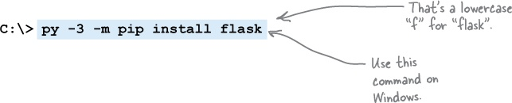

### Python decorators

Function decorator adjusts the behaviour of a function without needing
to change code. Function is decorated. Take existing code and augment it
with additional behaviour.

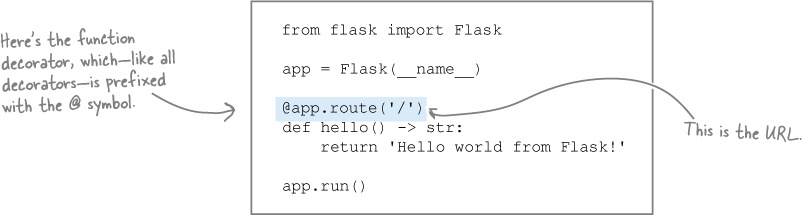

### URLs

Q: I'm a little confused by the 127.0.0.1 and: 5000 parts of the URL
used to access the webapp. What's the deal with those?

A: At the moment, you're testing your webapp on your computer,
which---because it's connected to the Internet---has its own unique IP
address. Despite this fact, Flask doesn't use your IP address and
instead connects its test web server to the Internet's loopback address:
127.0.0.1, also commonly known as localhost. Both are shorthand for "my
computer, no matter what its actual IP address is." For your web browser
(also on your computer) to communicate with your Flask web server, you
need to specify the address that is running your webapp,
namely:127.0.0.1. This is a standard IP address reserved for this exact
purpose.

The :5000 part of the URL identifies the protocol port number your web
server is running on.

Typically, web servers run on protocol port 80, which is an Internet
standard, and as such, doesn't need to be specified. You could type
oreilly.com:80 into your browser's address bar and it would work, but
nobody does, as oreilly.com alone is sufficient (as the :80 is assumed).

When you're building a webapp, it's very rare to test on protocol port
80 (as that's reserved for production servers), so most web frameworks
choose another port to run on. 8080 is a popular choice for this, but
Flask uses 5000 as its test protocol port.

### HTML template engine

**TEMPLATES UP CLOSE**


Template engines let programmers apply the object-oriented notions of
inheritance and reuse to the production of textual data, such as web
pages.

A website's look and feel can be defined in a top-level HTML template,
known as the **base template**, which is then inherited from by other
HTML pages. If you make a change to the base template, the change is
then reflected in *all* the HTML pages that inherit from it.

The template engine shipped with Flask is called *Jinja2*, and it is
both easy to use and powerful. It is not this book's intention to teach
you all you need to know about Jinja2, so what appears on these two
pages is---by necessity---both brief and to the point. For more details
on what's possible with Jinja2, see:

[***http://jinja.pocoo.org/docs/dev/***](http://jinja.pocoo.org/docs/dev/)

Here's the base template we'll use for our webapp. In this file,
called base.html, we put the HTML markup that we want all of our web
pages to share. We also use some Jinja2-specific markup to indicate
content that will be supplied when HTML pages inheriting from this one
are rendered (i.e., prepared prior to delivery to a waiting web
browser). Note that markup appearing between {{ and }}, as well as
markup enclosed between , is meant for the Jinja2 template
engine: we've highlighted these cases to make them easy to spot:

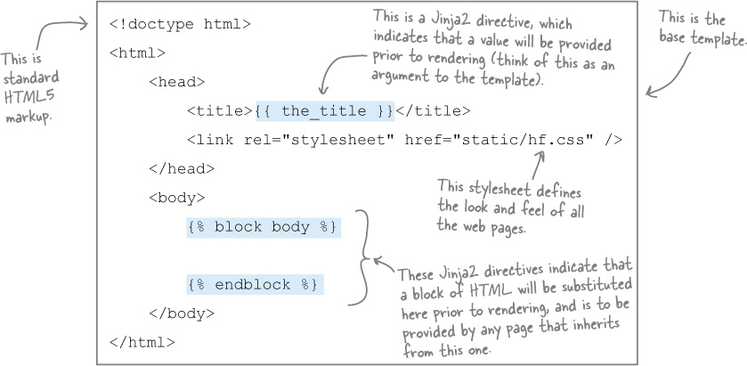

With the base template ready, we can inherit from it using
Jinja2's extends directive. When we do, the HTML files that inherit need
only provide the HTML for any named blocks in the base. In our case, we
have only one named block: body.

Here's the markup for the first of our pages, which we are
calling entry.html. This is markup for an HTML form that users can
interact with in order to provide the value
for phrase and letters expected by our webapp.

Note how the "boilerplate" HTML in the base template is not repeated in
this file, as the extends directive includes this markup for us. All we
need to do is provide the HTML that is specific to this file, and we do
this by providing the markup within the Jinja2 block called body:


And, finally, here's the markup for the results.html file, which is used
to render the results of our search. This template inherits from the
base template, too:


Debug mode for flask: automatically restarts webapp when code changed.

### Dunder name dunder main

Used to prevent app.run being called when run on e.g. AWS, but is called
when run locally.


Chapter 6: File access
----------------------

File open, operations, close

Better to use with:


---

## Chapter 7 : Database access

DB-API is standard library to talk to any sql database

Need a driver to connect.

MySQL owned by Oracle!

Standard stuff.

Use a context manager and "with" statement to manage initialisation,
work and teardown in less statements


Don't put import startements in a function or theyre exectured with
every function call.

---

## chapter 8: classes

OO is optional

Can use with statement with or without a class, but class is better.

"Context management protocol" is needed with the with statement.

Class encapsulates behavior (ie implements a function, method) and
state (variables, attributes)

Create a class with


Instantiate with

A = CountFromBy()

Looks like a function call. Functions should have lower case and
underscores. Classes have Hungarian notation.

Methods always take (self) as the first argument (alias to the current
object), but you don't pass this when calling methods.

Object construction handled by the optimiser. Use magic method
\_\_init\_\_ to initialise. Dunder init. Other dunder methods are dunder
eq for ==, dunder ge for \> operator. Can overwrite these for a class.
E.g. overwrite dunder repr for string representation of object.

---

## Chapter 9: Context management protocol

Context manager means you can use the **WITH** statement to manage
initiation and tear down.

Create a class, protocol says need to define 2 dunder magic methods:
\_\_enter\_\_ and \_\_exit\_\_. Then you can use with..

Best to use \_\_init\_\_ also.


---

## Chapter 10: Function decorators

Web requests are all stateless so independent, no memory. HTTP enforces
this. Web apps can load and unload at the discretion of the server, so
not practical to hold state. No global variables for web app state.
Sessions used instead. Flask web server implements this. Session like a
layer of state. Add a cookie to the browser, link this to a session ID
on the web server. Each user gets their own session, can store state on
web app.

Decorators prefixed with @.

### Pass a function to a function:

functions are objects with an ID. Just pass the name of the function as
the argument.

### Invoke a passed function


### Functions nested in functions

Code in a function can define another function. Can return the nested
function.


A more common usage of this technique arranges for the enclosing
function to return the nested function as its value, using
the return statement. This is what allows you to create a decorator.

### Return a function from a function


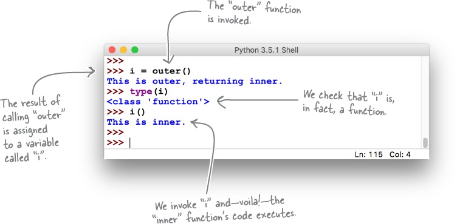

### Function accepting a list of arguments

### USE \* TO ACCEPT AN ARBITRARY LIST OF ARGUMENTS

Python provides a special notation that allows you to specify that a
function can take any number of arguments (where "any number" means
"zero or more"). This notation uses the \* character to represent *any
number*, and is combined with an argument name (by convention, args is
used) to specify that a function can accept an arbitrary list of
arguments (even though \*args is technically a tuple).

**Think of \* as meaning "expand to a list of values."**

Here's a version of myfunc that uses this notation to accept any number
of arguments when invoked. If any arguments are provided, myfunc prints
their values to the screen:

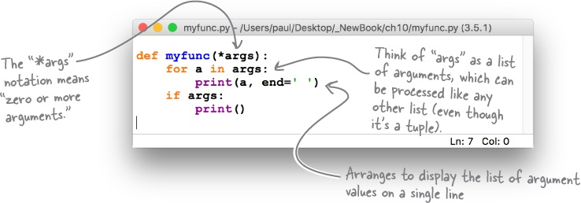


### * WORKS ON THE WAY IN, TOO

If you provide a list to myfunc as an argument, the list (despite
potentially containing many values) is treated as one item (i.e.,
it's *one*list). To instruct the interpreter to **expand** the list to
behave as if each of the list's items were an *individual* argument,
prefix the list's name with the \* character when invoking the function.

Another short IDLE session demonstrates the difference using \* can
have:

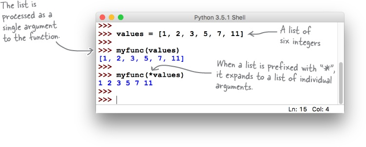

### USE ** TO ACCEPT ARBITRARY KEYWORD ARGUMENTS

In addition to the \* notation, Python also provides \*\*, which expands
to a collection of keyword arguments. Where \* uses args as its variable
name (by convention), \*\* uses kwargs, which is short for "keyword
arguments." (Note: you can use names other than args and kwargs within
this context, but very few Python programmers do.)

**Think of \*\* as meaning "expand to a dictionary of keys and
values."**

Let's look at another function, called myfunc2, which accepts any number
of keyword arguments:

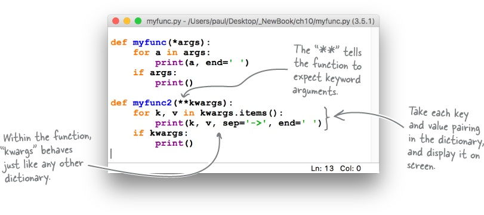

Here's a third version of myfunc (which goes by the shockingly
imaginative name of myfunc3). This function accepts any list of
arguments, any number of keyword arguments, or a combination of both:

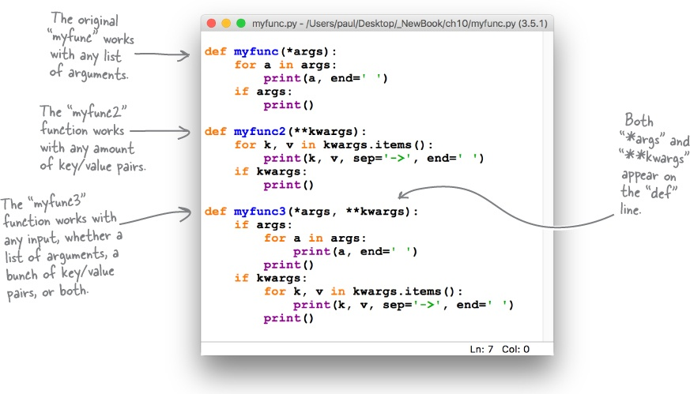


### Decorator steps

1.  Decorator is a function

2.  Decorator takes the decorated function as an argument

3.  Decorator returns a new function

4.  Decorator maintains the decorated functions signature

**When creating your own decorators, always import, then use, the
"functools" module's "wraps" function. (technical reasons in library).**


Note how the page2 function's code is only concerned with what it needs
to do: display the */page2* content. In this example, the page2 code is
a single, simple statement; it would be harder to read and understand if
it *also* contained the logic required to check whether a user's browser
is logged in or not. Using a decorator to separate out the
login-checking code is a big win.

**Decorators aren't freaky; they're fun.**

This "logic abstraction" is one of the reasons the use of decorators is
popular in Python. Another is that, if you think about it, in creating
the check\_logged\_in decorator, you've managed to write code
that *augments an existing function with extra code, by changing the
behavior of the existing function without changing its code*.

### Generic decorator code


**BULLET POINTS**


-   When you need to store server-side state within a Flask webapp, use
    the ***session*** dictionary (and don't forget to set a
    hard-to-guess ***secret\_key***).

-   You can pass a function as an argument to another function. Using
    the function's name (without the parentheses) gives you a **function
    object**, which can be manipulated like any other variable.

-   When you use a function object as an argument to a function, you can
    have the receiving function **invoke** the passed-in function object
    by appending parentheses.

-   A function can be **nested** inside an enclosing function's suite
    (and is only visible within the enclosing scope).

-   In addition to accepting a function object as an argument, functions
    can **return** a nested function as a return value.

-   **\*args** is shorthand for "expand to a list of items."

-   **\*\*kwargs** is shorthand for "expand to a dictionary of keys and
    values." When you see "kw," think "keywords."

-   Both **\*** and **\*\*** can also be used "on the way in," in that a
    list or keyword collection can be passed into a function as a single
    (expandable) argument.

-   Using **(*\*args***, ***\*\*kwargs*)** as a **function
    signature** lets you create functions that accept any number and
    type of arguments.

-   Using the new function features from this chapter, you learned how
    to create a **function decorator**, which changes the behavior of an
    existing function without the need to change the function's actual
    code. This sounds freaky, but is quite a bit of fun (and is very
    useful, too).

## Chapter 11: Exception handling

When a runtime error occurs, an exception is **raised**. If
you *ignore* a raised exception it is referred to as **uncaught**, and
the interpreter will terminate your code, then display a runtime error
message (as shown in the example from the bottom of the last page). That
said, raised exceptions can also be **caught** (i.e., dealt with) with
the try statement. Note that it's not enough to catch runtime errors,
you *also* have to decide what you're going to do next.

### Catching an Error Is Not Enough

When a runtime error occurs, an exception is **raised**. If
you *ignore* a raised exception it is referred to as **uncaught**, and
the interpreter will terminate your code, then display a runtime error
message (as shown in the example from the bottom of the last page). That
said, raised exceptions can also be **caught** (i.e., dealt with) with
the try statement. Note that it's not enough to catch runtime errors,
you *also* have to decide what you're going to do next.

Perhaps you'll decide to deliberately ignore the raised exception, and
keep going\...with your fingers firmly crossed. Or maybe you'll try to
run some other code in place of the code that crashed, and keep going.
Or perhaps the best thing to do is to log the error before terminating
your application as cleanly as possible. Whatever you decide to do,
the try statement can help.

In its most basic form, the try statement allows you to react whenever
the execution of your code results in a raised exception. To protect
code with try, put the code within try's suite. If an exception occurs,
the code in the try's suite terminates, and then the code in
the try's except suite runs. The except suite is where you define what
you want to happen next.


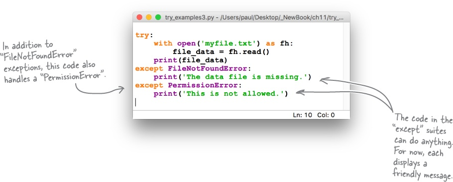


The standard library comes with a module
called sys that provides access to the interpreter's internals (a set of
variables and functions available at runtime).

One such function is exc_info, which provides information on the
exception currently being handled. When invoked, exc\_info returns a
three-valued tuple where the first value indicates the
exception's **type**, the second details the exception's **value**, and
the third contains a **traceback object** that provides access to the
traceback message (should you need it). When there is no currently
available exception, exc\_info returns the Python null value for each of
the tuple values, which looks like this:(None, None,
None).


To make this (and your life) easier, Python extends the try/except syntax
to make it convenient to get at the information returned by the
sys.exc\_info function, and it does this without you having to remember
to import or interact with the sys module, nor wrangle with the tuple
returned by the exc\_info function.

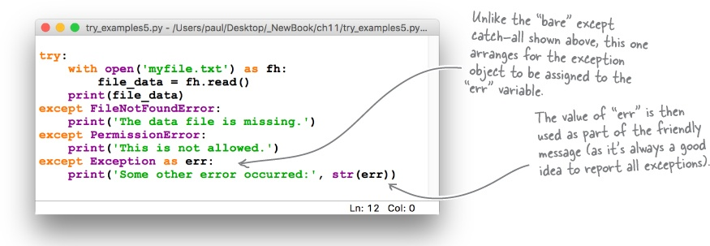

Create custom exceptions by extending the exception class
