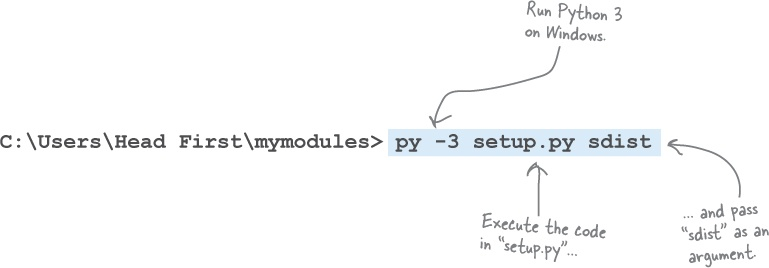
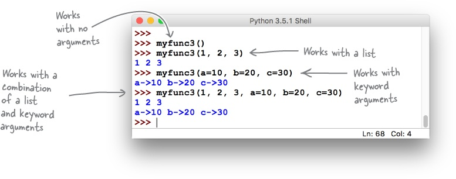

<LINK href="jb1.css" rel="stylesheet" type="text/css">

#### [Back to index](index.html)

# Python

- [Python](#python)
  - [Basics](#basics)
    - [Installation](#installation)
    - [Imports](#imports)
    - [Mutable / immutable](#mutable--immutable)
    - [Built in scalar types](#built-in-scalar-types)
    - [Python operations](#python-operations)
      - [To print strings](#to-print-strings)
      - [Concatenate](#concatenate)
  - [Memory structures](#memory-structures)
    - [List](#list)
    - [Tuple](#tuple)
    - [Dictionary](#dictionary)
    - [Set](#set)
  - [Chapter 3: Dictionaries, Sets, Tuples](#chapter-3-dictionaries-sets-tuples)
    - [Dictionary](#dictionary-1)
    - [Sets](#sets)
    - [Tuples](#tuples)
  - [Chapter 4: Functions and Modules](#chapter-4-functions-and-modules)
    - [Modules](#modules)
    - [Adding a module to site packages:](#adding-a-module-to-site-packages)
    - [Do Python function arguments support by-value or by-reference?](#do-python-function-arguments-support-by-value-or-by-reference)
    - [BULLET POINTS](#bullet-points)
  - [Chapter 5: building a web app](#chapter-5-building-a-web-app)
    - [Python decorators](#python-decorators)
    - [URLs](#urls)
    - [HTML template engine](#html-template-engine)
    - [Dunder name dunder main](#dunder-name-dunder-main)
  - [Chapter 6: File access](#chapter-6-file-access)
  - [Chapter 7 : Database access](#chapter-7--database-access)
  - [chapter 8: classes](#chapter-8-classes)
  - [Chapter 9: Context management protocol](#chapter-9-context-management-protocol)
  - [Chapter 10: Function decorators](#chapter-10-function-decorators)
    - [Pass a function to a function:](#pass-a-function-to-a-function)
    - [Invoke a passed function](#invoke-a-passed-function)
    - [Functions nested in functions](#functions-nested-in-functions)
    - [Return a function from a function](#return-a-function-from-a-function)
    - [Function accepting a list of arguments](#function-accepting-a-list-of-arguments)
    - [USE \* TO ACCEPT AN ARBITRARY LIST OF ARGUMENTS](#use--to-accept-an-arbitrary-list-of-arguments)
    - [* WORKS ON THE WAY IN, TOO](#-works-on-the-way-in-too)
    - [USE ** TO ACCEPT ARBITRARY KEYWORD ARGUMENTS](#use--to-accept-arbitrary-keyword-arguments)
    - [Decorator steps](#decorator-steps)
    - [Generic decorator code](#generic-decorator-code)
  - [Chapter 11: Exception handling](#chapter-11-exception-handling)
  - [Catching an Error Is Not Enough](#catching-an-error-is-not-enough)

## Basics

### Installation

Conda install packagename

Conda update packagename

Pip install packagename (use conda if you can for conda environments)

Objects have a type, and a set of methods that run on that type.

### Imports

Import somemodule\
somemodule.a(d, e)

Or:

From somemodule import a\
a(d, e)

### Mutable / immutable

Most are mutable (lists, dicts, numpy arrays, classes).

Strings and tuples are immutable.

### Built in scalar types

Str (unicode), bytes, float, bool, int.

### Python operations

#### To print strings

Named arguments:

`"hello {name}".format(name = "Jeremy")`

`"cost is {cost:6.3f}.format(cost = "230.3498", ) -\> 230.35`

default arguments

`print(\"Hello {}, your balance is {}.\".format(\"Adam\", 230.2346))`

positional arguments

`print(\"Hello {0}, your balance is {1}.\".format(\"Adam\", 230.2346))`

keyword arguments

`print(\"Hello {name}, your balance is {blc}.\".format(name=\"Adam\",
blc=230.2346))`

mixed arguments

`print(\"Hello {0}, your balance is {blc}.\".format(\"Adam\",
blc=230.2346))`

arguments with index

`\"start: {}\".format(Df2.shape\[0\])`

#### Concatenate

**The join() is a string method which returns a string concatenated with
the elements of an iterable.**

**Concatenate with +**

`print('str1 + str2 = ', str1 + str2)`

String operations

1.  \>\>\> \"PrOgRaMiZ\".lower()

2.  \'programiz\'

3.  \>\>\> \"PrOgRaMiZ\".upper()

4.  \'PROGRAMIZ\'

5.  \>\>\> \"This will split all words into a list\".split()

6.  \[\'This\', \'will\', \'split\', \'all\', \'words\', \'into\',
    > \'a\', \'list\'\]

7.  \>\>\> \' \'.join(\[\'This\', \'will\', \'join\', \'all\',
    > \'words\', \'into\', \'a\', \'string\'\])

8.  \'This will join all words into a string\'

9.  \>\>\> \'Happy New Year\'.find(\'ew\')

10. 7

11. \>\>\> \'Happy New Year\'.replace(\'Happy\',\'Brilliant\')

12. \'Brilliant New Year\'

---

## Memory structures

**A variable takes on the type of the value assigned.**

Everything is an object in Python, and any object can be assigned to a
variable.

**Like in other programming languages, objects can
have state (attributes or values) and behavior (methods).**

### List

an ordered mutable collection of objects. Not predefined size, any
objects, has sequence.

{width="4.90625in"
height="2.90625in"}

### Tuple

an ordered immutable collection of objects. Like a constant list.**

{width="4.395833333333333in"
height="3.0520833333333335in"}

### Dictionary

an unordered set of key/value pairs

{width="4.458333333333333in"
height="3.3229166666666665in"}

### Set

an unordered set of unique objects

{width="3.6145833333333335in"
height="3.0208333333333335in"}

Lists: [square brackets, comma separated objects]. Can do list of
lists.

Append(object) to add object

remove(object) to remove

pop(index) to remove on index (or last) and returns it

list1.extend(list2) to add list2 to list1

list.insert(index to insert before, object to insert)

## Chapter 3: Dictionaries, Sets, Tuples

### Dictionary

for name / value pairs. Like a map. Order not preserved. Load using
curly braces, with a colon for the key. Access with square brackets.

Person3 = {'Name': 'Jremy',\
'Gender': 'M'}

Lookup with square brackets: person3\['Gender'\]

Check out this for the parser interpretation:
<https://docs.python.org/3/reference/lexical_analysis.html#operators>

For loop only iterates over the keys. Use sorted function e.g. for k in
sorted(dictionary). Sorted returns an ordered copy, doesn't change the
original.

Items method with for loop is best way to get the data.

e.g. for k, v in sorted(found.items)):

print(k, 'was found', v, 'times')

Dictionary keys must be inititialised. So check membership with 'in'. Or
set the default

### Sets

like a list with unique values, curly braces, faster than
list, can use set operators. Curly braces look like dictionary, but no
colons. Can use set logic (union, difference, intersection)

### Tuples

like a list but immutable. Round brackets. Cant have a
single object in a tuple unless add a comma.

Use type(object) to see if it's a list / dictionary etc.

Often have e.g. dictionary of dictionaries.

{width="6.268055555555556in"
height="1.4361111111111111in"}

Access with people\['Ford'\]\['Gender'\]. Print with pprint

## Chapter 4: Functions and Modules

Modules are a collection of functions in a file.

Library is multiple modules.

{width="6.268055555555556in"
height="2.3444444444444446in"}

Functions in a class are methods.

Doesn't force you to specify the return type, just objects.

String delimiters: ' and " are the same.

Doc strings are """, can span multiple lines. PEP8 is best practice
format. **<https://www.python.org/dev/peps/>.**

Pass args, return a single object - but this could be a data structure.

Function annotations:

{width="6.268055555555556in"
height="1.4819444444444445in"}

Python doesn't check the type of parameters passed to a function call,
or the type of return values. Everything's an object. Annotations just
for documentation. Visible with help BIF.

Default arguments: specify default value with =

{width="6.268055555555556in"
height="1.2520833333333334in"}

Position versus keyword assignment: pass args in any order.

### Modules

Share functions by creating a module (file).

Import a module, but interpreter assumes module is on the search path.
Import error if not. Cant specify full path. This is hard! Looks in

1. Current working directory
2. Interpreters site package locations
3. Standard library locations

### Adding a module to site packages:

Setuptools module in standard library has the tools to add / remove from
site packages.

1.  Create a distribution description (identifies the module. Create a
    file setup.py with the details of the author etc, and list of the
    .py files to include in the package. Also create a README.tct file
    in same folder)

{width="6.268055555555556in"
height="2.6798611111111112in"}

2.  Generate a distribution file (creates multiple files zipped to a
    distribution file)

{width="6.268055555555556in"
height="2.1847222222222222in"}

3.  Install the distribution file (use pip = package installer for
    python

{width="6.268055555555556in"
height="1.3625in"}

Can share packages via PyPI (python package index).
[***https://pypi.python.org/pypi***](https://pypi.python.org/pypi).

### Do Python function arguments support by-value or by-reference?

Here's the kicker: both Tom *and* Sarah are right. Depending on the
situation, Python's function argument semantics
support **both** call-by-value *and* call-by-reference.

Recall once again that variables in Python aren't variables as we are
used to thinking about them in other programming languages; variables
are **object references**. It is useful to think of the value stored in
the variable as being the memory address of the value, not its actual
value. It's this memory address that's passed into a function, not the
actual value. This means that Python's functions support what's more
correctly called *by-object-reference call semantics*.

Based on the type of the object referred to, the actual call semantics
that apply at any point in time can differ. So, how come in Tom's and
Sarah's functions the arguments appeared to conform to by-value and
by-reference call semantics? First off, they didn't---they only appeared
to. What actually happens is that the interpreter looks at the type of
the value referred to by the object reference (the memory address) and,
if the variable refers to a **mutable** value, call-by-reference
semantics apply. If the type of the data referred to is **immutable**,
call-by- value semantics kick in. Consider now what this means for our
data.

Lists, dictionaries, and sets (being mutable) are always passed into a
function by reference--- any changes made to the variable's data
structure within the function's suite are reflected in the calling code.
The data is mutable, after all.

Strings, integers, and tuples (being immutable) are always passed into a
function by value--- any changes to the variable within the function are
private to the function and are not reflected in the calling code. As
the data is immutable, it cannot change.

Testing framework: pytest, and pytest plugins.

Pep8 plugin can test for compliance with PEP8.

Install pytest with pip

Summary so far:

### BULLET POINTS

- IDLE, Python's built-in IDE, is used to experiment with and execute
    Python code, either as single-statement snippets or as larger
    multistatement programs written within IDLE's text editor. As well
    as using IDLE, you ran a file of Python code directly from your
    operating system's command line, using the py -3 command (on
    Windows) or python3 (on everything else).

- You've learned how Python supports single-value data items, such as
    integers and strings, as well as the booleans True and False.

- You've explored use cases for the four built-in data structures:
    lists, dictionaries, sets, and tuples. You know that you can create
    complex data structures by combining these four built-ins in any
    number of ways.

- You've used a collection of Python statements,
    including if, elif, else, return, for, from, and import.

- You know that Python provides a rich standard library, and you've
    seen the following modules in
    action: datetime, random, sys, os, time, html, pprint, setuptools,
    and pip.

- As well as the standard library, Python comes with a handy
    collection of built-in functions, known as the BIFs. Here are some
    of the BIFs you've worked
    with: print, dir, help, range, list, len, input, sorted, dict, set, tuple,
    and type.

- Python supports all the usual operators, and then some. Those you've
    already seen include: in, not
    in, +, -, = (assignment), ==(equality), +=, and \*.

- As well as supporting the square bracket notation for working with
    items in a sequence (i.e., \[\]), Python extends the notation to
    support **slices**, which allow you to specify **start**, **stop**,
    and **step** values.

- You've learned how to create your own custom functions in Python,
    using the def statement. Python functions can optionally accept any
    number of arguments as well as return a value.

- Although it's possible to enclose strings in either single or double
    quotes, the Python conventions (documented in **PEP 8**) suggest
    picking one style and sticking to it. For this book, we've decided
    to enclose all of our strings within single quotes, unless the
    string we're quoting itself contains a single quote character, in
    which case we'll use double quotes (as a one-off, special case).

- Triple-quoted strings are also supported, and you've seen how they
    are used to add docstrings to your custom functions.

- You learned that you can group related functions into modules.
    Modules form the basis of the code reuse mechanism in Python, and
    you've seen how the pip module (included in the standard library)
    lets you consistently manage your module installations.

-  Speaking of things working in a consistent manner, you learned that
    in Python **everything is an object**, which ensures---as much as
    possible---that everything works just as you expect it to. This
    concept really pays off when you start to define your own custom
    objects using classes, which we'll show you how to do in a later
    chapter.

## Chapter 5: building a web app

Flask is a small web application framework.

Django is a much bigger one with good admin facilities, but overkill for
this.

{width="6.268055555555556in"
height="1.2673611111111112in"}

### Python decorators

Function decorator adjusts the behaviour of a function without needing
to change code. Function is decorated. Take existing code and augment it
with additional behaviour.

{width="6.268055555555556in"
height="1.6805555555555556in"}

### URLs

Q: I'm a little confused by the 127.0.0.1 and: 5000 parts of the URL
used to access the webapp. What's the deal with those?

A: At the moment, you're testing your webapp on your computer,
which---because it's connected to the Internet---has its own unique IP
address. Despite this fact, Flask doesn't use your IP address and
instead connects its test web server to the Internet's loopback address:
127.0.0.1, also commonly known as localhost. Both are shorthand for "my
computer, no matter what its actual IP address is." For your web browser
(also on your computer) to communicate with your Flask web server, you
need to specify the address that is running your webapp,
namely:127.0.0.1. This is a standard IP address reserved for this exact
purpose.

The :5000 part of the URL identifies the protocol port number your web
server is running on.

Typically, web servers run on protocol port 80, which is an Internet
standard, and as such, doesn't need to be specified. You could type
oreilly.com:80 into your browser's address bar and it would work, but
nobody does, as oreilly.com alone is sufficient (as the :80 is assumed).

When you're building a webapp, it's very rare to test on protocol port
80 (as that's reserved for production servers), so most web frameworks
choose another port to run on. 8080 is a popular choice for this, but
Flask uses 5000 as its test protocol port.

### HTML template engine

**TEMPLATES UP CLOSE**

{width="1.25in"
height="0.9479166666666666in"}

Template engines let programmers apply the object-oriented notions of
inheritance and reuse to the production of textual data, such as web
pages.

A website's look and feel can be defined in a top-level HTML template,
known as the **base template**, which is then inherited from by other
HTML pages. If you make a change to the base template, the change is
then reflected in *all* the HTML pages that inherit from it.

The template engine shipped with Flask is called *Jinja2*, and it is
both easy to use and powerful. It is not this book's intention to teach
you all you need to know about Jinja2, so what appears on these two
pages is---by necessity---both brief and to the point. For more details
on what's possible with Jinja2, see:

[***http://jinja.pocoo.org/docs/dev/***](http://jinja.pocoo.org/docs/dev/)

Here's the base template we'll use for our webapp. In this file,
called base.html, we put the HTML markup that we want all of our web
pages to share. We also use some Jinja2-specific markup to indicate
content that will be supplied when HTML pages inheriting from this one
are rendered (i.e., prepared prior to delivery to a waiting web
browser). Note that markup appearing between {{ and }}, as well as
markup enclosed between , is meant for the Jinja2 template
engine: we've highlighted these cases to make them easy to spot:

{width="6.268055555555556in"
height="3.0708333333333333in"}

With the base template ready, we can inherit from it using
Jinja2's extends directive. When we do, the HTML files that inherit need
only provide the HTML for any named blocks in the base. In our case, we
have only one named block: body.

Here's the markup for the first of our pages, which we are
calling entry.html. This is markup for an HTML form that users can
interact with in order to provide the value
for phrase and letters expected by our webapp.

Note how the "boilerplate" HTML in the base template is not repeated in
this file, as the extends directive includes this markup for us. All we
need to do is provide the HTML that is specific to this file, and we do
this by providing the markup within the Jinja2 block called body:

{width="6.268055555555556in"
height="2.6479166666666667in"}

And, finally, here's the markup for the results.html file, which is used
to render the results of our search. This template inherits from the
base template, too:

{width="6.268055555555556in"
height="2.607638888888889in"}

Debug mode for flask: automatically restarts webapp when code changed.

### Dunder name dunder main

Used to prevent app.run being called when run on e.g. AWS, but is called
when run locally.

{width="6.268055555555556in"
height="0.9520833333333333in"}

Chapter 6: File access
----------------------

File open, operations, close

Better to use with:

{width="6.268055555555556in"
height="1.5541666666666667in"}

---

## Chapter 7 : Database access

DB-API is standard library to talk to any sql database

Need a driver to connect.

MySQL owned by Oracle!

Standard stuff.

Use a context manager and "with" statement to manage initialisation,
work and teardown in less statements

{width="6.268055555555556in"
height="2.7805555555555554in"}

Don't put import startements in a function or theyre exectured with
every function call.

---

## chapter 8: classes

OO is optional

Can use with statement with or without a class, but class is better.

"Context management protocol" is needed with the with statement.

Class encapsulates behavior (ie implements a function, method) and
state (variables, attributes)

Create a class with

{width="6.268055555555556in"
height="1.43125in"}

Instantiate with

A = CountFromBy()

Looks like a function call. Functions should have lower case and
underscores. Classes have Hungarian notation.

Methods always take (self) as the first argument (alias to the current
object), but you don't pass this when calling methods.

Object construction handled by the optimiser. Use magic method
\_\_init\_\_ to initialise. Dunder init. Other dunder methods are dunder
eq for ==, dunder ge for \> operator. Can overwrite these for a class.
E.g. overwrite dunder repr for string representation of object.

---

## Chapter 9: Context management protocol

Context manager means you can use the **WITH** statement to manage
initiation and tear down.

Create a class, protocol says need to define 2 dunder magic methods:
\_\_enter\_\_ and \_\_exit\_\_. Then you can use with..

Best to use \_\_init\_\_ also.

{width="6.268055555555556in"
height="2.1791666666666667in"}

{width="6.268055555555556in"
height="6.752777777777778in"}

---

## Chapter 10: Function decorators

Web requests are all stateless so independent, no memory. HTTP enforces
this. Web apps can load and unload at the discretion of the server, so
not practical to hold state. No global variables for web app state.
Sessions used instead. Flask web server implements this. Session like a
layer of state. Add a cookie to the browser, link this to a session ID
on the web server. Each user gets their own session, can store state on
web app.

Decorators prefixed with @.

### Pass a function to a function:

functions are objects with an ID. Just pass the name of the function as
the argument.

### Invoke a passed function

{width="6.268055555555556in"
height="2.09375in"}

### Functions nested in functions

Code in a function can define another function. Can return the nested
function.

{width="5.739583333333333in"
height="2.0625in"}

A more common usage of this technique arranges for the enclosing
function to return the nested function as its value, using
the return statement. This is what allows you to create a decorator.

### Return a function from a function

{width="6.268055555555556in"
height="1.7451388888888888in"}

{width="6.268055555555556in"
height="3.0840277777777776in"}

### Function accepting a list of arguments

### USE \* TO ACCEPT AN ARBITRARY LIST OF ARGUMENTS

Python provides a special notation that allows you to specify that a
function can take any number of arguments (where "any number" means
"zero or more"). This notation uses the \* character to represent *any
number*, and is combined with an argument name (by convention, args is
used) to specify that a function can accept an arbitrary list of
arguments (even though \*args is technically a tuple).

**Think of \* as meaning "expand to a list of values."**

Here's a version of myfunc that uses this notation to accept any number
of arguments when invoked. If any arguments are provided, myfunc prints
their values to the screen:

{width="6.268055555555556in"
height="2.1909722222222223in"}

{width="6.268055555555556in"
height="2.779166666666667in"}

### * WORKS ON THE WAY IN, TOO

If you provide a list to myfunc as an argument, the list (despite
potentially containing many values) is treated as one item (i.e.,
it's *one*list). To instruct the interpreter to **expand** the list to
behave as if each of the list's items were an *individual* argument,
prefix the list's name with the \* character when invoking the function.

Another short IDLE session demonstrates the difference using \* can
have:

{width="6.268055555555556in"
height="2.5208333333333335in"}

### USE ** TO ACCEPT ARBITRARY KEYWORD ARGUMENTS

In addition to the \* notation, Python also provides \*\*, which expands
to a collection of keyword arguments. Where \* uses args as its variable
name (by convention), \*\* uses kwargs, which is short for "keyword
arguments." (Note: you can use names other than args and kwargs within
this context, but very few Python programmers do.)

**Think of \*\* as meaning "expand to a dictionary of keys and
values."**

Let's look at another function, called myfunc2, which accepts any number
of keyword arguments:

{width="6.268055555555556in"
height="2.782638888888889in"}

Here's a third version of myfunc (which goes by the shockingly
imaginative name of myfunc3). This function accepts any list of
arguments, any number of keyword arguments, or a combination of both:

{width="6.268055555555556in"
height="3.582638888888889in"}

{width="6.268055555555556in"
height="2.46875in"}

### Decorator steps

1.  Decorator is a function

2.  Decorator takes the decorated function as an argument

3.  Decorator returns a new function

4.  Decorator maintains the decorated functions signature

**When creating your own decorators, always import, then use, the
"functools" module's "wraps" function. (technical reasons in library).**

{width="6.268055555555556in"
height="2.577777777777778in"}

{width="6.268055555555556in"
height="2.509027777777778in"}

Note how the page2 function's code is only concerned with what it needs
to do: display the */page2* content. In this example, the page2 code is
a single, simple statement; it would be harder to read and understand if
it *also* contained the logic required to check whether a user's browser
is logged in or not. Using a decorator to separate out the
login-checking code is a big win.

**Decorators aren't freaky; they're fun.**

This "logic abstraction" is one of the reasons the use of decorators is
popular in Python. Another is that, if you think about it, in creating
the check\_logged\_in decorator, you've managed to write code
that *augments an existing function with extra code, by changing the
behavior of the existing function without changing its code*.

### Generic decorator code

{width="6.268055555555556in"
height="3.6590277777777778in"}

**BULLET POINTS**

{width="1.0208333333333333in"
height="0.7916666666666666in"}

-   When you need to store server-side state within a Flask webapp, use
    the ***session*** dictionary (and don't forget to set a
    hard-to-guess ***secret\_key***).

-   You can pass a function as an argument to another function. Using
    the function's name (without the parentheses) gives you a **function
    object**, which can be manipulated like any other variable.

-   When you use a function object as an argument to a function, you can
    have the receiving function **invoke** the passed-in function object
    by appending parentheses.

-   A function can be **nested** inside an enclosing function's suite
    (and is only visible within the enclosing scope).

-   In addition to accepting a function object as an argument, functions
    can **return** a nested function as a return value.

-   **\*args** is shorthand for "expand to a list of items."

-   **\*\*kwargs** is shorthand for "expand to a dictionary of keys and
    values." When you see "kw," think "keywords."

-   Both **\*** and **\*\*** can also be used "on the way in," in that a
    list or keyword collection can be passed into a function as a single
    (expandable) argument.

-   Using **(*\*args***, ***\*\*kwargs*)** as a **function
    signature** lets you create functions that accept any number and
    type of arguments.

-   Using the new function features from this chapter, you learned how
    to create a **function decorator**, which changes the behavior of an
    existing function without the need to change the function's actual
    code. This sounds freaky, but is quite a bit of fun (and is very
    useful, too).

## Chapter 11: Exception handling

When a runtime error occurs, an exception is **raised**. If
you *ignore* a raised exception it is referred to as **uncaught**, and
the interpreter will terminate your code, then display a runtime error
message (as shown in the example from the bottom of the last page). That
said, raised exceptions can also be **caught** (i.e., dealt with) with
the try statement. Note that it's not enough to catch runtime errors,
you *also* have to decide what you're going to do next.

## Catching an Error Is Not Enough

When a runtime error occurs, an exception is **raised**. If
you *ignore* a raised exception it is referred to as **uncaught**, and
the interpreter will terminate your code, then display a runtime error
message (as shown in the example from the bottom of the last page). That
said, raised exceptions can also be **caught** (i.e., dealt with) with
the try statement. Note that it's not enough to catch runtime errors,
you *also* have to decide what you're going to do next.

Perhaps you'll decide to deliberately ignore the raised exception, and
keep going\...with your fingers firmly crossed. Or maybe you'll try to
run some other code in place of the code that crashed, and keep going.
Or perhaps the best thing to do is to log the error before terminating
your application as cleanly as possible. Whatever you decide to do,
the try statement can help.

In its most basic form, the try statement allows you to react whenever
the execution of your code results in a raised exception. To protect
code with try, put the code within try's suite. If an exception occurs,
the code in the try's suite terminates, and then the code in
the try's except suite runs. The except suite is where you define what
you want to happen next.

{width="6.268055555555556in"
height="2.740972222222222in"}

{width="6.268055555555556in"
height="2.5277777777777777in"}

{width="6.268055555555556in"
height="2.4590277777777776in"}The standard library comes with a module
called sys that provides access to the interpreter's internals (a set of
variables and functions available at runtime).

One such function is exc\_info, which provides information on the
exception currently being handled. When invoked, exc\_info returns a
three-valued tuple where the first value indicates the
exception's **type**, the second details the exception's **value**, and
the third contains a **traceback object** that provides access to the
traceback message (should you need it). When there is no currently
available exception, exc\_info returns the Python null value for each of
the tuple values, which looks like this:(None, None,
None).{width="6.268055555555556in"
height="3.045138888888889in"}

To make this (and your life) easier, Python extends the try/except syntax
to make it convenient to get at the information returned by the
sys.exc\_info function, and it does this without you having to remember
to import or interact with the sys module, nor wrangle with the tuple
returned by the exc\_info function.

{width="6.268055555555556in"
height="2.1708333333333334in"}

Create custom exceptions by extending the exception class
