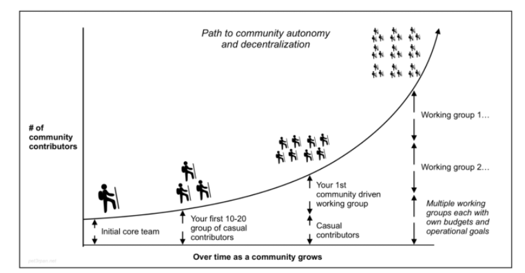
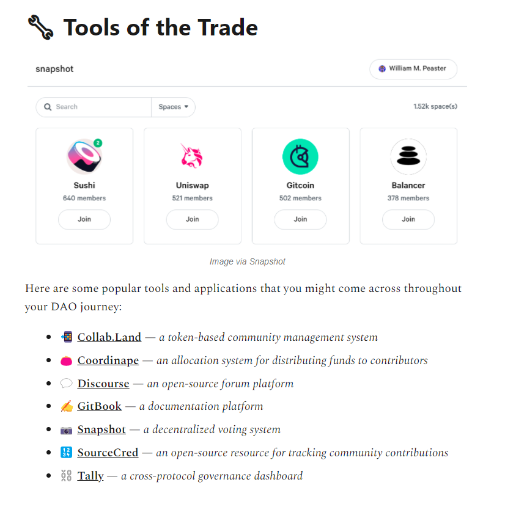

# DAO contributions

## What

- DAOs are user-owned decentralized communities organized around a common mission. Through smart contracts, these socio-technical communities enforce rules and manage their activities transparently on-chain. 
- DAOs are internet communities with a shared bank account and ownership.

## Why

- DAOs need labour
- could be protocol DAO like Yearn finance, or social DAO like Bankless, NFT DAO
- up to you how much time
- have to do upfront work first to prove your value

## Joining

### Starting work

- hop into forums and Discords and participate.
- provide input on governance proposals, 
- attend community calls
- write up community meetings
- interview core contributors
- vote on proposals
- organise local meetup
- In a world where companies have five rounds of interviews and many businesses don’t even respond to applications sent to their inbox, I was pleasantly surprised at how easy finding work in a DAO is. And not just work, paid work. For anyone building their portfolio, whether it’s in writing or designing or marketing or coding, a DAO is where you should start. There’s always so much going on, and if you attend just about any meeting in the DAO, you can find a project that’s looking for more support and labor.

### Follow on:

- when you've learnt whats going on, start doing deeper work.
- help with core projects
- resource for new members
- be active and provide value, people will notice.

### When built reputation:

- complete one off bounties
- part time work
- full time

## Roles

- developer (never enough)
- Community manager: help new members, managing discord, bring good vibes. Build relationships
- Content creation: write / video to help market. Don't need permission.
- designers: images, front ends etc
- operators / facilitators: set direction, check objectives complete. project management, multi sig signing. connect contributors to the right people. 
- Treasury: manage the community pool. budgeting, financial reporting. 
- DAO specific, e.g. Yearn needs strategists to optimise yield. Grant committees. Aave needs Risk Assesors. 

## Payment

- Always get tokens
- USD
- Coordinape: peer assessment to give tokens, split pool based on likes.
- Grants
- Bounties for discrete tasks
- SourceCred software to track participation KPI in discussions and reward

## Discord

- Discord organised into working groups
- Rules and FAQ sections
- helpful vibe
- Follow the rules
- Interact with people outside of dumping a link and leaving

## Software

- There are tons of DAO tools out there: Snapshot for voting, POAP for proof of attendance, Coordinape and Collab.land for incentives and rewards, and Discord for collaborating. But we need a DAO Google Drive! We need a DAO calendar! We need a DAO Zoom! There isn’t a good way to work on documents without resorting to using our Gmail accounts. While this might not be an issue in a traditional organization, in the crypto world where anonymity is celebrated and privacy is paramount, Google is a temporary, but not perfect, solution.

## Jobs

https://crypto.jobs/
Harmony: https://open.harmony.one/300m-on-bounties-grants-daos

## coordination issues

- voluntary
- people have different schedules and respond at different rates
- time zones, languages etc
- all asynchronous
- dont want to hire loads of middle managers
- need to find ways of organising
- votes take time, but do expose the issues clearly to all
- individuals need to lead. Say: Hey, I’m here to work, and I’ll do X
- 

