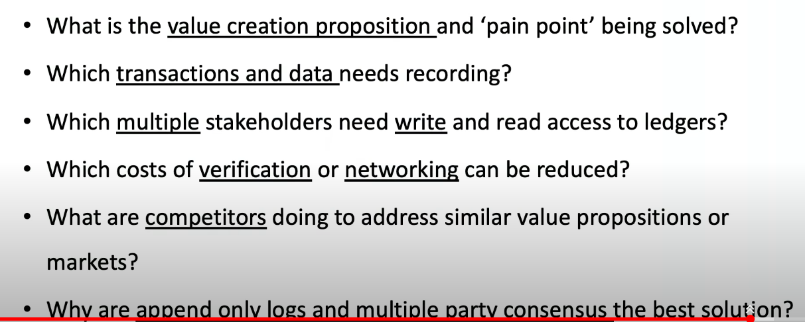

# Crypto use cases

Shared database reduces costs for all participants
No single trusted owner means less corruption
The  

## Supply chain

Existing process uses a letter of credit between importer bank and exporter bank, and commercially negotiate for who has the risk in the intervening stages. Less and less letter of credit, more gradually digitised, but that is not visible and not trusted. You can have lots of sales of a shipload of oil whilst it's at sea, no checks are needed currently to do this.  

You have a problem at the transition between the physical world and the digital, but that exists today and there are mechanisms to cope. Too high a standard to remove all these.  

For example

- use IOT to record readings at various stages
- Have trusted parties who guarantee they've done a check
- everyone writes to the same blockchain to provide status updates
- supply chain quality check can happen and you see every stage because it's public
- costs in verification can be reduced
- A single trusted central body can't provide enough covereage, and isn;t trusted e.g. Merck shipping.
- reduce networking costs becuase you can get the infirmation to all participants easily.  
- Read only logs shared.

Ultimately You get rid of lots of paperwork, reduce costs, increase visibility, and everyone is on the same system.

## Finance

Stock exchange has lots of different ledgers between lots of companies. Instead share a single one

